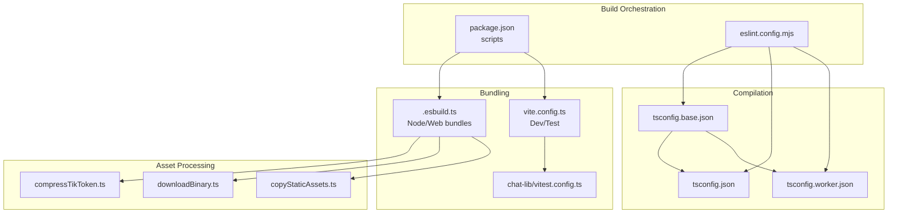
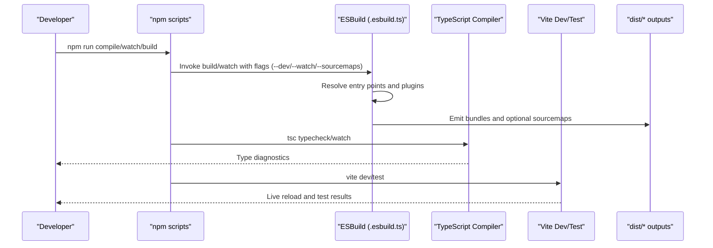
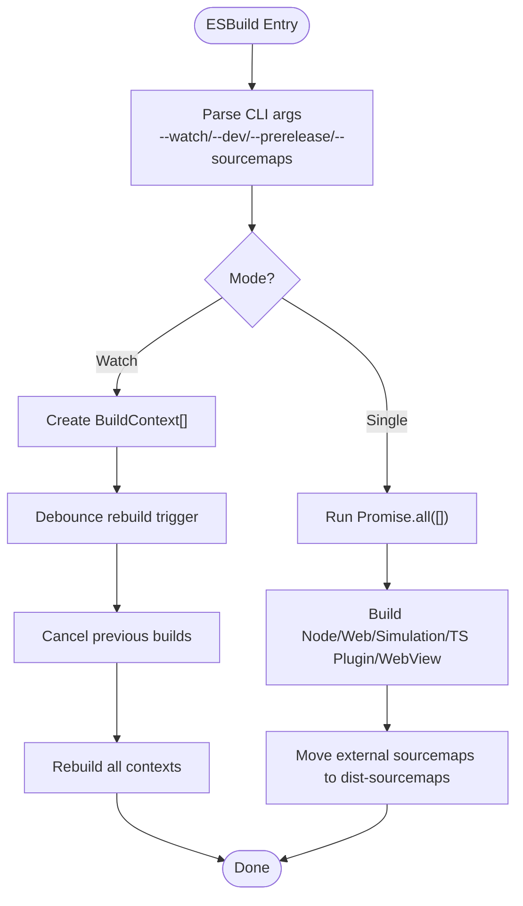
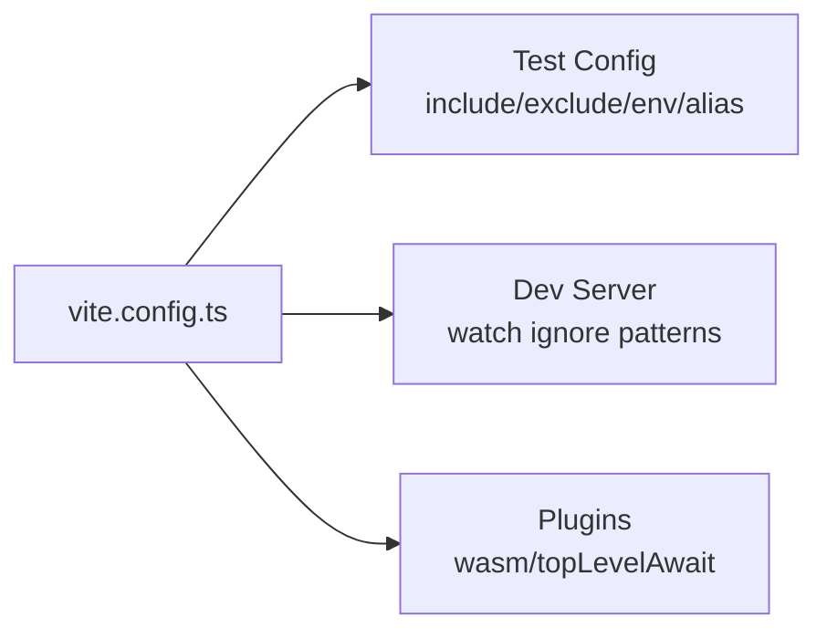
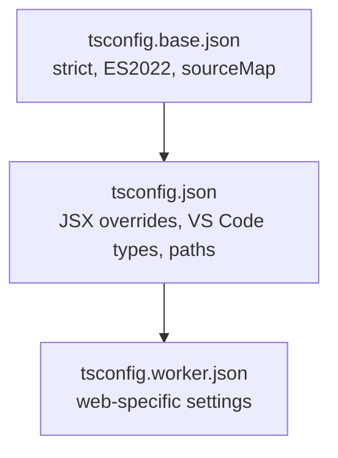
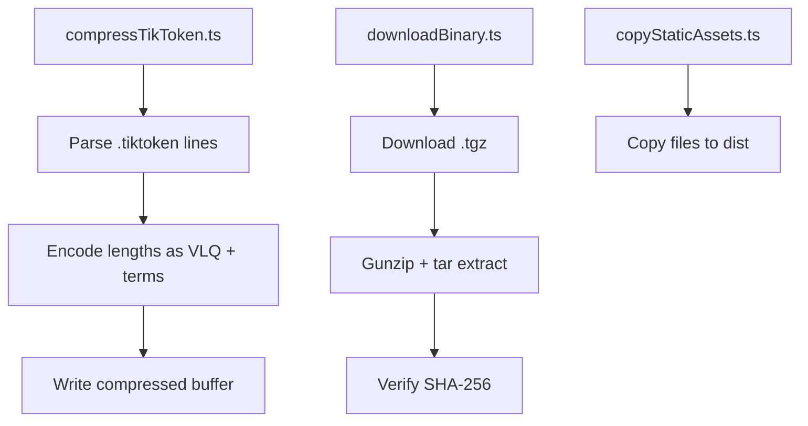
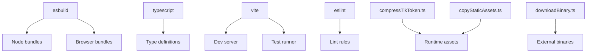

# Build System & Configuration

<cite>
**Referenced Files in This Document**
- [.esbuild.ts](file://.esbuild.ts)
- [vite.config.ts](file://vite.config.ts)
- [package.json](file://package.json)
- [tsconfig.json](file://tsconfig.json)
- [tsconfig.base.json](file://tsconfig.base.json)
- [chat-lib/vitest.config.ts](file://chat-lib/vitest.config.ts)
- [script/build/compressTikToken.ts](file://script/build/compressTikToken.ts)
- [script/build/downloadBinary.ts](file://script/build/downloadBinary.ts)
- [script/build/copyStaticAssets.ts](file://script/build/copyStaticAssets.ts)
- [eslint.config.mjs](file://eslint.config.mjs)
</cite>

## Table of Contents
1. [Introduction](#introduction)
2. [Project Structure](#project-structure)
3. [Core Components](#core-components)
4. [Architecture Overview](#architecture-overview)
5. [Detailed Component Analysis](#detailed-component-analysis)
6. [Dependency Analysis](#dependency-analysis)
7. [Performance Considerations](#performance-considerations)
8. [Troubleshooting Guide](#troubleshooting-guide)
9. [Conclusion](#conclusion)

## Introduction
This document explains the build system and configuration management for the VS Code extension project. It covers ESBuild configuration for TypeScript compilation, Vite setup for development and testing, TypeScript compiler options, and the complete build pipeline including asset compression, binary downloads, and static resource processing. It also details the package.json scripts, environment-specific configurations, optimization strategies, customization guidance, and troubleshooting approaches for common build issues.

## Project Structure
The build system centers around three pillars:
- ESBuild-based bundling for extension host, web workers, simulation environments, and TypeScript server plugin
- Vite-based development server and test runner configuration
- TypeScript compiler configuration with strict defaults and custom JSX handling

**Diagram sources**
- [package.json](file://package.json#L5919-L5962)
- [tsconfig.base.json](file://tsconfig.base.json#L1-L23)
- [tsconfig.json](file://tsconfig.json#L1-L40)
- [.esbuild.ts](file://.esbuild.ts#L1-L437)
- [vite.config.ts](file://vite.config.ts#L1-L40)
- [chat-lib/vitest.config.ts](file://chat-lib/vitest.config.ts#L1-L21)
- [script/build/compressTikToken.ts](file://script/build/compressTikToken.ts#L1-L77)
- [script/build/downloadBinary.ts](file://script/build/downloadBinary.ts#L1-L133)
- [script/build/copyStaticAssets.ts](file://script/build/copyStaticAssets.ts#L1-L19)

**Section sources**
- [package.json](file://package.json#L5919-L5962)
- [tsconfig.base.json](file://tsconfig.base.json#L1-L23)
- [tsconfig.json](file://tsconfig.json#L1-L40)
- [.esbuild.ts](file://.esbuild.ts#L1-L437)
- [vite.config.ts](file://vite.config.ts#L1-L40)
- [chat-lib/vitest.config.ts](file://chat-lib/vitest.config.ts#L1-L21)

## Core Components
- ESBuild configuration orchestrates multiple build targets: Node extension host, web worker, simulation environments, TypeScript server plugin, and webview bundles. It supports watch mode, sourcemaps, minification toggles, and custom plugins for test bundling and VS Code type shimming.
- Vite configuration sets up the development server, test environment, WASM and top-level await support, and path aliases aligned with ESBuild.
- TypeScript compiler options enforce strictness, JSX factory overrides, and type shims for VS Code testing.
- Asset processing utilities handle TikToken compression, binary downloads with checksum verification, and static asset copying.

**Section sources**
- [.esbuild.ts](file://.esbuild.ts#L20-L31)
- [.esbuild.ts](file://.esbuild.ts#L181-L200)
- [.esbuild.ts](file://.esbuild.ts#L202-L213)
- [.esbuild.ts](file://.esbuild.ts#L223-L232)
- [.esbuild.ts](file://.esbuild.ts#L234-L257)
- [.esbuild.ts](file://.esbuild.ts#L270-L288)
- [vite.config.ts](file://vite.config.ts#L19-L39)
- [tsconfig.json](file://tsconfig.json#L3-L21)
- [tsconfig.base.json](file://tsconfig.base.json#L2-L21)
- [script/build/compressTikToken.ts](file://script/build/compressTikToken.ts#L35-L65)
- [script/build/downloadBinary.ts](file://script/build/downloadBinary.ts#L20-L44)
- [script/build/copyStaticAssets.ts](file://script/build/copyStaticAssets.ts#L11-L18)

## Architecture Overview
The build pipeline integrates ESBuild and TypeScript compilation with Vite for development and testing. ESBuild handles bundling and optimization, while TypeScript ensures type safety and JSX transformations. Vite manages the dev server and test harness. Asset processing utilities prepare runtime resources.

**Diagram sources**
- [package.json](file://package.json#L5919-L5962)
- [.esbuild.ts](file://.esbuild.ts#L326-L415)
- [vite.config.ts](file://vite.config.ts#L19-L39)
- [tsconfig.json](file://tsconfig.json#L3-L21)

## Detailed Component Analysis

### ESBuild Configuration and Targets
ESBuild defines multiple build contexts:
- Node extension host: bundles the main extension entry and several workers
- Web worker: browser-compatible bundle for web contexts
- Simulation builds: Node and browser simulation environments
- TypeScript server plugin: compiles a companion plugin for TypeScript language services
- WebView: browser bundle for webview panels

Key behaviors:
- Watch mode uses Parcel watcher to rebuild all contexts with debounced triggers
- Sourcemaps are controlled via flags; external sourcemaps are moved to a dedicated directory post-build
- Plugins handle test bundling, sanity test aggregation, import.meta URL rewriting, and VS Code type shims
- External dependencies are declared to prevent bundling of native or large packages

**Diagram sources**
- [.esbuild.ts](file://.esbuild.ts#L326-L415)
- [.esbuild.ts](file://.esbuild.ts#L294-L324)

**Section sources**
- [.esbuild.ts](file://.esbuild.ts#L14-L18)
- [.esbuild.ts](file://.esbuild.ts#L20-L30)
- [.esbuild.ts](file://.esbuild.ts#L181-L200)
- [.esbuild.ts](file://.esbuild.ts#L202-L213)
- [.esbuild.ts](file://.esbuild.ts#L223-L232)
- [.esbuild.ts](file://.esbuild.ts#L234-L257)
- [.esbuild.ts](file://.esbuild.ts#L270-L288)
- [.esbuild.ts](file://.esbuild.ts#L294-L324)
- [.esbuild.ts](file://.esbuild.ts#L333-L400)
- [.esbuild.ts](file://.esbuild.ts#L355-L374)

### Vite Setup for Development and Testing
Vite configuration:
- Test environment: includes spec files, excludes standard directories, loads environment variables, and aliases VS Code types
- Dev server: watches files excluding configured patterns
- Plugins: WASM and top-level await support

**Diagram sources**
- [vite.config.ts](file://vite.config.ts#L19-L39)

**Section sources**
- [vite.config.ts](file://vite.config.ts#L19-L39)
- [chat-lib/vitest.config.ts](file://chat-lib/vitest.config.ts#L9-L21)

### TypeScript Compiler Options
Base configuration enforces strict TypeScript settings with ES2022 target and source maps. Extension-specific tsconfig overrides JSX factory/fragment and adds VS Code types and path aliases for testing.

**Diagram sources**
- [tsconfig.base.json](file://tsconfig.base.json#L2-L21)
- [tsconfig.json](file://tsconfig.json#L3-L21)

**Section sources**
- [tsconfig.base.json](file://tsconfig.base.json#L2-L21)
- [tsconfig.json](file://tsconfig.json#L3-L21)

### Asset Compression, Binary Downloads, Static Resource Processing
- TikToken compression: converts textual token lists into a compact binary format using variable-length quantities
- Binary downloads: ensures integrity via SHA-256 verification and extracts archives with gzip decompression
- Static asset copying: synchronously copies selected assets to destination paths

**Diagram sources**
- [script/build/compressTikToken.ts](file://script/build/compressTikToken.ts#L35-L65)
- [script/build/downloadBinary.ts](file://script/build/downloadBinary.ts#L20-L44)
- [script/build/copyStaticAssets.ts](file://script/build/copyStaticAssets.ts#L11-L18)

**Section sources**
- [script/build/compressTikToken.ts](file://script/build/compressTikToken.ts#L12-L65)
- [script/build/downloadBinary.ts](file://script/build/downloadBinary.ts#L14-L54)
- [script/build/copyStaticAssets.ts](file://script/build/copyStaticAssets.ts#L11-L18)

### Package Scripts and Environment-Specific Configurations
Key scripts:
- build: produces production bundles with external sourcemaps
- compile: development build with linked sourcemaps
- watch: parallel watch for ESBuild, TypeScript, and simulation TS
- typecheck: validates all relevant tsconfigs
- test: runs extension, sanity, and unit tests
- vitest: interactive test runner
- simulate: runs simulation main entry
- vscode-dts: updates and checks VS Code declarations
- web: runs VS Code Web tests headlessly
- package: packages the extension via VSCE

Environment flags:
- --dev toggles minification and sourcemap strategy
- --watch enables live rebuilding across multiple contexts
- --sourcemaps generates external sourcemaps and moves them to a separate directory

**Section sources**
- [package.json](file://package.json#L5919-L5962)
- [.esbuild.ts](file://.esbuild.ts#L14-L18)
- [.esbuild.ts](file://.esbuild.ts#L294-L324)

## Dependency Analysis
Build-time dependencies and their roles:
- ESBuild: primary bundler for Node and browser targets
- TypeScript: type checking and compilation
- Vite: development server and test runner
- ESLint: code quality and import restrictions
- Utility scripts: asset compression, binary downloads, static asset copying

**Diagram sources**
- [.esbuild.ts](file://.esbuild.ts#L402-L410)
- [package.json](file://package.json#L5963-L6059)
- [eslint.config.mjs](file://eslint.config.mjs#L28-L539)

**Section sources**
- [package.json](file://package.json#L5963-L6059)
- [eslint.config.mjs](file://eslint.config.mjs#L28-L539)

## Performance Considerations
- Minification and tree shaking: enabled in production builds to reduce bundle sizes
- Sourcemap strategy: linked sourcemaps for development, external sourcemaps for production with separate output directory
- Watch mode: debounced rebuild across multiple contexts to avoid excessive rebuild cycles
- Worker bundles: separate bundles for workers to optimize loading and memory usage
- Asset compression: reduces payload size for tokenizer data
- Binary downloads: integrity checks prevent corrupted assets and re-downloads

[No sources needed since this section provides general guidance]

## Troubleshooting Guide
Common issues and resolutions:
- Missing VS Code types in tests: ensure VS Code type alias is present in Vite and TypeScript configs
- Import.meta URL errors in third-party packages: use the import meta plugin to rewrite URLs
- Large external dependencies: mark as external in ESBuild options to avoid bundling
- Sourcemap packaging: external sourcemaps are moved to a separate directory; verify presence if debugging production builds
- Test bundling failures: confirm test globs and plugin resolution for test and sanity test entries
- Binary download failures: verify network connectivity, redirects, and SHA-256 mismatch logs

**Section sources**
- [.esbuild.ts](file://.esbuild.ts#L131-L146)
- [.esbuild.ts](file://.esbuild.ts#L181-L200)
- [.esbuild.ts](file://.esbuild.ts#L294-L324)
- [vite.config.ts](file://vite.config.ts#L24-L28)
- [tsconfig.json](file://tsconfig.json#L18-L20)

## Conclusion
The build system combines ESBuild for robust bundling, TypeScript for type safety, and Vite for development and testing. Asset processing utilities streamline runtime resource preparation. Scripts provide flexible modes for development, watch, and production builds, with strong sourcemap and integrity controls. Following the customization and troubleshooting guidance ensures reliable builds and smooth developer workflows.