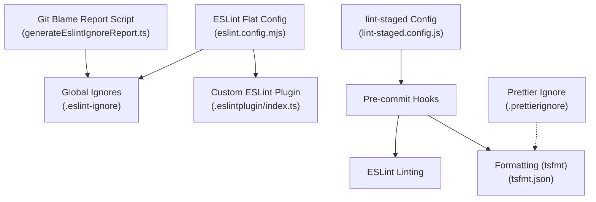
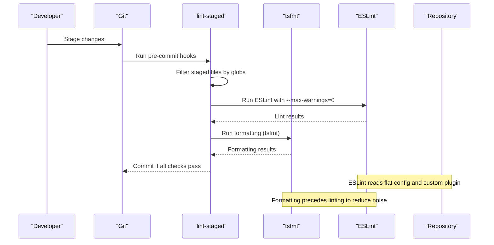
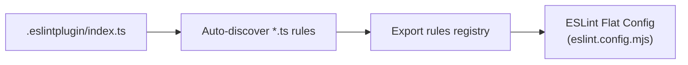
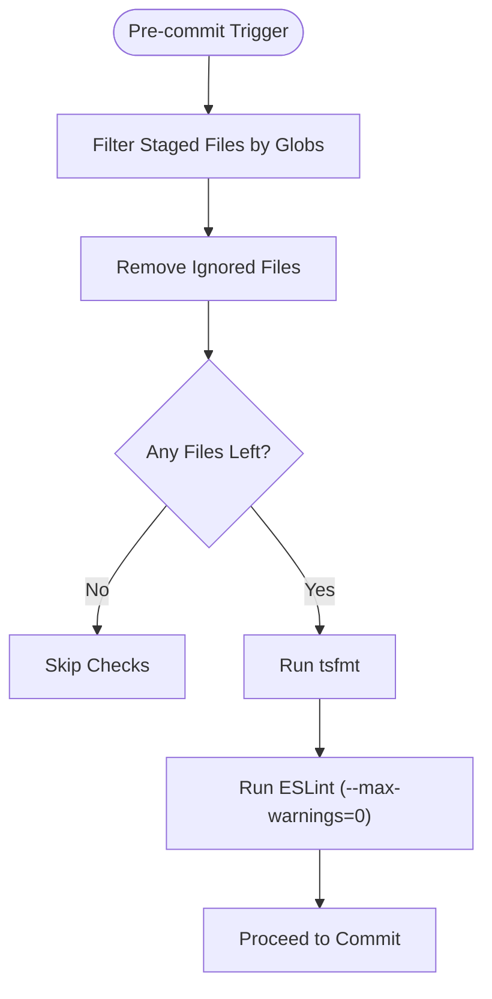
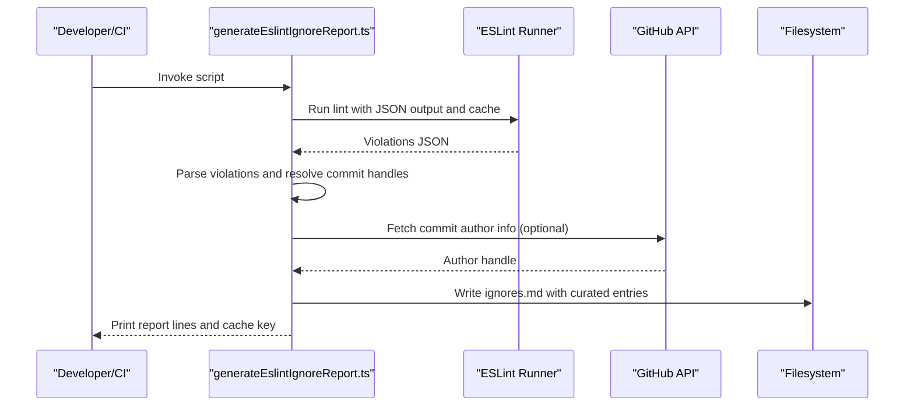
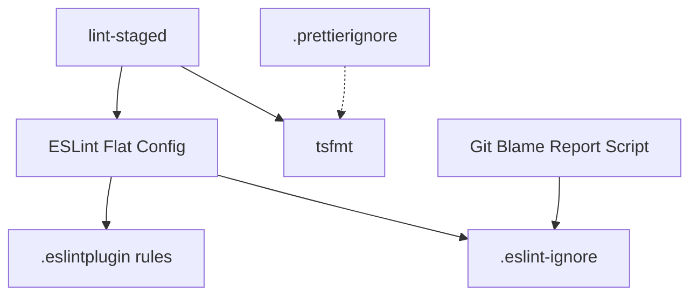

# Code Quality & Standards

<cite>
**Referenced Files in This Document**
- [eslint.config.mjs](file://eslint.config.mjs)
- [.eslint-ignore](file://.eslint-ignore)
- [lint-staged.config.js](file://lint-staged.config.js)
- [tsfmt.json](file://tsfmt.json)
- [.prettierignore](file://.prettierignore)
- [.eslintplugin/index.ts](file://.eslintplugin/index.ts)
- [.eslintplugin/package.json](file://.eslintplugin/package.json)
- [.eslintplugin/tsconfig.json](file://.eslintplugin/tsconfig.json)
- [script/eslintGitBlameReport/generateEslintIgnoreReport.ts](file://script/eslintGitBlameReport/generateEslintIgnoreReport.ts)
- [package.json](file://package.json)
</cite>

## Table of Contents
1. [Introduction](#introduction)
2. [Project Structure](#project-structure)
3. [Core Components](#core-components)
4. [Architecture Overview](#architecture-overview)
5. [Detailed Component Analysis](#detailed-component-analysis)
6. [Dependency Analysis](#dependency-analysis)
7. [Performance Considerations](#performance-considerations)
8. [Troubleshooting Guide](#troubleshooting-guide)
9. [Conclusion](#conclusion)
10. [Appendices](#appendices)

## Introduction
This document defines the code quality tools and standards for the project. It covers ESLint configuration (including custom rules and plugin configuration), Prettier formatting setup, lint-staged pre-commit enforcement, git blame reporting for generating ESLint ignore entries, and continuous quality enforcement across development workflows. It also provides guidelines for maintaining quality, resolving conflicts, updating standards, integrating with automated checks, and best practices for code reviews and maintenance.

## Project Structure
The code quality toolchain is centered around:
- ESLint configuration using flat config for TypeScript and JavaScript
- A custom ESLint plugin with domain-specific rules
- Pre-commit enforcement via lint-staged
- Formatting and style configuration via tsfmt and Prettier ignore
- Automated git blame reporting to generate ESLint ignore entries

**Diagram sources**
- [eslint.config.mjs](file://eslint.config.mjs#L28-L538)
- [.eslintplugin/index.ts](file://.eslintplugin/index.ts#L1-L20)
- [.eslint-ignore](file://.eslint-ignore#L1-L32)
- [lint-staged.config.js](file://lint-staged.config.js#L1-L31)
- [tsfmt.json](file://tsfmt.json#L1-L7)
- [.prettierignore](file://.prettierignore#L1-L18)
- [script/eslintGitBlameReport/generateEslintIgnoreReport.ts](file://script/eslintGitBlameReport/generateEslintIgnoreReport.ts#L1-L442)

**Section sources**
- [eslint.config.mjs](file://eslint.config.mjs#L28-L538)
- [.eslint-ignore](file://.eslint-ignore#L1-L32)
- [lint-staged.config.js](file://lint-staged.config.js#L1-L31)
- [tsfmt.json](file://tsfmt.json#L1-L7)
- [.prettierignore](file://.prettierignore#L1-L18)
- [.eslintplugin/index.ts](file://.eslintplugin/index.ts#L1-L20)
- [script/eslintGitBlameReport/generateEslintIgnoreReport.ts](file://script/eslintGitBlameReport/generateEslintIgnoreReport.ts#L1-L442)

## Core Components
- ESLint flat configuration with layered rules for JS/TS, TS-only, and project-specific constraints
- Custom ESLint plugin that auto-registers local rules
- Global ignore list for files and directories
- Pre-commit pipeline enforcing formatting and linting
- Formatting configuration via tsfmt
- Prettier ignore list for files and directories excluded from formatting
- Git blame reporting script to generate ESLint ignore entries and maintain quality

**Section sources**
- [eslint.config.mjs](file://eslint.config.mjs#L28-L538)
- [.eslintplugin/index.ts](file://.eslintplugin/index.ts#L1-L20)
- [.eslint-ignore](file://.eslint-ignore#L1-L32)
- [lint-staged.config.js](file://lint-staged.config.js#L1-L31)
- [tsfmt.json](file://tsfmt.json#L1-L7)
- [.prettierignore](file://.prettierignore#L1-L18)
- [script/eslintGitBlameReport/generateEslintIgnoreReport.ts](file://script/eslintGitBlameReport/generateEslintIgnoreReport.ts#L1-L442)

## Architecture Overview
The quality pipeline integrates ESLint, formatting, and pre-commit hooks to enforce standards consistently across contributors and CI.

**Diagram sources**
- [lint-staged.config.js](file://lint-staged.config.js#L19-L30)
- [eslint.config.mjs](file://eslint.config.mjs#L28-L538)
- [tsfmt.json](file://tsfmt.json#L1-L7)

## Detailed Component Analysis

### ESLint Configuration (Flat Config)
The project uses a modern ESLint flat configuration that:
- Applies global ignores from a dedicated ignore file
- Defines rules for all JS/TS files, TS-only files, and project-specific constraints
- Integrates custom rules via a local plugin
- Enforces import restrictions, path-based restrictions, and domain-specific rules
- Includes exceptions for test files, generated types, and specific libraries

Key characteristics:
- Parser: TypeScript ESLint parser
- Plugins: Stylistic, TypeScript ESLint, JSDoc, Import, Header, and a local plugin
- Rules include stylistic rules (indentation, semicolons), security and correctness rules (no eval, no unsafe finally), and TS-specific naming conventions
- Project-specific rules enforce import zones and restrict runtime-only imports in certain contexts
- Domain-specific rules detect GDPR-related issues, NLS misuse, and layered file violations

**Section sources**
- [eslint.config.mjs](file://eslint.config.mjs#L28-L538)
- [.eslint-ignore](file://.eslint-ignore#L1-L32)

### Custom ESLint Plugin
The local plugin dynamically registers all rule modules in the plugin directory, excluding the index and utility files. This enables centralized, maintainable rule definitions tailored to the project’s domain.

**Diagram sources**
- [.eslintplugin/index.ts](file://.eslintplugin/index.ts#L1-L20)
- [eslint.config.mjs](file://eslint.config.mjs#L20-L20)

**Section sources**
- [.eslintplugin/index.ts](file://.eslintplugin/index.ts#L1-L20)
- [.eslintplugin/package.json](file://.eslintplugin/package.json#L1-L5)
- [.eslintplugin/tsconfig.json](file://.eslintplugin/tsconfig.json#L1-L18)
- [eslint.config.mjs](file://eslint.config.mjs#L20-L20)

### Prettier Formatting Setup
- Formatting is configured via tsfmt with tab size and indentation settings
- Prettier ignore excludes distribution artifacts, test fixtures, Markdown files, and other non-source targets
- The pre-commit pipeline runs formatting before linting to minimize style-related warnings

**Section sources**
- [tsfmt.json](file://tsfmt.json#L1-L7)
- [.prettierignore](file://.prettierignore#L1-L18)
- [lint-staged.config.js](file://lint-staged.config.js#L19-L30)

### Lint-staged Configuration
- Filters staged files using globs and excludes specific directories and file types
- Removes ignored files from the staged set before running checks
- Executes formatting and linting in sequence with a strict warning policy

**Diagram sources**
- [lint-staged.config.js](file://lint-staged.config.js#L8-L30)

**Section sources**
- [lint-staged.config.js](file://lint-staged.config.js#L1-L31)

### Git Blame Reporting for ESLint Ignore Generation
A script automates the generation of ESLint ignore entries by:
- Running ESLint with JSON output and caching results
- Parsing violations and mapping each to a commit and author handle
- Resolving handles via GitHub API, local git metadata, or fallbacks
- Writing a curated ignore list to a markdown file for review and integration

**Diagram sources**
- [script/eslintGitBlameReport/generateEslintIgnoreReport.ts](file://script/eslintGitBlameReport/generateEslintIgnoreReport.ts#L45-L93)

**Section sources**
- [script/eslintGitBlameReport/generateEslintIgnoreReport.ts](file://script/eslintGitBlameReport/generateEslintIgnoreReport.ts#L1-L442)

## Dependency Analysis
The quality toolchain depends on:
- ESLint flat config and plugins
- Local custom rules
- Pre-commit orchestration via lint-staged
- Formatting via tsfmt
- Ignore lists for both ESLint and formatting

**Diagram sources**
- [eslint.config.mjs](file://eslint.config.mjs#L28-L538)
- [.eslintplugin/index.ts](file://.eslintplugin/index.ts#L1-L20)
- [.eslint-ignore](file://.eslint-ignore#L1-L32)
- [lint-staged.config.js](file://lint-staged.config.js#L1-L31)
- [tsfmt.json](file://tsfmt.json#L1-L7)
- [.prettierignore](file://.prettierignore#L1-L18)
- [script/eslintGitBlameReport/generateEslintIgnoreReport.ts](file://script/eslintGitBlameReport/generateEslintIgnoreReport.ts#L1-L442)

**Section sources**
- [eslint.config.mjs](file://eslint.config.mjs#L28-L538)
- [.eslintplugin/index.ts](file://.eslintplugin/index.ts#L1-L20)
- [.eslint-ignore](file://.eslint-ignore#L1-L32)
- [lint-staged.config.js](file://lint-staged.config.js#L1-L31)
- [tsfmt.json](file://tsfmt.json#L1-L7)
- [.prettierignore](file://.prettierignore#L1-L18)
- [script/eslintGitBlameReport/generateEslintIgnoreReport.ts](file://script/eslintGitBlameReport/generateEslintIgnoreReport.ts#L1-L442)

## Performance Considerations
- Use ESLint cache and a dedicated cache location to speed up repeated runs
- Keep ignore lists minimal and targeted to avoid unnecessary scanning
- Run formatting before linting to reduce redundant style fixes
- Limit staged file sets to only changed files to shorten pre-commit cycles

[No sources needed since this section provides general guidance]

## Troubleshooting Guide
Common issues and resolutions:
- Pre-commit fails due to formatting: Run formatting locally and re-stage files
- ESLint warnings exceed threshold: Review failing rules and adjust code or exceptions
- Ignored files still linted: Verify entries in the global ignore file and ensure they match the intended paths
- Custom rules not applied: Confirm the plugin module exports a valid rule and is discoverable by the plugin index
- Git blame resolution failures: Ensure the GitHub CLI is installed and authenticated; confirm commit hashes and network connectivity

**Section sources**
- [lint-staged.config.js](file://lint-staged.config.js#L19-L30)
- [eslint.config.mjs](file://eslint.config.mjs#L28-L538)
- [.eslint-ignore](file://.eslint-ignore#L1-L32)
- [.eslintplugin/index.ts](file://.eslintplugin/index.ts#L1-L20)
- [script/eslintGitBlameReport/generateEslintIgnoreReport.ts](file://script/eslintGitBlameReport/generateEslintIgnoreReport.ts#L174-L213)

## Conclusion
The project enforces high-quality code through a robust, configurable ESLint setup, a custom plugin for domain-specific rules, and a pre-commit pipeline that ensures consistent formatting and linting. The git blame reporting script supports continuous maintenance by generating actionable ignore entries. Adhering to these standards improves readability, reduces defects, and streamlines collaborative development.

[No sources needed since this section summarizes without analyzing specific files]

## Appendices

### Maintaining Code Quality Guidelines
- Keep ignore lists minimal and scoped; prefer fixing issues over adding ignores
- Update custom rules when project conventions evolve
- Periodically review and refine import and path restrictions
- Encourage reviewers to verify that lint failures are intentional and documented

### Resolving Linting Conflicts
- Fix violations directly when feasible
- Temporarily add targeted exceptions in the ESLint configuration if necessary, with a follow-up task to address the root cause
- Use the git blame report to identify responsible parties for persistent violations and coordinate remediation

### Updating Quality Standards
- Propose changes to ESLint rules and plugin modules via pull requests
- Update ignore lists only after broad consensus and justification
- Communicate changes in team meetings and update documentation accordingly

### Integration with Workflows and Reviews
- Configure CI to mirror local pre-commit checks
- Require passing lint and formatting in pull requests
- Use the ignore report to triage and track ongoing violations during code reviews

**Section sources**
- [eslint.config.mjs](file://eslint.config.mjs#L28-L538)
- [lint-staged.config.js](file://lint-staged.config.js#L1-L31)
- [script/eslintGitBlameReport/generateEslintIgnoreReport.ts](file://script/eslintGitBlameReport/generateEslintIgnoreReport.ts#L1-L442)
- [package.json](file://package.json#L1-L800)