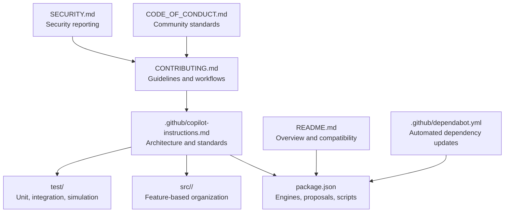
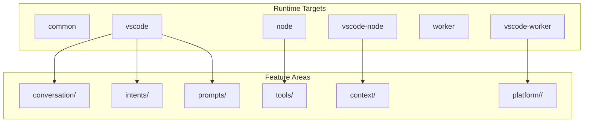
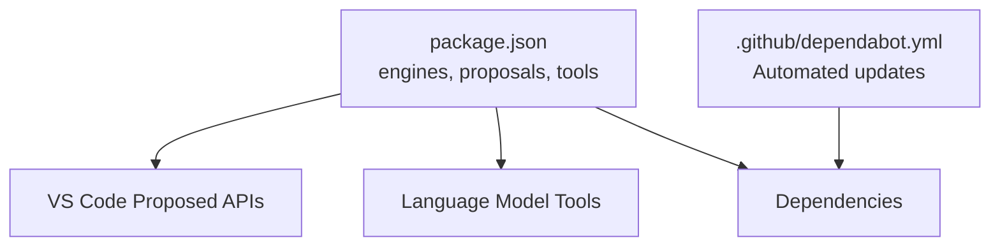

# Contribution Guidelines

<cite>
**Referenced Files in This Document**
- [CONTRIBUTING.md](file://CONTRIBUTING.md)
- [CODE_OF_CONDUCT.md](file://CODE_OF_CONDUCT.md)
- [SECURITY.md](file://SECURITY.md)
- [.github/copilot-instructions.md](file://.github/copilot-instructions.md)
- [package.json](file://package.json)
- [README.md](file://README.md)
- [.github/dependabot.yml](file://.github/dependabot.yml)
</cite>

## Table of Contents
1. [Introduction](#introduction)
2. [Project Structure](#project-structure)
3. [Core Components](#core-components)
4. [Architecture Overview](#architecture-overview)
5. [Detailed Component Analysis](#detailed-component-analysis)
6. [Dependency Analysis](#dependency-analysis)
7. [Performance Considerations](#performance-considerations)
8. [Troubleshooting Guide](#troubleshooting-guide)
9. [Conclusion](#conclusion)
10. [Appendices](#appendices)

## Introduction
This document consolidates contribution guidelines and development processes for the GitHub Copilot Chat extension. It covers issue reporting, development setup, testing, code review expectations, documentation standards, security vulnerability reporting, community standards, and release/versioning practices. It is intended to be accessible to contributors with varying levels of familiarity with the codebase.

## Project Structure
The repository is a VS Code extension with a layered architecture supporting multiple runtimes (desktop Node.js and web worker). Development guidance, coding standards, and entry points are documented in the Copilot Instructions.

**Diagram sources**
- [CONTRIBUTING.md](file://CONTRIBUTING.md#L1-L439)
- [.github/copilot-instructions.md](file://.github/copilot-instructions.md#L1-L353)
- [package.json](file://package.json#L1-L800)
- [README.md](file://README.md#L1-L91)
- [CODE_OF_CONDUCT.md](file://CODE_OF_CONDUCT.md#L1-L10)
- [SECURITY.md](file://SECURITY.md#L1-L14)
- [.github/dependabot.yml](file://.github/dependabot.yml#L1-L66)

**Section sources**
- [CONTRIBUTING.md](file://CONTRIBUTING.md#L67-L280)
- [.github/copilot-instructions.md](file://.github/copilot-instructions.md#L39-L123)
- [package.json](file://package.json#L25-L29)
- [README.md](file://README.md#L55-L59)

## Core Components
- Issue reporting and triage: Search existing issues, provide reproducible steps, environment details, and logs. Use the built-in “Report Issue” tool to collect metadata.
- Development environment: Node.js, Python, Git LFS, and platform-specific tooling. First-time setup includes installing dependencies, obtaining tokens, and running watch/build/debug configurations.
- Testing: Unit tests, extension integration tests, and simulation tests with baselines and caching. Simulation tests require cache population and baseline updates.
- Code structure and layers: Feature-based organization across common, vscode, node, vscode-node, worker, and vscode-worker layers. Contributions and services are registered per layer.
- Agent mode and tools: Agent mode integrates with VS Code chat participants and tools; tool registration and behavior are defined in the extension manifest and tool implementations.
- Troubleshooting: Use the “Show Chat Debug View” to inspect requests, prompts, and tool calls; review logs carefully before sharing.

**Section sources**
- [CONTRIBUTING.md](file://CONTRIBUTING.md#L30-L66)
- [CONTRIBUTING.md](file://CONTRIBUTING.md#L69-L127)
- [CONTRIBUTING.md](file://CONTRIBUTING.md#L85-L123)
- [.github/copilot-instructions.md](file://.github/copilot-instructions.md#L186-L223)
- [.github/copilot-instructions.md](file://.github/copilot-instructions.md#L280-L345)
- [CONTRIBUTING.md](file://CONTRIBUTING.md#L299-L308)

## Architecture Overview
The extension is a layered system with contributions and services registered per runtime target. The Copilot Instructions document provides a comprehensive overview of architecture, coding standards, and development guidelines.

**Diagram sources**
- [.github/copilot-instructions.md](file://.github/copilot-instructions.md#L186-L223)
- [.github/copilot-instructions.md](file://.github/copilot-instructions.md#L280-L345)

**Section sources**
- [.github/copilot-instructions.md](file://.github/copilot-instructions.md#L39-L123)
- [.github/copilot-instructions.md](file://.github/copilot-instructions.md#L186-L223)

## Detailed Component Analysis

### Issue Reporting and Templates
- Search existing issues and reactions before filing.
- Provide version, OS, model, reproducible steps, expected vs actual behavior, supporting artifacts, and console errors.
- Use the built-in “Report Issue” tool to auto-collect metadata and search for duplicates.

**Section sources**
- [CONTRIBUTING.md](file://CONTRIBUTING.md#L30-L66)

### Development Environment and Setup
- Requirements: Node.js, Python, Git LFS, and Windows build tools as needed.
- First-time setup: Install dependencies, obtain tokens, and use watch/debug launch configurations.
- Running with Code OSS: Desktop and web variants require specific overrides and configuration.

**Section sources**
- [CONTRIBUTING.md](file://CONTRIBUTING.md#L69-L84)
- [CONTRIBUTING.md](file://CONTRIBUTING.md#L75-L81)
- [CONTRIBUTING.md](file://CONTRIBUTING.md#L335-L439)

### Testing Procedures
- Unit tests, extension integration tests, and simulation tests.
- Simulation tests require cache population and baseline updates; PRs fail with uncommitted baseline changes.
- Cache is stored under test/simulation/cache and snapshot baseline under test/simulation/baseline.json.

**Section sources**
- [CONTRIBUTING.md](file://CONTRIBUTING.md#L85-L123)

### Code Review Expectations
- Compilation checks must pass before running scripts.
- Use watch tasks to monitor incremental builds and catch errors early.
- Follow coding standards and architecture patterns outlined in the Copilot Instructions.

**Section sources**
- [.github/copilot-instructions.md](file://.github/copilot-instructions.md#L26-L38)
- [.github/copilot-instructions.md](file://.github/copilot-instructions.md#L186-L223)

### Documentation Standards
- Follow TypeScript/JS guidelines, React/JSX conventions, and architecture patterns.
- Maintain clear file organization and strong interface definitions.
- Use VS Code proposed APIs judiciously and keep enabledApiProposals current.

**Section sources**
- [.github/copilot-instructions.md](file://.github/copilot-instructions.md#L186-L223)
- [package.json](file://package.json#L90-L149)

### Branching and Pull Requests
- Fork and clone the repository.
- Create feature branches and submit pull requests.
- Ensure tests pass, caches are populated, and baselines are updated before merging.

**Section sources**
- [CONTRIBUTING.md](file://CONTRIBUTING.md#L85-L123)

### Agent Mode and Tools
- Agent mode integrates with VS Code chat participants and tools.
- Tool registration and schemas are defined in the extension manifest; implementations live under tools/.

**Section sources**
- [CONTRIBUTING.md](file://CONTRIBUTING.md#L268-L294)
- [package.json](file://package.json#L150-L800)

### Troubleshooting Requests
- Use “Show Chat Debug View” to inspect prompts, tools, and responses.
- Export logs for debugging and include them when filing issues.

**Section sources**
- [CONTRIBUTING.md](file://CONTRIBUTING.md#L299-L308)

### API Updates and Compatibility
- For breaking changes to proposed APIs, update the API version and adopt in the extension.
- For additive changes, update engines.vscode date stamp to require the new API.

**Section sources**
- [CONTRIBUTING.md](file://CONTRIBUTING.md#L309-L334)

### Security Vulnerability Reporting
- Do not report security vulnerabilities via public GitHub issues.
- Follow Microsoft’s security reporting guidance.

**Section sources**
- [SECURITY.md](file://SECURITY.md#L1-L14)

### Community Standards and Code of Conduct
- Adheres to the Microsoft Open Source Code of Conduct.
- Contact information and FAQ links are provided.

**Section sources**
- [CODE_OF_CONDUCT.md](file://CODE_OF_CONDUCT.md#L1-L10)

### Release and Versioning
- The extension version and build metadata are defined in package.json.
- Compatibility aligns with VS Code version requirements and proposed API adoption.
- Dependabot automates dependency updates with curated ignores and schedules.

**Section sources**
- [package.json](file://package.json#L5-L11)
- [package.json](file://package.json#L25-L29)
- [.github/dependabot.yml](file://.github/dependabot.yml#L1-L66)

## Dependency Analysis
The project relies on VS Code’s proposed APIs and external integrations. The manifest enumerates enabled API proposals and tool schemas. Dependabot manages npm dependencies with strategic ignores to maintain stability.

**Diagram sources**
- [package.json](file://package.json#L25-L149)
- [.github/dependabot.yml](file://.github/dependabot.yml#L1-L66)

**Section sources**
- [package.json](file://package.json#L90-L149)
- [.github/dependabot.yml](file://.github/dependabot.yml#L21-L66)

## Performance Considerations
- Simulation tests are computationally expensive; rely on cached layers and deterministic baselines.
- Prefer incremental builds and watch tasks to detect issues early.
- Use the debugging view to inspect request details and optimize prompt rendering.

[No sources needed since this section provides general guidance]

## Troubleshooting Guide
- Validate Node version and Git LFS installation before running tests.
- Use the built-in “Report Issue” tool to collect metadata and search for duplicates.
- Inspect the Chat Debug View for prompts, tools, and responses; export logs for sharing.

**Section sources**
- [CONTRIBUTING.md](file://CONTRIBUTING.md#L85-L87)
- [CONTRIBUTING.md](file://CONTRIBUTING.md#L30-L66)
- [CONTRIBUTING.md](file://CONTRIBUTING.md#L299-L308)

## Conclusion
These guidelines consolidate the contribution workflow, development processes, testing, documentation, security, and community standards for the GitHub Copilot Chat extension. Contributors should follow the established processes, adhere to coding standards, and leverage the provided tools and debugging aids to ensure high-quality contributions.

[No sources needed since this section summarizes without analyzing specific files]

## Appendices

### Appendix A: Development Workflow Checklist
- Confirm Node and Python versions meet requirements.
- Install dependencies and obtain tokens.
- Run watch tasks and ensure compilation passes.
- Execute unit, integration, and simulation tests.
- Update caches and baselines as needed.
- Submit PR with clear description and references.

**Section sources**
- [CONTRIBUTING.md](file://CONTRIBUTING.md#L69-L123)
- [CONTRIBUTING.md](file://CONTRIBUTING.md#L85-L123)