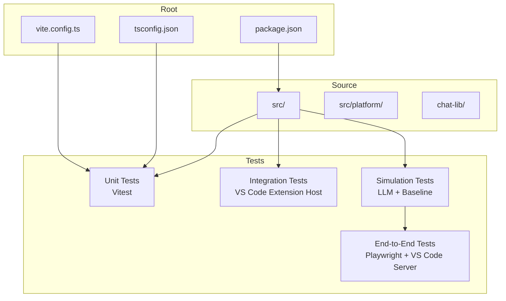
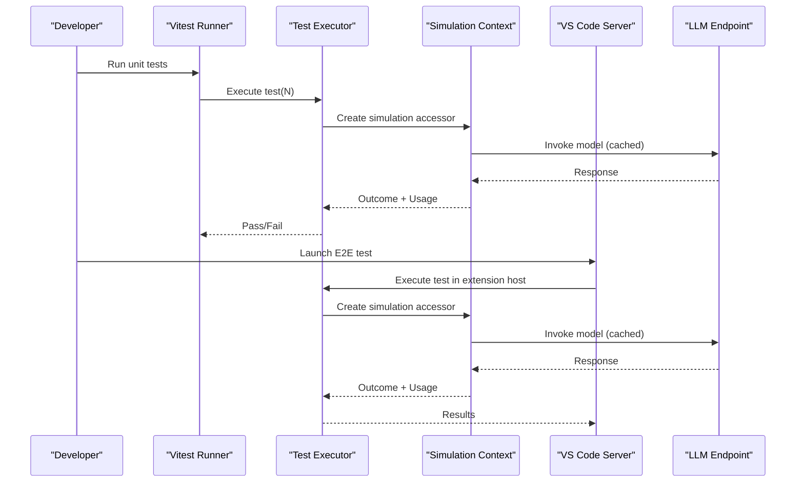
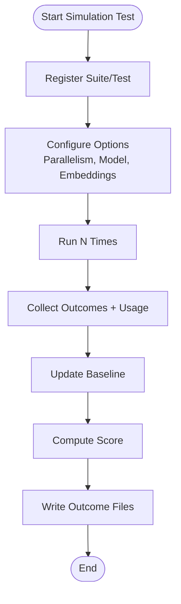
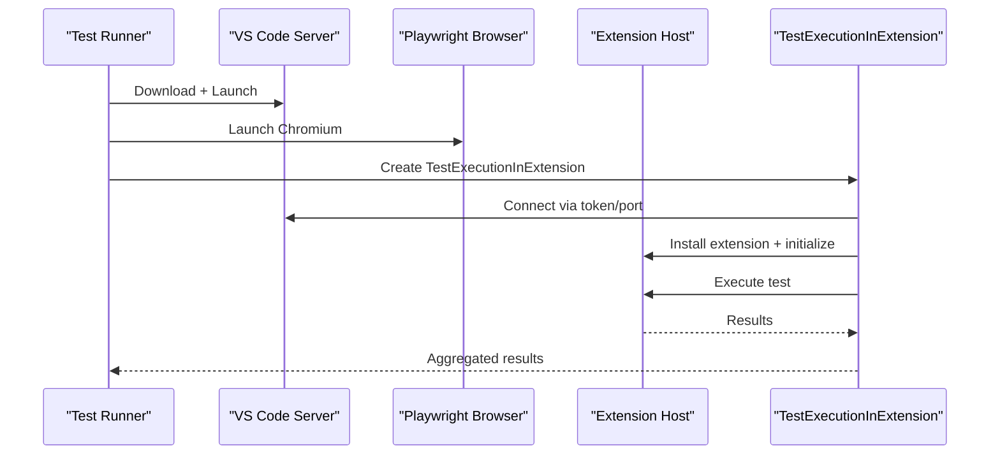
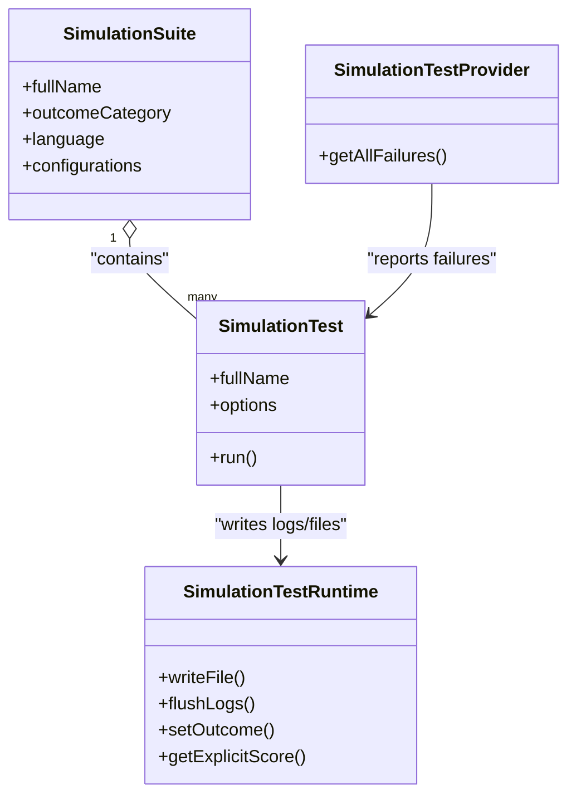
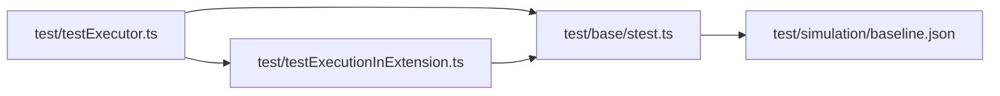

# Development & Testing

<cite>
**Referenced Files in This Document**
- [package.json](file://package.json)
- [CONTRIBUTING.md](file://CONTRIBUTING.md)
- [README.md](file://README.md)
- [vite.config.ts](file://vite.config.ts)
- [chat-lib/vitest.config.ts](file://chat-lib/vitest.config.ts)
- [tsconfig.json](file://tsconfig.json)
- [chat-lib/tsconfig.json](file://chat-lib/tsconfig.json)
- [test/base/stest.ts](file://test/base/stest.ts)
- [test/simulation/baseline.json](file://test/simulation/baseline.json)
- [test/simulation/simulationTestProvider.ts](file://test/simulation/simulationTestProvider.ts)
- [test/testExecutionInExtension.ts](file://test/testExecutionInExtension.ts)
- [test/testExecutor.ts](file://test/testExecutor.ts)
- [script/test/scoredEditsReconciler.spec.ts](file://script/test/scoredEditsReconciler.spec.ts)
</cite>

## Table of Contents
1. [Introduction](#introduction)
2. [Project Structure](#project-structure)
3. [Core Components](#core-components)
4. [Architecture Overview](#architecture-overview)
5. [Detailed Component Analysis](#detailed-component-analysis)
6. [Dependency Analysis](#dependency-analysis)
7. [Performance Considerations](#performance-considerations)
8. [Troubleshooting Guide](#troubleshooting-guide)
9. [Conclusion](#conclusion)
10. [Appendices](#appendices)

## Introduction
This document provides a comprehensive guide to the development workflow and testing strategies for the project. It covers environment setup, build configuration, debugging procedures, and the complete testing framework including unit tests, integration tests, simulation tests, and end-to-end tests. It also details the test execution pipeline, test data management, automated testing workflows, performance and load testing guidance, and the simulation testing framework for AI-assisted development scenarios.

## Project Structure
The repository is organized around a VS Code extension with a strong emphasis on testing and simulation. Key areas include:
- Extension source code under src/, platform abstractions under src/platform/, and library code under chat-lib/.
- A dedicated test/ directory containing unit, integration, simulation, and end-to-end test suites.
- Build and test configuration files for TypeScript/Vitest and Vite.

**Diagram sources**
- [package.json](file://package.json#L1-L120)
- [vite.config.ts](file://vite.config.ts#L1-L40)
- [tsconfig.json](file://tsconfig.json#L1-L40)

**Section sources**
- [package.json](file://package.json#L1-L120)
- [README.md](file://README.md#L1-L91)

## Core Components
- Development environment requirements and setup:
  - Node.js, Python, Git LFS, and platform-specific tooling.
  - First-time setup steps and debugging configurations.
- Build configuration:
  - TypeScript compilation and Vitest/Vite test configuration.
  - Path aliases and environment loading for tests.
- Testing framework:
  - Unit tests with Vitest.
  - Integration tests executed within VS Code.
  - Simulation tests that invoke LLM endpoints and maintain baselines.
  - End-to-end tests using Playwright against a real VS Code server.

**Section sources**
- [CONTRIBUTING.md](file://CONTRIBUTING.md#L69-L127)
- [vite.config.ts](file://vite.config.ts#L1-L40)
- [chat-lib/vitest.config.ts](file://chat-lib/vitest.config.ts#L1-L21)
- [tsconfig.json](file://tsconfig.json#L1-L40)
- [chat-lib/tsconfig.json](file://chat-lib/tsconfig.json#L1-L22)

## Architecture Overview
The testing architecture integrates multiple layers:
- Local unit tests run via Vitest with Node environment.
- Simulation tests orchestrate real LLM calls, cache interactions, and produce outcomes captured in baseline files.
- End-to-end tests spin up a real VS Code server, install the extension, and execute tests in a controlled workspace.

**Diagram sources**
- [test/testExecutor.ts](file://test/testExecutor.ts#L136-L154)
- [test/testExecutionInExtension.ts](file://test/testExecutionInExtension.ts#L53-L131)
- [test/base/stest.ts](file://test/base/stest.ts#L19-L51)

## Detailed Component Analysis

### Development Environment Setup
- Requirements:
  - Node.js, Python, Git LFS, and platform-specific build tools.
- First-time setup:
  - Install dependencies, obtain tokens, and use provided launch configurations for watch mode and debugging.
- Running with Code OSS:
  - Desktop and web variants with specific overrides and configuration steps.

**Section sources**
- [CONTRIBUTING.md](file://CONTRIBUTING.md#L69-L84)
- [CONTRIBUTING.md](file://CONTRIBUTING.md#L335-L438)

### Build Configuration
- TypeScript configuration:
  - Root tsconfig extends a base and includes src, test, and specific shims.
  - Paths alias for VS Code types.
- Vitest configuration:
  - Root vite.config.ts defines test inclusion/exclusion, environment loading, and aliases.
  - chat-lib/vitest.config.ts sets Node environment for library tests.

**Section sources**
- [tsconfig.json](file://tsconfig.json#L1-L40)
- [chat-lib/tsconfig.json](file://chat-lib/tsconfig.json#L1-L22)
- [vite.config.ts](file://vite.config.ts#L1-L40)
- [chat-lib/vitest.config.ts](file://chat-lib/vitest.config.ts#L1-L21)

### Debugging Procedures
- Use provided VS Code launch configurations for watch mode and extension debugging.
- Utilize the “Show Chat Debug View” command to inspect requests and troubleshoot agent behavior.
- Export request logs for sharing with maintainers.

**Section sources**
- [CONTRIBUTING.md](file://CONTRIBUTING.md#L75-L82)
- [CONTRIBUTING.md](file://CONTRIBUTING.md#L299-L308)

### Unit Tests
- Framework:
  - Vitest-based unit tests with Node environment.
  - Aliasing of VS Code types for test compatibility.
- Example:
  - A spec file validates merge conflict resolution logic.

**Section sources**
- [vite.config.ts](file://vite.config.ts#L19-L39)
- [chat-lib/vitest.config.ts](file://chat-lib/vitest.config.ts#L9-L21)
- [script/test/scoredEditsReconciler.spec.ts](file://script/test/scoredEditsReconciler.spec.ts#L1-L800)

### Integration Tests
- Execution:
  - Tests run within the VS Code extension host.
- Orchestration:
  - Test executor coordinates runs, manages outcomes, and aggregates usage metrics.

**Section sources**
- [test/testExecutor.ts](file://test/testExecutor.ts#L136-L154)

### Simulation Tests
- Purpose:
  - Reach out to Copilot API endpoints, invoke LLMs, and validate outcomes deterministically via baselines.
- Pipeline:
  - Registration of suites/tests, execution with configurable parallelism, caching, and snapshotting.
  - Baseline comparison and scoring across multiple runs.
- Data Management:
  - Baseline stored in test/simulation/baseline.json.
  - Cache layers under test/simulation/cache.
  - Outcome files and logs written per run.

**Diagram sources**
- [test/base/stest.ts](file://test/base/stest.ts#L319-L422)
- [test/testExecutor.ts](file://test/testExecutor.ts#L191-L278)
- [test/simulation/baseline.json](file://test/simulation/baseline.json#L1-L800)

**Section sources**
- [CONTRIBUTING.md](file://CONTRIBUTING.md#L85-L123)
- [test/base/stest.ts](file://test/base/stest.ts#L19-L51)
- [test/base/stest.ts](file://test/base/stest.ts#L319-L422)
- [test/testExecutor.ts](file://test/testExecutor.ts#L191-L278)
- [test/simulation/baseline.json](file://test/simulation/baseline.json#L1-L800)

### End-to-End Tests
- Infrastructure:
  - Spawns a VS Code server, installs the extension, and executes tests in a browser-controlled workspace.
- Execution:
  - TestExecutionInExtension manages workspaces, connections, and test runs.
  - Results are proxied back and aggregated by the test executor.

**Diagram sources**
- [test/testExecutionInExtension.ts](file://test/testExecutionInExtension.ts#L53-L131)
- [test/testExecutionInExtension.ts](file://test/testExecutionInExtension.ts#L187-L336)

**Section sources**
- [test/testExecutionInExtension.ts](file://test/testExecutionInExtension.ts#L53-L131)
- [test/testExecutionInExtension.ts](file://test/testExecutionInExtension.ts#L187-L336)

### Test Data Management
- Baseline:
  - A JSON file tracks pass/fail counts, scores, and content filter counts per test.
- Cache:
  - Simulation cache layers reduce cost and variability of LLM calls.
- Snapshots:
  - Optional snapshotting of test workspace state for reproducibility.

**Section sources**
- [test/simulation/baseline.json](file://test/simulation/baseline.json#L1-L800)
- [test/base/stest.ts](file://test/base/stest.ts#L424-L477)

### Automated Testing Workflows
- Unit tests:
  - Run via Vitest with configured include/exclude patterns and environment.
- Integration tests:
  - Execute within VS Code using provided npm scripts.
- Simulation tests:
  - Run with npm scripts; cache population and baseline updates are required for PRs.
- E2E tests:
  - Managed by TestExecutionInExtension with Playwright and VS Code server.

**Section sources**
- [CONTRIBUTING.md](file://CONTRIBUTING.md#L85-L123)
- [vite.config.ts](file://vite.config.ts#L19-L39)
- [chat-lib/vitest.config.ts](file://chat-lib/vitest.config.ts#L9-L21)

### Guidelines for Writing Effective Tests
- Keep tests deterministic:
  - Use simulation cache and deterministic prompts where possible.
- Validate outcomes:
  - Capture logs, written files, and explicit scores for regression detection.
- Organize by suites:
  - Group related tests with shared configurations and language/model settings.
- Use snapshots:
  - For complex workspace scenarios, snapshot state to ensure reproducibility.

**Section sources**
- [test/base/stest.ts](file://test/base/stest.ts#L121-L167)
- [test/base/stest.ts](file://test/base/stest.ts#L528-L631)

### Continuous Integration Practices
- CI runs optional simulation tests differently; ensure optional tests are not skipped unintentionally.
- PRs require populated cache layers and updated baselines; uncommitted baseline changes will cause failures.
- Use the provided scripts to update baselines and require cache.

**Section sources**
- [CONTRIBUTING.md](file://CONTRIBUTING.md#L100-L123)
- [test/testExecutor.ts](file://test/testExecutor.ts#L165-L170)

### Build System and Code Quality Tools
- Build targets and engines are defined in package.json.
- TypeScript configuration includes JSX factories and path aliases.
- Vitest configuration enables environment variables and Node globals for tests.

**Section sources**
- [package.json](file://package.json#L25-L29)
- [package.json](file://package.json#L150-L600)
- [tsconfig.json](file://tsconfig.json#L1-L40)
- [vite.config.ts](file://vite.config.ts#L19-L39)
- [chat-lib/vitest.config.ts](file://chat-lib/vitest.config.ts#L9-L21)

### Contributing, Code Review, and Release Procedures
- Contribution guidelines cover issue creation, development setup, testing, and troubleshooting.
- Code review processes are implied by PR requirements (cache and baseline maintenance).
- Releases align with VS Code version compatibility and engine requirements.

**Section sources**
- [CONTRIBUTING.md](file://CONTRIBUTING.md#L30-L67)
- [CONTRIBUTING.md](file://CONTRIBUTING.md#L69-L84)
- [package.json](file://package.json#L25-L29)

### Performance Testing, Load Testing, and Scalability Validation
- Simulation tests inherently include stochastic LLM behavior and can be used to measure performance across runs.
- Token usage and request durations are tracked per run and aggregated for analysis.
- Parallelism can be tuned to evaluate throughput and resource utilization.

**Section sources**
- [test/testExecutor.ts](file://test/testExecutor.ts#L253-L277)
- [test/testExecutor.ts](file://test/testExecutor.ts#L321-L337)

### Simulation Testing Framework for AI-Assisted Scenarios
- SimulationTest and SimulationSuite provide a registry for organizing AI-assisted tests.
- SimulationTestRuntime captures logs, writes files, and records outcomes for validation.
- SimulationTestProvider surfaces test failures for IDE integration.

**Diagram sources**
- [test/base/stest.ts](file://test/base/stest.ts#L253-L287)
- [test/base/stest.ts](file://test/base/stest.ts#L121-L167)
- [test/base/stest.ts](file://test/base/stest.ts#L528-L631)
- [test/simulation/simulationTestProvider.ts](file://test/simulation/simulationTestProvider.ts#L10-L63)

**Section sources**
- [test/base/stest.ts](file://test/base/stest.ts#L121-L167)
- [test/base/stest.ts](file://test/base/stest.ts#L528-L631)
- [test/simulation/simulationTestProvider.ts](file://test/simulation/simulationTestProvider.ts#L10-L63)

## Dependency Analysis
- Test execution depends on:
  - Simulation context and services.
  - Endpoint provider for LLM calls.
  - Tokenizer provider and outcome collectors.
- E2E relies on Playwright and VS Code server lifecycle management.

**Diagram sources**
- [test/testExecutor.ts](file://test/testExecutor.ts#L136-L154)
- [test/testExecutionInExtension.ts](file://test/testExecutionInExtension.ts#L53-L131)
- [test/base/stest.ts](file://test/base/stest.ts#L319-L422)
- [test/simulation/baseline.json](file://test/simulation/baseline.json#L1-L800)

**Section sources**
- [test/testExecutor.ts](file://test/testExecutor.ts#L136-L154)
- [test/testExecutionInExtension.ts](file://test/testExecutionInExtension.ts#L53-L131)
- [test/base/stest.ts](file://test/base/stest.ts#L319-L422)

## Performance Considerations
- Use simulation cache to reduce LLM costs and stabilize results.
- Tune parallelism to balance throughput and resource usage.
- Monitor token usage and request durations to identify bottlenecks.

[No sources needed since this section provides general guidance]

## Troubleshooting Guide
- Verify Node and Python versions and ensure Git LFS is installed.
- Use the “Show Chat Debug View” to inspect prompts and responses.
- Export request logs for issue reproduction.
- For E2E failures, confirm VS Code server startup and extension installation steps.

**Section sources**
- [CONTRIBUTING.md](file://CONTRIBUTING.md#L69-L87)
- [CONTRIBUTING.md](file://CONTRIBUTING.md#L299-L308)
- [test/testExecutionInExtension.ts](file://test/testExecutionInExtension.ts#L197-L207)

## Conclusion
This guide consolidates the development workflow and testing strategies for the project. It outlines environment setup, build configuration, debugging, and a robust testing pipeline spanning unit, integration, simulation, and end-to-end tests. Adhering to the outlined practices ensures reliable development, predictable CI behavior, and scalable validation of AI-assisted features.

[No sources needed since this section summarizes without analyzing specific files]

## Appendices
- Additional resources and links are provided in the repository README and contribution guidelines.

**Section sources**
- [README.md](file://README.md#L69-L76)
- [CONTRIBUTING.md](file://CONTRIBUTING.md#L1-L40)