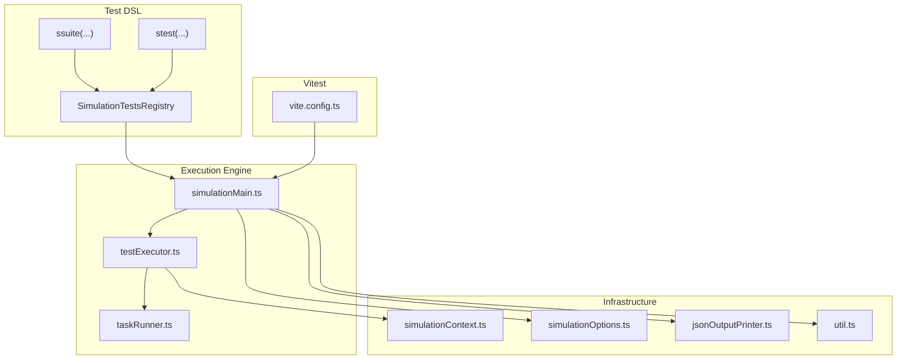
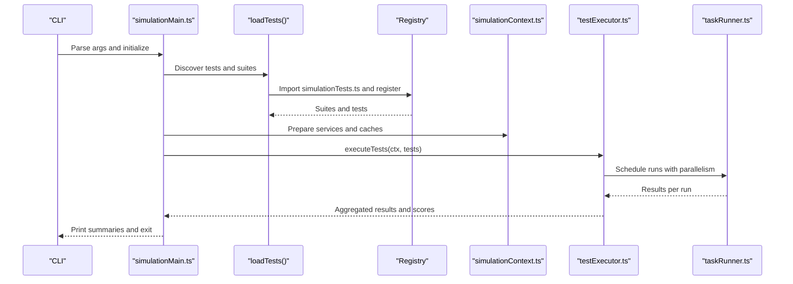
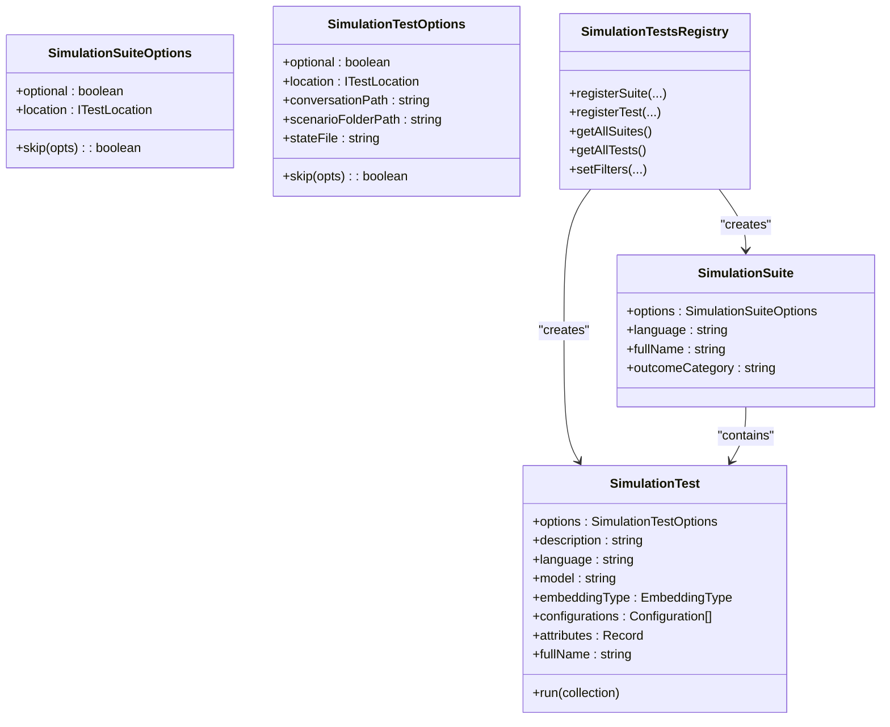
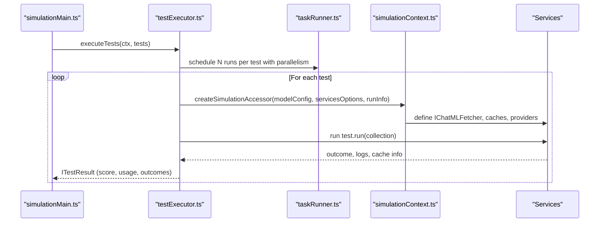
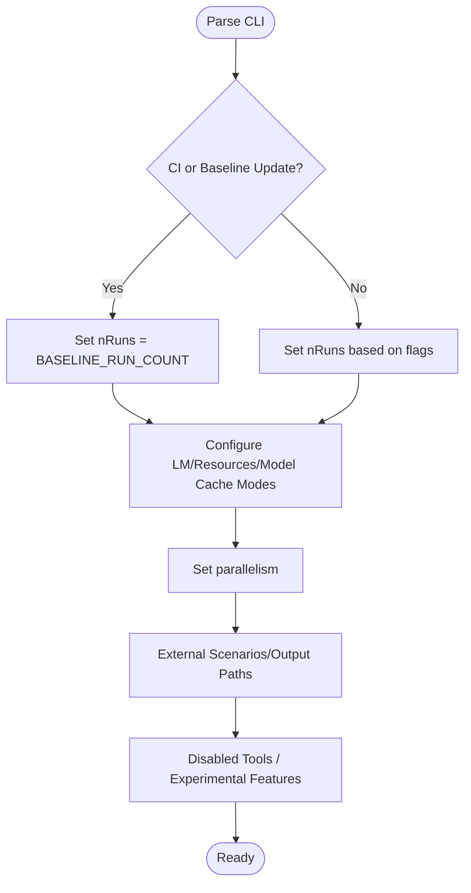
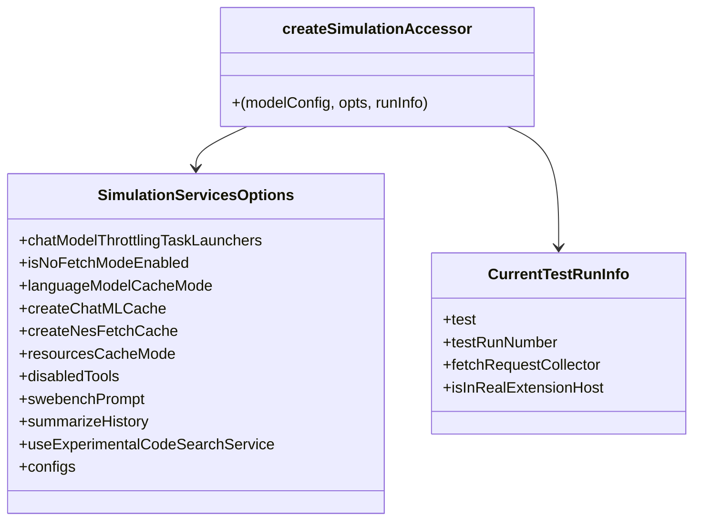
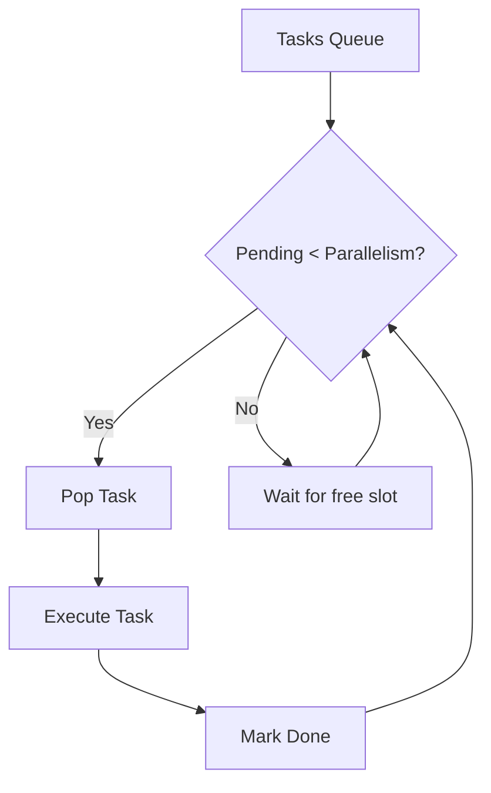
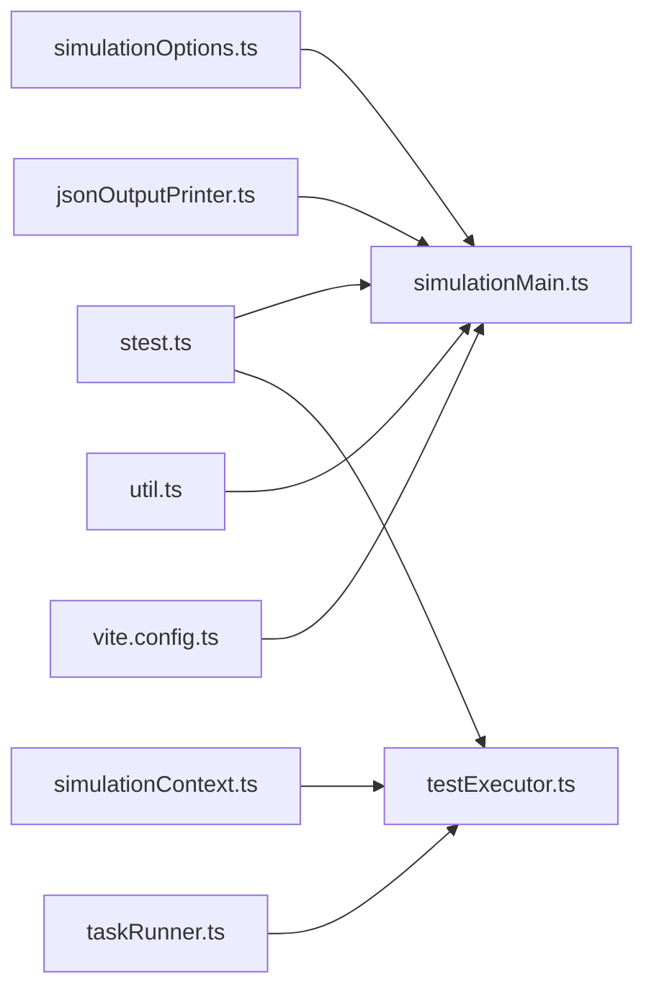

# Testing Framework & Strategies

<cite>
**Referenced Files in This Document**
- [simulationMain.ts](file://test/simulationMain.ts)
- [testExecutor.ts](file://test/testExecutor.ts)
- [stest.ts](file://test/base/stest.ts)
- [simulationOptions.ts](file://test/base/simulationOptions.ts)
- [simulationContext.ts](file://test/base/simulationContext.ts)
- [simulationTestProvider.ts](file://test/simulation/simulationTestProvider.ts)
- [simulationTests.ts](file://test/simulationTests.ts)
- [taskRunner.ts](file://test/taskRunner.ts)
- [jsonOutputPrinter.ts](file://test/jsonOutputPrinter.ts)
- [util.ts](file://test/util.ts)
- [vite.config.ts](file://vite.config.ts)
- [package.json](file://package.json)
</cite>

## Table of Contents
1. [Introduction](#introduction)
2. [Project Structure](#project-structure)
3. [Core Components](#core-components)
4. [Architecture Overview](#architecture-overview)
5. [Detailed Component Analysis](#detailed-component-analysis)
6. [Dependency Analysis](#dependency-analysis)
7. [Performance Considerations](#performance-considerations)
8. [Troubleshooting Guide](#troubleshooting-guide)
9. [Conclusion](#conclusion)
10. [Appendices](#appendices)

## Introduction
This document describes the comprehensive testing framework and strategies used in the project, focusing on:
- The SimulationTest framework with stest and ssuite decorators
- Test registration and execution pipeline
- Simulation testing for AI-assisted development scenarios
- Test data management and outcome validation
- Unit testing with Vitest, integration testing patterns, and end-to-end testing methodologies
- Guidelines for writing effective tests, organizing test suites, mocking strategies, and fixtures
- Test execution environment, parallel test running, and continuous integration setup
- Performance testing, load testing, and scalability validation tailored for AI-enabled applications

## Project Structure
The testing system is organized around:
- A SimulationTest DSL built with stest and ssuite decorators for declaring tests and suites
- A registry that collects and filters tests
- An execution engine that runs tests in parallel, manages caches, and validates outcomes
- A Vitest-based unit testing configuration for component and integration tests
- Utilities for JSON output, timing, and scoring

**Diagram sources**
- [stest.ts](file://test/base/stest.ts#L482-L510)
- [simulationMain.ts](file://test/simulationMain.ts#L413-L479)
- [testExecutor.ts](file://test/testExecutor.ts#L136-L154)
- [simulationContext.ts](file://test/base/simulationContext.ts#L177-L305)
- [simulationOptions.ts](file://test/base/simulationOptions.ts#L12-L161)
- [taskRunner.ts](file://test/taskRunner.ts#L28-L45)
- [jsonOutputPrinter.ts](file://test/jsonOutputPrinter.ts#L12-L41)
- [util.ts](file://test/util.ts#L11-L32)
- [vite.config.ts](file://vite.config.ts#L19-L39)

**Section sources**
- [stest.ts](file://test/base/stest.ts#L482-L510)
- [simulationMain.ts](file://test/simulationMain.ts#L413-L479)
- [testExecutor.ts](file://test/testExecutor.ts#L136-L154)
- [simulationContext.ts](file://test/base/simulationContext.ts#L177-L305)
- [simulationOptions.ts](file://test/base/simulationOptions.ts#L12-L161)
- [taskRunner.ts](file://test/taskRunner.ts#L28-L45)
- [jsonOutputPrinter.ts](file://test/jsonOutputPrinter.ts#L12-L41)
- [util.ts](file://test/util.ts#L11-L32)
- [vite.config.ts](file://vite.config.ts#L19-L39)

## Core Components
- SimulationTest and ssuite decorators: Define tests and suites with metadata, language, model, and configuration overrides.
- SimulationTestsRegistry: Registers suites and tests, enforces uniqueness, supports filtering, and resolves locations for reporting.
- SimulationOptions: Parses CLI flags controlling model selection, cache modes, parallelism, CI behavior, and external scenarios.
- SimulationContext: Builds a TestingServiceCollection with caching, throttling, and AI services for each test run.
- TestExecutor: Orchestrates execution, parallel scheduling, scoring, baseline comparison, and outcome recording.
- TaskRunner: Limits concurrency and schedules tasks for parallel execution.
- JSONOutputPrinter: Emits structured output for test runs and artifacts.
- Vitest configuration: Defines include/exclude patterns, environment variables, and aliases for unit tests.

**Section sources**
- [stest.ts](file://test/base/stest.ts#L121-L167)
- [stest.ts](file://test/base/stest.ts#L253-L287)
- [stest.ts](file://test/base/stest.ts#L319-L422)
- [simulationOptions.ts](file://test/base/simulationOptions.ts#L12-L161)
- [simulationContext.ts](file://test/base/simulationContext.ts#L177-L305)
- [testExecutor.ts](file://test/testExecutor.ts#L136-L278)
- [taskRunner.ts](file://test/taskRunner.ts#L28-L45)
- [jsonOutputPrinter.ts](file://test/jsonOutputPrinter.ts#L12-L41)
- [vite.config.ts](file://vite.config.ts#L19-L39)

## Architecture Overview
The end-to-end flow starts from CLI parsing, discovers tests, prepares the simulation context, executes tests in parallel, and writes outcomes and baselines.

**Diagram sources**
- [simulationMain.ts](file://test/simulationMain.ts#L57-L126)
- [simulationMain.ts](file://test/simulationMain.ts#L413-L479)
- [simulationContext.ts](file://test/base/simulationContext.ts#L177-L305)
- [testExecutor.ts](file://test/testExecutor.ts#L136-L154)
- [taskRunner.ts](file://test/taskRunner.ts#L28-L45)

## Detailed Component Analysis

### SimulationTest DSL: stest and ssuite
- ssuite registers a suite with title, subtitle, location, language, configurations, and optional flags. It captures the file location for reporting.
- stest registers individual tests with description, language, model, embedding type, configurations, and options like optional and skip predicates. It also captures location.
- Registry enforces unique test names, merges suite-level configurations into tests, and supports filtering via grep/omit-grep.

**Diagram sources**
- [stest.ts](file://test/base/stest.ts#L121-L167)
- [stest.ts](file://test/base/stest.ts#L188-L208)
- [stest.ts](file://test/base/stest.ts#L253-L287)
- [stest.ts](file://test/base/stest.ts#L319-L422)

**Section sources**
- [stest.ts](file://test/base/stest.ts#L482-L510)
- [stest.ts](file://test/base/stest.ts#L319-L422)

### Execution Pipeline: From Discovery to Outcome
- loadTests imports the central registry loader and builds a filtered list of tests.
- prepareTestEnvironment configures caches, baseline, output paths, and printer.
- executeTests groups tests by extension host locality, schedules with TaskRunner, and aggregates scores.
- executeTestOnce sets up a TestingServiceCollection per run, injects spies and caches, runs the test, and records outcomes.

**Diagram sources**
- [simulationMain.ts](file://test/simulationMain.ts#L290-L411)
- [testExecutor.ts](file://test/testExecutor.ts#L136-L278)
- [simulationContext.ts](file://test/base/simulationContext.ts#L177-L305)

**Section sources**
- [simulationMain.ts](file://test/simulationMain.ts#L290-L411)
- [testExecutor.ts](file://test/testExecutor.ts#L136-L278)
- [simulationContext.ts](file://test/base/simulationContext.ts#L177-L305)

### Simulation Options and Flags
- Controls model selection, cache modes (LM, resources, model metadata), parallelism, CI behavior, external scenarios, and output paths.
- Supports disabling tools, enabling experimental features, and configuring model/model config files.

**Diagram sources**
- [simulationOptions.ts](file://test/base/simulationOptions.ts#L90-L161)
- [simulationOptions.ts](file://test/base/simulationOptions.ts#L163-L251)

**Section sources**
- [simulationOptions.ts](file://test/base/simulationOptions.ts#L12-L161)
- [simulationOptions.ts](file://test/base/simulationOptions.ts#L163-L251)

### Simulation Context and Caching
- Builds a TestingServiceCollection with throttled chat fetchers, caching wrappers, and AI services.
- Supports No-Fetch mode, cache scopes, and spy interception of requests for validation and metrics.

**Diagram sources**
- [simulationContext.ts](file://test/base/simulationContext.ts#L136-L170)
- [simulationContext.ts](file://test/base/simulationContext.ts#L177-L305)

**Section sources**
- [simulationContext.ts](file://test/base/simulationContext.ts#L136-L170)
- [simulationContext.ts](file://test/base/simulationContext.ts#L177-L305)

### Parallel Execution and Task Scheduling
- TaskRunner limits concurrent tasks and launches new ones as slots free up.
- executeTests partitions tests by extension host locality and runs them concurrently.

**Diagram sources**
- [taskRunner.ts](file://test/taskRunner.ts#L28-L70)
- [testExecutor.ts](file://test/testExecutor.ts#L156-L189)

**Section sources**
- [taskRunner.ts](file://test/taskRunner.ts#L28-L70)
- [testExecutor.ts](file://test/testExecutor.ts#L156-L189)

### Unit Testing with Vitest
- Vitest is configured with include/exclude patterns, environment loading, and aliases for testing.
- Unit tests live alongside source under spec files and leverage the same service collection and mocks as integration tests.

**Section sources**
- [vite.config.ts](file://vite.config.ts#L19-L39)

### Integration and End-to-End Testing Methodologies
- Integration tests validate service wiring and caching behavior using the same TestingServiceCollection.
- E2E tests simulate real user scenarios across inline and panel contexts, capturing logs, outcomes, and metrics.
- External scenarios support running tests against external systems (NES, external providers) with controlled discovery and filtering.

**Section sources**
- [simulationMain.ts](file://test/simulationMain.ts#L413-L479)
- [simulationTests.ts](file://test/simulationTests.ts#L1-L62)

### Outcome Validation and Baseline Management
- Outcomes include pass/fail, explicit scores, content filter counts, cache info, and request metrics.
- Baseline comparison computes overall and suite-level scores, tracks improvements/worsenings, and supports CI gating.

**Section sources**
- [testExecutor.ts](file://test/testExecutor.ts#L47-L84)
- [testExecutor.ts](file://test/testExecutor.ts#L233-L241)
- [simulationMain.ts](file://test/simulationMain.ts#L611-L769)

### Test Data Management and Fixtures
- Test snapshots and outcome files are written under per-run directories with unique filenames.
- Fixtures and scenario data are managed via external scenario loaders and discovery utilities.

**Section sources**
- [stest.ts](file://test/base/stest.ts#L528-L631)
- [simulationMain.ts](file://test/simulationMain.ts#L413-L479)

### Continuous Integration Setup
- CI mode enforces baseline stability and fails on regressions or missing mandatory scenarios.
- Optional tests are skipped in CI; baseline updates require specific flags and validation.

**Section sources**
- [simulationOptions.ts](file://test/base/simulationOptions.ts#L98-L104)
- [simulationMain.ts](file://test/simulationMain.ts#L388-L408)

## Dependency Analysis
The following diagram highlights key dependencies among core testing modules.

**Diagram sources**
- [simulationOptions.ts](file://test/base/simulationOptions.ts#L12-L161)
- [stest.ts](file://test/base/stest.ts#L482-L510)
- [simulationMain.ts](file://test/simulationMain.ts#L57-L126)
- [testExecutor.ts](file://test/testExecutor.ts#L136-L154)
- [simulationContext.ts](file://test/base/simulationContext.ts#L177-L305)
- [taskRunner.ts](file://test/taskRunner.ts#L28-L45)
- [jsonOutputPrinter.ts](file://test/jsonOutputPrinter.ts#L12-L41)
- [util.ts](file://test/util.ts#L11-L32)
- [vite.config.ts](file://vite.config.ts#L19-L39)

**Section sources**
- [simulationOptions.ts](file://test/base/simulationOptions.ts#L12-L161)
- [stest.ts](file://test/base/stest.ts#L482-L510)
- [simulationMain.ts](file://test/simulationMain.ts#L57-L126)
- [testExecutor.ts](file://test/testExecutor.ts#L136-L154)
- [simulationContext.ts](file://test/base/simulationContext.ts#L177-L305)
- [taskRunner.ts](file://test/taskRunner.ts#L28-L45)
- [jsonOutputPrinter.ts](file://test/jsonOutputPrinter.ts#L12-L41)
- [util.ts](file://test/util.ts#L11-L32)
- [vite.config.ts](file://vite.config.ts#L19-L39)

## Performance Considerations
- Parallelism: Tune the parallelism flag to balance throughput and resource contention. Higher parallelism increases cache hit rates but may saturate endpoints.
- Caching: Use cache modes to control cache usage and enforce cache hits for reproducibility. Consider external cache layers for shared baselines.
- Throttling: Built-in throttlers emulate endpoint limits; boosting can accelerate runs during development.
- Memory and I/O: Heap snapshots and GC toggles aid in diagnosing memory pressure during long runs.
- Metrics: Track request counts, durations, content filter impacts, and cache misses to identify bottlenecks.

[No sources needed since this section provides general guidance]

## Troubleshooting Guide
- Critical errors and TypeErrors are treated as critical failures to prevent CI masking.
- Unexpected failures are logged and surfaced with stacks; content filter hits and cache misses are tracked for diagnosis.
- Endpoint health tracking records rate-limited and failed requests to aid triage.
- Use verbose mode to print detailed per-run results and messages.

**Section sources**
- [testExecutor.ts](file://test/testExecutor.ts#L458-L490)
- [testExecutor.ts](file://test/testExecutor.ts#L495-L502)
- [simulationMain.ts](file://test/simulationMain.ts#L395-L408)

## Conclusion
The testing framework combines a flexible SimulationTest DSL, robust execution orchestration, and comprehensive caching and validation to support AI-assisted development testing. It scales from unit tests under Vitest to large-scale simulation runs with parallel execution, structured outcomes, and CI-friendly baselines. The design emphasizes reproducibility, observability, and maintainability for AI-enabled workflows.

[No sources needed since this section summarizes without analyzing specific files]

## Appendices

### Writing Effective Simulation Tests
- Use ssuite to group related scenarios by context (inline, panel, external) and language.
- Prefer deterministic prompts and controlled model selections for stable baselines.
- Capture explicit scores and outcomes for automated validation.
- Leverage configuration overrides to test feature flags and settings.

**Section sources**
- [stest.ts](file://test/base/stest.ts#L253-L287)
- [stest.ts](file://test/base/stest.ts#L121-L167)

### Test Organization Patterns
- Feature-based grouping: Place related stest files under feature folders (e.g., e2e, inline, prompts).
- Central registry loader: Keep simulationTests.ts updated to include new test files.

**Section sources**
- [simulationTests.ts](file://test/simulationTests.ts#L1-L62)

### Mocking Strategies and Fixtures
- Use TestingServiceCollection to inject mock services and spies for endpoints.
- Fixture data can be loaded via external scenario discovery and scenario loaders.

**Section sources**
- [simulationContext.ts](file://test/base/simulationContext.ts#L177-L305)
- [simulationMain.ts](file://test/simulationMain.ts#L413-L479)

### Test Execution Environment
- Environment variables are loaded via Vite’s env loader for unit tests.
- Simulation runs set environment flags and configure logging and output.

**Section sources**
- [vite.config.ts](file://vite.config.ts#L20-L28)
- [simulationMain.ts](file://test/simulationMain.ts#L5-L10)

### Continuous Integration Setup
- CI mode enforces baseline stability and skips optional tests.
- Baseline update requires explicit flags and validation.

**Section sources**
- [simulationOptions.ts](file://test/base/simulationOptions.ts#L98-L104)
- [simulationMain.ts](file://test/simulationMain.ts#L388-L408)

### Performance, Load, and Scalability Testing
- Use parallelism to scale test execution; monitor endpoint health and cache behavior.
- Employ throttling and cache modes to simulate production constraints.
- Track usage metrics and request durations to identify scaling bottlenecks.

**Section sources**
- [simulationContext.ts](file://test/base/simulationContext.ts#L110-L134)
- [simulationContext.ts](file://test/base/simulationContext.ts#L267-L285)
- [testExecutor.ts](file://test/testExecutor.ts#L253-L266)