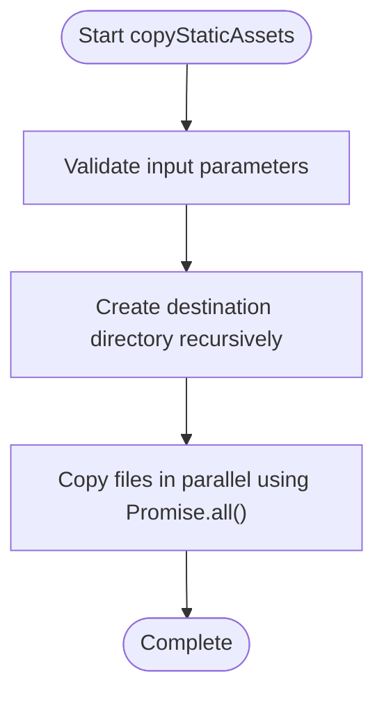
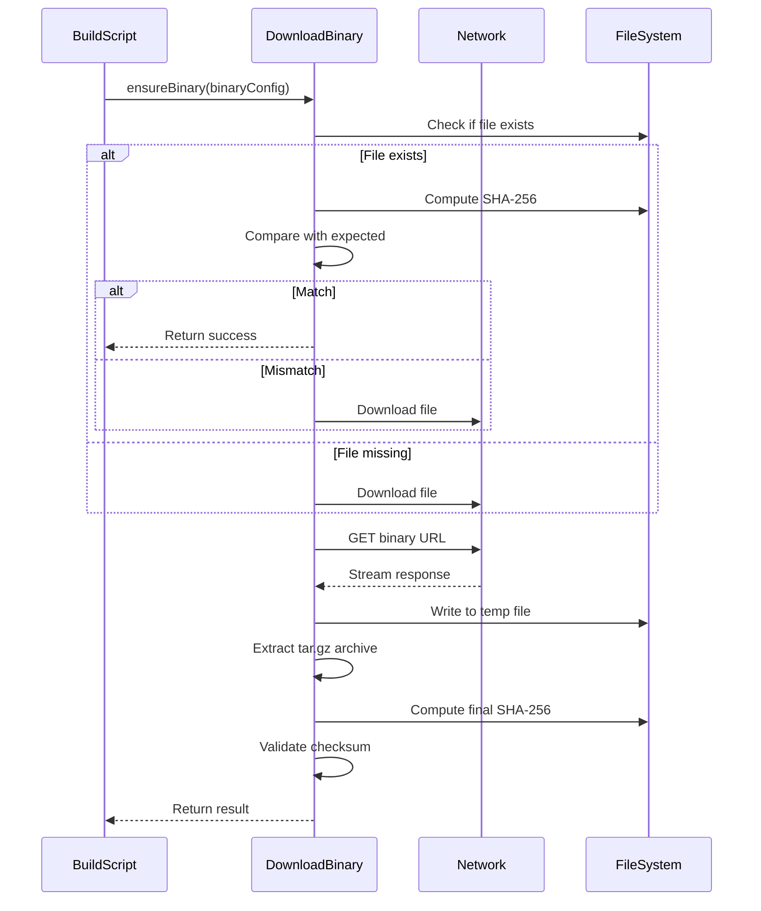
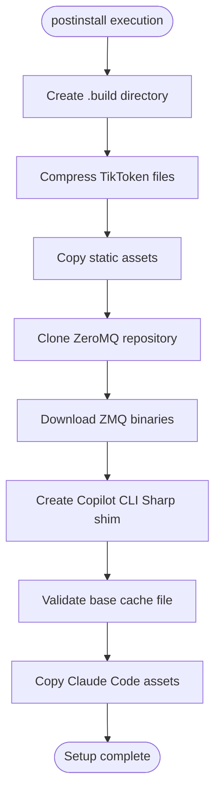
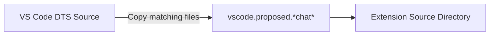
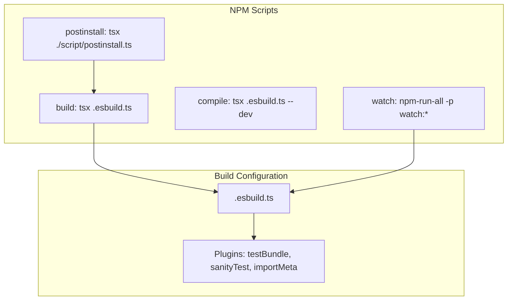
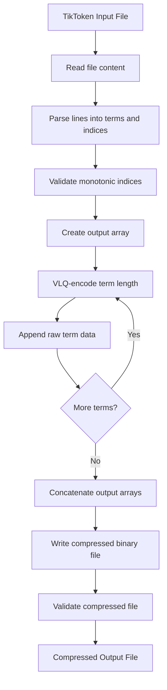

# Build Process

<cite>
**Referenced Files in This Document**   
- [compressTikToken.ts](file://script/build/compressTikToken.ts)
- [copyStaticAssets.ts](file://script/build/copyStaticAssets.ts)
- [downloadBinary.ts](file://script/build/downloadBinary.ts)
- [postinstall.ts](file://script/postinstall.ts)
- [applyLocalDts.sh](file://script/applyLocalDts.sh)
- [package.json](file://package.json)
- [.esbuild.ts](file://.esbuild.ts)
</cite>

## Table of Contents
1. [Introduction](#introduction)
2. [Build Scripts Overview](#build-scripts-overview)
3. [Static Asset Management](#static-asset-management)
4. [Binary Dependency Handling](#binary-dependency-handling)
5. [Post-Installation Setup](#post-installation-setup)
6. [Type Definition Management](#type-definition-management)
7. [Build Process Integration](#build-process-integration)
8. [Build Optimization and Compression](#build-optimization-and-compression)
9. [Practical Build Examples](#practical-build-examples)
10. [Common Build Issues and Solutions](#common-build-issues-and-solutions)
11. [Environment-Specific Customization](#environment-specific-customization)
12. [Conclusion](#conclusion)

## Introduction

The GitHub Copilot Chat extension employs a sophisticated build process designed to optimize performance, manage dependencies, and ensure consistent deployment across environments. This documentation provides a comprehensive analysis of the build system, focusing on the scripts located in the `script/build/` directory and their integration with npm scripts defined in `package.json`. The build process encompasses several critical components including asset compression, static file management, binary dependency handling, and post-installation configuration. Understanding this build system is essential for developers who need to customize, debug, or extend the functionality of the Copilot Chat extension.

**Section sources**
- [package.json](file://package.json#L4244-L4415)

## Build Scripts Overview

The build process for GitHub Copilot Chat is orchestrated through a collection of specialized scripts in the `script/build/` directory. These scripts handle various aspects of the build pipeline, from asset optimization to dependency management. The primary build scripts include `compressTikToken.ts`, `copyStaticAssets.ts`, and `downloadBinary.ts`, each serving a distinct purpose in preparing the extension for deployment. These TypeScript scripts are executed using `tsx`, allowing for modern JavaScript features and type safety during the build process. The build system is designed to be modular and extensible, enabling developers to add new build steps as needed while maintaining consistency across different environments.

The build scripts are integrated into the overall development workflow through npm scripts defined in `package.json`. The main build command, `npm run build`, invokes the `.esbuild.ts` configuration file which coordinates the compilation and bundling process using esbuild. This integration ensures that all build steps are executed in the correct order and with the appropriate configuration for the target environment. The build system supports both development and production modes, with different optimization levels and output configurations based on the build type.

**Section sources**
- [compressTikToken.ts](file://script/build/compressTikToken.ts#L1-L77)
- [copyStaticAssets.ts](file://script/build/copyStaticAssets.ts#L1-L19)
- [downloadBinary.ts](file://script/build/downloadBinary.ts#L1-L133)

## Static Asset Management

The static asset management process in GitHub Copilot Chat is handled by the `copyStaticAssets.ts` script, which efficiently copies required assets to the distribution directory. This script exports a function that takes an array of source paths and a destination directory, then copies each file while preserving the directory structure. The implementation uses Node.js's `fs.promises` API with `Promise.all()` to perform multiple copy operations in parallel, optimizing build performance.

Static assets include various components essential for the extension's functionality, such as Tree-sitter grammar WASM files and other binary dependencies. The script is designed to handle multiple files simultaneously, reducing build time through parallel execution. It also ensures that the destination directory exists by creating it recursively if necessary, preventing file system errors during the copy process. This approach to static asset management provides a reliable and efficient way to include necessary files in the final build without manual intervention.



**Diagram sources**
- [copyStaticAssets.ts](file://script/build/copyStaticAssets.ts#L1-L19)

**Section sources**
- [copyStaticAssets.ts](file://script/build/copyStaticAssets.ts#L1-L19)
- [postinstall.ts](file://script/postinstall.ts#L179-L183)

## Binary Dependency Handling

Binary dependency management in GitHub Copilot Chat is implemented through the `downloadBinary.ts` script, which provides robust functionality for downloading and verifying binary files. The script defines an `IBinary` interface that specifies the required properties for each binary: URL, SHA-256 checksum, and destination path. This interface ensures consistent configuration across all binary dependencies.

The core function `ensureBinary()` performs several critical operations: it first checks if the binary already exists at the specified destination, then verifies its integrity using the SHA-256 checksum. If the binary is missing or corrupted, it downloads the file from the specified URL, extracts it from a tar.gz archive, and validates the checksum again after extraction. This multi-step verification process ensures the integrity and authenticity of all binary dependencies.

The script also includes helper functions for computing SHA-256 hashes, downloading files with redirect handling, and extracting tar archives. These utilities provide comprehensive error handling and logging, making the binary management process reliable and transparent. The implementation uses streaming operations for file downloads and extraction, minimizing memory usage and improving performance with large files.



**Diagram sources**
- [downloadBinary.ts](file://script/build/downloadBinary.ts#L1-L133)

**Section sources**
- [downloadBinary.ts](file://script/build/downloadBinary.ts#L1-L133)
- [postinstall.ts](file://script/postinstall.ts#L185-L188)

## Post-Installation Setup

The post-installation setup process is managed by the `postinstall.ts` script, which executes automatically after npm package installation. This script performs several critical initialization tasks that prepare the development environment for building and running the extension. The postinstall process is triggered by the `postinstall` npm script in `package.json`, ensuring it runs whenever dependencies are installed or updated.

Key responsibilities of the postinstall script include:
- Compressing TikToken files for efficient storage and loading
- Copying static assets such as Tree-sitter grammar WASM files
- Cloning and configuring the ZeroMQ repository from a specific commit
- Creating shim modules for dependencies with native components
- Validating the presence of essential test files

The script implements a comprehensive setup workflow that addresses various dependency requirements. For example, it handles the ZeroMQ dependency by cloning a specific repository commit, ensuring version consistency across development environments. It also creates a shim for the Sharp module, which has native dependencies that are difficult to distribute, by implementing a minimal compatible interface that satisfies the requirements of dependent packages.



**Diagram sources**
- [postinstall.ts](file://script/postinstall.ts#L170-L203)

**Section sources**
- [postinstall.ts](file://script/postinstall.ts#L170-L203)
- [package.json](file://package.json#L4246)

## Type Definition Management

Type definition management in the GitHub Copilot Chat project is handled through the `applyLocalDts.sh` shell script, which automates the process of copying proposed VS Code API definitions. This script plays a crucial role in ensuring that the extension has access to the latest VS Code API proposals, which are necessary for implementing advanced features and maintaining compatibility with the evolving VS Code platform.

The script uses basic shell commands to locate the source directory and copy specific type definition files matching the pattern `vscode.proposed.*chat*` from the VS Code source tree to the extension's source directory. This selective copying ensures that only relevant chat-related API proposals are included, reducing the risk of conflicts with other API definitions. The implementation is straightforward but effective, leveraging the power of shell globbing to identify and copy the appropriate files.

This approach to type definition management enables the extension to use experimental VS Code APIs while maintaining a clean separation between stable and proposed APIs. By automating this process, the build system ensures that developers always have access to the latest chat-related API proposals without manual intervention, facilitating rapid development and experimentation with new VS Code features.



**Diagram sources**
- [applyLocalDts.sh](file://script/applyLocalDts.sh#L1-L6)

**Section sources**
- [applyLocalDts.sh](file://script/applyLocalDts.sh#L1-L6)

## Build Process Integration

The build process in GitHub Copilot Chat is tightly integrated with npm scripts defined in `package.json`, creating a cohesive development workflow. The primary build command `npm run build` invokes the `.esbuild.ts` configuration file, which leverages esbuild for fast and efficient compilation and bundling. This integration allows for a streamlined build process that combines TypeScript compilation, module bundling, and asset optimization in a single step.

The `package.json` file defines several key scripts that orchestrate different aspects of the build process:
- `postinstall`: Executes the post-installation setup script
- `build`: Runs the main esbuild configuration
- `compile`: Performs development builds with source maps
- `watch`: Enables continuous rebuilding during development
- `typecheck`: Validates TypeScript types across the codebase

The esbuild configuration in `.esbuild.ts` defines multiple build targets for different components of the extension, including the main extension host, web worker components, and simulation tools. It uses plugins to handle special cases such as test bundling and import meta URL resolution. The configuration also implements environment-specific optimizations, such as minification for production builds and source maps for development.



**Diagram sources**
- [package.json](file://package.json#L4244-L4285)
- [.esbuild.ts](file://.esbuild.ts#L1-L382)

**Section sources**
- [package.json](file://package.json#L4244-L4285)
- [.esbuild.ts](file://.esbuild.ts#L1-L382)

## Build Optimization and Compression

The build optimization and compression process in GitHub Copilot Chat focuses on reducing file size and improving runtime performance through several specialized techniques. The most notable optimization is the compression of TikToken files, which are used for tokenization in the AI models. The `compressTikToken.ts` script transforms these text-based files into a compact binary format that significantly reduces storage requirements and improves loading speed.

The compression algorithm takes advantage of the monotonic increase in term lengths by using Variable Length Quantity (VLQ) encoding for length values followed by the raw term data. This approach eliminates redundant information present in the original format, where each line included both the base64-encoded term and its index. The implementation includes validation to ensure data integrity, with an `assertOk` function that verifies the compressed file can be correctly decompressed and matches the original content.

Additional optimization techniques include:
- Tree shaking to eliminate unused code
- Minification of JavaScript output
- Bundling of modules to reduce file count
- Source map generation for development builds
- Externalization of dependencies to prevent duplication

These optimizations work together to create a lean and efficient build that minimizes the extension's footprint while maintaining full functionality. The build system balances optimization level with development convenience, providing fast builds for development and maximum optimization for production releases.



**Diagram sources**
- [compressTikToken.ts](file://script/build/compressTikToken.ts#L35-L65)

**Section sources**
- [compressTikToken.ts](file://script/build/compressTikToken.ts#L1-L77)
- [.esbuild.ts](file://.esbuild.ts#L18-L26)

## Practical Build Examples

The GitHub Copilot Chat build system provides several practical commands for different development scenarios. These commands are accessible through npm scripts and can be executed from the project root directory. Understanding these commands and their typical use cases is essential for effective development and troubleshooting.

To perform a standard build of the extension, execute:
```bash
npm run build
```
This command runs the esbuild configuration with production settings, generating optimized output in the `dist/` directory.

For development with continuous rebuilding, use:
```bash
npm run watch
```
This command starts multiple watchers that automatically rebuild the extension when source files change, enabling rapid development cycles.

To install dependencies and run post-installation setup:
```bash
npm install
```
This command installs all dependencies and automatically triggers the `postinstall` script, which handles the setup of binary dependencies and asset copying.

For type checking without building:
```bash
npm run typecheck
```
This command verifies TypeScript types across the codebase, helping catch type errors before compilation.

To run tests:
```bash
npm run test
```
This command executes all test suites, including unit tests and extension tests.

The build output includes several key directories and files:
- `dist/`: Contains the compiled extension files
- `.build/`: Temporary build artifacts
- `node_modules/`: Installed dependencies
- Various WASM and binary files copied during the build process

**Section sources**
- [package.json](file://package.json#L4244-L4285)
- [.esbuild.ts](file://.esbuild.ts#L275-L359)

## Common Build Issues and Solutions

Several common build issues may arise when working with the GitHub Copilot Chat extension, primarily related to dependency management, network connectivity, and file system permissions. Understanding these issues and their solutions is crucial for maintaining a smooth development workflow.

**Asset Copying Failures**: These typically occur when source files are missing or destination directories cannot be created. Solutions include:
- Verifying that all required dependencies are installed
- Checking file system permissions for the destination directory
- Ensuring sufficient disk space is available
- Running `npm install` to restore missing dependencies

**Binary Download Errors**: These may happen due to network issues or checksum mismatches. Troubleshooting steps include:
- Verifying internet connectivity and proxy settings
- Checking that the specified URL is accessible
- Clearing any corrupted downloads from the destination directory
- Verifying that the SHA-256 checksum in the configuration matches the expected value

**Git LFS Issues**: The build process depends on Git LFS for large files like the base cache. If these files are not properly initialized:
- Install Git LFS: `git lfs install`
- Pull LFS files: `git lfs pull`
- Verify file integrity: `git lfs fsck`

**Permission Errors**: When running scripts that require elevated privileges:
- Ensure the user has write permissions to the project directory
- Avoid running npm commands with sudo when possible
- Configure npm to use a directory with appropriate permissions

**Missing Type Definitions**: If the VS Code API definitions are not properly copied:
- Verify the source directory exists
- Check that the `applyLocalDts.sh` script has execute permissions
- Manually run the script if needed

**Section sources**
- [postinstall.ts](file://script/postinstall.ts#L193-L196)
- [downloadBinary.ts](file://script/build/downloadBinary.ts#L20-L44)
- [applyLocalDts.sh](file://script/applyLocalDts.sh#L1-L6)

## Environment-Specific Customization

The build process for GitHub Copilot Chat supports customization for different environments through various configuration options and conditional logic. This flexibility allows developers to adapt the build process to specific requirements, such as development, testing, or production deployments.

The `.esbuild.ts` configuration file includes several command-line flags that modify build behavior:
- `--watch`: Enables continuous rebuilding during development
- `--dev`: Disables minification and enables source maps
- `--prerelease`: Applies prerelease-specific package.json patches

Environment-specific customization is also achieved through the `isDev` variable, which controls optimization settings like minification and source map generation. In development mode, the build process prioritizes fast iteration and debugging capabilities, while production builds focus on performance and code size optimization.

The postinstall script demonstrates environment adaptation by conditionally handling dependencies. For example, it creates a shim for the Sharp module only when needed, allowing the extension to function in environments where native modules cannot be compiled. This approach enables the extension to work across different platforms and development setups without requiring platform-specific builds.

Additional customization options include:
- Different entry points for various extension hosts (node, web, worker)
- Externalization of dependencies to accommodate different deployment scenarios
- Conditional inclusion of test bundles based on the build target
- Platform-specific configuration for simulation tools

**Section sources**
- [.esbuild.ts](file://.esbuild.ts#L14-L16)
- [.esbuild.ts](file://.esbuild.ts#L21-L23)
- [postinstall.ts](file://script/postinstall.ts#L171-L172)

## Conclusion

The build process for GitHub Copilot Chat is a comprehensive system that integrates multiple specialized scripts to create a reliable and efficient development workflow. By leveraging modern build tools like esbuild and implementing custom solutions for specific requirements, the build system effectively manages dependencies, optimizes assets, and ensures consistent deployment across environments. The modular design of the build scripts allows for easy extension and customization, making it adaptable to various development scenarios and requirements.

Understanding the build process is essential for developers working on the extension, as it provides insight into how different components are assembled and optimized. The combination of TypeScript-based build scripts, npm integration, and specialized utilities creates a robust foundation for developing and maintaining the Copilot Chat extension. As the project evolves, this build system can be extended to accommodate new requirements while maintaining the reliability and performance that users expect.