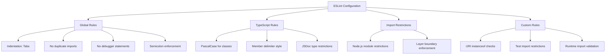
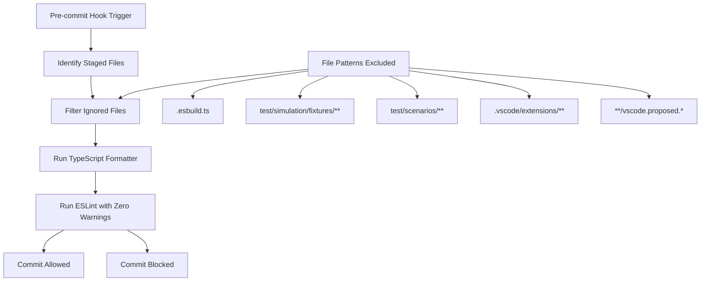
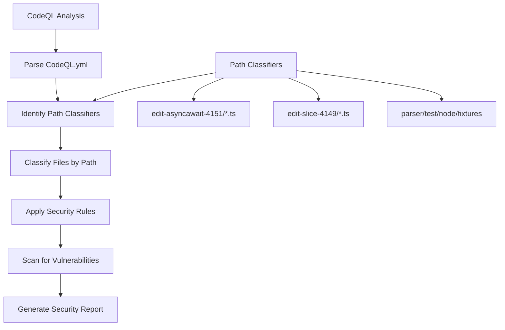
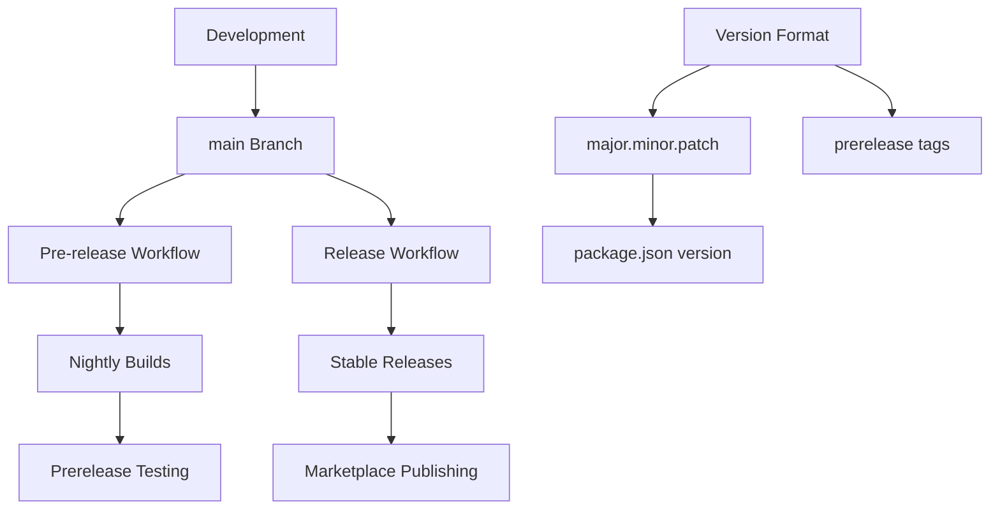
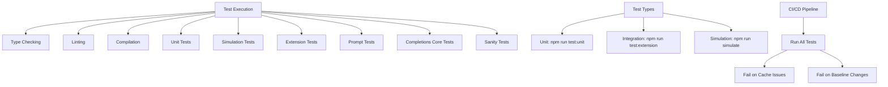
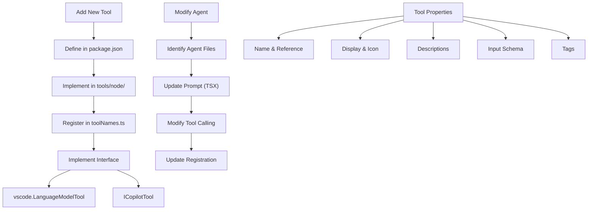

# Contribution Workflow

<cite>
**Referenced Files in This Document**   
- [README.md](file://README.md)
- [CONTRIBUTING.md](file://CONTRIBUTING.md)
- [package.json](file://package.json)
- [eslint.config.mjs](file://eslint.config.mjs)
- [lint-staged.config.js](file://lint-staged.config.js)
- [CodeQL.yml](file://CodeQL.yml)
- [build/release.yml](file://build/release.yml)
- [build/pre-release.yml](file://build/pre-release.yml)
</cite>

## Table of Contents
1. [Introduction](#introduction)
2. [Contribution Overview](#contribution-overview)
3. [Development Setup](#development-setup)
4. [Code Formatting and Linting](#code-formatting-and-linting)
5. [Pre-commit Hooks](#pre-commit-hooks)
6. [Security Scanning with CodeQL](#security-scanning-with-codeql)
7. [Branching Strategy and Versioning](#branching-strategy-and-versioning)
8. [Testing Requirements](#testing-requirements)
9. [Common Contribution Tasks](#common-contribution-tasks)
10. [Pull Request Process](#pull-request-process)
11. [Issue Reporting and Feature Requests](#issue-reporting-and-feature-requests)
12. [Conclusion](#conclusion)

## Introduction

This document provides comprehensive guidance for contributing to the GitHub Copilot Chat extension. It covers the complete contribution workflow from forking the repository to submitting pull requests, including development setup, code quality requirements, testing procedures, and review processes. The documentation is designed to help both new and experienced contributors understand the project's standards and practices.

**Section sources**
- [README.md](file://README.md#L1-L84)
- [CONTRIBUTING.md](file://CONTRIBUTING.md#L1-L439)

## Contribution Overview

The GitHub Copilot Chat extension is an AI-powered companion to the GitHub Copilot inline coding suggestions tool, providing conversational AI assistance within Visual Studio Code. Contributions to this project follow standard open-source practices with specific requirements for code quality, testing, and security.

The contribution process begins with forking the repository on GitHub, creating a feature branch, implementing changes, and submitting a pull request for review. The project maintains high standards for code quality through automated linting, formatting, testing, and security scanning.

**Section sources**
- [README.md](file://README.md#L1-L84)
- [CONTRIBUTING.md](file://CONTRIBUTING.md#L1-L439)

## Development Setup

To set up a development environment for GitHub Copilot Chat, contributors need to meet specific requirements and follow a defined setup process.

### Requirements
- Node.js 22.x
- Python 3.10 to 3.12
- Git Large File Storage (LFS) for running tests
- Visual Studio Build Tools 2019 or later (Windows) for building with node-gyp

### First-time Setup
1. Fork the repository on GitHub
2. Clone your fork locally
3. On Windows, run `Set-ExecutionPolicy Unrestricted` as administrator in PowerShell
4. Install dependencies with `npm install`
5. Run `npm run get_token` to configure authentication
6. Start development with the "Launch Copilot Extension - Watch Mode" launch configuration

For development under Windows Subsystem for Linux (WSL), follow the VS Code setup instructions for self-hosting.

**Section sources**
- [CONTRIBUTING.md](file://CONTRIBUTING.md#L68-L83)

## Code Formatting and Linting

The project enforces strict code formatting and linting rules to maintain code quality and consistency across the codebase.

### ESLint Configuration

The linting configuration is defined in `eslint.config.mjs` and includes multiple rule sets for different file types and locations. Key aspects of the configuration include:

- **Global rules**: Indentation with tabs, no duplicate imports, no debugger statements, and proper semicolon usage
- **TypeScript-specific rules**: Naming conventions (PascalCase for classes), member delimiter style, and JSDoc type restrictions
- **Import restrictions**: Prohibits direct imports of Node.js built-in modules and enforces layer boundaries between code components
- **Custom rules**: Includes project-specific rules for preventing instanceof checks on URIs, restricting test imports, and ensuring proper runtime imports

The configuration also enforces a header comment on all files with copyright and license information.

**Diagram sources **
- [eslint.config.mjs](file://eslint.config.mjs#L1-L371)

**Section sources**
- [eslint.config.mjs](file://eslint.config.mjs#L1-L371)

## Pre-commit Hooks

The project uses pre-commit hooks to ensure code quality before changes are committed to the repository. These hooks are configured through the `lint-staged.config.js` file.

### Hook Configuration

The pre-commit hooks are configured to run on files matching the pattern `!({.esbuild.ts,test/simulation/fixtures/**,test/scenarios/**,.vscode/extensions/**,**/vscode.proposed.*})*{.ts,.js,.tsx}`, which excludes certain directories and file types from the pre-commit checks.

The hooks perform two main operations:
1. **TypeScript formatting**: Runs `npm run tsfmt` on staged files to ensure consistent code formatting
2. **ESLint validation**: Runs `eslint --max-warnings=0` on staged files to enforce coding standards with zero warnings allowed

The configuration includes a function to filter out files that are ignored by ESLint, ensuring that only relevant files are processed by the pre-commit hooks.

**Diagram sources **
- [lint-staged.config.js](file://lint-staged.config.js#L1-L28)

**Section sources**
- [lint-staged.config.js](file://lint-staged.config.js#L1-L28)

## Security Scanning with CodeQL

The project uses CodeQL for security scanning to identify potential vulnerabilities in the codebase. The configuration is defined in the `CodeQL.yml` file.

### CodeQL Configuration

The CodeQL configuration specifies path classifiers to categorize files in the repository. Currently, the configuration identifies test files in specific directories:

- `test/simulation/fixtures/edit-asyncawait-4151/*.ts`
- `test/simulation/fixtures/edit-slice-4149/*.ts`
- `src/platform/parser/test/node/fixtures`

These path classifiers help CodeQL understand the structure of the codebase and apply appropriate security rules to different types of files. Test files are typically excluded from certain security checks since they may contain patterns that would be considered vulnerabilities in production code.

The CodeQL analysis is integrated into the CI/CD pipeline and runs on every pull request to ensure that new code does not introduce security vulnerabilities.

**Diagram sources **
- [CodeQL.yml](file://CodeQL.yml#L1-L6)

**Section sources**
- [CodeQL.yml](file://CodeQL.yml#L1-L6)

## Branching Strategy and Versioning

The project follows a structured branching strategy and versioning scheme to manage development and releases.

### Branching Strategy

The primary branch for development is `main`, which contains the latest stable code. The project uses a continuous integration approach where changes are integrated directly into the main branch after passing all tests and reviews.

The CI/CD pipeline includes two main workflows:
- **Pre-release workflow**: Runs nightly on weekdays, triggered by a cron schedule (`0 4 * * Mon-Fri`)
- **Release workflow**: Triggered on pushes to the `main` branch

Both workflows perform comprehensive testing, including unit tests, extension tests, simulation tests, and sanity checks.

### Versioning Scheme

The versioning scheme is defined in the `package.json` file, which specifies the current version of the extension. The build system uses standardized versioning with prerelease tags for development builds.

The version in `package.json` follows semantic versioning (major.minor.patch) and is updated for each release. The build system automatically manages version increments for prerelease builds.

**Diagram sources **
- [package.json](file://package.json#L1-L800)
- [build/release.yml](file://build/release.yml#L1-L236)
- [build/pre-release.yml](file://build/pre-release.yml#L1-L233)

**Section sources**
- [package.json](file://package.json#L1-L800)
- [build/release.yml](file://build/release.yml#L1-L236)
- [build/pre-release.yml](file://build/pre-release.yml#L1-L233)

## Testing Requirements

The project has a comprehensive testing framework with multiple types of tests to ensure code quality and functionality.

### Test Types

The testing framework includes three main types of tests:

1. **Unit tests**: Run in Node.js and test individual functions and components
   - Executed with `npm run test:unit`
   - Use Vitest as the test runner

2. **Integration tests**: Run within VS Code itself to test extension functionality
   - Executed with `npm run test:extension`
   - Test the integration between different components

3. **Simulation tests**: Reach out to Copilot API endpoints and invoke LLMs
   - Executed with `npm run simulate`
   - Run 10 times per test to accommodate the stochastic nature of LLMs
   - Results are snapshotted in `test/simulation/baseline.json`

### Test Execution

The CI/CD pipeline runs the following test sequence:
1. Type checking with `npm run typecheck`
2. Linting with `npm run lint`
3. Compilation with `npm run compile`
4. Unit tests with `npm run test:unit`
5. Simulation tests with `npm run simulate-ci`
6. Extension tests with `npm run test:extension`
7. Completions Core prompt tests with `npm run test:prompt`
8. Completions Core library tests with `npm run test:completions-core`
9. Extension sanity tests with `npm run test:sanity`

Pull requests will fail if the simulation test cache is not populated or if there are uncommitted baseline changes.

**Section sources**
- [CONTRIBUTING.md](file://CONTRIBUTING.md#L85-L122)
- [build/release.yml](file://build/release.yml#L1-L236)

## Common Contribution Tasks

This section covers practical examples of common contribution tasks, including adding new tools and modifying agents.

### Adding a New Tool

To add a new tool to the GitHub Copilot Chat extension:

1. Define the tool in `package.json` under the `contributes.languageModelTools` section
2. Implement the tool in the `src/extension/tools/node/` directory
3. Register the tool name in `src/extension/tools/common/toolNames.ts`
4. Ensure the tool implements the `vscode.LanguageModelTool` interface or extends `ICopilotTool` for additional functionality

The tool definition in `package.json` should include:
- Name and tool reference name
- Display name and icon
- User and model descriptions
- Input schema defining required parameters
- Tags for categorization

### Modifying an Agent

To modify an existing agent:

1. Identify the relevant agent files:
   - Main prompt: `src/extension/prompts/node/agent/agentPrompt.tsx`
   - System prompt: `src/extension/prompts/node/agent/agentInstructions.tsx`
   - Tool calling loop: `src/extension/intents/node/toolCallingLoop.ts`
   - Participant registration: `src/extension/conversation/vscode-node/chatParticipants.ts`

2. Update the agent prompt using the TSX-based framework
3. Modify the tool calling logic as needed
4. Update the participant registration if new capabilities are added

The agent mode is implemented as a chat participant registered with VS Code, using the standard `vscode.lm.invokeTool` API to invoke tools.

**Section sources**
- [package.json](file://package.json#L140-L775)
- [CONTRIBUTING.md](file://CONTRIBUTING.md#L281-L293)
- [CONTRIBUTING.md](file://CONTRIBUTING.md#L269-L276)

## Pull Request Process

The pull request process for the GitHub Copilot Chat extension follows a structured review and approval workflow.

### Pull Request Requirements

All pull requests must meet the following requirements:
- Pass all CI/CD checks (build, tests, linting, security scanning)
- Include appropriate test coverage for new functionality
- Follow the code formatting and linting rules
- Update documentation if necessary
- Include a clear description of the changes and their purpose

### Review Process

The review process includes:
1. Automated checks through GitHub Actions
2. Code review by project maintainers
3. Validation of test results
4. Security review through CodeQL scanning
5. Final approval and merge

Community contributions require additional steps for simulation test cache population, which must be performed by VS Code team members. If a community member submits a PR with new cache layers, the PR will fail, and a team member must recreate the layers.

Maintainers can update the simulation test baseline with `npm run simulate-update-baseline` if test results change and the new baseline is acceptable.

**Section sources**
- [CONTRIBUTING.md](file://CONTRIBUTING.md#L104-L122)
- [build/release.yml](file://build/release.yml#L1-L236)

## Issue Reporting and Feature Requests

The project has specific guidelines for reporting issues and requesting features.

### Creating Good Issues

Before creating a new issue:
1. Search existing issues to avoid duplicates
2. Check the most popular feature requests
3. Add reactions to existing issues instead of "+1" comments

When reporting a bug or requesting a feature, include:
- Version of VS Code and copilot-chat extension
- Operating system
- LLM model if applicable
- Reproducible steps (1... 2... 3...)
- Expected vs. actual behavior
- Images, animations, or videos showing the issue
- Code snippets or prompts that demonstrate the issue
- Errors from the Dev Tools Console

Use the built-in "Report Issue" tool in VS Code to automatically include version, extension, and system information.

### Feature Requests

Feature requests should:
- Describe a single feature per issue
- Include use cases and benefits
- Provide examples of how the feature would be used
- Consider backward compatibility
- Follow the project's architecture and design patterns

The project team reviews feature requests based on user impact, technical feasibility, and alignment with the product roadmap.

**Section sources**
- [CONTRIBUTING.md](file://CONTRIBUTING.md#L30-L65)

## Conclusion

Contributing to the GitHub Copilot Chat extension involves following a comprehensive workflow that ensures code quality, security, and consistency. By understanding the development setup, code formatting rules, pre-commit hooks, security scanning, branching strategy, testing requirements, and review process, contributors can effectively participate in the project's development.

The project maintains high standards through automated tools and processes, including ESLint for code quality, lint-staged for pre-commit checks, CodeQL for security scanning, and a comprehensive testing framework. Contributors should familiarize themselves with these tools and follow the documented procedures for common tasks like adding new tools or modifying agents.

By adhering to these guidelines, contributors can help maintain the high quality and security standards of the GitHub Copilot Chat extension while adding valuable features and improvements for users.