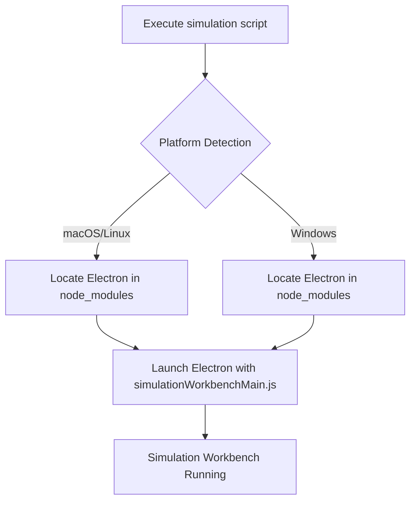
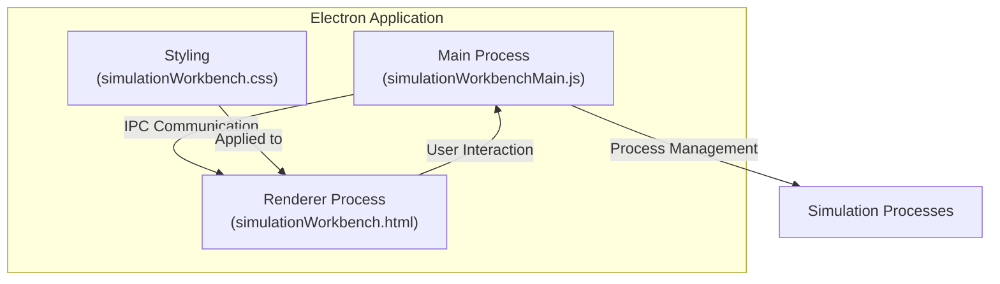
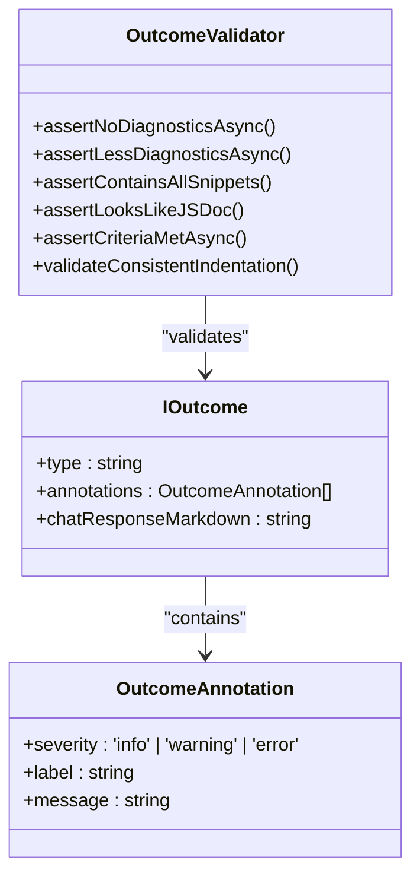

# Debugging Techniques

<cite>
**Referenced Files in This Document**   
- [simulate.sh](file://script/simulate.sh)
- [simulate.ps1](file://script/simulate.ps1)
- [simulationWorkbenchMain.js](file://script/electron/simulationWorkbenchMain.js)
- [simulationWorkbench.html](file://script/electron/simulationWorkbench.html)
- [simulationWorkbench.css](file://script/electron/simulationWorkbench.css)
- [outcomeValidators.ts](file://test/simulation/outcomeValidators.ts)
- [types.ts](file://test/simulation/types.ts)
- [src/extension/log/](file://src/extension/log/)
- [src/platform/log/](file://src/platform/log/)
</cite>

## Table of Contents
1. [Introduction](#introduction)
2. [Simulation Mode Execution](#simulation-mode-execution)
3. [Simulation Workbench Interface](#simulation-workbench-interface)
4. [Logging Infrastructure](#logging-infrastructure)
5. [Debugging Common Issues](#debugging-common-issues)
6. [Outcome Validation and Analysis](#outcome-validation-and-analysis)
7. [Execution Flow Tracing](#execution-flow-tracing)
8. [Performance and Memory Analysis](#performance-and-memory-analysis)
9. [Conclusion](#conclusion)

## Introduction
This document provides comprehensive guidance on debugging GitHub Copilot Chat using the available tools and frameworks. It covers the simulation environment, logging infrastructure, and debugging techniques for identifying and resolving issues in the extension's behavior. The documentation focuses on practical approaches to test, analyze, and improve the reliability and performance of the Copilot Chat functionality.

## Simulation Mode Execution

The GitHub Copilot Chat extension provides simulation scripts that enable running the extension in a controlled testing environment. These scripts launch an Electron-based workbench that simulates the VS Code environment for testing Copilot Chat functionality without requiring the full VS Code IDE.

The simulation mode is executed through two platform-specific scripts:

- **simulate.sh**: Bash script for Unix-like systems (Linux, macOS)
- **simulate.ps1**: PowerShell script for Windows systems

Both scripts serve the same purpose of launching the simulation workbench by starting an Electron application with the simulation environment. The scripts locate the Electron executable from the project's node_modules directory and launch it with the simulation workbench main process file.

**Section sources**
- [simulate.sh](file://script/simulate.sh)
- [simulate.ps1](file://script/simulate.ps1)

## Simulation Workbench Interface

The simulation workbench provides a visual interface for testing and debugging Copilot Chat functionality. It is implemented as an Electron application with a web-based frontend that renders test results and allows interaction with the simulation environment.

The workbench architecture consists of several key components:

1. **Main Process** (`simulationWorkbenchMain.js`): Handles Electron application lifecycle, process management, and IPC communication between the main and renderer processes.

2. **Renderer Process** (`simulationWorkbench.html`): Provides the user interface for the workbench, including test visualization, result display, and control elements.

3. **Styling** (`simulationWorkbench.css`): Defines the visual appearance of the workbench interface with specific styling for test results, status indicators, and interactive elements.

The workbench enables developers to:
- Run simulation tests in a controlled environment
- Visualize test execution and outcomes
- Inspect intermediate states and responses
- Debug conversation flows and agent behaviors
- Analyze tool execution and error conditions

**Diagram sources**
- [simulationWorkbenchMain.js](file://script/electron/simulationWorkbenchMain.js)
- [simulationWorkbench.html](file://script/electron/simulationWorkbench.html)
- [simulationWorkbench.css](file://script/electron/simulationWorkbench.css)

**Section sources**
- [simulationWorkbenchMain.js](file://script/electron/simulationWorkbenchMain.js)
- [simulationWorkbench.html](file://script/electron/simulationWorkbench.html)
- [simulationWorkbench.css](file://script/electron/simulationWorkbench.css)

## Logging Infrastructure

The GitHub Copilot Chat extension includes a comprehensive logging infrastructure for tracking extension behavior and diagnosing issues. The logging system is distributed across two main locations in the codebase:

1. **Extension-level logging** (`src/extension/log/`): Contains logging utilities specific to the Copilot Chat extension functionality, including agent interactions, conversation management, and feature-specific logging.

2. **Platform-level logging** (`src/platform/log/`): Provides foundational logging capabilities used across the platform, including common logging interfaces, formatters, and transport mechanisms.

The logging infrastructure supports various logging levels and categories, enabling developers to filter and analyze log output based on the type of information needed. Logs capture critical information such as:
- Agent initialization and execution
- Tool calls and responses
- Conversation state transitions
- Error conditions and exception handling
- Performance metrics and timing information

Developers can leverage this logging infrastructure to trace the execution flow, identify bottlenecks, and understand the sequence of operations during both normal execution and error conditions.

**Section sources**
- [src/extension/log/](file://src/extension/log/)
- [src/platform/log/](file://src/platform/log/)

## Debugging Common Issues

When debugging GitHub Copilot Chat, several common issue categories require specific approaches and techniques:

### Agent Failures
Agent failures typically occur when the AI agent fails to generate appropriate responses or encounters errors during execution. To debug agent failures:

1. Examine the agent initialization sequence and configuration
2. Check for proper authentication and endpoint connectivity
3. Review prompt construction and context preparation
4. Analyze the agent's response parsing and interpretation

### Tool Execution Errors
Tool execution errors happen when integrated tools fail to execute properly or return unexpected results. Debugging strategies include:

1. Verifying tool registration and availability
2. Checking input parameter validation
3. Examining tool execution context and permissions
4. Reviewing error handling and fallback mechanisms

### Conversation Flow Problems
Conversation flow issues manifest as incorrect response sequencing, context loss, or inappropriate follow-up actions. To address these:

1. Trace the conversation state management
2. Verify context preservation across turns
3. Check intent recognition accuracy
4. Analyze response selection logic

The simulation environment provides specific utilities for reproducing and diagnosing these issues, allowing developers to isolate problematic scenarios and implement targeted fixes.

**Section sources**
- [outcomeValidators.ts](file://test/simulation/outcomeValidators.ts)
- [types.ts](file://test/simulation/types.ts)

## Outcome Validation and Analysis

The simulation framework includes robust outcome validation capabilities through the `outcomeValidators.ts` module. This system provides a comprehensive set of validation functions to verify the correctness of simulation results and ensure the extension behaves as expected.

Key validation capabilities include:

- **Diagnostic validation**: Checking for the presence or absence of code diagnostics after edits
- **Content validation**: Verifying that generated content contains expected snippets or patterns
- **Structural validation**: Ensuring code structure adheres to expected formats (e.g., JSDoc)
- **Edit validation**: Confirming that workspace edits are applied correctly
- **Criteria evaluation**: Assessing responses against specified quality criteria

The validation system uses a flexible annotation mechanism that allows tests to report warnings, information, or errors without failing immediately. This enables comprehensive feedback on code quality and adherence to best practices.

**Diagram sources**
- [outcomeValidators.ts](file://test/simulation/outcomeValidators.ts)
- [types.ts](file://test/simulation/types.ts)

**Section sources**
- [outcomeValidators.ts](file://test/simulation/outcomeValidators.ts)
- [types.ts](file://test/simulation/types.ts)

## Execution Flow Tracing

Effective debugging of GitHub Copilot Chat requires understanding the execution flow across multiple components and asynchronous operations. The simulation environment provides several mechanisms for tracing execution:

### Breakpoint Debugging
Developers can set breakpoints in the simulation code to pause execution and inspect the current state. This is particularly useful for:
- Examining variable values at specific execution points
- Stepping through complex logic flows
- Identifying unexpected state transitions

### Variable Inspection
The simulation workbench enables inspection of key variables and data structures, including:
- Conversation context and history
- Agent state and configuration
- Tool execution parameters
- Response generation inputs and outputs

### Asynchronous Flow Tracking
Given the highly asynchronous nature of AI interactions, the system provides mechanisms to track:
- Promise chains and async/await sequences
- Event-driven operations
- Background task execution
- Streamed response processing

The IPC (Inter-Process Communication) system in the simulation workbench also facilitates tracing by logging messages between the main and renderer processes, providing visibility into cross-process interactions.

**Section sources**
- [simulationWorkbenchMain.js](file://script/electron/simulationWorkbenchMain.js)
- [outcomeValidators.ts](file://test/simulation/outcomeValidators.ts)

## Performance and Memory Analysis

Performance debugging and memory usage analysis are critical for maintaining a responsive and efficient Copilot Chat experience. The simulation environment supports several approaches to identify and address performance issues:

### Performance Monitoring
The system includes capabilities to measure:
- Response generation latency
- Tool execution time
- Context preparation duration
- Rendering performance

These metrics help identify bottlenecks in the processing pipeline and optimize critical paths.

### Memory Usage Analysis
Memory analysis focuses on:
- Identifying memory leaks in long-running sessions
- Monitoring object allocation patterns
- Tracking resource cleanup and disposal
- Evaluating cache efficiency

The simulation environment allows for repeated execution of scenarios to observe memory growth patterns and identify potential leaks.

### Optimization Strategies
Based on performance analysis, several optimization strategies can be applied:
- Caching frequently accessed data
- Lazy loading of non-essential components
- Efficient data structure selection
- Proper resource cleanup and disposal

The simulation framework's ability to run controlled tests makes it ideal for measuring the impact of performance optimizations and ensuring they deliver the expected improvements.

**Section sources**
- [simulationWorkbenchMain.js](file://script/electron/simulationWorkbenchMain.js)
- [outcomeValidators.ts](file://test/simulation/outcomeValidators.ts)

## Conclusion
The debugging infrastructure for GitHub Copilot Chat provides comprehensive tools and frameworks for identifying, analyzing, and resolving issues in the extension's behavior. By leveraging the simulation environment, logging system, and validation utilities, developers can effectively debug complex AI-driven interactions and ensure high-quality user experiences. The combination of visual debugging through the simulation workbench and programmatic validation through outcome checkers creates a powerful toolkit for maintaining and improving the reliability and performance of Copilot Chat functionality.