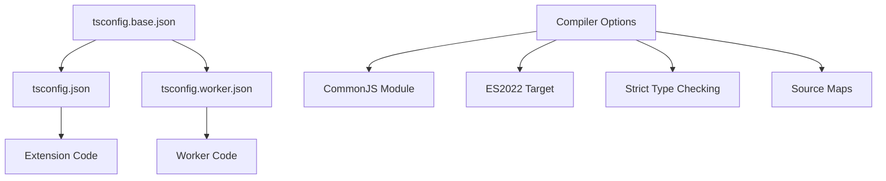
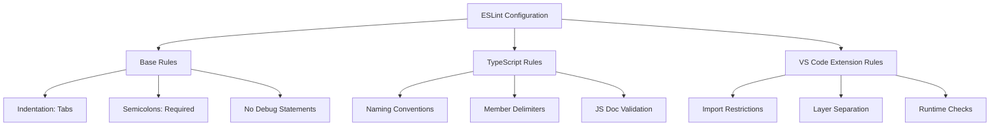
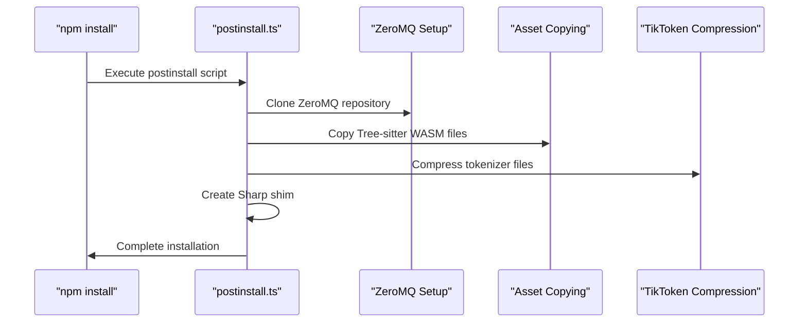

# Development Environment Setup

<cite>
**Referenced Files in This Document**
- [package.json](file://package.json)
- [tsconfig.json](file://tsconfig.json)
- [tsconfig.base.json](file://tsconfig.base.json)
- [tsconfig.worker.json](file://tsconfig.worker.json)
- [eslint.config.mjs](file://eslint.config.mjs)
- [script/setup/copySources.ts](file://script/setup/copySources.ts)
- [script/postinstall.ts](file://script/postinstall.ts)
- [script/simulate.sh](file://script/simulate.sh)
- [script/applyLocalDts.sh](file://script/applyLocalDts.sh)
- [vite.config.ts](file://vite.config.ts)
- [script/build/compressTikToken.ts](file://script/build/compressTikToken.ts)
- [script/build/copyStaticAssets.ts](file://script/build/copyStaticAssets.ts)
- [README.md](file://README.md)
</cite>

## Table of Contents
1. [Introduction](#introduction)
2. [Prerequisites](#prerequisites)
3. [Environment Setup](#environment-setup)
4. [TypeScript Configuration](#typescript-configuration)
5. [ESLint Configuration](#eslint-configuration)
6. [Installation Process](#installation-process)
7. [Platform-Specific Setup](#platform-specific-setup)
8. [Verification and Testing](#verification-and-testing)
9. [Troubleshooting](#troubleshooting)
10. [Advanced Configuration](#advanced-configuration)

## Introduction

GitHub Copilot Chat is a sophisticated AI-powered development tool that integrates with Visual Studio Code to provide conversational AI assistance for coding tasks. Setting up a development environment for this project requires careful attention to Node.js version requirements, TypeScript configuration, and platform-specific dependencies.

This comprehensive guide covers everything from initial prerequisites to advanced troubleshooting, ensuring developers can effectively contribute to the GitHub Copilot Chat project across different operating systems.

## Prerequisites

### Node.js Requirements

The project has strict Node.js version requirements that must be met for proper development:

- **Minimum Node.js Version**: 22.14.0
- **Minimum npm Version**: 9.0.0
- **VS Code Engine Requirement**: ^1.106.0-20251024

These requirements are enforced in the package.json engines field and are critical for compatibility with the extension ecosystem.

### Development Tools

Essential development tools that should be installed globally:

- **npm** (version 9.0.0 or higher)
- **TypeScript** (latest version)
- **VS Code** (latest stable release)
- **Git** (for version control)

### Platform Dependencies

Different platforms may require additional setup:

- **Windows**: PowerShell 5.1+ or PowerShell Core
- **macOS**: Xcode Command Line Tools
- **Linux**: Build essentials (gcc, g++, make)

**Section sources**
- [package.json](file://package.json#L25-L29)

## Environment Setup

### Step 1: Clone the Repository

```bash
git clone https://github.com/microsoft/vscode-copilot-chat.git
cd vscode-copilot-chat
```

### Step 2: Verify Node.js and npm Versions

```bash
node --version  # Should be >= 22.14.0
npm --version   # Should be >= 9.0.0
```

### Step 3: Initialize Workspace Setup

The project includes specialized setup scripts for copying VS Code source files and configuring the development environment.

```bash
# Copy VS Code source files
npx tsx script/setup/copySources.ts

# Apply local TypeScript definitions
./script/applyLocalDts.sh
```

**Section sources**
- [script/setup/copySources.ts](file://script/setup/copySources.ts#L133-L205)
- [script/applyLocalDts.sh](file://script/applyLocalDts.sh#L1-L6)

## TypeScript Configuration

### Base Configuration Structure

The project uses a multi-layered TypeScript configuration approach with separate files for different compilation targets:



**Diagram sources**
- [tsconfig.base.json](file://tsconfig.base.json#L1-L23)
- [tsconfig.json](file://tsconfig.json#L1-L39)
- [tsconfig.worker.json](file://tsconfig.worker.json#L1-L28)

### Key Configuration Features

#### Strict Type Checking
- **Strict Mode**: Enabled for comprehensive type safety
- **No Implicit Overrides**: Prevents accidental method overriding
- **Exact Optional Property Types**: Ensures precise optional property handling
- **Force Consistent Casing**: Maintains consistent naming conventions

#### Module System
- **CommonJS Modules**: Standard for Node.js development
- **ES2022 Target**: Modern JavaScript features with broad compatibility
- **Experimental Decorators**: Support for advanced TypeScript features

#### Path Resolution
The configuration includes sophisticated path mapping for VS Code integration:

```json
{
  "paths": {
    "vscode": ["./src/util/common/test/shims/vscodeTypesShim.ts"]
  }
}
```

**Section sources**
- [tsconfig.base.json](file://tsconfig.base.json#L2-L21)
- [tsconfig.json](file://tsconfig.json#L18-L20)

## ESLint Configuration

### Coding Standards and Linting Rules

The ESLint configuration enforces strict coding standards with multiple rule sets:



**Diagram sources**
- [eslint.config.mjs](file://eslint.config.mjs#L27-L371)

### Import Restrictions

The configuration enforces strict layer separation to maintain architectural boundaries:

#### Layer-Based Import Rules
- **Common Layer**: Cannot import from VS Code or Node-specific code
- **VS Code Layer**: Cannot import from Node-specific code
- **Node Layer**: Cannot import from VS Code-specific code
- **Worker Layer**: Specialized restrictions for web worker environments

#### Restricted Imports
Built-in Node.js modules are restricted to prevent runtime issues:
- `assert`, `buffer`, `child_process`, `cluster`, `console`, `crypto`
- `dns`, `events`, `fs`, `http`, `https`, `net`, `os`, `path`

### Custom ESLint Plugins

The project includes custom ESLint plugins for:
- **Local Rules**: Project-specific validation rules
- **Import Path Validation**: Ensures proper layer separation
- **Runtime Import Detection**: Prevents runtime-specific imports in wrong contexts

**Section sources**
- [eslint.config.mjs](file://eslint.config.mjs#L151-L332)

## Installation Process

### Dependency Installation

The installation process involves multiple steps handled by the post-install script:



**Diagram sources**
- [script/postinstall.ts](file://script/postinstall.ts#L170-L205)

### Installation Commands

```bash
# Install dependencies
npm install

# Run post-install script manually (if needed)
npx tsx script/postinstall.ts

# Build the project
npm run build

# Run tests
npm test
```

### Post-Install Script Features

The post-install script performs several critical tasks:

1. **ZeroMQ Setup**: Clones and configures the ZeroMQ library from a specific commit
2. **Tree-sitter Assets**: Copies WASM grammars for language parsing
3. **TikToken Compression**: Optimizes tokenizer files for production
4. **Sharp Shim Creation**: Creates functional shims for native dependencies
5. **Cache Validation**: Ensures required cache files exist

**Section sources**
- [script/postinstall.ts](file://script/postinstall.ts#L170-L205)

## Platform-Specific Setup

### Windows Setup

Windows users need to ensure PowerShell execution policy allows script execution:

```powershell
# Set execution policy (may need administrator privileges)
Set-ExecutionPolicy -ExecutionPolicy RemoteSigned -Scope CurrentUser

# Run setup scripts
.\script\applyLocalDts.sh
.\script\simulate.ps1
```

### macOS Setup

macOS requires Xcode Command Line Tools for native module compilation:

```bash
# Install Xcode Command Line Tools
xcode-select --install

# Run Unix-style setup scripts
./script/applyLocalDts.sh
./script/simulate.sh
```

### Linux Setup

Linux distributions require build essentials and additional dependencies:

```bash
# Ubuntu/Debian
sudo apt-get update
sudo apt-get install build-essential

# CentOS/RHEL/Fedora
sudo yum groupinstall "Development Tools"

# Run setup scripts
./script/applyLocalDts.sh
./script/simulate.sh
```

**Section sources**
- [script/simulate.sh](file://script/simulate.sh#L1-L22)

## Verification and Testing

### Basic Build Verification

Verify the TypeScript compilation works correctly:

```bash
# Compile TypeScript files
npm run compile

# Verify with strict checking
npm run compile:strict

# Build for distribution
npm run build
```

### Test Execution

The project uses Vitest for testing with comprehensive coverage:

```bash
# Run all tests
npm test

# Run tests with coverage
npm run test:coverage

# Run specific test suites
npm run test:unit
npm run test:integration
```

### Simulation Testing

The project includes simulation testing capabilities:

```bash
# Run simulation tests
./script/simulate.sh

# Run with specific parameters
./script/simulate.sh --debug
```

### TypeScript Definition Validation

Verify that TypeScript definitions are correctly generated:

```bash
# Check for missing type definitions
npm run check:types

# Validate VS Code API compatibility
npm run check:vscode
```

**Section sources**
- [vite.config.ts](file://vite.config.ts#L18-L39)

## Troubleshooting

### Common Environment Issues

#### Module Resolution Errors

**Problem**: TypeScript cannot resolve module imports
**Solution**: 
1. Ensure `npm install` completes successfully
2. Check that `node_modules` directory exists
3. Verify TypeScript configuration includes correct paths

#### Type Definition Problems

**Problem**: Missing or incorrect type definitions
**Solution**:
1. Run the copy sources script: `npx tsx script/setup/copySources.ts`
2. Apply local definitions: `./script/applyLocalDts.sh`
3. Clear TypeScript cache if needed

#### Native Module Compilation Failures

**Problem**: ZeroMQ or other native modules fail to compile
**Solution**:
1. Verify Node.js version meets requirements
2. Install platform-specific build tools
3. Check for conflicting native module versions

### Performance Issues

#### Slow Build Times

**Problem**: TypeScript compilation takes excessive time
**Solution**:
1. Enable incremental compilation in tsconfig
2. Exclude unnecessary files from compilation
3. Use TypeScript's watch mode for development

#### Memory Issues During Build

**Problem**: Build process consumes excessive memory
**Solution**:
1. Increase Node.js heap size: `NODE_OPTIONS="--max-old-space-size=4096"`
2. Reduce concurrent compilation threads
3. Clean build artifacts periodically

### Platform-Specific Issues

#### Windows Path Length Limitations

**Problem**: Long file paths exceed Windows limits
**Solution**:
1. Enable long path support in Windows registry
2. Use shorter project directory paths
3. Consider using Git's core.longpaths option

#### macOS Permission Issues

**Problem**: Scripts fail due to permission restrictions
**Solution**:
1. Make scripts executable: `chmod +x script/*.sh`
2. Sign Electron applications if necessary
3. Adjust Gatekeeper settings if needed

**Section sources**
- [script/postinstall.ts](file://script/postinstall.ts#L116-L168)

## Advanced Configuration

### Custom Build Configurations

The project supports multiple build configurations for different deployment targets:

#### Worker Configuration
Specialized TypeScript configuration for web worker environments with WebWorker types enabled.

#### Production Optimization
Build optimizations including:
- Code splitting for better loading performance
- Asset compression and bundling
- Minification for reduced bundle sizes

### Development Workflow Customization

#### Editor Integration
Configure VS Code for optimal development experience:
- Install recommended extensions
- Configure workspace settings
- Set up debugging configurations

#### Continuous Integration
The project includes CI-friendly configurations:
- Automated testing across platforms
- Code quality checks
- Dependency vulnerability scanning

### Extending the Development Environment

#### Adding New Language Support
To add support for new programming languages:
1. Update Tree-sitter grammar configurations
2. Modify language detection logic
3. Add language-specific parsers and analyzers

#### Custom Tool Integration
Integrate custom development tools:
1. Configure ESLint plugins for custom rules
2. Add custom build scripts
3. Integrate with external development services

**Section sources**
- [tsconfig.worker.json](file://tsconfig.worker.json#L1-L28)
- [script/build/compressTikToken.ts](file://script/build/compressTikToken.ts#L1-L77)