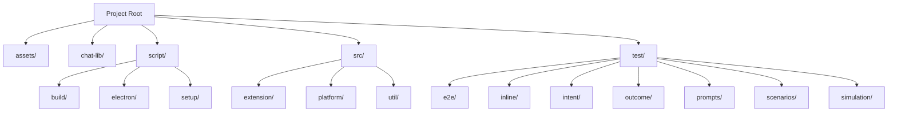
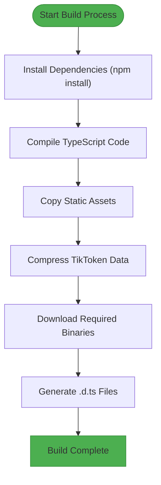
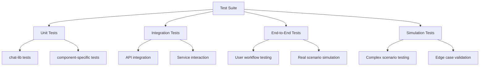
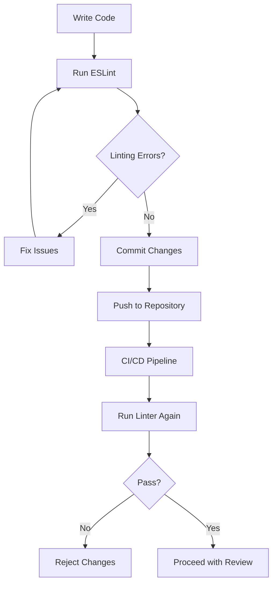

# Development Guide

<cite>
**Referenced Files in This Document**   
- [README.md](file://README.md)
- [package.json](file://package.json)
- [eslint.config.mjs](file://eslint.config.mjs)
- [tsconfig.json](file://tsconfig.json)
- [script/simulate.sh](file://script/simulate.sh)
- [script/simulate.ps1](file://script/simulate.ps1)
- [script/tsconfig.json](file://script/tsconfig.json)
- [test/simulationTests.ts](file://test/simulationTests.ts)
- [test/taskRunner.ts](file://test/taskRunner.ts)
- [chat-lib/vitest.config.ts](file://chat-lib/vitest.config.ts)
</cite>

## Table of Contents
1. [Introduction](#introduction)
2. [Project Structure](#project-structure)
3. [Prerequisites and Environment Setup](#prerequisites-and-environment-setup)
4. [Build Process and Scripts](#build-process-and-scripts)
5. [Testing Methodologies](#testing-methodologies)
6. [Debugging the Extension](#debugging-the-extension)
7. [Contribution Workflow](#contribution-workflow)
8. [Code Formatting and Linting](#code-formatting-and-linting)
9. [Common Development Tasks](#common-development-tasks)
10. [Versioning and Branching Strategy](#versioning-and-branching-strategy)
11. [Performance Considerations](#performance-considerations)
12. [Best Practices for Extension Development](#best-practices-for-extension-development)

## Introduction

This document provides a comprehensive guide for setting up the development environment for GitHub Copilot Chat. It covers all aspects of the development workflow, from initial setup to contribution guidelines, testing methodologies, and performance optimization. The guide is designed to help developers understand the architecture, tools, and processes required to contribute effectively to the GitHub Copilot Chat extension for Visual Studio Code.

GitHub Copilot Chat is an AI-powered companion extension that enhances the coding experience by providing conversational AI assistance, inline suggestions, and intelligent code generation capabilities. This development guide will walk you through the complete development lifecycle, ensuring you have all the knowledge needed to contribute to this sophisticated extension.

**Section sources**
- [README.md](file://README.md#L1-L84)

## Project Structure

The GitHub Copilot Chat repository follows a well-organized structure that separates concerns and facilitates maintainability. The project is divided into several key directories:

- **assets/**: Contains static assets such as agent definitions and images
- **chat-lib/**: Houses shared library components with their own test suite and configuration
- **script/**: Contains build, simulation, and utility scripts for development and testing
- **src/**: The main source code directory containing the extension implementation
- **test/**: Comprehensive test suite with various testing methodologies
- **src/extension/**: Core extension functionality organized by feature areas
- **src/platform/**: Platform-specific implementations and services

The extension code is organized using a layered architecture with clear separation between common, VS Code-specific, and Node.js-specific implementations. This modular structure allows for better code reuse and easier maintenance.

**Diagram sources **
- [README.md](file://README.md#L1-L84)
- [package.json](file://package.json#L1-L800)

**Section sources**
- [README.md](file://README.md#L1-L84)

## Prerequisites and Environment Setup

To develop for GitHub Copilot Chat, you need to set up a specific development environment with the following prerequisites:

1. **Node.js**: Version 22.14.0 or higher, as specified in the package.json engines field
2. **npm**: Version 9.0.0 or higher
3. **Visual Studio Code**: The latest version for extension development
4. **TypeScript**: The project uses TypeScript for type safety and modern JavaScript features
5. **Git**: For version control and repository management

The development environment must be configured to support the extension's deep integration with VS Code. This includes setting up the proper TypeScript configuration and ensuring that all dependencies are correctly installed. The project uses modern JavaScript features and requires a compatible Node.js runtime.

The setup process begins with cloning the repository and installing dependencies using npm. The project's package.json file specifies all required dependencies and development tools. After installation, developers should verify that their environment meets all requirements by running the basic build and test commands.

**Section sources**
- [package.json](file://package.json#L26-L28)
- [README.md](file://README.md#L48-L50)

## Build Process and Scripts

The build process for GitHub Copilot Chat is managed through a comprehensive set of scripts in the script/ directory. These scripts handle various aspects of the development workflow, including building, testing, and simulating the extension.

Key build scripts include:
- **build/**: Contains scripts for compressing assets, copying static files, and downloading binaries
- **setup/**: Includes scripts for copying source files during setup
- **alternativeAction/**: Handles alternative action processing
- **testGeneration/**: Manages test generation utilities

The build process is orchestrated through npm scripts defined in package.json, which invoke the appropriate TypeScript files in the script/ directory. The scripts are written in TypeScript and compiled on-the-fly, allowing for type safety and better maintainability.

A critical aspect of the build process is the simulation environment, which allows developers to test the extension in a controlled environment. The simulation scripts (simulate.sh and simulate.ps1) launch an Electron-based workbench that mimics the VS Code environment, enabling comprehensive testing of extension features.

**Diagram sources **
- [script/simulate.sh](file://script/simulate.sh#L1-L22)
- [script/simulate.ps1](file://script/simulate.ps1#L1-L10)
- [package.json](file://package.json#L1-L800)

**Section sources**
- [script/simulate.sh](file://script/simulate.sh#L1-L22)
- [script/simulate.ps1](file://script/simulate.ps1#L1-L10)
- [script/tsconfig.json](file://script/tsconfig.json#L1-L14)

## Testing Methodologies

The GitHub Copilot Chat project employs a comprehensive testing strategy with multiple layers of testing to ensure code quality and reliability. The test/ directory contains various types of tests that cover different aspects of the extension's functionality.

### Unit Tests
Unit tests are located throughout the codebase and focus on testing individual functions and classes in isolation. These tests verify the correctness of specific code units and are typically fast and focused. The project uses Vitest for unit testing, as evidenced by the vitest.config.ts file in the chat-lib directory.

### Integration Tests
Integration tests verify that different components work together correctly. These tests are more comprehensive than unit tests and often involve multiple modules or services. The integration tests ensure that the various parts of the extension interact as expected.

### End-to-End Tests
End-to-end tests are located in the test/e2e/ directory and simulate real user interactions with the extension. These tests verify the complete workflow from user input to system response, ensuring that the extension functions correctly in realistic scenarios. The e2e tests cover critical user journeys such as code explanation, generation, and editing.

### Simulation Tests
The project includes a sophisticated simulation framework in the test/simulation/ directory that allows for comprehensive testing of complex scenarios. These tests use a simulation workbench to replicate the VS Code environment and test the extension's behavior under various conditions.

The testing infrastructure is designed to be extensible and maintainable, with clear separation between different test types. The taskRunner.ts file implements a task execution system that can run tests in parallel, improving test execution efficiency.

**Diagram sources **
- [test/simulationTests.ts](file://test/simulationTests.ts#L1-L62)
- [test/taskRunner.ts](file://test/taskRunner.ts#L1-L83)
- [chat-lib/vitest.config.ts](file://chat-lib/vitest.config.ts#L1-L22)

**Section sources**
- [test/simulationTests.ts](file://test/simulationTests.ts#L1-L62)
- [test/taskRunner.ts](file://test/taskRunner.ts#L1-L83)
- [chat-lib/vitest.config.ts](file://chat-lib/vitest.config.ts#L1-L22)

## Debugging the Extension

Debugging the GitHub Copilot Chat extension requires using VS Code's extension development host, which provides a specialized environment for developing and debugging extensions. The extension development host allows developers to run and debug their extension in isolation from the main VS Code instance.

To debug the extension, developers should:
1. Open the repository in VS Code
2. Use the "Extension Development Host" launch configuration
3. Set breakpoints in the source code
4. Trigger the extension functionality through the UI
5. Inspect variables and execution flow in the debugger

The simulation environment in the script/ directory provides an alternative debugging approach by launching a dedicated Electron-based workbench. This environment is particularly useful for testing complex scenarios and edge cases that might be difficult to reproduce in the standard extension development host.

The extension includes comprehensive logging capabilities that can be enabled for debugging purposes. Developers can use the built-in VS Code debugging tools to inspect the extension's behavior, monitor API calls, and analyze performance characteristics.

**Section sources**
- [script/simulate.sh](file://script/simulate.sh#L1-L22)
- [script/simulate.ps1](file://script/simulate.ps1#L1-L10)

## Contribution Workflow

The contribution workflow for GitHub Copilot Chat follows a structured process to ensure code quality and maintainability. Contributors should follow these steps when making changes to the codebase:

1. Fork the repository and create a feature branch
2. Make changes following the project's coding standards
3. Write appropriate tests for new functionality
4. Run the test suite to ensure all tests pass
5. Submit a pull request with a clear description of the changes
6. Address any feedback from code reviewers
7. Merge the changes after approval

The project uses a code review process to maintain high code quality and ensure that all changes are thoroughly vetted. Contributors should provide detailed explanations of their changes and be prepared to discuss their implementation choices.

The contribution workflow is designed to be collaborative and transparent, with clear communication channels for discussing proposed changes and resolving issues.

**Section sources**
- [README.md](file://README.md#L69-L70)

## Code Formatting and Linting

The GitHub Copilot Chat project enforces strict code formatting and linting rules to maintain consistency and code quality across the codebase. The eslint.config.mjs file contains the complete ESLint configuration, which includes rules for:

- Code style and formatting
- Best practices
- Error prevention
- Import management
- Type safety
- Custom project-specific rules

The linting configuration is divided into multiple sections that apply different rules to different parts of the codebase. For example, there are specific rules for TypeScript files, test files, and different source directories.

Key linting rules include:
- Tab-based indentation
- Required semicolons
- No var declarations (use const/let)
- No duplicate imports
- Restricted globals
- Header comments with copyright information
- Import path restrictions to maintain layer separation

The project also includes custom ESLint rules implemented in the .eslintplugin directory, which enforce project-specific conventions and prevent common mistakes.

Developers should run the linter locally before committing changes to ensure compliance with the project's standards. The linting process is also integrated into the CI/CD pipeline to prevent non-compliant code from being merged.

**Diagram sources **
- [eslint.config.mjs](file://eslint.config.mjs#L1-L371)

**Section sources**
- [eslint.config.mjs](file://eslint.config.mjs#L1-L371)

## Common Development Tasks

This section covers practical examples of common development tasks when working on the GitHub Copilot Chat extension.

### Adding a New Tool
To add a new tool to the extension:
1. Define the tool in the package.json under the languageModelTools contribution point
2. Implement the tool's functionality in the appropriate source directory
3. Add unit tests for the new tool
4. Update documentation and examples
5. Verify the tool works in the simulation environment

### Modifying an Agent
To modify an existing agent:
1. Locate the agent implementation in the src/extension/agents/ directory
2. Update the agent's logic and behavior
3. Add or modify test cases to cover the changes
4. Test the changes in the simulation environment
5. Verify backward compatibility if applicable

### Creating a New Feature
To implement a new feature:
1. Design the feature architecture and identify required components
2. Implement the core functionality
3. Add UI components if needed
4. Write comprehensive tests
5. Document the feature and usage patterns
6. Test in various scenarios

These tasks follow the project's architectural patterns and coding standards, ensuring consistency across the codebase.

**Section sources**
- [package.json](file://package.json#L140-L750)
- [src/extension/agents/](file://src/extension/agents/)

## Versioning and Branching Strategy

The GitHub Copilot Chat project follows a structured versioning and branching strategy to manage releases and development. The versioning scheme uses semantic versioning (MAJOR.MINOR.PATCH) as indicated by the version field in package.json.

The branching model likely follows a variation of Git Flow or GitHub Flow, with:
- A main branch for stable releases
- Feature branches for new development
- Release branches for preparing releases
- Hotfix branches for critical bug fixes

The project releases in lockstep with VS Code due to its deep UI integration, meaning each new version of Copilot Chat is compatible only with the latest VS Code release. This tight coupling requires careful coordination of releases and versioning.

The versioning strategy ensures backward compatibility within major versions while allowing for significant improvements and new features in minor and major releases. The project maintains a clear changelog to document changes between versions.

**Section sources**
- [package.json](file://package.json#L5)
- [README.md](file://README.md#L48-L50)

## Performance Considerations

Developing for a VS Code extension requires careful attention to performance, as the extension runs in the same process as the editor and can impact the overall user experience. The GitHub Copilot Chat extension implements several performance optimizations:

1. **Efficient Resource Management**: The extension minimizes memory usage and avoids unnecessary computations
2. **Asynchronous Operations**: Long-running operations are performed asynchronously to prevent blocking the UI
3. **Caching Strategies**: Results of expensive operations are cached to improve response times
4. **Lazy Loading**: Components and services are loaded on-demand rather than at startup
5. **Throttling and Debouncing**: Frequent operations are throttled to prevent performance degradation

The extension also implements sophisticated caching mechanisms, as evidenced by the various cache-related files in the test/ directory. These caches store frequently accessed data such as code search results, embeddings, and chat history.

Performance monitoring and optimization are ongoing processes, with regular profiling and benchmarking to identify and address performance bottlenecks.

**Section sources**
- [test/cache.ts](file://test/cache.ts)
- [test/completionsCache.ts](file://test/completionsCache.ts)
- [test/embeddingsCache.ts](file://test/embeddingsCache.ts)

## Best Practices for Extension Development

When developing for GitHub Copilot Chat, follow these best practices to ensure high-quality, maintainable code:

1. **Follow the Layered Architecture**: Respect the separation between common, VS Code-specific, and Node.js-specific code
2. **Write Comprehensive Tests**: Ensure all new functionality is covered by appropriate tests
3. **Use Type Safety**: Leverage TypeScript's type system to catch errors early
4. **Optimize Performance**: Consider the impact of your code on the editor's performance
5. **Handle Errors Gracefully**: Implement robust error handling and recovery mechanisms
6. **Document Your Code**: Provide clear comments and documentation for complex logic
7. **Follow Coding Standards**: Adhere to the project's linting and formatting rules
8. **Consider Accessibility**: Ensure the extension is usable by all developers
9. **Test in Real Scenarios**: Verify functionality in realistic use cases
10. **Monitor Resource Usage**: Be mindful of memory and CPU consumption

These best practices help maintain the high quality and reliability that users expect from GitHub Copilot Chat. By following these guidelines, developers can contribute effectively to the project while ensuring a positive user experience.

**Section sources**
- [eslint.config.mjs](file://eslint.config.mjs#L1-L371)
- [tsconfig.json](file://tsconfig.json#L1-L39)
- [package.json](file://package.json#L1-L800)