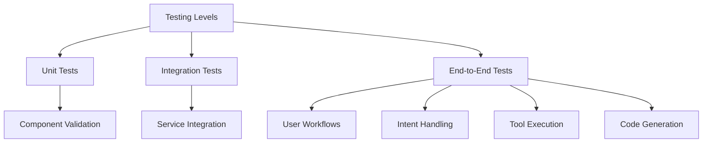
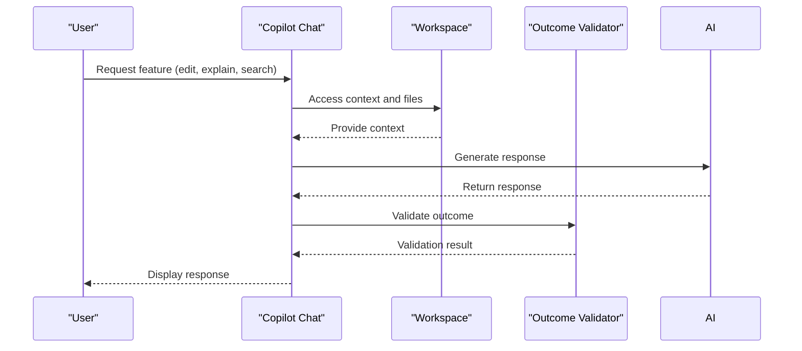
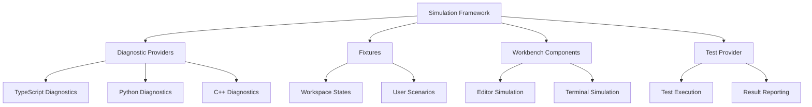
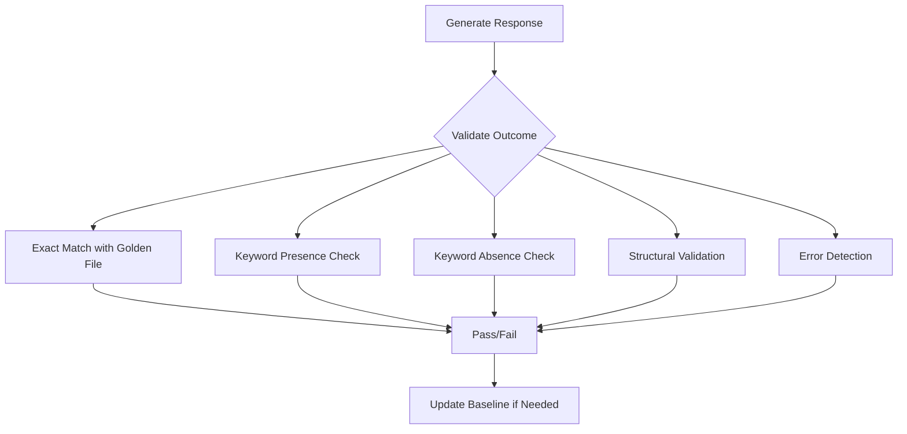
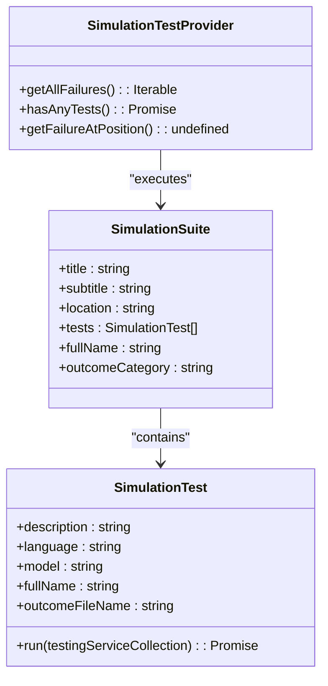
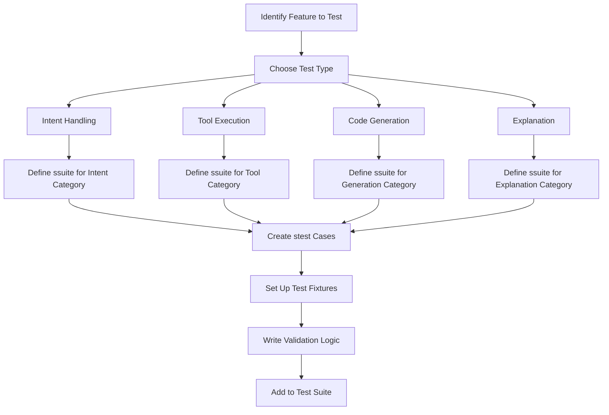

# Testing Strategy

<cite>
**Referenced Files in This Document**   
- [stest.ts](file://test/base/stest.ts)
- [simulationTestProvider.ts](file://test/simulation/simulationTestProvider.ts)
- [edit.stest.ts](file://test/e2e/edit.stest.ts)
- [explain.stest.ts](file://test/e2e/explain.stest.ts)
- [validate.ts](file://test/base/validate.ts)
- [outcomeValidators.ts](file://test/simulation/outcomeValidators.ts)
- [testHelper.ts](file://test/e2e/testHelper.ts)
- [types.ts](file://test/simulation/types.ts)
- [tools.stest.ts](file://test/e2e/tools.stest.ts)
- [debugCommandToConfig.stest.ts](file://test/simulation/debugCommandToConfig.stest.ts)
- [intentTest.ts](file://test/intent/intentTest.ts)
- [simulationOptions.ts](file://test/base/simulationOptions.ts)
- [scenarioLoader.ts](file://test/e2e/scenarioLoader.ts)
</cite>

## Table of Contents
1. [Introduction](#introduction)
2. [Testing Levels](#testing-levels)
3. [End-to-End Tests](#end-to-end-tests)
4. [Simulation Testing Framework](#simulation-testing-framework)
5. [Outcome Validation](#outcome-validation)
6. [Scenario-Based Testing](#scenario-based-testing)
7. [Writing New Tests](#writing-new-tests)
8. [Test Debugging and Performance](#test-debugging-and-performance)
9. [Conclusion](#conclusion)

## Introduction

The GitHub Copilot Chat testing strategy employs a comprehensive multi-layered approach to ensure the reliability and quality of the AI-powered coding assistant. The test suite is organized into different levels including unit tests, integration tests, and end-to-end tests, with a primary focus on scenario-based testing that simulates real user interactions. The testing infrastructure is built around a simulation framework that allows for deterministic testing of AI-generated responses by using caching mechanisms and golden file comparisons. This document provides a detailed overview of the testing architecture, covering the various test types, validation mechanisms, and development practices used to maintain the quality of GitHub Copilot Chat features.

**Section sources**
- [stest.ts](file://test/base/stest.ts#L1-L641)
- [simulationTestProvider.ts](file://test/simulation/simulationTestProvider.ts#L1-L64)

## Testing Levels

The GitHub Copilot Chat test suite implements multiple testing levels to validate functionality at different granularities. At the lowest level, unit tests verify individual components and functions in isolation, ensuring that core utilities and services behave as expected. Integration tests validate the interaction between multiple components, particularly focusing on the integration between the Copilot Chat interface and various VS Code APIs. The most prominent testing level is the end-to-end (e2e) tests located in the test/e2e/ directory, which simulate complete user workflows and validate the entire request-response cycle. These e2e tests are implemented using the stest framework, which provides a structured approach to defining test scenarios, executing them, and validating outcomes. The testing strategy also includes specialized tests for specific features such as intent handling, tool execution, and code generation, each with tailored validation criteria. The test hierarchy is organized using suite and test descriptors that categorize tests by functionality, location (inline, panel, or external), and other attributes, enabling targeted test execution and reporting.

**Diagram sources **
- [stest.ts](file://test/base/stest.ts#L1-L641)
- [types.ts](file://test/simulation/types.ts#L1-L136)

**Section sources**
- [stest.ts](file://test/base/stest.ts#L1-L641)
- [types.ts](file://test/simulation/types.ts#L1-L136)

## End-to-End Tests

The end-to-end tests in the test/e2e/ directory validate complete user workflows for key GitHub Copilot Chat features such as edit, explain, and search scenarios. These tests simulate realistic user interactions by setting up specific workspace states, executing chat commands, and validating the resulting AI responses against expected outcomes. Each e2e test is defined using the ssuite and stest functions from the stest framework, which provide a structured way to organize test suites and individual test cases. For example, the edit.stest.ts file contains tests that verify the edit functionality, ensuring that the AI correctly understands edit requests and generates appropriate code changes without unnecessary file reads or searches. Similarly, the explain.stest.ts file contains tests that validate the explain functionality, checking that the AI provides accurate code explanations without speculation. The e2e tests leverage scenario files from the test/scenarios/ directory to set up consistent test conditions and validate responses against predefined requirements. These tests are designed to be comprehensive, covering various programming languages, code contexts, and user intents to ensure robust functionality across different use cases.

**Diagram sources **
- [edit.stest.ts](file://test/e2e/edit.stest.ts#L1-L42)
- [explain.stest.ts](file://test/e2e/explain.stest.ts#L1-L43)
- [tools.stest.ts](file://test/e2e/tools.stest.ts#L1-L24)

**Section sources**
- [edit.stest.ts](file://test/e2e/edit.stest.ts#L1-L42)
- [explain.stest.ts](file://test/e2e/explain.stest.ts#L1-L43)
- [tools.stest.ts](file://test/e2e/tools.stest.ts#L1-L24)

## Simulation Testing Framework

The simulation testing framework in test/simulation/ provides the infrastructure for running deterministic tests of GitHub Copilot Chat features. This framework includes diagnostic providers that simulate language-specific diagnostics (such as TypeScript, Python, or C++ errors), fixtures that define test scenarios and workspace states, and workbench components that simulate the VS Code editor environment. The framework uses a simulation test provider to manage test execution and reporting, allowing tests to be run in a controlled environment that closely mimics the actual VS Code extension host. The simulation framework supports various test strategies, including direct edits, tool-based interactions, and agent-mode conversations, enabling comprehensive testing of different interaction patterns. Test scenarios are defined using structured data that specifies the initial workspace state, user queries, and expected outcomes, allowing for consistent test execution across different runs. The framework also includes utilities for managing test state, such as workspace setup and teardown, ensuring that tests are isolated and do not interfere with each other.

**Diagram sources **
- [simulationTestProvider.ts](file://test/simulation/simulationTestProvider.ts#L1-L64)
- [types.ts](file://test/simulation/types.ts#L1-L136)
- [diagnosticProviders](file://test/simulation/diagnosticProviders)

**Section sources**
- [simulationTestProvider.ts](file://test/simulation/simulationTestProvider.ts#L1-L64)
- [types.ts](file://test/simulation/types.ts#L1-L136)

## Outcome Validation

Test outcomes in the GitHub Copilot Chat test suite are validated against golden files in the test/outcome/ directory, which contain expected responses for various test scenarios. The validation process compares the actual AI-generated responses with these golden files to ensure consistency and correctness. The outcome validation system uses a combination of exact matching and semantic validation to handle cases where minor variations in responses are acceptable. For example, the validate.ts utility provides functions for checking that responses contain required keywords while avoiding prohibited terms, allowing for flexible validation of AI responses. The outcomeValidators.ts file contains specialized validation functions for different types of responses, such as code edits, explanations, and tool calls, each with specific criteria for success. For code edits, the validation checks not only the textual content but also the structural correctness and absence of errors in the modified code. The validation system also supports scoring mechanisms that assign numerical scores to test outcomes, enabling quantitative assessment of AI performance over time. This comprehensive validation approach ensures that GitHub Copilot Chat maintains high-quality responses across different features and use cases.

**Diagram sources **
- [outcomeValidators.ts](file://test/simulation/outcomeValidators.ts#L1-L198)
- [validate.ts](file://test/base/validate.ts#L1-L63)
- [outcome](file://test/outcome/)

**Section sources**
- [outcomeValidators.ts](file://test/simulation/outcomeValidators.ts#L1-L198)
- [validate.ts](file://test/base/validate.ts#L1-L63)

## Scenario-Based Testing

The stest.ts file serves as the foundation for scenario-based testing in the GitHub Copilot Chat test suite, providing the ssuite and stest functions that structure test definitions. These functions allow developers to define test suites and individual test cases with descriptive metadata, configuration options, and execution logic. The simulationTestProvider.ts file implements the test provider interface that integrates with the VS Code testing framework, enabling the simulation tests to be discovered and executed like regular unit tests. Scenario-based tests are organized by functionality (such as edit, explain, or search) and location (inline, panel, or external), allowing for targeted test execution and reporting. The scenarioLoader.ts utility helps load and parse test scenarios from JSON files, making it easy to define complex test cases with multiple steps and validation criteria. This approach enables the creation of comprehensive test suites that cover a wide range of user interactions and edge cases, ensuring that GitHub Copilot Chat behaves correctly in various contexts. The scenario-based testing framework also supports parameterized tests, where the same test logic can be applied to multiple input scenarios, improving test coverage and maintainability.

**Diagram sources **
- [stest.ts](file://test/base/stest.ts#L1-L641)
- [simulationTestProvider.ts](file://test/simulation/simulationTestProvider.ts#L1-L64)
- [scenarioLoader.ts](file://test/e2e/scenarioLoader.ts)

**Section sources**
- [stest.ts](file://test/base/stest.ts#L1-L641)
- [simulationTestProvider.ts](file://test/simulation/simulationTestProvider.ts#L1-L64)

## Writing New Tests

Creating new tests for GitHub Copilot Chat features involves using the stest framework to define test suites and cases that validate specific functionality. For example, to write a test for intent handling, developers would use the ssuite function to define a test suite for a specific intent category, then use the stest function to define individual test cases that verify the correct detection and handling of user intents. Similarly, for tool execution tests, developers would set up scenarios that trigger specific tools and validate that the correct tool calls are generated with appropriate parameters. The test framework provides utilities for setting up test fixtures, such as workspace states and conversation histories, ensuring that tests run in consistent environments. Test assertions can be written using standard assertion libraries or specialized validation functions from the outcomeValidators.ts file. When writing new tests, developers should follow the existing patterns in the codebase, using descriptive test names, appropriate categorization, and comprehensive validation criteria to ensure high-quality test coverage.

**Section sources**
- [stest.ts](file://test/base/stest.ts#L1-L641)
- [intentTest.ts](file://test/intent/intentTest.ts#L1-L112)
- [tools.stest.ts](file://test/e2e/tools.stest.ts#L1-L24)

## Test Debugging and Performance

The GitHub Copilot Chat test suite includes several features to support test debugging and optimize performance when running the test suite. The simulationOptions.ts file defines command-line options that control test execution, such as the ability to run specific tests using grep filters, control parallelism, and manage caching behavior. For debugging, the framework provides detailed logging and the ability to inspect intermediate states, making it easier to diagnose test failures. The test infrastructure uses caching extensively to avoid redundant API calls and improve test execution speed, with options to require cache hits or refresh caches as needed. Performance considerations include running tests in parallel when possible, minimizing the overhead of test setup and teardown, and using efficient validation methods. The framework also supports headless test execution, which further improves performance by eliminating the overhead of UI rendering. For large test suites, developers can use the --n option to run tests multiple times and collect statistical data on performance and consistency.

**Section sources**
- [simulationOptions.ts](file://test/base/simulationOptions.ts#L1-L286)
- [stest.ts](file://test/base/stest.ts#L1-L641)

## Conclusion

The GitHub Copilot Chat testing strategy provides a comprehensive framework for ensuring the quality and reliability of AI-powered coding assistance features. By combining end-to-end tests, scenario-based testing, and sophisticated outcome validation, the test suite effectively validates the functionality of key features like edit, explain, and search across various contexts and programming languages. The simulation testing framework enables deterministic testing of AI responses through caching and golden file comparisons, while the modular test structure allows for targeted validation of specific features and interaction patterns. The availability of tools for writing new tests and debugging existing ones ensures that the test suite can evolve alongside the product, maintaining high code quality as new features are developed. This robust testing approach plays a crucial role in delivering a reliable and effective AI coding assistant that meets the needs of developers in real-world scenarios.