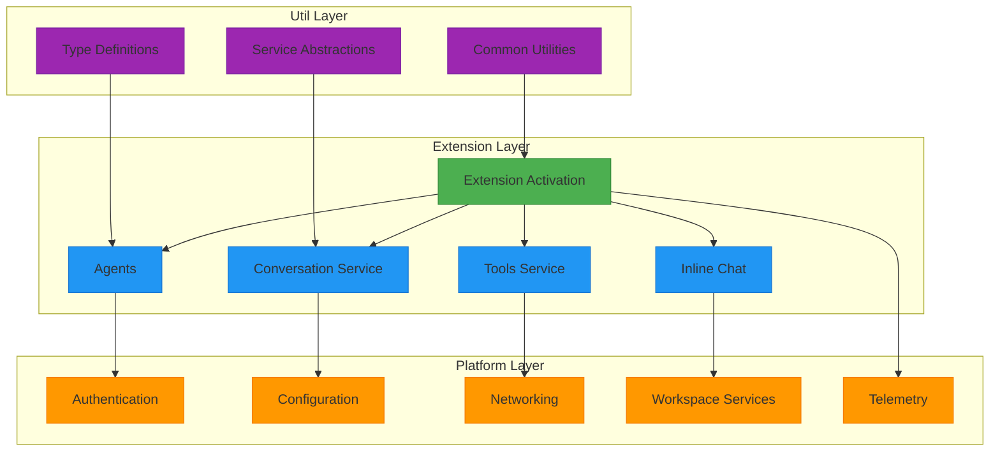
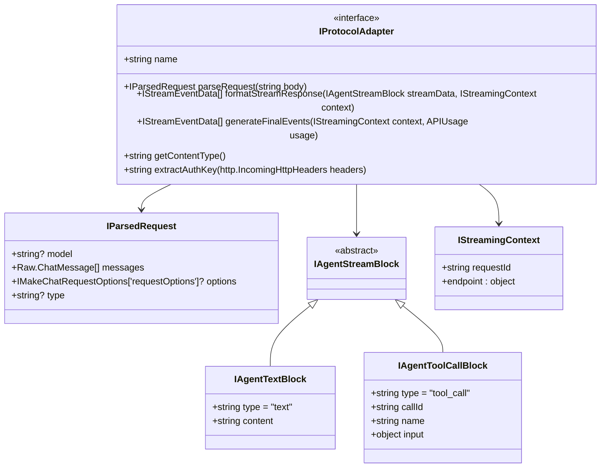
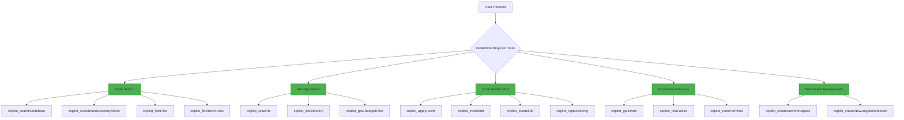
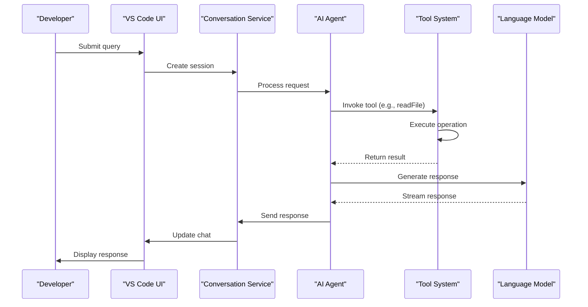

# Project Overview

<cite>
**Referenced Files in This Document**   
- [README.md](file://README.md)
- [package.json](file://package.json)
- [src/extension/extension/vscode/extension.ts](file://src/extension/extension/vscode/extension.ts)
- [src/extension/agents/node/adapters/types.ts](file://src/extension/agents/node/adapters/types.ts)
- [src/extension/conversation/vscode-node/conversationFeature.ts](file://src/extension/conversation/vscode-node/conversationFeature.ts)
- [src/extension/tools/common/toolsRegistry.ts](file://src/extension/tools/common/toolsRegistry.ts)
- [src/extension/agents/claude/node/claudeCodeAgent.ts](file://src/extension/agents/claude/node/claudeCodeAgent.ts)
- [src/extension/inlineChat/node/inlineChatAgent.ts](file://src/extension/inlineChat/node/inlineChatAgent.ts)
</cite>

## Table of Contents
1. [Introduction](#introduction)
2. [Core Architecture](#core-architecture)
3. [Extension Activation and Lifecycle](#extension-activation-and-lifecycle)
4. [Agents and Language Model Integration](#agents-and-language-model-integration)
5. [Tools and Capabilities](#tools-and-capabilities)
6. [Inline Chat Implementation](#inline-chat-implementation)
7. [Configuration and Contribution Points](#configuration-and-contribution-points)
8. [Usage Patterns and Developer Experience](#usage-patterns-and-developer-experience)
9. [Public Interfaces and APIs](#public-interfaces-and-apis)
10. [Data Flow and Component Interactions](#data-flow-and-component-interactions)

## Introduction

The GitHub Copilot Chat extension is an AI-powered programming assistant integrated within Visual Studio Code, enabling natural language interactions for code suggestions, refactoring, and codebase understanding. As a companion extension to GitHub Copilot, it provides conversational AI assistance through the Chat view, allowing developers to ask questions about their code, receive context-aware answers, and apply AI-generated suggestions directly to their codebase. The extension supports advanced features such as agent mode for autonomous task execution, inline chat for contextual code assistance, and multi-file editing capabilities.

The extension operates as a sophisticated integration layer between VS Code's editor environment and AI language models, facilitating bidirectional communication through a well-defined architecture. It leverages VS Code's proposed APIs for chat participants, language models, and interactive sessions to deliver a seamless developer experience. The system is designed to adapt to individual coding styles and project requirements, allowing users to select optimal models and customize responses through custom instructions.

**Section sources**
- [README.md](file://README.md#L1-L84)

## Core Architecture

The GitHub Copilot Chat extension follows a modular architecture that separates extension components, platform services, and utilities into distinct layers. This design enables maintainability, testability, and extensibility while supporting multiple runtime environments (Node.js, web, and worker contexts). The architecture is organized around several key principles: separation of concerns, dependency injection, and event-driven communication.

At the core of the architecture is the extension activation system, which initializes services and contributions based on the runtime environment. The system employs an inversion of control pattern through the `IInstantiationService` interface, allowing for proper dependency management and service lifecycle control. Platform services such as logging, telemetry, configuration, and file system operations are abstracted through interfaces, enabling environment-specific implementations while maintaining a consistent API surface.

The architecture is divided into three primary layers:
1. **Extension Layer**: Contains the main extension logic, activation code, and VS Code integration points
2. **Platform Layer**: Provides cross-cutting concerns like networking, authentication, and workspace services
3. **Util Layer**: Offers common utilities for data structures, async operations, and type safety

This layered approach ensures that business logic remains decoupled from platform-specific details, facilitating easier maintenance and testing across different execution contexts.

**Diagram sources**
- [src/extension/extension/vscode/extension.ts](file://src/extension/extension/vscode/extension.ts#L1-L113)
- [src/extension/conversation/vscode-node/conversationFeature.ts](file://src/extension/conversation/vscode-node/conversationFeature.ts)

## Extension Activation and Lifecycle

The extension activation process is triggered by specific activation events defined in the package.json manifest, including `onStartupFinished`, `onLanguageModelChat:copilot`, and file system events. The activation sequence begins with environment validation, checking whether the extension is running in a supported VS Code version and appropriate extension mode. During activation, the system performs several critical initialization steps: localization bundle configuration, experimentation service initialization, and contribution registration.

The activation process employs a shared codebase approach across different runtime environments (web, Node.js, and worker contexts) through the `baseActivate` function, which handles common initialization tasks. This function creates an `IInstantiationService` instance to manage service dependencies and lifecycle, ensuring proper disposal of resources when the extension is deactivated. The service builder pattern allows for flexible service registration while maintaining type safety and dependency resolution.

Key aspects of the activation lifecycle include:
- Context validation to prevent activation in unsupported environments
- Localization initialization using VS Code's l10n API
- Experimentation service setup for feature flag management
- Contribution collection and registration with VS Code
- API exposure for external consumers through the `getAPI` method

The activation process is designed to be idempotent and resilient, with proper error handling and logging to support debugging and telemetry collection. Services are registered through the `registerServices` callback, allowing for environment-specific implementations while maintaining a consistent interface.

**Section sources**
- [package.json](file://package.json#L81-L87)
- [src/extension/extension/vscode/extension.ts](file://src/extension/extension/vscode/extension.ts#L1-L113)

## Agents and Language Model Integration

The GitHub Copilot Chat extension implements a sophisticated agent system that enables AI-powered, seamlessly integrated peer programming sessions. Agents represent autonomous AI entities capable of performing complex, multi-step tasks based on natural language instructions. The architecture supports multiple agent types, including Claude-based agents and Copilot CLI agents, each with specialized capabilities for different development scenarios.

Agents interact with the codebase through a well-defined protocol that includes request parsing, streaming response handling, and tool integration. The `IProtocolAdapter` interface defines the contract for protocol-specific handling, allowing the system to support different language model providers and communication protocols. Each adapter implements methods for parsing incoming requests, formatting streaming responses, and generating protocol-specific events.

The agent system follows a request-response pattern with streaming capabilities, enabling real-time interaction between the user and AI. When a user submits a query, the system creates an agent session that manages the conversation state, tool invocations, and response generation. The agent can invoke various tools to gather information, modify code, or execute commands, with each tool call being tracked and presented to the user.

Key components of the agent system include:
- **Agent Session Service**: Manages the lifecycle of agent conversations
- **Code Agent**: Specialized agent for code-related tasks and modifications
- **Protocol Adapters**: Handle communication with different language model providers
- **Tool Invocation Formatter**: Translates tool calls into appropriate formats

**Diagram sources**
- [src/extension/agents/node/adapters/types.ts](file://src/extension/agents/node/adapters/types.ts#L1-L91)
- [src/extension/agents/claude/node/claudeCodeAgent.ts](file://src/extension/agents/claude/node/claudeCodeAgent.ts)

## Tools and Capabilities

The extension exposes a comprehensive set of tools through the `languageModelTools` contribution point in package.json, enabling the AI system to interact with the development environment and perform various coding tasks. These tools are categorized based on their functionality and are designed to provide the AI with controlled access to the codebase, file system, and development tools.

The tools system follows a schema-based approach, with each tool defining its input parameters, descriptions, and capabilities through JSON schema. This allows the AI system to understand how to use each tool appropriately and generate valid tool calls. Tools are registered in the extension manifest with specific properties including name, display name, icon, user description, model description, and input schema.

Key tool categories include:
- **Code Search Tools**: Enable searching the codebase by text, symbols, or file patterns
- **File Operations**: Support reading, writing, and navigating files and directories
- **Code Modification**: Allow applying patches, creating files, and modifying code
- **Development Environment**: Provide access to errors, test results, and version control
- **Workspace Management**: Support creating new workspaces and projects

The tools system implements a security model that restricts access to sensitive operations and requires explicit user permission for certain actions. Some tools are conditionally enabled based on configuration settings, such as the `disableReplaceTool` flag that controls access to the string replacement functionality.

**Diagram sources**
- [package.json](file://package.json#L141-L750)
- [src/extension/tools/common/toolsRegistry.ts](file://src/extension/tools/common/toolsRegistry.ts)

## Inline Chat Implementation

The inline chat feature provides contextual AI assistance directly within the code editor, allowing developers to request help with specific code sections without leaving their workflow. This implementation leverages VS Code's inline chat API to create a seamless integration between the editor and the AI system. When activated, inline chat creates a focused conversation context around the selected code, enabling the AI to provide targeted suggestions for refactoring, explanation, or enhancement.

The inline chat system is implemented through specialized agent types that understand the context of the current editor selection and file. These agents can access the surrounding code context, including imports, function definitions, and related files, to provide more accurate and relevant responses. The system supports various interaction patterns, including asking questions about selected code, requesting explanations of complex algorithms, or suggesting improvements to code quality.

Key aspects of the inline chat implementation include:
- Context preservation of the current editor selection
- Integration with VS Code's decoration system to highlight suggested changes
- Support for multi-turn conversations within the inline chat interface
- Ability to apply AI-generated suggestions directly to the code
- Real-time feedback on code changes and their impact

The inline chat agent processes user requests by first analyzing the selected code context, then formulating appropriate tool calls to gather additional information if needed, and finally generating a response that addresses the user's query. The system can suggest code modifications using the `insertEdit` or `replaceString` tools, with changes being previewed before application.

**Section sources**
- [src/extension/inlineChat/node/inlineChatAgent.ts](file://src/extension/inlineChat/node/inlineChatAgent.ts)
- [README.md](file://README.md#L40-L42)

## Configuration and Contribution Points

The extension's functionality is exposed to VS Code through a comprehensive set of contribution points defined in the package.json manifest. These contributions define how the extension integrates with the editor UI, registers commands, and provides capabilities to the AI system. The configuration system follows VS Code's extension manifest schema, with specific additions for AI-related features.

Key contribution points include:
- **languageModelTools**: Registers the available tools that the AI can use
- **activationEvents**: Defines when the extension should be activated
- **enabledApiProposals**: Specifies which proposed VS Code APIs are used
- **contributes**: Contains various UI and functional contributions

The extension leverages proposed APIs that are under development and may change in future VS Code releases. These APIs provide advanced capabilities for AI integration, including chat participants, language model systems, and interactive sessions. The extension carefully manages these dependencies through the `enabledApiProposals` field, ensuring compatibility with specific VS Code versions.

Configuration options are exposed through the extension's settings, allowing users to customize behavior such as enabling user preferences, controlling workspace creation, and managing tool availability. Some features are conditionally enabled based on configuration flags, such as the `disableReplaceTool` setting that controls access to the string replacement functionality.

**Section sources**
- [package.json](file://package.json#L81-L750)

## Usage Patterns and Developer Experience

The GitHub Copilot Chat extension supports several practical usage patterns that enhance developer productivity and code quality. These patterns leverage the extension's core capabilities to address common development tasks through natural language interactions.

Common use cases include:
- **Code Generation**: Creating new functions, classes, or entire files based on natural language descriptions
- **Code Explanation**: Understanding complex algorithms or unfamiliar code through conversational Q&A
- **Refactoring Assistance**: Improving code quality by suggesting better patterns, adding error handling, or optimizing performance
- **Debugging Support**: Analyzing error messages and test failures to suggest fixes
- **Documentation Generation**: Creating comments, docstrings, or README files for code
- **Learning and Exploration**: Understanding APIs, libraries, or frameworks through interactive questioning

The developer experience is designed to be intuitive and non-disruptive, with AI assistance available through multiple entry points:
- The Chat view for general conversations about the codebase
- Inline chat for contextual assistance within the editor
- Agent mode for autonomous task execution
- Slash commands for specific actions like code search or file creation

These patterns enable developers to work more efficiently by reducing context switching and providing immediate access to AI-powered assistance. The system learns from user interactions and can adapt to individual coding styles and project requirements over time.

**Section sources**
- [README.md](file://README.md#L21-L43)

## Public Interfaces and APIs

The extension exposes a public API through the `CopilotExtensionApi` class, allowing other extensions to integrate with GitHub Copilot Chat functionality. This API follows a versioned interface pattern, with the `getAPI` method validating the requested version against the current implementation. The API provides access to core services and capabilities while maintaining backward compatibility.

Key aspects of the public interface include:
- Version management to ensure compatibility between consumers and the extension
- Service instantiation through the dependency injection system
- Access to conversation and agent functionality
- Integration with VS Code's proposed APIs for chat and language models

The API is designed to be extensible, allowing for new capabilities to be added in future versions while maintaining stability for existing consumers. The versioning system prevents breaking changes by throwing an error when a consumer requests an API version that exceeds the current implementation.

The extension also exposes functionality through VS Code's contribution points, making capabilities available to the AI system and other extensions. These contributions follow the standard VS Code extension model while adding AI-specific features like language model tools and chat participants.

**Section sources**
- [src/extension/extension/vscode/extension.ts](file://src/extension/extension/vscode/extension.ts#L84-L91)
- [src/extension/api/vscode/extensionApi.ts](file://src/extension/api/vscode/extensionApi.ts)

## Data Flow and Component Interactions

The extension's data flow follows a well-defined pattern that coordinates interactions between the user interface, agent system, tools, and external services. When a user initiates a conversation, the request flows through several components in a specific sequence:

1. The VS Code chat interface captures the user input and forwards it to the conversation service
2. The conversation service creates a session and selects an appropriate agent based on the context
3. The agent processes the request, potentially invoking tools to gather information or modify code
4. Tool calls are executed, with results returned to the agent
5. The agent generates a response, which is streamed back to the user interface
6. The user interface displays the response and any suggested code changes

This flow is supported by several key interactions:
- The agent system communicates with language models through protocol adapters
- Tools access the file system and development environment through platform services
- The conversation service maintains state across multiple turns
- Telemetry and logging services capture usage data for improvement

The system is designed to handle errors gracefully, with appropriate fallbacks and user feedback when operations fail. Each component has well-defined responsibilities and interfaces, enabling independent development and testing.

**Diagram sources**
- [src/extension/conversation/vscode-node/conversationFeature.ts](file://src/extension/conversation/vscode-node/conversationFeature.ts)
- [src/extension/agents/claude/node/claudeCodeAgent.ts](file://src/extension/agents/claude/node/claudeCodeAgent.ts)