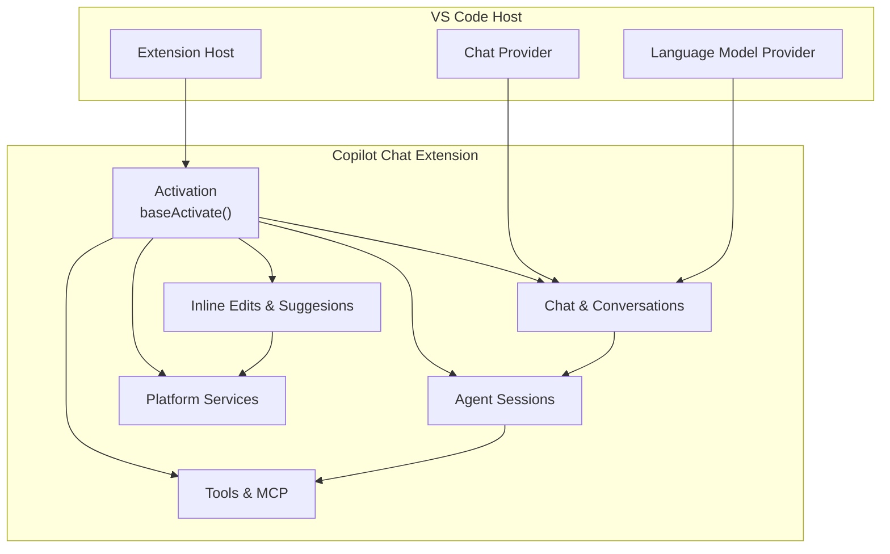
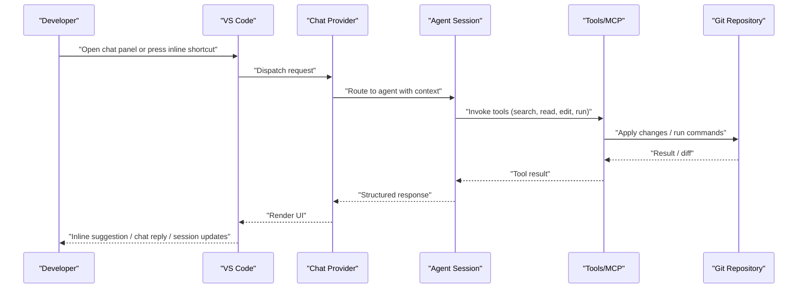
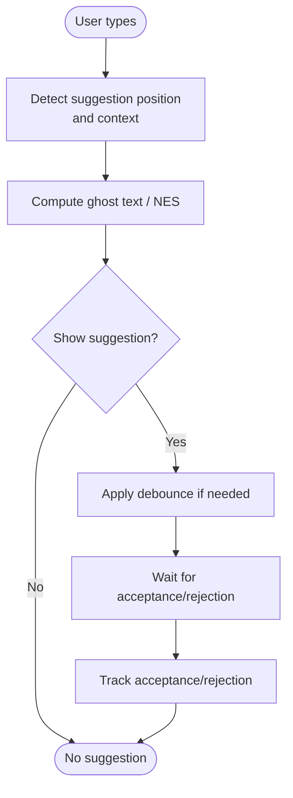
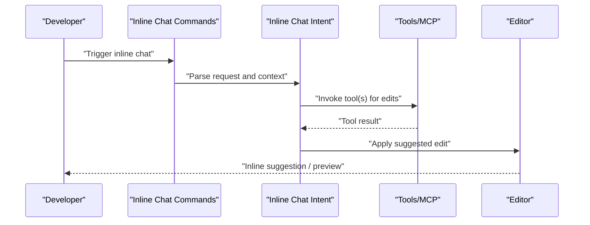
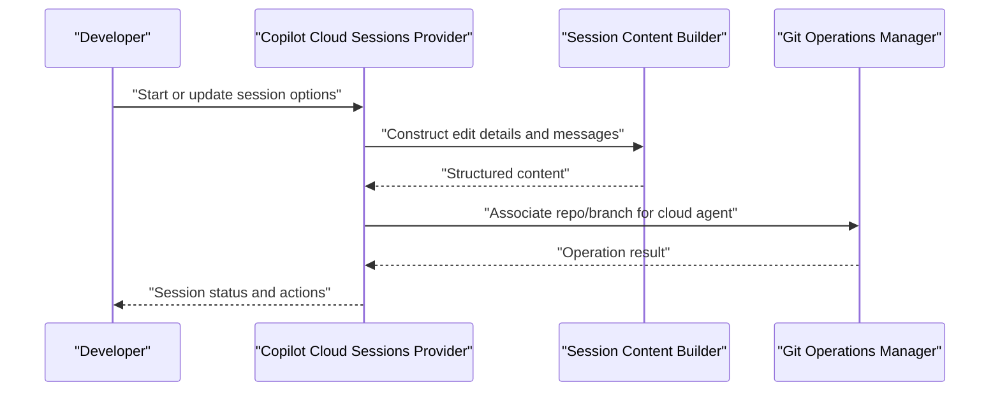
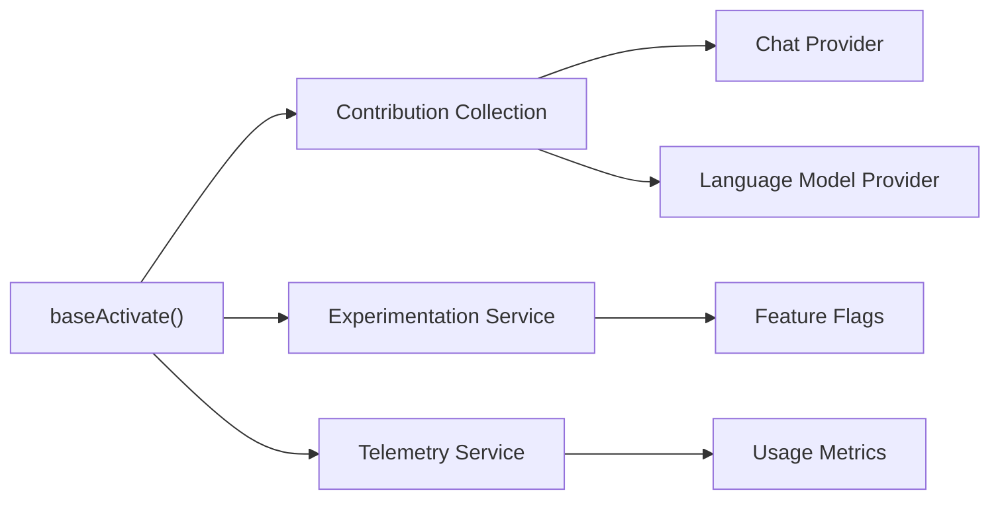

# Project Overview

<cite>
**Referenced Files in This Document**
- [README.md](file://README.md)
- [package.json](file://package.json)
- [.github/copilot-instructions.md](file://.github/copilot-instructions.md)
- [src/extension/extension/vscode/extension.ts](file://src/extension/extension/vscode/extension.ts)
- [src/extension/inlineEdits/vscode-node/inlineCompletionProvider.ts](file://src/extension/inlineEdits/vscode-node/inlineCompletionProvider.ts)
- [src/extension/inlineEdits/vscode-node/components/logContextRecorder.ts](file://src/extension/inlineEdits/vscode-node/components/logContextRecorder.ts)
- [src/extension/xtab/common/inlineSuggestion.ts](file://src/extension/xtab/common/inlineSuggestion.ts)
- [src/extension/xtab/node/xtabProvider.ts](file://src/extension/xtab/node/xtabProvider.ts)
- [src/extension/completions-core/vscode-node/lib/src/ghostText/ghostText.ts](file://src/extension/completions-core/vscode-node/lib/src/ghostText/ghostText.ts)
- [src/extension/inlineChat/nodes/inlineChatConstants.ts](file://src/extension/inlineChat/nodes/inlineChatConstants.ts)
- [src/extension/inlineChat/nodes/inlineChatCommands.ts](file://src/extension/inlineChat/nodes/inlineChatCommands.ts)
- [src/extension/inlineChat/node/inlineChatIntent.ts](file://src/extension/inlineChat/node/inlineChatIntent.ts)
- [src/extension/chatSessions/vscode-node/copilotCloudSessionsProvider.ts](file://src/extension/chatSessions/vscode-node/copilotCloudSessionsProvider.ts)
- [src/extension/chatSessions/vscode-node/copilotCloudSessionContentBuilder.ts](file://src/extension/chatSessions/vscode-node/copilotCloudSessionContentBuilder.ts)
- [src/extension/chatSessions/vscode/chatSessionsUriHandler.ts](file://src/extension/chatSessions/vscode/chatSessionsUriHandler.ts)
- [src/platform/telemetry/vscode-node/microsoftExperimentationService.ts](file://src/platform/telemetry/vscode-node/microsoftExperimentationService.ts)
</cite>

## Table of Contents
1. [Introduction](#introduction)
2. [Project Structure](#project-structure)
3. [Core Components](#core-components)
4. [Architecture Overview](#architecture-overview)
5. [Detailed Component Analysis](#detailed-component-analysis)
6. [Dependency Analysis](#dependency-analysis)
7. [Performance Considerations](#performance-considerations)
8. [Troubleshooting Guide](#troubleshooting-guide)
9. [Conclusion](#conclusion)

## Introduction
GitHub Copilot Chat is an AI-powered peer programming extension for Visual Studio Code. It augments developers with autonomous AI agents, inline suggestions, inline chat, and centralized agent sessions management. The extension enables end-to-end coding tasks: planning, file editing, command execution, and self-correction, all within the VS Code editor. It integrates deeply with GitHub Copilot services and leverages VS Code’s chat, language model, and proposed APIs to deliver a seamless, extensible AI coding experience.

Practical examples:
- Feature building: Ask an agent to implement a new feature across multiple files, with planning, edits, and PR preparation.
- Debugging: Describe a failing test or runtime issue; the agent locates problems, proposes fixes, and validates changes.
- Code refactoring: Request refactorings with inline chat to restructure code safely and iteratively.

## Project Structure
At a high level, the extension is organized into layered modules:
- Extension activation and contributions: initializes services, registers providers, and wires UI contributions.
- Chat and conversations: orchestrates chat participants, agents, and conversation flows.
- Inline editing and suggestions: provides ghost text, next edit suggestions (NES), and inline chat.
- Agent sessions: manages local and cloud agent sessions, options, and Git operations.
- Tools and MCP: exposes language model tools and Model Context Protocol integrations.
- Platform services: search, parsing, telemetry, workspace, and Git services supporting the extension.

```mermaid
graph TB
subgraph "VS Code Host"
EXT["Extension Host"]
CM["Chat Provider"]
LM["Language Model Provider"]
end
subgraph "Copilot Chat Extension"
ACT["Activation<br/>baseActivate()"]
CHAT["Chat & Conversations"]
INLINE["Inline Edits & Suggesions"]
AGENTS["Agent Sessions"]
TOOLS["Tools & MCP"]
PLATFORM["Platform Services"]
end
EXT --> ACT
ACT --> CHAT
ACT --> INLINE
ACT --> AGENTS
ACT --> TOOLS
ACT --> PLATFORM
CM --> CHAT
LM --> CHAT
CHAT --> AGENTS
AGENTS --> TOOLS
INLINE --> PLATFORM
```

**Diagram sources**
- [src/extension/extension/vscode/extension.ts](file://src/extension/extension/vscode/extension.ts#L33-L90)
- [.github/copilot-instructions.md](file://.github/copilot-instructions.md#L139-L156)

**Section sources**
- [.github/copilot-instructions.md](file://.github/copilot-instructions.md#L63-L156)
- [package.json](file://package.json#L150-L149)

## Core Components
- Autonomous AI agents: Execute multi-step tasks end-to-end, including planning, editing, running commands, and self-correction.
- Inline suggestions: Ghost text and next edit suggestions (NES) to accelerate typing and reduce context switching.
- Inline chat: Press a key chord to open a chat prompt directly in the editor for precise, in-place edits.
- Agent sessions management: Centralized view to run multiple sessions, track status, switch contexts, review changes, and resume work.

These capabilities are backed by:
- Rich VS Code API integration (proposed APIs) for chat, language models, embeddings, and editor features.
- Tooling for workspace search, codebase understanding, and Git operations.
- Experimentation and telemetry services to tailor experiences and measure impact.

**Section sources**
- [README.md](file://README.md#L1-L91)
- [package.json](file://package.json#L90-L149)
- [.github/copilot-instructions.md](file://.github/copilot-instructions.md#L157-L171)

## Architecture Overview
The extension follows a modular architecture:
- Activation layer: Ensures compatibility, sets up experimentation, and loads contributions.
- Feature layers: Chat, inline edits, agent sessions, and tools are implemented as cohesive subsystems.
- Platform services: Search, parsing, telemetry, workspace, and Git provide cross-cutting capabilities.
- Integration points: Connects to GitHub Copilot services, VS Code chat/language model APIs, and MCP servers.

```mermaid
sequenceDiagram
participant User as "Developer"
participant VSCode as "VS Code"
participant Chat as "Chat Provider"
participant Agent as "Agent Session"
participant Tools as "Tools/MCP"
participant Repo as "Git Repository"
User->>VSCode : "Open chat panel or press inline shortcut"
VSCode->>Chat : "Dispatch request"
Chat->>Agent : "Route to agent with context"
Agent->>Tools : "Invoke tools (search, read, edit, run)"
Tools->>Repo : "Apply changes / run commands"
Repo-->>Tools : "Result / diff"
Tools-->>Agent : "Tool result"
Agent-->>Chat : "Structured response"
Chat-->>VSCode : "Render UI"
VSCode-->>User : "Inline suggestion / chat reply / session updates"
```

**Diagram sources**
- [src/extension/inlineChat/node/inlineChatIntent.ts](file://src/extension/inlineChat/node/inlineChatIntent.ts#L512-L542)
- [src/extension/chatSessions/vscode-node/copilotCloudSessionsProvider.ts](file://src/extension/chatSessions/vscode-node/copilotCloudSessionsProvider.ts#L917-L944)
- [src/extension/chatSessions/vscode-node/copilotCloudSessionContentBuilder.ts](file://src/extension/chatSessions/vscode-node/copilotCloudSessionContentBuilder.ts#L463-L492)

## Detailed Component Analysis

### Inline Suggestions and Next Edit Suggestions (NES)
- Ghost text and NES are provided through dedicated providers and computation layers. The system considers user typing, suggestion visibility, and experiment configurations to decide when and how to render suggestions.
- Position-aware logic determines valid inline suggestion positions (e.g., middle-of-line vs. end-of-line), applying extra debouncing to improve responsiveness and reduce noise.
- Acceptance/rejection is tracked to capture user interaction telemetry and refine future suggestions.

```mermaid
flowchart TD
Start(["User types"]) --> DetectPos["Detect suggestion position<br/>and context"]
DetectPos --> Compute["Compute ghost text / NES"]
Compute --> Render{"Show suggestion?"}
Render --> |Yes| Debounce["Apply debounce if needed"]
Debounce --> WaitUser["Wait for acceptance/rejection"]
Render --> |No| End(["No suggestion"])
WaitUser --> Track["Track acceptance/rejection"]
Track --> End
```

**Diagram sources**
- [src/extension/inlineEdits/vscode-node/inlineCompletionProvider.ts](file://src/extension/inlineEdits/vscode-node/inlineCompletionProvider.ts#L231-L258)
- [src/extension/xtab/common/inlineSuggestion.ts](file://src/extension/xtab/common/inlineSuggestion.ts#L31-L47)
- [src/extension/xtab/node/xtabProvider.ts](file://src/extension/xtab/node/xtabProvider.ts#L240-L250)
- [src/extension/inlineEdits/vscode-node/components/logContextRecorder.ts](file://src/extension/inlineEdits/vscode-node/components/logContextRecorder.ts#L61-L103)
- [src/extension/completions-core/vscode-node/lib/src/ghostText/ghostText.ts](file://src/extension/completions-core/vscode-node/lib/src/ghostText/ghostText.ts#L663-L690)

**Section sources**
- [src/extension/inlineEdits/vscode-node/inlineCompletionProvider.ts](file://src/extension/inlineEdits/vscode-node/inlineCompletionProvider.ts#L140-L258)
- [src/extension/xtab/common/inlineSuggestion.ts](file://src/extension/xtab/common/inlineSuggestion.ts#L20-L47)
- [src/extension/xtab/node/xtabProvider.ts](file://src/extension/xtab/node/xtabProvider.ts#L226-L250)
- [src/extension/inlineEdits/vscode-node/components/logContextRecorder.ts](file://src/extension/inlineEdits/vscode-node/components/logContextRecorder.ts#L61-L103)
- [src/extension/completions-core/vscode-node/lib/src/ghostText/ghostText.ts](file://src/extension/completions-core/vscode-node/lib/src/ghostText/ghostText.ts#L663-L690)

### Inline Chat
- Inline chat enables precise, in-place edits directly in the editor. Commands and constants configure behavior and temperature/top-p settings for deterministic, focused interactions.
- Intent handling coordinates tool invocations, error handling, and iterative refinement of edits.

```mermaid
sequenceDiagram
participant Dev as "Developer"
participant Cmd as "Inline Chat Commands"
participant Intent as "Inline Chat Intent"
participant Tools as "Tools/MCP"
participant Editor as "Editor"
Dev->>Cmd : "Trigger inline chat"
Cmd->>Intent : "Parse request and context"
Intent->>Tools : "Invoke tool(s) for edits"
Tools-->>Intent : "Tool result"
Intent->>Editor : "Apply suggested edit"
Editor-->>Dev : "Inline suggestion / preview"
```

**Diagram sources**
- [src/extension/inlineChat/nodes/inlineChatCommands.ts](file://src/extension/inlineChat/nodes/inlineChatCommands.ts#L39-L49)
- [src/extension/inlineChat/nodes/inlineChatConstants.ts](file://src/extension/inlineChat/nodes/inlineChatConstants.ts#L6-L9)
- [src/extension/inlineChat/node/inlineChatIntent.ts](file://src/extension/inlineChat/node/inlineChatIntent.ts#L512-L542)

**Section sources**
- [src/extension/inlineChat/nodes/inlineChatCommands.ts](file://src/extension/inlineChat/nodes/inlineChatCommands.ts#L39-L49)
- [src/extension/inlineChat/nodes/inlineChatConstants.ts](file://src/extension/inlineChat/nodes/inlineChatConstants.ts#L6-L9)
- [src/extension/inlineChat/node/inlineChatIntent.ts](file://src/extension/inlineChat/node/inlineChatIntent.ts#L512-L542)

### Agent Sessions Management
- Provides centralized management of agent sessions, including options for custom agents, models, partner agents, and repositories.
- Builds human-readable content for edits and tracks session state for transparency and resumability.
- Handles URIs and storage keys for pending sessions and integrates with Git for cloud agent operations.

```mermaid
sequenceDiagram
participant User as "Developer"
participant Sessions as "Copilot Cloud Sessions Provider"
participant Builder as "Session Content Builder"
participant Git as "Git Operations Manager"
User->>Sessions : "Start or update session options"
Sessions->>Builder : "Construct edit details and messages"
Builder-->>Sessions : "Structured content"
Sessions->>Git : "Associate repo/branch for cloud agent"
Git-->>Sessions : "Operation result"
Sessions-->>User : "Session status and actions"
```

**Diagram sources**
- [src/extension/chatSessions/vscode-node/copilotCloudSessionsProvider.ts](file://src/extension/chatSessions/vscode-node/copilotCloudSessionsProvider.ts#L917-L944)
- [src/extension/chatSessions/vscode-node/copilotCloudSessionContentBuilder.ts](file://src/extension/chatSessions/vscode-node/copilotCloudSessionContentBuilder.ts#L463-L492)
- [src/extension/chatSessions/vscode/chatSessionsUriHandler.ts](file://src/extension/chatSessions/vscode/chatSessionsUriHandler.ts#L1-L20)

**Section sources**
- [src/extension/chatSessions/vscode-node/copilotCloudSessionsProvider.ts](file://src/extension/chatSessions/vscode-node/copilotCloudSessionsProvider.ts#L917-L944)
- [src/extension/chatSessions/vscode-node/copilotCloudSessionContentBuilder.ts](file://src/extension/chatSessions/vscode-node/copilotCloudSessionContentBuilder.ts#L463-L492)
- [src/extension/chatSessions/vscode/chatSessionsUriHandler.ts](file://src/extension/chatSessions/vscode/chatSessionsUriHandler.ts#L1-L20)

### Relationship to GitHub Copilot
- Copilot Chat extends GitHub Copilot by integrating chat, language model, and agent capabilities into VS Code. It leverages Copilot’s inference services and tooling while exposing a rich UI and session management layer.
- The extension declares numerous VS Code proposed APIs to enable chat, agent sessions, inline completions, and MCP integrations.

**Section sources**
- [README.md](file://README.md#L1-L91)
- [package.json](file://package.json#L90-L149)

## Dependency Analysis
- Activation and contributions: The base activation function ensures compatibility and initializes services before contributions load.
- Experimentation and telemetry: Services provide feature flags and telemetry to tailor experiences and measure outcomes.
- Proposed APIs: The extension contributes a broad set of proposed APIs to integrate with VS Code’s chat, language models, and editor features.

```mermaid
graph LR
Base["baseActivate()"] --> Contrib["Contribution Collection"]
Contrib --> ChatProv["Chat Provider"]
Contrib --> LMProv["Language Model Provider"]
Base --> Exp["Experimentation Service"]
Base --> Tel["Telemetry Service"]
Exp --> Flags["Feature Flags"]
Tel --> Metrics["Usage Metrics"]
```

**Diagram sources**
- [src/extension/extension/vscode/extension.ts](file://src/extension/extension/vscode/extension.ts#L33-L90)
- [src/platform/telemetry/vscode-node/microsoftExperimentationService.ts](file://src/platform/telemetry/vscode-node/microsoftExperimentationService.ts#L81-L102)

**Section sources**
- [src/extension/extension/vscode/extension.ts](file://src/extension/extension/vscode/extension.ts#L33-L90)
- [src/platform/telemetry/vscode-node/microsoftExperimentationService.ts](file://src/platform/telemetry/vscode-node/microsoftExperimentationService.ts#L81-L102)
- [package.json](file://package.json#L90-L149)

## Performance Considerations
- Debounce and position-aware logic reduce unnecessary suggestion computations and improve responsiveness.
- Experiment-based toggles allow enabling/disabling features and adjusting aggressiveness to balance speed and quality.
- Speculative requests for next edit suggestions can preemptively compute follow-up edits after user actions.

[No sources needed since this section provides general guidance]

## Troubleshooting Guide
- Verify activation conditions and proposed API availability to ensure features are enabled.
- Use inline suggestion logging to track acceptance/rejection and diagnose suggestion behavior.
- Confirm session option updates and Git operations for cloud agent flows.

**Section sources**
- [src/extension/extension/vscode/extension.ts](file://src/extension/extension/vscode/extension.ts#L33-L90)
- [src/extension/inlineEdits/vscode-node/components/logContextRecorder.ts](file://src/extension/inlineEdits/vscode-node/components/logContextRecorder.ts#L61-L103)
- [src/extension/chatSessions/vscode-node/copilotCloudSessionsProvider.ts](file://src/extension/chatSessions/vscode-node/copilotCloudSessionsProvider.ts#L917-L944)

## Conclusion
GitHub Copilot Chat transforms how developers write code in VS Code by combining autonomous AI agents, inline suggestions, inline chat, and centralized agent sessions management. Built on a modular architecture and deep integration with VS Code and GitHub Copilot services, it supports end-to-end coding tasks with planning, editing, command execution, and self-correction. Whether you are building features, debugging, or refactoring, Copilot Chat accelerates your workflow while maintaining a strong focus on developer productivity and editor integration.

[No sources needed since this section summarizes without analyzing specific files]