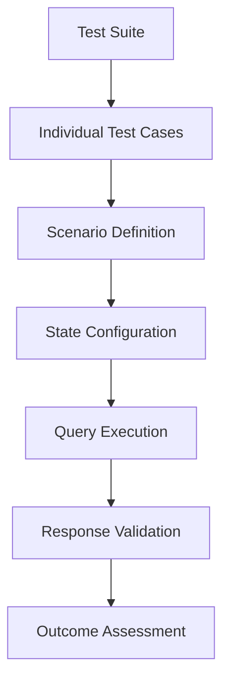
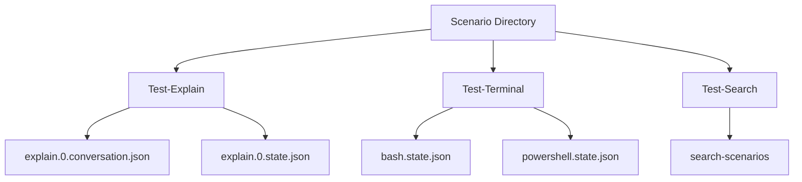
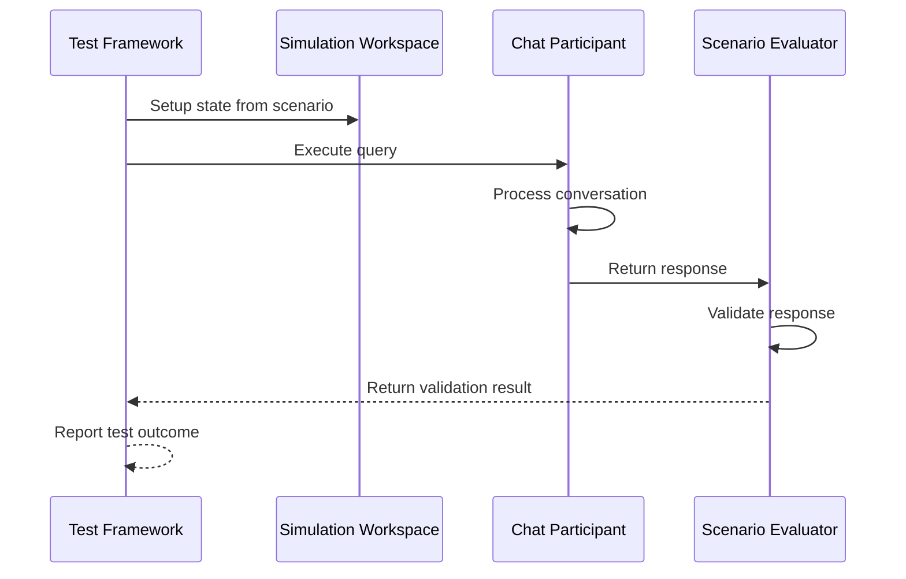
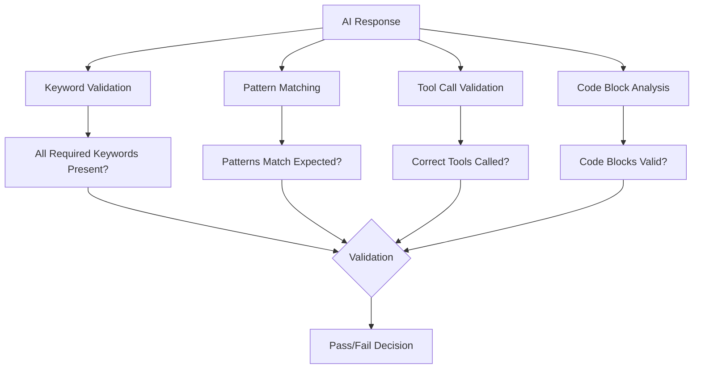

# End-to-End Testing

<cite>
**Referenced Files in This Document**   
- [edit.stest.ts](file://test/e2e/edit.stest.ts)
- [explain.stest.ts](file://test/e2e/explain.stest.ts)
- [search.stest.ts](file://test/e2e/search.stest.ts)
- [terminal.stest.ts](file://test/e2e/terminal.stest.ts)
- [scenarioLoader.ts](file://test/e2e/scenarioLoader.ts)
- [scenarioTest.ts](file://test/e2e/scenarioTest.ts)
- [testHelper.ts](file://test/e2e/testHelper.ts)
- [toolSimTest.ts](file://test/e2e/toolSimTest.ts)
- [stest.ts](file://test/base/stest.ts)
- [validate.ts](file://test/base/validate.ts)
- [test-explain/explain.0.conversation.json](file://test/scenarios/test-explain/explain.0.conversation.json)
- [test-terminal/bash.state.json](file://test/scenarios/test-terminal/bash.state.json)
</cite>

## Table of Contents
1. [Introduction](#introduction)
2. [E2E Test Structure](#e2e-test-structure)
3. [Scenario-Based Testing](#scenario-based-testing)
4. [Test Execution Framework](#test-execution-framework)
5. [Validation and Outcome Scoring](#validation-and-outcome-scoring)
6. [Testing AI-Driven Features](#testing-ai-driven-features)
7. [Handling Asynchronous Interactions](#handling-asynchronous-interactions)
8. [Conclusion](#conclusion)

## Introduction
End-to-end (E2E) testing in GitHub Copilot Chat validates complete user workflows from initial UI interaction to final outcome. These tests simulate real user interactions with the VS Code interface to validate the expected behavior of complex AI-driven features such as agent mode, inline chat, code generation, and terminal assistance. The E2E test suite ensures that user queries are properly processed through the entire system stack, from the UI layer through the AI model interaction and back to the user interface with appropriate responses and actions.

The testing framework is designed to validate complete user journeys, such as submitting a chat query and receiving code suggestions, explaining code functionality, performing search operations, or executing terminal commands. Each test scenario captures a specific user workflow and verifies that the system responds appropriately with accurate, contextually relevant results.

**Section sources**
- [explain.stest.ts](file://test/e2e/explain.stest.ts#L1-L43)
- [terminal.stest.ts](file://test/e2e/terminal.stest.ts#L1-L617)

## E2E Test Structure
The E2E tests are organized in the `test/e2e/` directory with dedicated test files for different scenarios: edit, explain, search, and terminal interactions. Each test file follows a consistent pattern of defining test suites and individual test cases that validate specific user workflows.

The test structure uses the `ssuite` and `stest` functions from the testing framework to define test suites and individual test cases. A test suite groups related tests together, while individual test cases validate specific scenarios. For example, the `explain.stest.ts` file contains tests for code explanation functionality, while `terminal.stest.ts` validates terminal command suggestions.

**Diagram sources**
- [explain.stest.ts](file://test/e2e/explain.stest.ts#L13-L42)
- [search.stest.ts](file://test/e2e/search.stest.ts#L101-L111)
- [terminal.stest.ts](file://test/e2e/terminal.stest.ts#L522-L557)

**Section sources**
- [edit.stest.ts](file://test/e2e/edit.stest.ts#L1-L42)
- [explain.stest.ts](file://test/e2e/explain.stest.ts#L1-L43)
- [search.stest.ts](file://test/e2e/search.stest.ts#L1-L280)
- [terminal.stest.ts](file://test/e2e/terminal.stest.ts#L1-L617)

## Scenario-Based Testing
The E2E testing framework utilizes scenario files stored in the `test/scenarios/` directory to define test inputs and expected outcomes. These scenario files contain JSON configurations that specify the test context, including workspace state, conversation history, and validation criteria.

Each scenario defines a complete test case with properties such as:
- **question**: The user query to be tested
- **stateFile**: The workspace state configuration for the test
- **keywords**: Validation criteria for the expected response
- **description**: Human-readable description of the test case

For example, the explain functionality test scenario defines that when requesting an explanation of code, the response should include specific keywords like "foo", "bar", and "console" while excluding others like "qux".

**Diagram sources**
- [test-explain/explain.0.conversation.json](file://test/scenarios/test-explain/explain.0.conversation.json#L1-L17)
- [test-terminal/bash.state.json](file://test/scenarios/test-terminal/bash.state.json#L1-L7)

**Section sources**
- [scenarioLoader.ts](file://test/e2e/scenarioLoader.ts#L1-L168)
- [test/scenarios/test-explain/explain.0.conversation.json](file://test/scenarios/test-explain/explain.0.conversation.json#L1-L17)
- [test/scenarios/test-terminal/bash.state.json](file://test/scenarios/test-terminal/bash.state.json#L1-L7)

## Test Execution Framework
The E2E test execution framework is built around the `generateScenarioTestRunner` function, which orchestrates the complete test workflow from setup to validation. The framework simulates the VS Code environment and processes user queries through the Copilot Chat system, capturing and validating the responses.

The test execution process follows these steps:
1. Setup the simulation workspace with the specified state
2. Parse and process the user query
3. Execute the chat request through the system
4. Capture the AI response and any tool calls
5. Validate the response against expected criteria
6. Report test outcomes

The framework uses a simulation workspace that can be reset to specific states for each test, ensuring consistent and isolated test execution. The `SimulationWorkspace` class provides the necessary interfaces to simulate VS Code's editor, terminal, and other components.

**Diagram sources**
- [scenarioTest.ts](file://test/e2e/scenarioTest.ts#L55-L256)
- [testHelper.ts](file://test/e2e/testHelper.ts#L26-L50)

**Section sources**
- [scenarioTest.ts](file://test/e2e/scenarioTest.ts#L1-L256)
- [testHelper.ts](file://test/e2e/testHelper.ts#L1-L112)
- [stest.ts](file://test/base/stest.ts#L1-L641)

## Validation and Outcome Scoring
The E2E testing framework employs comprehensive validation mechanisms to assess the quality and accuracy of AI responses. Validation occurs at multiple levels, from basic keyword matching to complex structural analysis of tool calls and code suggestions.

The validation system uses a predicate-based approach where test scenarios define expected patterns in the AI response. These patterns can include:
- Required keywords that must appear in the response
- Excluded keywords that should not appear
- Regular expression patterns for specific text formats
- Structural requirements for code blocks or command suggestions

For terminal command suggestions, the framework validates responses against shell-specific command patterns, ensuring that suggested commands are appropriate for the user's terminal environment (bash, zsh, powershell, etc.).

**Diagram sources**
- [validate.ts](file://test/base/validate.ts#L1-L63)
- [terminal.stest.ts](file://test/e2e/terminal.stest.ts#L564-L616)
- [edit.stest.ts](file://test/e2e/edit.stest.ts#L21-L39)

**Section sources**
- [validate.ts](file://test/base/validate.ts#L1-L63)
- [toolSimTest.ts](file://test/e2e/toolSimTest.ts#L1-L175)

## Testing AI-Driven Features
The E2E framework is specifically designed to handle the challenges of testing non-deterministic AI outputs. Rather than expecting exact text matches, the tests validate that responses meet functional requirements and contain appropriate content.

For agent mode testing, the framework verifies that the AI agent selects appropriate tools for the given task and uses them correctly. The `toolSimTest.ts` file contains utilities for validating tool call patterns, ensuring that the AI calls the right tools with correct parameters.

Inline chat functionality is tested by validating that code suggestions are contextually appropriate and properly formatted. The tests check that code blocks are correctly identified and that suggestions do not include inappropriate content or speculation.

The scoring mechanism evaluates responses based on multiple criteria, including:
- Completeness of information provided
- Accuracy of technical details
- Appropriateness of suggested solutions
- Adherence to best practices
- Avoidance of speculative or uncertain language

**Section sources**
- [toolSimTest.ts](file://test/e2e/toolSimTest.ts#L1-L175)
- [explain.stest.ts](file://test/e2e/explain.stest.ts#L23-L27)
- [terminal.stest.ts](file://test/e2e/terminal.stest.ts#L564-L616)

## Handling Asynchronous Interactions
The E2E testing framework handles asynchronous interactions through promise-based execution and proper sequencing of test steps. Multi-step interactions are validated by examining the complete conversation history and ensuring that each step progresses logically to the next.

For tool-based workflows, the framework validates the sequence of tool calls and ensures that the AI properly handles the results of each tool invocation. The tests verify that the AI doesn't make unnecessary tool calls or request information that is already available in the context.

The simulation framework captures all intermediate states and responses, allowing for detailed analysis of the interaction flow. This enables testing of complex scenarios where the AI must gather information through multiple steps before providing a final response.

**Section sources**
- [scenarioTest.ts](file://test/e2e/scenarioTest.ts#L67-L240)
- [toolSimTest.ts](file://test/e2e/toolSimTest.ts#L64-L77)

## Conclusion
The end-to-end testing framework for GitHub Copilot Chat provides comprehensive validation of user workflows across various AI-driven features. By combining scenario-based testing with flexible validation mechanisms, the framework effectively tests the complex interactions between users and the AI assistant.

The architecture supports testing of diverse functionality including code explanation, editing, search operations, and terminal command suggestions. The use of scenario files allows for systematic testing of different contexts and edge cases, while the validation framework accommodates the non-deterministic nature of AI responses.

Future enhancements could include more sophisticated scoring mechanisms, expanded scenario coverage, and integration with performance metrics to ensure both functional correctness and optimal user experience.