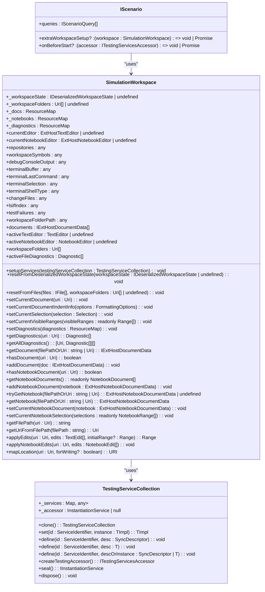
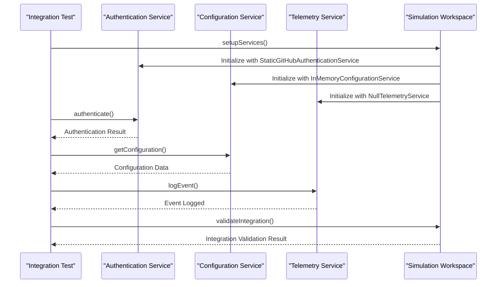
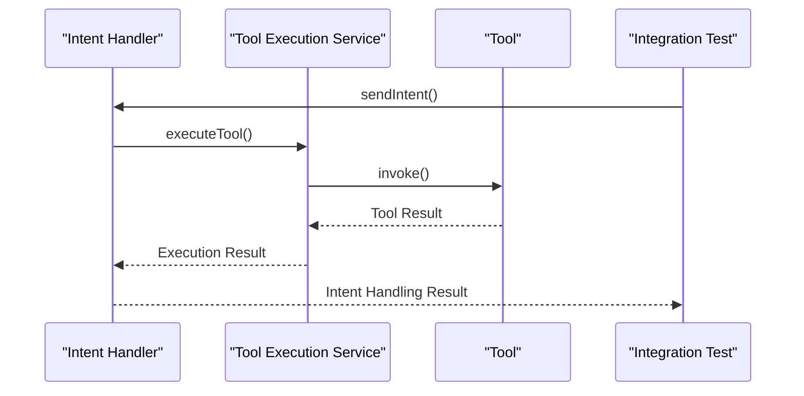
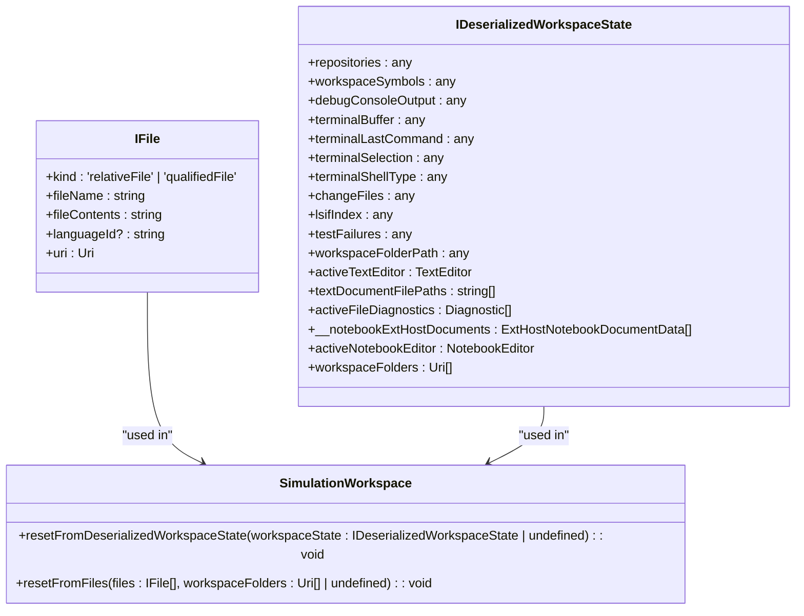
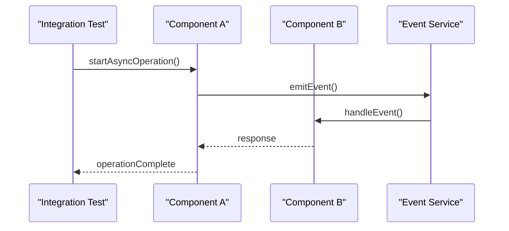
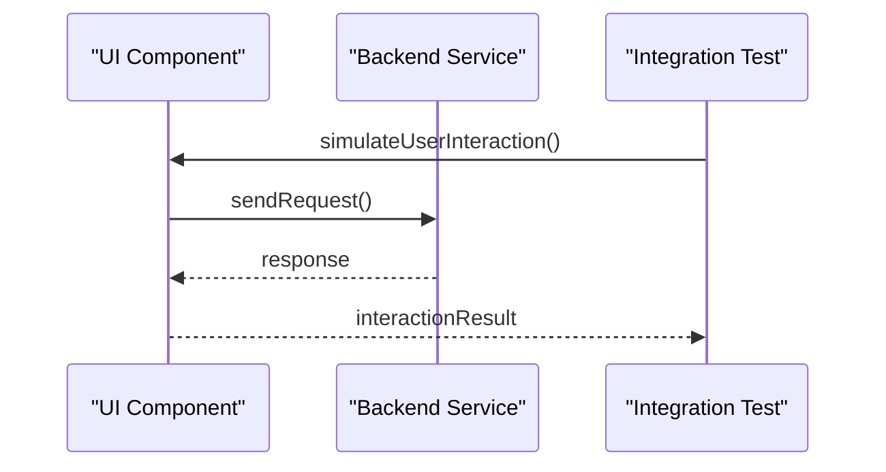
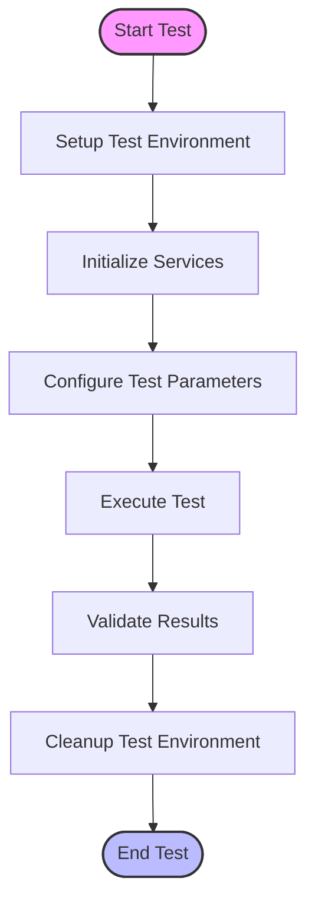
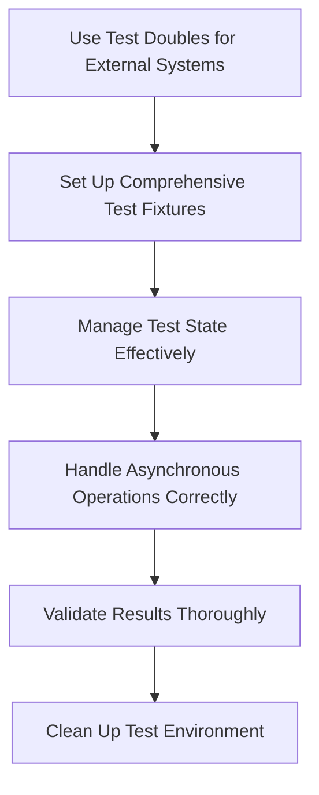

# Integration Testing

<cite>
**Referenced Files in This Document**   
- [simulationTestProvider.ts](file://test/simulation/simulationTestProvider.ts)
- [types.ts](file://test/simulation/types.ts)
- [simulationBaseline.ts](file://test/base/simulationBaseline.ts)
- [testHelper.ts](file://test/e2e/testHelper.ts)
- [services.ts](file://src/platform/test/node/services.ts)
- [simulationWorkspace.ts](file://src/platform/test/node/simulationWorkspace.ts)
- [edit.stest.ts](file://test/e2e/edit.stest.ts)
- [explain.stest.ts](file://test/e2e/explain.stest.ts)
- [stest.ts](file://test/base/stest.ts)
- [scenarioLoader.ts](file://test/e2e/scenarioLoader.ts)
</cite>

## Table of Contents
1. [Introduction](#introduction)
2. [Integration Testing Framework](#integration-testing-framework)
3. [Test Infrastructure Components](#test-infrastructure-components)
4. [Service Integration Testing](#service-integration-testing)
5. [Intent Handler and Tool Execution Integration](#intent-handler-and-tool-execution-integration)
6. [Test Fixtures and State Management](#test-fixtures-and-state-management)
7. [Asynchronous Operations and Event-Driven Communication](#asynchronous-operations-and-event-driven-communication)
8. [UI and Backend Service Integration](#ui-and-backend-service-integration)
9. [Challenges in Testing AI Components and VS Code APIs](#challenges-in-testing-ai-components-and-vs-code-apis)
10. [Best Practices for Reliable Integration Testing](#best-practices-for-reliable-integration-testing)

## Introduction

Integration testing in GitHub Copilot Chat focuses on verifying the interaction between multiple components to ensure they work together as expected. This includes testing the integration between the extension layer and platform services, validating the interaction between intent handlers and tool execution services, and ensuring service dependencies like authentication, configuration, and telemetry services function correctly together. The integration tests use test doubles for external systems like language models and handle asynchronous operations and event-driven communication effectively.

**Section sources**
- [types.ts](file://test/simulation/types.ts#L1-L136)
- [services.ts](file://src/platform/test/node/services.ts#L1-L293)

## Integration Testing Framework

The integration testing framework in GitHub Copilot Chat is designed to simulate real-world scenarios by setting up test environments that mimic the actual extension behavior. The framework uses a combination of test providers, simulation workspaces, and baseline comparisons to validate the integration between different components.

```mermaid
classDiagram
class SimulationTestProvider {
+failures : {label? : string; uri : URI; testRange : Range; failureRange? : Range; message : string}[]
+getFailureAtPosition() : undefined
+hasTestsInUri() : Promise<boolean>
+getLastFailureFor() : ITestFailure | undefined
+getAllFailures() : Iterable<ITestFailure>
+hasAnyTests() : Promise<boolean>
}
class SimulationBaseline {
+prevBaseline : Map<string, IBaselineTestSummary>
+currBaseline : Map<string, IBaselineTestSummary>
+currSkipped : Set<string>
+current : IterableIterator<IBaselineTestSummary>
+currentScore : number
+overallScore : number
+DEFAULT_BASELINE_PATH : string
+readFromDisk(baselinePath : string, runningAllTests : boolean) : Promise<SimulationBaseline>
+setCurrentResult(testSummary : IBaselineTestSummary) : TestBaselineComparison
+setSkippedTest(name : string) : void
+writeToDisk(pathToWriteTo? : string) : Promise<void>
+testSummaries : IBaselineTestSummary[]
+compare() : ICompleteBaselineComparison
+clear() : void
}
class ITestingServicesAccessor {
+get<T>(id : ServiceIdentifier<T>) : T
+getIfExists<T>(id : ServiceIdentifier<T>) : T | undefined
+dispose() : void
}
SimulationTestProvider --> ITestingServicesAccessor : "uses"
SimulationBaseline --> ITestingServicesAccessor : "uses"
```

**Diagram sources**
- [simulationTestProvider.ts](file://test/simulation/simulationTestProvider.ts#L10-L64)
- [simulationBaseline.ts](file://test/base/simulationBaseline.ts#L9-L266)
- [services.ts](file://src/platform/test/node/services.ts#L153-L177)

**Section sources**
- [simulationTestProvider.ts](file://test/simulation/simulationTestProvider.ts#L1-L64)
- [simulationBaseline.ts](file://test/base/simulationBaseline.ts#L1-L266)
- [services.ts](file://src/platform/test/node/services.ts#L1-L293)

## Test Infrastructure Components

The test infrastructure components include simulation workspaces, test services, and scenario loaders that work together to create a comprehensive testing environment. The simulation workspace sets up the necessary files and configurations, while the test services provide the required dependencies for the tests.



**Diagram sources**
- [simulationWorkspace.ts](file://src/platform/test/node/simulationWorkspace.ts#L117-L704)
- [services.ts](file://src/platform/test/node/services.ts#L104-L148)
- [types.ts](file://test/simulation/types.ts#L56-L69)

**Section sources**
- [simulationWorkspace.ts](file://src/platform/test/node/simulationWorkspace.ts#L1-L704)
- [services.ts](file://src/platform/test/node/services.ts#L1-L293)
- [types.ts](file://test/simulation/types.ts#L1-L136)

## Service Integration Testing

Service integration testing in GitHub Copilot Chat involves verifying the proper functioning of service dependencies such as authentication, configuration, and telemetry services. The tests ensure that these services work together seamlessly and handle various scenarios correctly.



**Diagram sources**
- [services.ts](file://src/platform/test/node/services.ts#L185-L292)
- [simulationWorkspace.ts](file://src/platform/test/node/simulationWorkspace.ts#L189-L215)

**Section sources**
- [services.ts](file://src/platform/test/node/services.ts#L1-L293)
- [simulationWorkspace.ts](file://src/platform/test/node/simulationWorkspace.ts#L1-L704)

## Intent Handler and Tool Execution Integration

The integration between intent handlers and tool execution services is a critical aspect of GitHub Copilot Chat. The tests validate that intent handlers correctly invoke the appropriate tools and that the tool execution services process the requests as expected.



**Diagram sources**
- [edit.stest.ts](file://test/e2e/edit.stest.ts#L17-L42)
- [testHelper.ts](file://test/e2e/testHelper.ts#L61-L102)

**Section sources**
- [edit.stest.ts](file://test/e2e/edit.stest.ts#L1-L42)
- [testHelper.ts](file://test/e2e/testHelper.ts#L1-L112)

## Test Fixtures and State Management

Test fixtures and state management are essential for ensuring reliable integration tests. The framework provides mechanisms to set up test fixtures, manage test state, and ensure test reliability.



**Diagram sources**
- [types.ts](file://test/simulation/types.ts#L49-L71)
- [simulationWorkspace.ts](file://src/platform/test/node/simulationWorkspace.ts#L217-L257)

**Section sources**
- [types.ts](file://test/simulation/types.ts#L1-L136)
- [simulationWorkspace.ts](file://src/platform/test/node/simulationWorkspace.ts#L1-L704)

## Asynchronous Operations and Event-Driven Communication

Handling asynchronous operations and event-driven communication is crucial for integration testing in GitHub Copilot Chat. The tests ensure that asynchronous operations are handled correctly and that event-driven communication between components works as expected.



**Diagram sources**
- [simulationWorkspace.ts](file://src/platform/test/node/simulationWorkspace.ts#L119-L120)
- [services.ts](file://src/platform/test/node/services.ts#L131-L136)

**Section sources**
- [simulationWorkspace.ts](file://src/platform/test/node/simulationWorkspace.ts#L1-L704)
- [services.ts](file://src/platform/test/node/services.ts#L1-L293)

## UI and Backend Service Integration

The integration between UI components and backend services is tested to ensure that user interactions are correctly processed and that the backend services respond appropriately.



**Diagram sources**
- [explain.stest.ts](file://test/e2e/explain.stest.ts#L13-L43)
- [scenarioLoader.ts](file://test/e2e/scenarioLoader.ts)

**Section sources**
- [explain.stest.ts](file://test/e2e/explain.stest.ts#L1-L43)
- [scenarioLoader.ts](file://test/e2e/scenarioLoader.ts)

## Challenges in Testing Complex Interactions between AI Components and VS Code APIs

Testing complex interactions between AI components and VS Code APIs presents several challenges, including handling asynchronous operations, managing test state, and ensuring reliable test execution.



**Diagram sources**
- [services.ts](file://src/platform/test/node/services.ts#L229-L292)
- [simulationWorkspace.ts](file://src/platform/test/node/simulationWorkspace.ts#L189-L215)

**Section sources**
- [services.ts](file://src/platform/test/node/services.ts#L1-L293)
- [simulationWorkspace.ts](file://src/platform/test/node/simulationWorkspace.ts#L1-L704)

## Best Practices for Reliable Integration Testing

To ensure reliable integration testing, several best practices should be followed, including setting up comprehensive test fixtures, managing test state effectively, and using test doubles for external systems.



**Diagram sources**
- [services.ts](file://src/platform/test/node/services.ts#L185-L292)
- [simulationWorkspace.ts](file://src/platform/test/node/simulationWorkspace.ts#L189-L215)

**Section sources**
- [services.ts](file://src/platform/test/node/services.ts#L1-L293)
- [simulationWorkspace.ts](file://src/platform/test/node/simulationWorkspace.ts#L1-L704)