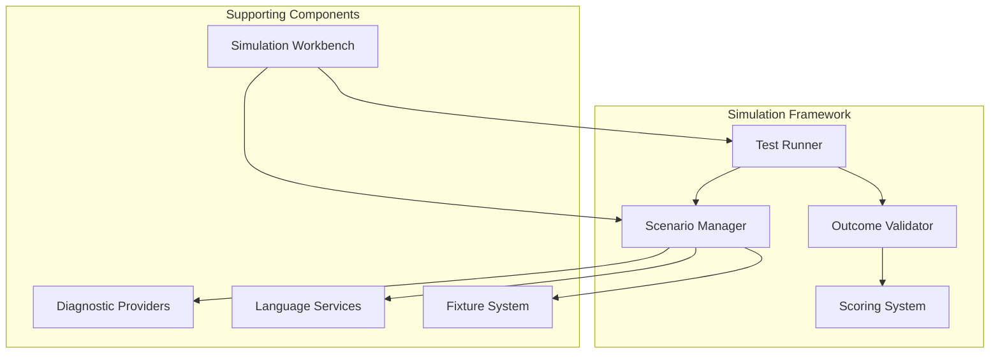
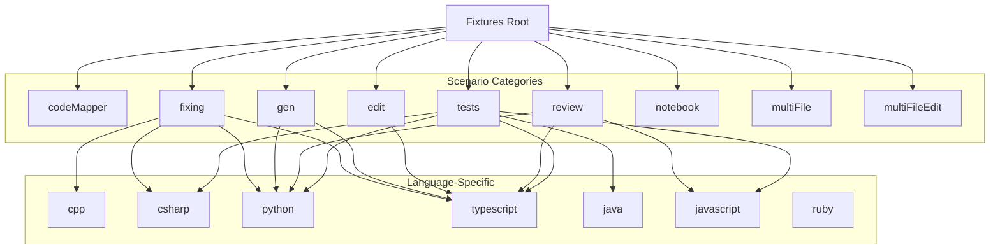
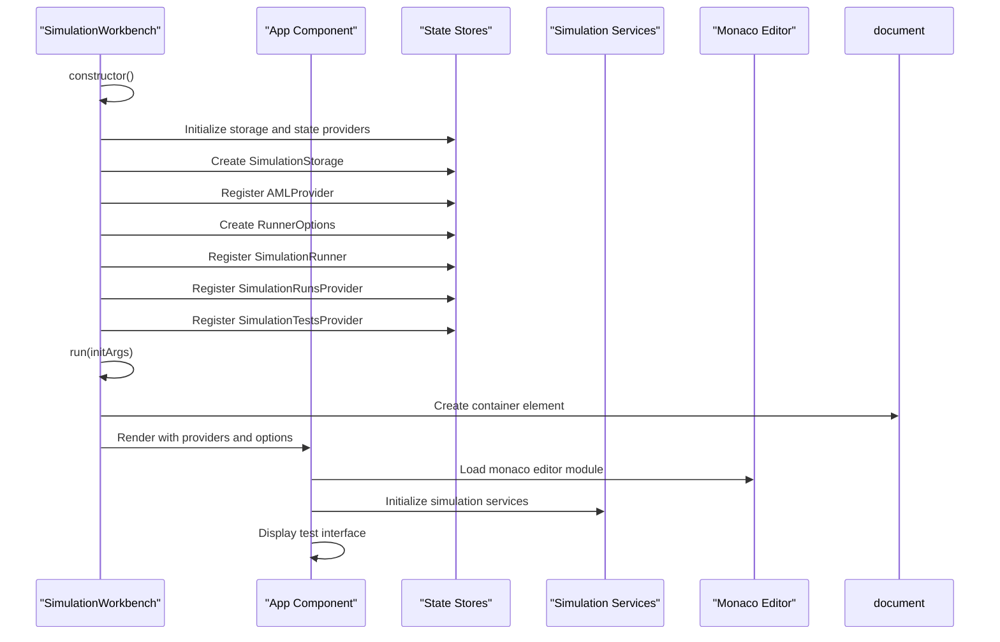
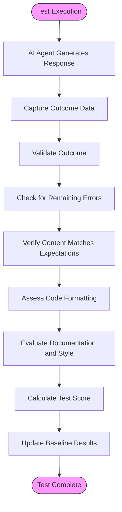

# Simulation Testing

<cite>
**Referenced Files in This Document**   
- [types.ts](file://test/simulation/types.ts)
- [simulationTestProvider.ts](file://test/simulation/simulationTestProvider.ts)
- [index.ts](file://test/simulation/diagnosticProviders/index.ts)
- [utils.ts](file://test/simulation/diagnosticProviders/utils.ts)
- [simulationWorkbench.tsx](file://test/simulation/workbench/simulationWorkbench.tsx)
- [outcomeValidators.ts](file://test/simulation/outcomeValidators.ts)
- [setupTests.stest.ts](file://test/simulation/setupTests.stest.ts)
- [testSnapshot.ts](file://test/simulation/testSnapshot.ts)
- [baseline.json](file://test/simulation/baseline.json)
- [simulationLanguageFeatureService.ts](file://test/simulation/language/simulationLanguageFeatureService.ts)
- [fixtures/codeMapper/index.ts](file://test/simulation/fixtures/codeMapper/index.ts)
</cite>

## Table of Contents
1. [Introduction](#introduction)
2. [Simulation Framework Architecture](#simulation-framework-architecture)
3. [Diagnostic Providers](#diagnostic-providers)
4. [Test Fixtures System](#test-fixtures-system)
5. [Simulation Workbench](#simulation-workbench)
6. [Outcome Validation and Scoring](#outcome-validation-and-scoring)
7. [Creating New Simulation Scenarios](#creating-new-simulation-scenarios)
8. [Handling Non-Deterministic AI Responses](#handling-non-deterministic-ai-responses)
9. [Conclusion](#conclusion)

## Introduction

Simulation testing in GitHub Copilot Chat provides a controlled environment for evaluating AI agent behavior across complex coding scenarios. Unlike traditional testing methods, simulation tests create reproducible conditions that allow for thorough examination of AI responses to various programming challenges, including error fixing, code generation, and refactoring tasks across multiple languages. The simulation framework enables testing of multi-step agent workflows and validates performance through comprehensive scoring mechanisms. This documentation explains the architecture and components of the simulation testing system, focusing on how it addresses the challenges of testing non-deterministic AI behaviors in software development contexts.

**Section sources**
- [types.ts](file://test/simulation/types.ts#L1-L136)
- [simulationTestProvider.ts](file://test/simulation/simulationTestProvider.ts#L1-L64)

## Simulation Framework Architecture

The simulation testing framework is organized within the `test/simulation/` directory and consists of several key components that work together to create a comprehensive testing environment. The architecture follows a modular design with distinct responsibilities for test execution, diagnostic analysis, and outcome validation.

The core of the simulation framework is built around the concept of controlled test scenarios that simulate real-world coding situations. These scenarios are executed in isolated environments that replicate the VS Code editor context, allowing AI agents to interact with codebases as they would in actual development workflows. The framework supports various test strategies including inline editing, workspace modifications, and conversational interactions, each designed to evaluate different aspects of AI agent capabilities.

At the architectural level, the simulation framework integrates with the extension's service container through dependency injection, allowing access to essential services like caching, workspace management, and language features. The framework leverages caching mechanisms to optimize performance by storing results of expensive operations such as diagnostic computation and TypeScript server interactions. This caching system ensures consistent test results while minimizing execution time, particularly for scenarios that require repeated analysis of the same codebase.



**Diagram sources **
- [types.ts](file://test/simulation/types.ts#L1-L136)
- [simulationTestProvider.ts](file://test/simulation/simulationTestProvider.ts#L1-L64)

**Section sources**
- [types.ts](file://test/simulation/types.ts#L1-L136)
- [simulationTestProvider.ts](file://test/simulation/simulationTestProvider.ts#L1-L64)

## Diagnostic Providers

Diagnostic providers are a critical component of the simulation testing framework, responsible for identifying and reporting code issues across different programming languages. These providers simulate the behavior of language servers and linters, enabling the framework to validate whether AI agents can correctly identify and fix various types of coding errors.

The diagnostic provider system is implemented in the `test/simulation/diagnosticProviders/` directory and follows a modular architecture with specialized providers for different languages and tools. The framework includes providers for TypeScript (tsc), ESLint, Python (pyright, pylint, ruff), C# (roslyn), and C++ compilers, each implementing the same interface for consistency. These providers are accessible through the `KnownDiagnosticProviders` class, which exposes static instances of each provider type.

The diagnostic provider system employs a caching mechanism to optimize performance and ensure consistency across test runs. The `CachingDiagnosticsProvider` abstract class provides a foundation for all diagnostic providers, handling cache key generation, storage, and retrieval. This caching system uses SHA-256 hashes of the input files and provider configuration to create unique cache keys, ensuring that identical codebases produce consistent diagnostic results. The cache is scoped to specific diagnostic tools and salted with version information to prevent conflicts between different provider versions.

```mermaid
classDiagram
class DiagnosticsProvider {
+getDiagnostics(accessor, files) Promise~ITestDiagnostic[]~
}
class CachingDiagnosticsProvider {
-id : string
-cacheSalt : string
-cacheScope : CacheScope
+get cacheVersion() number
+getDiagnostics(accessor, files) Promise~ITestDiagnostic[]~
-computeDiagnostics(files) Promise~ITestDiagnostic[]~
}
class LintingDiagnosticsProvider {
-computeDiagnostics(_files) Promise~ITestDiagnostic[]~
-fetchCommand(temporaryDirectory, filePath) Promise~{command, arguments, env}~
-processDiagnostics(fileName, stdoutResult) ITestDiagnostic[]
}
class TSServerDiagnosticsProvider {
-computeDiagnostics(files) Promise~ITestDiagnostic[]~
}
class EslintDiagnosticsProvider {
-computeDiagnostics(files) Promise~ITestDiagnostic[]~
}
class PyrightDiagnosticsProvider {
-computeDiagnostics(files) Promise~ITestDiagnostic[]~
}
class RoslynDiagnosticsProvider {
-computeDiagnostics(files) Promise~ITestDiagnostic[]~
}
class CppDiagnosticsProvider {
-computeDiagnostics(files) Promise~ITestDiagnostic[]~
}
class RuffDiagnosticsProvider {
-computeDiagnostics(files) Promise~ITestDiagnostic[]~
}
DiagnosticsProvider <|-- CachingDiagnosticsProvider
CachingDiagnosticsProvider <|-- LintingDiagnosticsProvider
CachingDiagnosticsProvider <|-- TSServerDiagnosticsProvider
LintingDiagnosticsProvider <|-- EslintDiagnosticsProvider
LintingDiagnosticsProvider <|-- PyrightDiagnosticsProvider
LintingDiagnosticsProvider <|-- RuffDiagnosticsProvider
CachingDiagnosticsProvider <|-- RoslynDiagnosticsProvider
CachingDiagnosticsProvider <|-- CppDiagnosticsProvider
```

**Diagram sources **
- [index.ts](file://test/simulation/diagnosticProviders/index.ts#L1-L31)
- [utils.ts](file://test/simulation/diagnosticProviders/utils.ts#L1-L121)

**Section sources**
- [index.ts](file://test/simulation/diagnosticProviders/index.ts#L1-L31)
- [utils.ts](file://test/simulation/diagnosticProviders/utils.ts#L1-L121)

## Test Fixtures System

The test fixtures system provides the foundation for creating realistic coding scenarios in simulation tests. Located in the `test/simulation/fixtures/` directory, this system contains a comprehensive collection of code samples and project structures that represent various programming languages, frameworks, and common development patterns. These fixtures serve as the initial state for simulation tests, allowing AI agents to interact with codebases that mimic real-world development environments.

The fixtures are organized in a hierarchical structure by category and language, with directories for specific testing scenarios such as code mapping, error fixing, code generation, and refactoring tasks. Each fixture typically includes one or more source files with intentional errors or incomplete implementations that the AI agent must address. For example, the `fixing/` directory contains subdirectories for different languages (cpp, csharp, python, typescript) with numerous test cases that present specific coding errors for the AI to resolve.

The fixture system supports both simple single-file scenarios and complex multi-file projects, enabling testing of AI capabilities across different levels of complexity. Some fixtures include additional configuration files (package.json, tsconfig.json) to simulate realistic project environments with specific tooling and dependencies. The system also includes specialized fixtures for testing edge cases, such as large files that exceed typical context windows, files with complex syntax patterns, and code with ambiguous error conditions.



**Section sources**
- [fixtures/codeMapper/index.ts](file://test/simulation/fixtures/codeMapper/index.ts#L1-L25)

## Simulation Workbench

The simulation workbench is a dedicated testing environment that provides a visual interface for running and analyzing simulation tests. Implemented in the `test/simulation/workbench/` directory, the workbench serves as both a development tool for creating new test scenarios and a diagnostic tool for analyzing AI agent behavior. The workbench is built using React and integrates with Electron to provide a desktop application experience.

The workbench architecture follows a component-based design with a central `SimulationWorkbench` class that manages the application lifecycle and coordinates between various subsystems. Key components include the `App` component for the main user interface, stores for managing application state (simulation runs, test sources, runner options), and services for interacting with the simulation framework. The workbench leverages Monaco Editor for code display and editing, providing a familiar development environment for test authors and analysts.

The workbench initialization process involves loading configuration from command-line arguments, setting up the simulation environment, and rendering the user interface. It communicates with the simulation framework through a combination of direct API calls and event-driven interactions. The workbench supports multiple test sources, including local files and remote datasets, and provides options for configuring test execution parameters such as model selection, temperature settings, and maximum token limits.



**Diagram sources **
- [simulationWorkbench.tsx](file://test/simulation/workbench/simulationWorkbench.tsx#L1-L103)

**Section sources**
- [simulationWorkbench.tsx](file://test/simulation/workbench/simulationWorkbench.tsx#L1-L103)

## Outcome Validation and Scoring

Outcome validation and scoring are essential components of the simulation testing framework, providing mechanisms to evaluate the quality and correctness of AI agent responses. The framework uses a comprehensive system of validators and scoring metrics to assess whether AI-generated code modifications meet the required standards for correctness, style, and functionality.

The validation system is implemented in `outcomeValidators.ts` and includes a variety of assertion functions for different types of code quality checks. These validators can verify the presence of specific code patterns, check for the absence of diagnostic errors, validate JSON structure, and ensure proper documentation formatting. The system also includes specialized validators for checking indentation consistency, ensuring that AI-generated code adheres to the expected formatting style of the target language.

The scoring mechanism is based on a baseline system that tracks the historical performance of AI agents across different test scenarios. The `baseline.json` file contains aggregated results from multiple test runs, including pass/fail counts and calculated scores for each test case. This baseline data enables the framework to identify regressions and measure improvements in AI agent performance over time. Each test scenario is assigned a score between 0 and 1, with 1 indicating perfect performance across all test runs.



**Section sources**
- [outcomeValidators.ts](file://test/simulation/outcomeValidators.ts#L1-L198)
- [baseline.json](file://test/simulation/baseline.json#L1-L800)

## Creating New Simulation Scenarios

Creating new simulation scenarios involves defining test cases that evaluate specific AI capabilities in controlled coding environments. The process begins with selecting or creating appropriate fixtures that represent the target coding scenario, followed by defining the expected interactions and validation criteria. The framework provides a structured approach to scenario creation through the use of scenario definitions and query specifications.

A simulation scenario is defined using the `IScenario` interface, which can be implemented as either a `IDeserializedWorkspaceStateBasedScenario` or an `IFileBasedScenario`. The scenario includes a series of queries that represent user interactions with the AI agent, along with validation functions that verify the correctness of the agent's responses. Each query specifies the context (active file, selection range, visible ranges) and the user input (query text), along with expected outcomes and diagnostic requirements.

The scenario creation process typically follows these steps: first, identify the AI capability to be tested (e.g., error fixing, code generation, refactoring); second, select or create fixture files that contain appropriate code examples; third, define the sequence of user queries that will trigger the desired AI behavior; fourth, implement validation functions that verify the correctness of the AI's responses; and finally, integrate the scenario into the test suite and establish baseline performance metrics.

```mermaid
classDiagram
class IScenario {
+queries : IScenarioQuery[]
+extraWorkspaceSetup? : (workspace) => void | Promise~void~
+onBeforeStart? : (accessor) => void | Promise~void~
}
class IDeserializedWorkspaceStateBasedScenario {
+workspaceState : IDeserializedWorkspaceState
+scenarioFolderPath? : string
}
class IFileBasedScenario {
+files : IFile[]
+workspaceFolders? : Uri[]
}
class IScenarioQuery {
+file? : string | Uri
+activeCell? : number
+selection? : [number, number, number, number] | [number, number]
+visibleRanges? : ([number, number, number, number] | [number, number])[]
+wholeRange? : [number, number, number, number] | [number, number]
+query : string
+expectedIntent? : string | undefined
+validate(outcome, workspace, accessor) : void | Promise~void~
+diagnostics? : IScenarioDiagnostic[] | DiagnosticProviderId
+fileIndentInfo? : FormattingOptions
+promptReferences? : IScenarioPromptReference[]
}
class IOutcome {
+type : 'inlineEdit' | 'workspaceEdit' | 'conversational' | 'error' | 'none'
+chatResponseMarkdown : string
+annotations : OutcomeAnnotation[]
}
class IInlineEditOutcome {
+appliedEdits : IInlineEdit[]
+originalFileContents : string
+fileContents : string
+initialDiagnostics? : ResourceMap~Diagnostic[]~
}
class IWorkspaceEditOutcome {
+files : IFile[] | {srcUri : string; post : string}[]
+edits : WorkspaceEdit
}
class IConversationalOutcome {
}
class IErrorOutcome {
+errorDetails : ChatErrorDetails
}
class IEmptyOutcome {
}
IScenario <|-- IDeserializedWorkspaceStateBasedScenario
IScenario <|-- IFileBasedScenario
IScenarioQuery --> IOutcome
IOutcome <|-- IInlineEditOutcome
IOutcome <|-- IWorkspaceEditOutcome
IOutcome <|-- IConversationalOutcome
IOutcome <|-- IErrorOutcome
IOutcome <|-- IEmptyOutcome
```

**Section sources**
- [types.ts](file://test/simulation/types.ts#L1-L136)
- [setupTests.stest.ts](file://test/simulation/setupTests.stest.ts#L1-L106)

## Handling Non-Deterministic AI Responses

The simulation testing framework addresses the challenge of non-deterministic AI responses through a combination of statistical analysis, comprehensive validation, and robust scoring mechanisms. Since AI agents can produce different outputs for the same input due to factors like temperature settings and random sampling, the framework employs multiple test runs and aggregation techniques to provide reliable performance metrics.

The primary approach to handling non-determinism is through repeated testing and statistical analysis. Each test scenario is executed multiple times (typically 10 runs as indicated in the baseline data), and the results are aggregated to calculate a performance score. This score represents the percentage of successful runs, providing a more accurate assessment of AI reliability than single-run tests. The framework also includes mechanisms for identifying and categorizing different types of failures, allowing developers to distinguish between consistent issues and occasional outliers.

To ensure consistent test conditions, the framework uses deterministic initialization where possible, including fixed random seeds and cached external dependencies. The caching system plays a crucial role in maintaining consistency by ensuring that expensive operations like diagnostic computation and language server interactions produce identical results across test runs. Additionally, the framework includes tolerance mechanisms for acceptable variations in AI output, such as allowing for equivalent code transformations that maintain functionality while differing in implementation details.

**Section sources**
- [baseline.json](file://test/simulation/baseline.json#L1-L800)
- [testSnapshot.ts](file://test/simulation/testSnapshot.ts#L1-L66)

## Conclusion

The simulation testing framework for GitHub Copilot Chat provides a comprehensive environment for evaluating AI agent behavior in realistic coding scenarios. By combining controlled test environments, specialized diagnostic providers, and robust validation mechanisms, the framework enables thorough assessment of AI capabilities across multiple programming languages and development tasks. The system's modular architecture supports extensibility, allowing new test scenarios and validation criteria to be added as AI capabilities evolve. Through statistical analysis and baseline tracking, the framework provides reliable metrics for measuring AI performance and identifying areas for improvement, ultimately contributing to the development of more effective and reliable AI-assisted coding tools.