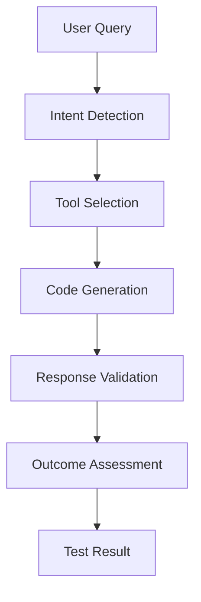
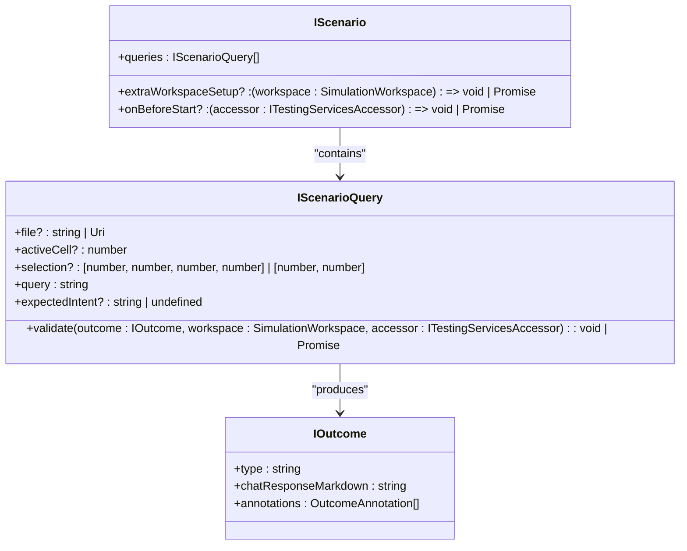
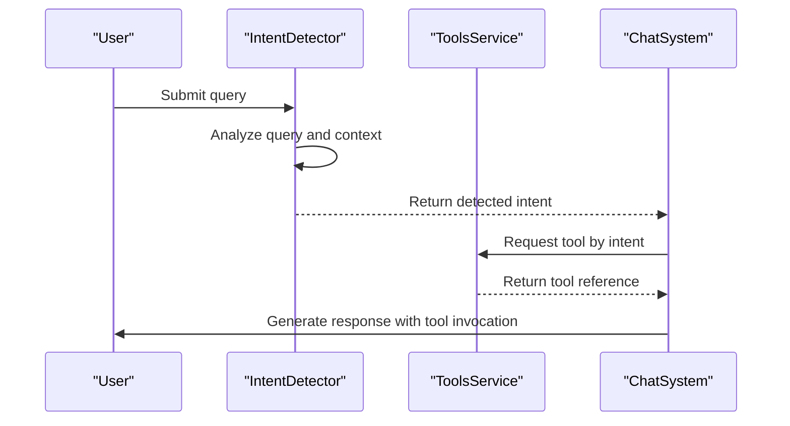

# Testing Strategy

<cite>
**Referenced Files in This Document**   
- [test/e2e/edit.stest.ts](file://test/e2e/edit.stest.ts)
- [test/simulation/notebooks.stest.ts](file://test/simulation/notebooks.stest.ts)
- [test/intent/intentTest.ts](file://test/intent/intentTest.ts)
- [test/base/stest.ts](file://test/base/stest.ts)
- [test/simulation/outcomeValidators.ts](file://test/simulation/outcomeValidators.ts)
- [test/simulation/types.ts](file://test/simulation/types.ts)
- [test/simulation/simulationTestProvider.ts](file://test/simulation/simulationTestProvider.ts)
- [test/e2e/testHelper.ts](file://test/e2e/testHelper.ts)
- [test/simulation/setupTests.stest.ts](file://test/simulation/setupTests.stest.ts)
- [chat-lib/vitest.config.ts](file://chat-lib/vitest.config.ts)
- [CODE_OF_CONDUCT.md](file://CODE_OF_CONDUCT.md)
- [CODEQL.yml](file://CODEQL.yml)
</cite>

## Table of Contents
1. [Introduction](#introduction)
2. [Testing Framework and Configuration](#testing-framework-and-configuration)
3. [Unit Testing](#unit-testing)
4. [Integration Testing](#integration-testing)
5. [End-to-End Testing](#end-to-end-testing)
6. [Simulation Testing](#simulation-testing)
7. [Intent and Tool Execution Testing](#intent-and-tool-execution-testing)
8. [AI Feature Testing Challenges and Strategies](#ai-feature-testing-challenges-and-strategies)
9. [Test Automation and CI/CD Pipeline](#test-automation-and-cicd-pipeline)
10. [Best Practices for Testing AI-Driven Features](#best-practices-for-testing-ai-driven-features)
11. [Conclusion](#conclusion)

## Introduction
GitHub Copilot Chat employs a comprehensive, multi-layered testing strategy to ensure the reliability, accuracy, and quality of its AI-driven features. The testing approach encompasses unit tests, integration tests, end-to-end (E2E) tests, and specialized simulation tests that validate the system's behavior under realistic conditions. This document details the testing frameworks, methodologies, and patterns used across the codebase, with a focus on how the team addresses the unique challenges of testing non-deterministic AI outputs and complex conversational workflows. The strategy is designed to validate both functional correctness and user experience across various interaction modes, including inline chat, panel-based conversations, and notebook environments.

## Testing Framework and Configuration
The GitHub Copilot Chat codebase utilizes Vitest as its primary testing framework, configured to support both unit and integration testing scenarios. The framework is set up to include test files with the `.spec.ts` and `.spec.tsx` extensions while excluding node_modules, dist, and other temporary directories. Tests run in a Node.js environment with global variables enabled, allowing for seamless integration with the extension's services and APIs. The configuration also supports environment variable loading, enabling flexible test setup across different environments. This foundation provides a robust platform for executing various test types, from simple unit tests to complex simulation scenarios that mimic real-world user interactions.

**Section sources**
- [chat-lib/vitest.config.ts](file://chat-lib/vitest.config.ts)

## Unit Testing
Unit testing in the GitHub Copilot Chat codebase focuses on validating individual components and functions in isolation. The tests are organized by feature area and typically reside in `test` directories adjacent to the code they test. For example, unit tests for the inline edit functionality are located in `src/extension/inlineEdits/test/`, while agent-related tests are found in `src/extension/agents/claude/node/test/`. These tests verify the correctness of specific algorithms, data transformations, and business logic, ensuring that each component behaves as expected under various conditions. The use of mocking and dependency injection allows for thorough testing of complex interactions without relying on external systems.

**Section sources**
- [src/extension/inlineEdits/test/common/editRebase.spec.ts](file://src/extension/inlineEdits/test/common/editRebase.spec.ts)
- [src/extension/agents/claude/node/test/claudeCodeAgent.spec.ts](file://src/extension/agents/claude/node/test/claudeCodeAgent.spec.ts)

## Integration Testing
Integration testing ensures that different components of the system work together correctly. The codebase includes integration tests for various features, such as the codebase tool, file reading operations, and diagnostic providers. These tests validate the interactions between services, such as the intent service, tools service, and workspace services, ensuring that data flows correctly through the system. Integration tests often use real or simulated workspace states to verify that components can handle realistic data and edge cases. The tests are designed to catch issues that might not be apparent in unit tests, such as incorrect data serialization or improper error handling across service boundaries.

**Section sources**
- [test/e2e/edit.stest.ts](file://test/e2e/edit.stest.ts)
- [test/simulation/notebooks.stest.ts](file://test/simulation/notebooks.stest.ts)

## End-to-End Testing
End-to-end (E2E) testing in GitHub Copilot Chat validates complete user workflows from input to output. The E2E tests are organized in the `test/e2e/` directory and cover various scenarios, including code editing, explanation generation, notebook interactions, and terminal commands. Each test simulates a user query and verifies the system's response against expected outcomes. For example, the `edit.stest.ts` file contains tests that validate the system's ability to generate correct code edits without reading unnecessary files or performing irrelevant semantic searches. The tests use a structured approach with clear descriptions, setup functions, and validation logic to ensure comprehensive coverage of key functionality.

**Diagram sources**
- [test/e2e/edit.stest.ts](file://test/e2e/edit.stest.ts)
- [test/e2e/explain.stest.ts](file://test/e2e/explain.stest.ts)

**Section sources**
- [test/e2e/edit.stest.ts](file://test/e2e/edit.stest.ts)
- [test/e2e/explain.stest.st](file://test/e2e/explain.stest.ts)

## Simulation Testing
Simulation testing is a core component of the GitHub Copilot Chat testing strategy, designed to validate complex, multi-step interactions in a controlled environment. The simulation tests are organized in the `test/simulation/` directory and use a sophisticated framework to simulate user interactions with the chat interface. These tests can validate various aspects of the system, including inline editing, code generation, error fixing, and notebook interactions. The simulation framework supports different test strategies, such as Edits, Edits2, Inline, InlineChatIntent, and Agent modes, allowing for comprehensive testing of different interaction patterns. The tests use predefined scenarios with specific workspace states, queries, and expected outcomes to ensure consistent and repeatable results.

**Diagram sources**
- [test/simulation/types.ts](file://test/simulation/types.ts)
- [test/simulation/notebooks.stest.ts](file://test/simulation/notebooks.stest.ts)

**Section sources**
- [test/simulation/types.ts](file://test/simulation/types.ts)
- [test/simulation/notebooks.stest.ts](file://test/simulation/notebooks.stest.ts)

## Intent and Tool Execution Testing
Testing intent handling and tool execution is critical for ensuring that GitHub Copilot Chat correctly interprets user queries and selects appropriate actions. The intent testing framework, implemented in `test/intent/intentTest.ts`, validates that the system can accurately detect user intents based on their queries and context. Tests cover various scenarios, including generic queries, command-based interactions, and location-specific intents (e.g., panel, editor, terminal). The framework uses a combination of predefined scenarios and dynamic intent detection to verify that the system responds appropriately to different types of input. Tool execution tests validate that the correct tools are invoked with the right parameters and that their outputs are properly integrated into the conversation flow.

**Diagram sources**
- [test/intent/intentTest.ts](file://test/intent/intentTest.ts)
- [test/e2e/tools.stest.ts](file://test/e2e/tools.stest.ts)

**Section sources**
- [test/intent/intentTest.ts](file://test/intent/intentTest.ts)
- [test/e2e/tools.stest.ts](file://test/e2e/tools.stest.ts)

## AI Feature Testing Challenges and Strategies
Testing AI-driven features presents unique challenges due to the non-deterministic nature of language model outputs and the complexity of conversational workflows. The GitHub Copilot Chat team addresses these challenges through several strategies:
- **Outcome validation**: Instead of testing exact outputs, tests validate that responses meet specific criteria, such as containing required code snippets or resolving errors.
- **Diagnostic validation**: Tests verify that code edits eliminate specific errors by checking for the absence of diagnostic messages from language servers.
- **Context preservation**: Tests ensure that generated code maintains proper indentation, formatting, and context, using validators that check for consistent code structure.
- **Elided code detection**: Tests validate that generated responses do not contain markers for elided code, ensuring complete and usable outputs.
- **Multi-step validation**: Complex scenarios are broken down into multiple validation steps, allowing for comprehensive testing of conversational flows.

These strategies enable the team to maintain high-quality standards while accommodating the inherent variability of AI-generated content.

**Section sources**
- [test/simulation/outcomeValidators.ts](file://test/simulation/outcomeValidators.ts)
- [test/simulation/types.ts](file://test/simulation/types.ts)

## Test Automation and CI/CD Pipeline
The test automation and CI/CD pipeline for GitHub Copilot Chat is configured through the `CodeQL.yml` file, which defines the workflow for running security and quality checks. The pipeline integrates with GitHub Actions to automatically execute tests on code changes, ensuring that new contributions meet the project's quality standards. The workflow includes steps for setting up the testing environment, installing dependencies, and running various test suites. CodeQL analysis is used to identify security vulnerabilities and code quality issues, providing an additional layer of validation beyond functional testing. The pipeline is designed to provide rapid feedback to developers while maintaining a high level of confidence in the codebase's reliability and security.

**Section sources**
- [CODEQL.yml](file://CODEQL.yml)

## Best Practices for Testing AI-Driven Features
Based on the GitHub Copilot Chat codebase, several best practices emerge for testing AI-driven features:
- **Use simulation frameworks**: Create realistic test environments that mimic user interactions and workspace states.
- **Validate outcomes, not outputs**: Focus on verifying that responses meet functional requirements rather than matching exact text.
- **Leverage diagnostic tools**: Use language server diagnostics to validate code quality and correctness.
- **Test edge cases**: Include scenarios with ambiguous queries, incomplete context, and error conditions.
- **Maintain test isolation**: Use dependency injection and mocking to isolate components and ensure reliable test results.
- **Document test scenarios**: Provide clear descriptions and expectations for each test to facilitate maintenance and understanding.
- **Use consistent validation patterns**: Implement reusable validation functions to ensure consistency across tests.

These practices help ensure that AI-driven features are thoroughly tested and reliable in real-world usage scenarios.

**Section sources**
- [test/base/stest.ts](file://test/base/stest.ts)
- [test/simulation/outcomeValidators.ts](file://test/simulation/outcomeValidators.ts)

## Conclusion
The testing strategy for GitHub Copilot Chat demonstrates a comprehensive and sophisticated approach to validating AI-driven features. By combining unit, integration, end-to-end, and simulation testing, the team ensures that the system functions correctly across various scenarios and interaction patterns. The use of Vitest as the primary testing framework, combined with custom simulation tools and validation utilities, provides a robust foundation for maintaining high-quality standards. The focus on outcome validation, diagnostic checking, and context preservation addresses the unique challenges of testing non-deterministic AI outputs. The integration of test automation and CI/CD pipelines ensures that quality is maintained throughout the development process. This multi-layered testing approach enables the team to deliver a reliable and effective AI-powered coding assistant that meets the needs of developers in diverse programming environments.