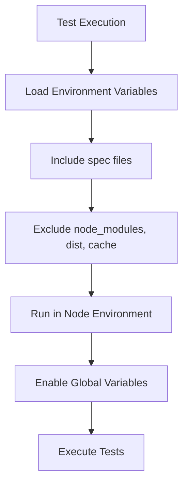
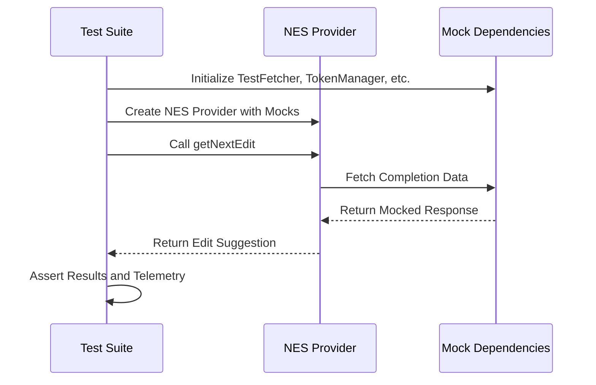
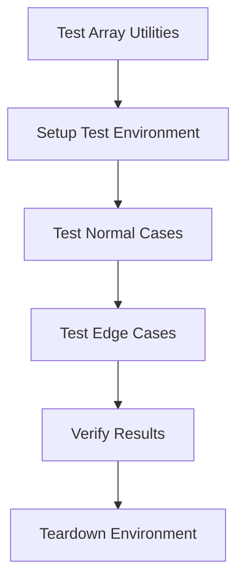
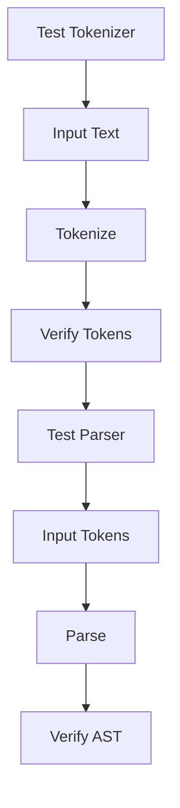
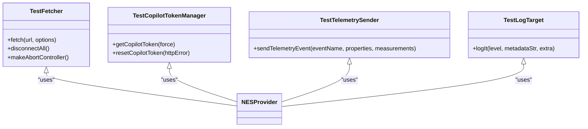

# Unit Testing

<cite>
**Referenced Files in This Document**   
- [package.json](file://package.json)
- [vitest.config.ts](file://vitest.config.ts)
- [chat-lib/package.json](file://chat-lib/package.json)
- [chat-lib/test/nesProvider.spec.ts](file://chat-lib/test/nesProvider.spec.ts)
- [src/util/common/test/testUtils.ts](file://src/util/common/test/testUtils.ts)
- [src/util/common/test/async.spec.ts](file://src/util/common/test/async.spec.ts)
- [src/util/common/test/notebooks.spec.ts](file://src/util/common/test/notebooks.spec.ts)
- [src/util/common/arrays.ts](file://src/util/common/arrays.ts)
- [src/util/common/async.ts](file://src/util/common/async.ts)
- [src/util/common/notebooks.ts](file://src/util/common/notebooks.ts)
- [src/extension/byok/common/test/geminiMessageConverter.spec.ts](file://src/extension/byok/common/test/geminiMessageConverter.spec.ts)
- [src/extension/byok/common/test/anthropicMessageConverter.spec.ts](file://src/extension/byok/common/test/anthropicMessageConverter.spec.ts)
- [src/extension/parser/test/node/tokenizer.spec.ts](file://src/extension/parser/test/node/tokenizer.spec.ts)
- [src/extension/parser/test/node/parser.spec.ts](file://src/extension/parser/test/node/parser.spec.ts)
- [src/extension/test/testUtils.ts](file://src/extension/test/testUtils.ts)
</cite>

## Table of Contents
1. [Introduction](#introduction)
2. [Testing Framework Configuration](#testing-framework-configuration)
3. [Core Testing Patterns](#core-testing-patterns)
4. [Testing Utility Functions](#testing-utility-functions)
5. [AI-Related Utility Testing](#ai-related-utility-testing)
6. [Test Isolation and Dependency Management](#test-isolation-and-dependency-management)
7. [Best Practices and Patterns](#best-practices-and-patterns)
8. [Conclusion](#conclusion)

## Introduction

Unit testing in the GitHub Copilot Chat codebase serves to isolate and verify individual functions, classes, and modules, ensuring the reliability and correctness of the AI-powered features. The testing strategy focuses on validating pure functions, stateless components, and utility functions across various directories, with a particular emphasis on AI-related utilities such as tokenizers, parsers, and response processing functions. The codebase employs Vitest as the primary testing framework, leveraging its capabilities for efficient and comprehensive test execution. This documentation provides an in-depth exploration of the unit testing practices, configurations, and patterns used in the project, offering guidance on writing effective test cases and managing dependencies.

**Section sources**
- [package.json](file://package.json)
- [chat-lib/package.json](file://chat-lib/package.json)

## Testing Framework Configuration

The GitHub Copilot Chat project utilizes Vitest as its testing framework, configured through the `vitest.config.ts` file in the `chat-lib` directory. The configuration specifies that test files should include those with the `.spec.ts` or `.spec.tsx` extensions and excludes files in `node_modules`, `dist`, and various cache directories. The testing environment is set to 'node', and global variables are enabled to facilitate testing. The `loadEnv` function is used to load environment variables, ensuring that tests can access necessary configuration settings. This setup allows for a streamlined testing process, enabling developers to run tests efficiently and with minimal configuration overhead.

**Diagram sources **
- [chat-lib/vitest.config.ts](file://chat-lib/vitest.config.ts)

**Section sources**
- [chat-lib/vitest.config.ts](file://chat-lib/vitest.config.ts)
- [chat-lib/package.json](file://chat-lib/package.json)

## Core Testing Patterns

The codebase demonstrates several core testing patterns, particularly in the `chat-lib/test/nesProvider.spec.ts` file, which tests the Next Edit Suggestion (NES) provider. The test setup involves creating mock implementations for dependencies such as `TestFetcher`, `TestCopilotTokenManager`, `TestTelemetrySender`, and `TestLogTarget`. These mocks allow for isolated testing of the NES provider's functionality, ensuring that external dependencies do not affect the test outcomes. The use of `describe` and `it` blocks from Vitest provides a clear structure for organizing tests, with each `it` block representing a specific test case. Assertions are made using `assert` and `expect` to verify the expected behavior of the code under test.

**Diagram sources **
- [chat-lib/test/nesProvider.spec.ts](file://chat-lib/test/nesProvider.spec.ts)

**Section sources**
- [chat-lib/test/nesProvider.spec.ts](file://chat-lib/test/nesProvider.spec.ts)

## Testing Utility Functions

The `src/util/common` directory contains a variety of utility functions that are extensively tested. For example, the `arrays.ts` file includes functions for array manipulation, which are tested in corresponding `.spec.ts` files. The testing approach for these utilities involves creating test cases that cover various input scenarios, including edge cases, to ensure robustness. The use of `beforeEach` and `afterEach` hooks in Vitest allows for setup and teardown of test environments, ensuring that each test runs in isolation. Additionally, the `testUtils.ts` file provides helper functions such as `ensureNoDisposablesAreLeakedInTestSuite`, which helps in managing disposable resources and preventing memory leaks during testing.

**Diagram sources **
- [src/util/common/test/testUtils.ts](file://src/util/common/test/testUtils.ts)
- [src/util/common/arrays.ts](file://src/util/common/arrays.ts)

**Section sources**
- [src/util/common/test/testUtils.ts](file://src/util/common/test/testUtils.ts)
- [src/util/common/test/async.spec.ts](file://src/util/common/test/async.spec.ts)
- [src/util/common/test/notebooks.spec.ts](file://src/util/common/test/notebooks.spec.ts)

## AI-Related Utility Testing

AI-related utilities, such as tokenizers and parsers, are critical components of the Copilot Chat system and are rigorously tested. The `src/extension/parser/test/node/tokenizer.spec.ts` and `src/extension/parser/test/node/parser.spec.ts` files contain tests for the tokenizer and parser functionalities, respectively. These tests ensure that the tokenizer correctly processes input text into tokens and that the parser accurately constructs abstract syntax trees from the tokenized input. Mocking is used extensively to simulate different input scenarios and to verify the output against expected results. The tests also cover error handling, ensuring that the utilities can gracefully handle malformed input.

**Diagram sources **
- [src/extension/parser/test/node/tokenizer.spec.ts](file://src/extension/parser/test/node/tokenizer.spec.ts)
- [src/extension/parser/test/node/parser.spec.ts](file://src/extension/parser/test/node/parser.spec.ts)

**Section sources**
- [src/extension/byok/common/test/geminiMessageConverter.spec.ts](file://src/extension/byok/common/test/geminiMessageConverter.spec.ts)
- [src/extension/byok/common/test/anthropicMessageConverter.spec.ts](file://src/extension/byok/common/test/anthropicMessageConverter.spec.ts)

## Test Isolation and Dependency Management

Effective test isolation is achieved through the use of mocks and stubs, which replace external dependencies with controlled implementations. For instance, the `TestFetcher` class in `nesProvider.spec.ts` simulates network requests by returning predefined responses, allowing the NES provider to be tested without actual network calls. Similarly, the `TestCopilotTokenManager` provides a fixed token for authentication, eliminating the need for real token retrieval. This approach ensures that tests are deterministic and not affected by external factors such as network latency or authentication issues. The use of dependency injection further enhances testability by allowing different implementations to be injected based on the testing context.

**Diagram sources **
- [chat-lib/test/nesProvider.spec.ts](file://chat-lib/test/nesProvider.spec.ts)

**Section sources**
- [chat-lib/test/nesProvider.spec.ts](file://chat-lib/test/nesProvider.spec.ts)
- [src/extension/test/testUtils.ts](file://src/extension/test/testUtils.ts)

## Best Practices and Patterns

The codebase adheres to several best practices in unit testing, including the use of descriptive test names, comprehensive coverage of edge cases, and the avoidance of test duplication. The `ensureNoDisposablesAreLeakedInTestSuite` function ensures that all disposable resources are properly cleaned up after each test, preventing memory leaks. The use of `sinon` for stubbing and spying allows for detailed verification of function calls and their arguments. Additionally, the project leverages snapshot testing, as seen in the `toMatchInlineSnapshot` assertion, to verify the output of functions against previously recorded snapshots, making it easier to detect unintended changes.

**Section sources**
- [src/util/common/test/testUtils.ts](file://src/util/common/test/testUtils.ts)
- [src/util/common/test/async.spec.ts](file://src/util/common/test/async.spec.ts)

## Conclusion

The unit testing strategy in the GitHub Copilot Chat codebase is comprehensive and well-structured, focusing on isolating and verifying individual components through the use of Vitest and various mocking techniques. The emphasis on testing utility functions and AI-related utilities ensures the reliability of core functionalities, while best practices such as test isolation and resource management contribute to the overall quality of the codebase. By following these patterns and practices, developers can maintain a high level of confidence in the correctness and robustness of the software.