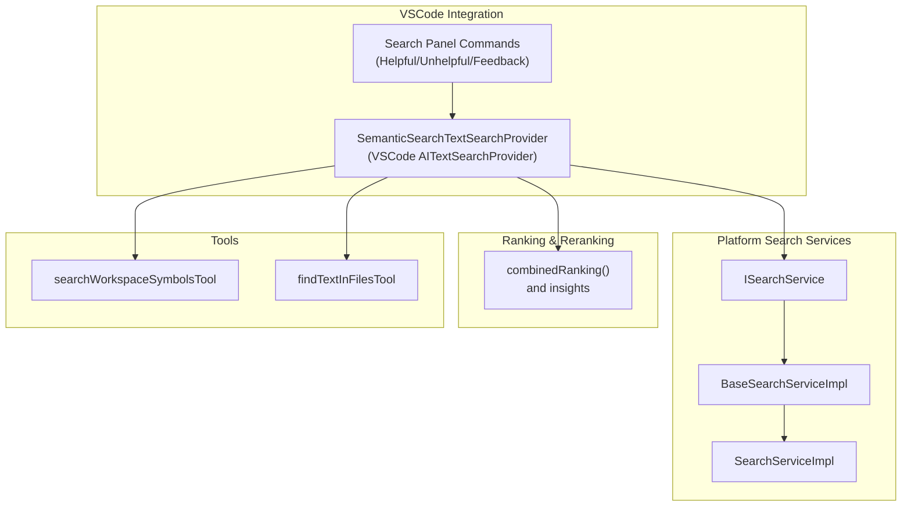
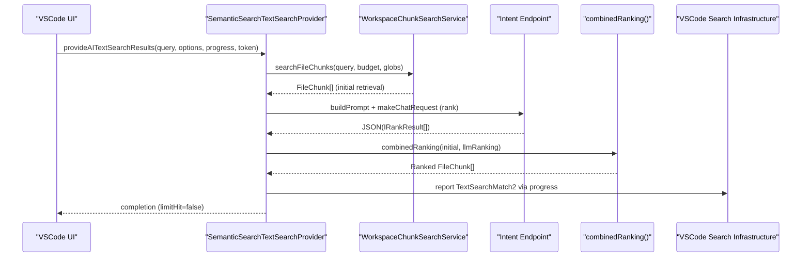
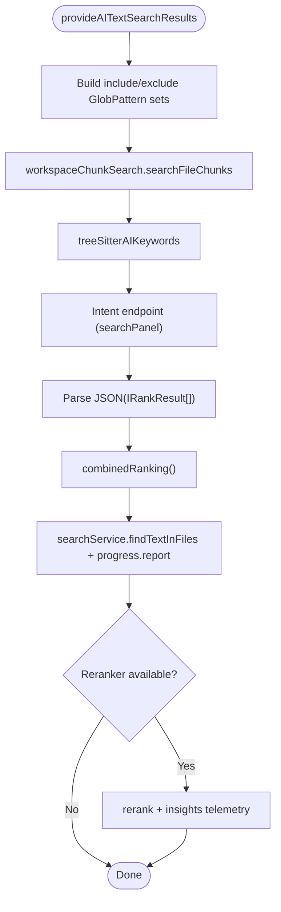
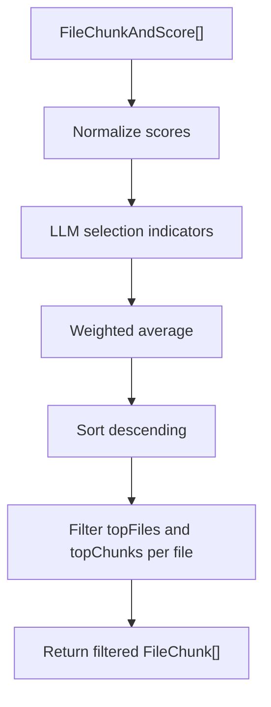
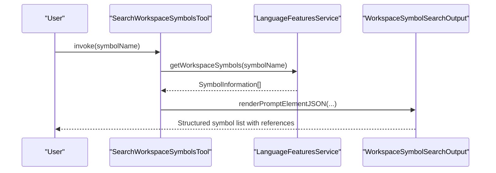
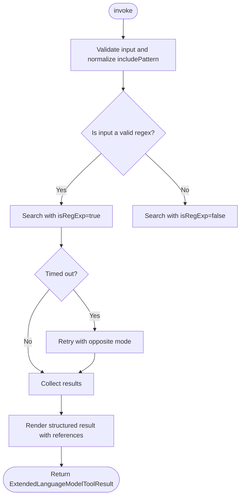
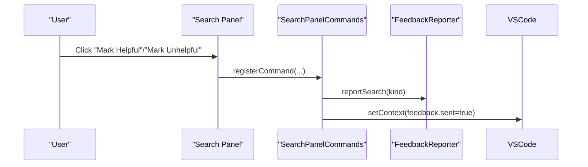
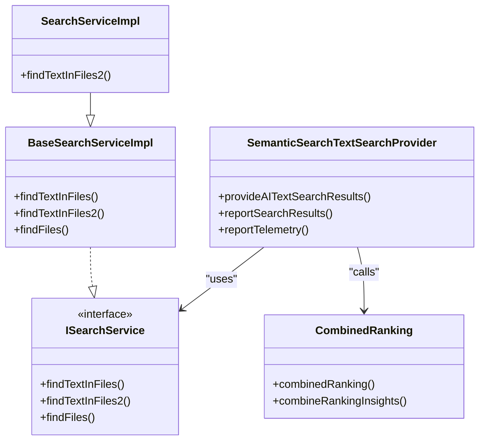

# Code Search & Navigation Tools

<cite>
**Referenced Files in This Document**
- [semanticSearchTextSearchProvider.ts](file://src/extension/workspaceSemanticSearch/node/semanticSearchTextSearchProvider.ts)
- [combinedRank.ts](file://src/extension/workspaceSemanticSearch/node/combinedRank.ts)
- [searchWorkspaceSymbolsTool.tsx](file://src/extension/tools/node/searchWorkspaceSymbolsTool.tsx)
- [findTextInFilesTool.tsx](file://src/extension/tools/node/findTextInFilesTool.tsx)
- [commands.ts](file://src/extension/search/vscode-node/commands.ts)
- [searchIntent.ts](file://src/extension/intents/node/searchIntent.ts)
- [searchService.ts](file://src/platform/search/common/searchService.ts)
- [baseSearchServiceImpl.ts](file://src/platform/search/vscode/baseSearchServiceImpl.ts)
- [searchServiceImpl.ts](file://src/platform/search/vscode-node/searchServiceImpl.ts)
- [semanticSearchView.stest.ts](file://test/e2e/semanticSearchView.stest.ts)
</cite>

## Table of Contents
1. [Introduction](#introduction)
2. [Project Structure](#project-structure)
3. [Core Components](#core-components)
4. [Architecture Overview](#architecture-overview)
5. [Detailed Component Analysis](#detailed-component-analysis)
6. [Dependency Analysis](#dependency-analysis)
7. [Performance Considerations](#performance-considerations)
8. [Troubleshooting Guide](#troubleshooting-guide)
9. [Conclusion](#conclusion)
10. [Appendices](#appendices)

## Introduction
This document explains the code search and navigation tools that enable intelligent workspace exploration in the repository. It focuses on three primary capabilities:
- codebaseTool: a semantic search provider that retrieves and ranks relevant code chunks across the workspace and integrates with VSCode’s search infrastructure.
- searchWorkspaceSymbolsTool: a symbol-based navigation tool that queries workspace symbols and renders concise results.
- findTextInFilesTool: a content-based search tool that performs literal or regular-expression searches across files with robust result formatting and safety controls.

The document covers integration with VSCode’s search providers, ranking algorithms, result reporting, context preservation, search view integration, filtering, navigation, and performance optimization strategies for large codebases.

## Project Structure
The search and navigation features are implemented across several layers:
- Extension-level tools and providers that integrate with VSCode’s AI and search APIs.
- Platform-level search services that abstract VSCode workspace search and file enumeration.
- Ranking and reranking utilities that combine retrieval scores with LLM-driven selection.
- E2E tests that exercise semantic search via the VSCode AITextSearchProvider interface.

**Diagram sources**
- [semanticSearchTextSearchProvider.ts](file://src/extension/workspaceSemanticSearch/node/semanticSearchTextSearchProvider.ts#L64-L324)
- [commands.ts](file://src/extension/search/vscode-node/commands.ts#L13-L35)
- [searchService.ts](file://src/platform/search/common/searchService.ts#L12-L20)
- [baseSearchServiceImpl.ts](file://src/platform/search/vscode/baseSearchServiceImpl.ts#L9-L22)
- [searchServiceImpl.ts](file://src/platform/search/vscode-node/searchServiceImpl.ts#L13-L20)
- [combinedRank.ts](file://src/extension/workspaceSemanticSearch/node/combinedRank.ts#L26-L80)
- [searchWorkspaceSymbolsTool.tsx](file://src/extension/tools/node/searchWorkspaceSymbolsTool.tsx#L24-L61)
- [findTextInFilesTool.tsx](file://src/extension/tools/node/findTextInFilesTool.tsx#L41-L131)

**Section sources**
- [semanticSearchTextSearchProvider.ts](file://src/extension/workspaceSemanticSearch/node/semanticSearchTextSearchProvider.ts#L64-L324)
- [searchService.ts](file://src/platform/search/common/searchService.ts#L12-L20)
- [baseSearchServiceImpl.ts](file://src/platform/search/vscode/baseSearchServiceImpl.ts#L9-L22)
- [searchServiceImpl.ts](file://src/platform/search/vscode-node/searchServiceImpl.ts#L13-L20)
- [combinedRank.ts](file://src/extension/workspaceSemanticSearch/node/combinedRank.ts#L26-L80)
- [searchWorkspaceSymbolsTool.tsx](file://src/extension/tools/node/searchWorkspaceSymbolsTool.tsx#L24-L61)
- [findTextInFilesTool.tsx](file://src/extension/tools/node/findTextInFilesTool.tsx#L41-L131)
- [commands.ts](file://src/extension/search/vscode-node/commands.ts#L13-L35)

## Core Components
- Semantic search provider (codebaseTool):
  - Implements VSCode’s AITextSearchProvider to deliver semantic search results.
  - Retrieves file chunks, extracts keywords, runs an LLM to rank results, combines with retrieval scores, and reports matches with preview ranges.
  - Integrates with platform search services and workspace chunk search.
- Symbol navigation tool (searchWorkspaceSymbolsTool):
  - Queries workspace symbols via language features and renders a structured, truncated list with references.
- Content-based search tool (findTextInFilesTool):
  - Performs literal or regex searches with timeouts, caps results, and formats matches with prioritized previews.

**Section sources**
- [semanticSearchTextSearchProvider.ts](file://src/extension/workspaceSemanticSearch/node/semanticSearchTextSearchProvider.ts#L64-L324)
- [searchWorkspaceSymbolsTool.tsx](file://src/extension/tools/node/searchWorkspaceSymbolsTool.tsx#L24-L61)
- [findTextInFilesTool.tsx](file://src/extension/tools/node/findTextInFilesTool.tsx#L41-L131)

## Architecture Overview
The semantic search pipeline integrates VSCode’s search infrastructure with retrieval and LLM-based ranking:

**Diagram sources**
- [semanticSearchTextSearchProvider.ts](file://src/extension/workspaceSemanticSearch/node/semanticSearchTextSearchProvider.ts#L129-L324)
- [combinedRank.ts](file://src/extension/workspaceSemanticSearch/node/combinedRank.ts#L26-L80)
- [baseSearchServiceImpl.ts](file://src/platform/search/vscode/baseSearchServiceImpl.ts#L9-L22)

## Detailed Component Analysis

### Semantic Search Provider (codebaseTool)
- Responsibilities:
  - Convert folder include/exclude patterns to VSCode GlobPattern sets.
  - Invoke workspace chunk search to retrieve candidate chunks.
  - Extract AI keywords from retrieved chunks and surface them to the UI.
  - Request LLM to produce a ranked list of files/queries.
  - Combine retrieval distance scores with LLM selections using normalized weights.
  - Report results to VSCode progress with precise source and preview ranges.
  - Optionally rerank via a dedicated reranker service and emit telemetry.
- Key behaviors:
  - Uses a maximum token budget and result cap for retrieval.
  - Emits AISearchKeyword entries for UI hints.
  - Reports telemetry for chunk search duration, LLM filtering duration, and ranking insights.
  - Preserves context for helpful/unhelpful feedback via VSCode context keys.

**Diagram sources**
- [semanticSearchTextSearchProvider.ts](file://src/extension/workspaceSemanticSearch/node/semanticSearchTextSearchProvider.ts#L129-L324)
- [combinedRank.ts](file://src/extension/workspaceSemanticSearch/node/combinedRank.ts#L26-L80)

**Section sources**
- [semanticSearchTextSearchProvider.ts](file://src/extension/workspaceSemanticSearch/node/semanticSearchTextSearchProvider.ts#L129-L324)
- [combinedRank.ts](file://src/extension/workspaceSemanticSearch/node/combinedRank.ts#L26-L80)

### Ranking and Reranking Utilities
- combinedRanking:
  - Normalizes retrieval distances and LLM selections, computes a weighted combination, sorts, and filters to top files/chunks.
  - Prevents overlapping chunks by tracking selected ranges per file.
- combineRankingInsights:
  - Computes best/worst LLM-selected ranks to measure reranking improvement.

**Diagram sources**
- [combinedRank.ts](file://src/extension/workspaceSemanticSearch/node/combinedRank.ts#L26-L80)

**Section sources**
- [combinedRank.ts](file://src/extension/workspaceSemanticSearch/node/combinedRank.ts#L26-L80)

### Symbol Navigation Tool (searchWorkspaceSymbolsTool)
- Responsibilities:
  - Invokes language features to retrieve workspace symbols matching the input name.
  - Renders a structured summary with references and path representation.
  - Provides prepared invocation messages for user feedback.
- Output:
  - A truncated list of matches with container and symbol names, plus a total count.

**Diagram sources**
- [searchWorkspaceSymbolsTool.tsx](file://src/extension/tools/node/searchWorkspaceSymbolsTool.tsx#L24-L61)
- [searchWorkspaceSymbolsTool.tsx](file://src/extension/tools/node/searchWorkspaceSymbolsTool.tsx#L68-L94)

**Section sources**
- [searchWorkspaceSymbolsTool.tsx](file://src/extension/tools/node/searchWorkspaceSymbolsTool.tsx#L24-L61)
- [searchWorkspaceSymbolsTool.tsx](file://src/extension/tools/node/searchWorkspaceSymbolsTool.tsx#L68-L94)

### Content-Based Search Tool (findTextInFilesTool)
- Capabilities:
  - Literal or regex search with a configurable max result cap.
  - Timeout handling with fallback to opposite regex mode when needed.
  - Ignores or includes ignored resources based on flags and configuration.
  - Formats results with prioritized previews and references for navigation.
- Safety and UX:
  - Validates regex patterns and provides hints when timeouts occur.
  - Caps results to protect performance and readability.
  - Builds human-friendly messages indicating whether matches were found.

**Diagram sources**
- [findTextInFilesTool.tsx](file://src/extension/tools/node/findTextInFilesTool.tsx#L52-L131)
- [findTextInFilesTool.tsx](file://src/extension/tools/node/findTextInFilesTool.tsx#L158-L183)

**Section sources**
- [findTextInFilesTool.tsx](file://src/extension/tools/node/findTextInFilesTool.tsx#L52-L131)
- [findTextInFilesTool.tsx](file://src/extension/tools/node/findTextInFilesTool.tsx#L158-L183)

### Search View Integration and Feedback
- Commands:
  - Mark helpful/unhelpful and submit feedback via VSCode commands.
  - Sets a context key to prevent duplicate feedback submissions.
- Intent-based search parameter extraction:
  - Parses model responses to extract structured search arguments and exposes “Search” buttons for quick execution.

**Diagram sources**
- [commands.ts](file://src/extension/search/vscode-node/commands.ts#L13-L35)
- [searchIntent.ts](file://src/extension/intents/node/searchIntent.ts#L35-L55)

**Section sources**
- [commands.ts](file://src/extension/search/vscode-node/commands.ts#L13-L35)
- [searchIntent.ts](file://src/extension/intents/node/searchIntent.ts#L35-L55)

## Dependency Analysis
- Provider-to-service coupling:
  - The semantic search provider depends on:
    - Workspace chunk search service for retrieval.
    - Intent service to construct prompts and call endpoints for ranking.
    - Parser service to highlight symbols in previews.
    - Telemetry and logging services for observability.
    - VSCode search service to report final matches.
- Platform search abstraction:
  - ISearchService defines the contract for file and text search.
  - BaseSearchServiceImpl delegates to VSCode workspace APIs.
  - SearchServiceImpl adds ignore filtering and logging.

**Diagram sources**
- [semanticSearchTextSearchProvider.ts](file://src/extension/workspaceSemanticSearch/node/semanticSearchTextSearchProvider.ts#L64-L324)
- [searchService.ts](file://src/platform/search/common/searchService.ts#L12-L20)
- [baseSearchServiceImpl.ts](file://src/platform/search/vscode/baseSearchServiceImpl.ts#L9-L22)
- [searchServiceImpl.ts](file://src/platform/search/vscode-node/searchServiceImpl.ts#L13-L20)
- [combinedRank.ts](file://src/extension/workspaceSemanticSearch/node/combinedRank.ts#L26-L80)

**Section sources**
- [semanticSearchTextSearchProvider.ts](file://src/extension/workspaceSemanticSearch/node/semanticSearchTextSearchProvider.ts#L64-L324)
- [searchService.ts](file://src/platform/search/common/searchService.ts#L12-L20)
- [baseSearchServiceImpl.ts](file://src/platform/search/vscode/baseSearchServiceImpl.ts#L9-L22)
- [searchServiceImpl.ts](file://src/platform/search/vscode-node/searchServiceImpl.ts#L13-L20)
- [combinedRank.ts](file://src/extension/workspaceSemanticSearch/node/combinedRank.ts#L26-L80)

## Performance Considerations
- Retrieval caps:
  - Token budgets and maximum chunk counts constrain initial retrieval to manageable sizes.
- Result capping:
  - findTextInFilesTool caps results to protect UI responsiveness and reduce payload size.
- Timeout handling:
  - Content-based search retries with opposite regex mode to mitigate slow patterns.
- Incremental search:
  - The provider builds include/exclude glob patterns from folder options to narrow scope early.
- Preview trimming:
  - Results are trimmed around matches to reduce noise and improve readability.
- Reranking:
  - Optional reranking leverages a dedicated reranker service to refine results when available.

[No sources needed since this section provides general guidance]

## Troubleshooting Guide
- No results in semantic search:
  - Verify include/exclude patterns and folder options passed to the provider.
  - Check that the LLM response parses to a valid JSON array of IRankResult entries.
  - Confirm that the reranker service is available if reranking is desired.
- Content-based search yields no matches:
  - The tool suggests checking search.exclude settings and .*ignore files; consider enabling includeIgnoredFiles.
  - Retry with the opposite regex mode if the previous attempt timed out.
- Feedback not registering:
  - Ensure the feedback commands are invoked and that the context key is not already set.

**Section sources**
- [semanticSearchTextSearchProvider.ts](file://src/extension/workspaceSemanticSearch/node/semanticSearchTextSearchProvider.ts#L250-L273)
- [findTextInFilesTool.tsx](file://src/extension/tools/node/findTextInFilesTool.tsx#L94-L110)
- [commands.ts](file://src/extension/search/vscode-node/commands.ts#L19-L34)

## Conclusion
The repository implements a robust, layered search and navigation system:
- A semantic search provider integrates with VSCode’s search infrastructure, retrieves chunks, and ranks them using LLM insights.
- Symbol and content-based tools offer complementary navigation modes with strong UX safeguards.
- Clear separation of concerns across platform search services, ranking utilities, and extension tools enables maintainability and scalability.

[No sources needed since this section summarizes without analyzing specific files]

## Appendices

### Examples of Complex Queries and Multi-Criteria Searches
- Semantic search:
  - Natural language query scoped to specific folders with include/exclude patterns.
  - Example scenario: search for “authentication flow” within src/extension while excluding test files.
- Symbol search:
  - Search for a symbol name across the entire workspace; the tool returns a structured list with references.
- Content-based search:
  - Regex search for “TODO.*refactor” with include patterns like src/**/*.ts and a maxResults cap.
  - If no matches are found, the tool can suggest adjusting search.exclude or toggling includeIgnoredFiles.

[No sources needed since this section provides general guidance]

### Search Result Interpretation
- Semantic search results:
  - Initial retrieval chunks are ranked by a combination of distance and LLM selection; previews highlight relevant symbols.
  - Additional reranking metrics help assess improvements.
- Symbol search results:
  - A concise list of matches with file paths and line ranges; truncated to a fixed number with a note about omitted results.
- Content-based search results:
  - Matches grouped by file with prioritized previews; references enable direct navigation.

[No sources needed since this section provides general guidance]

### E2E Validation
- The semantic search view test exercises the AITextSearchProvider with a realistic query and validates that keywords appear in results.

**Section sources**
- [semanticSearchView.stest.ts](file://test/e2e/semanticSearchView.stest.ts#L34-L71)