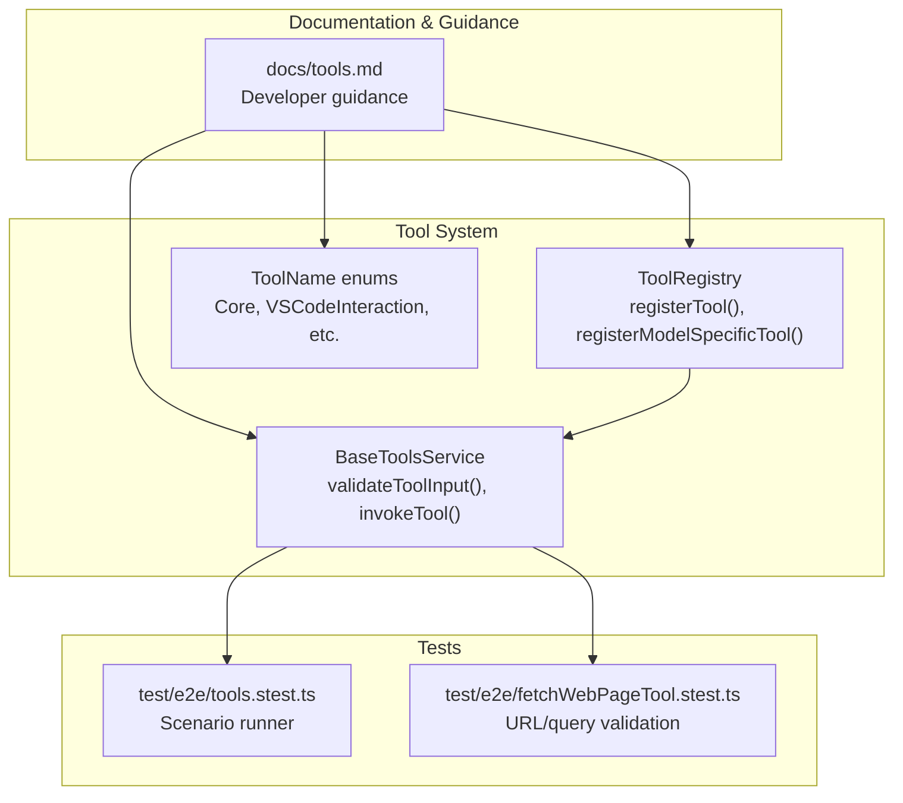
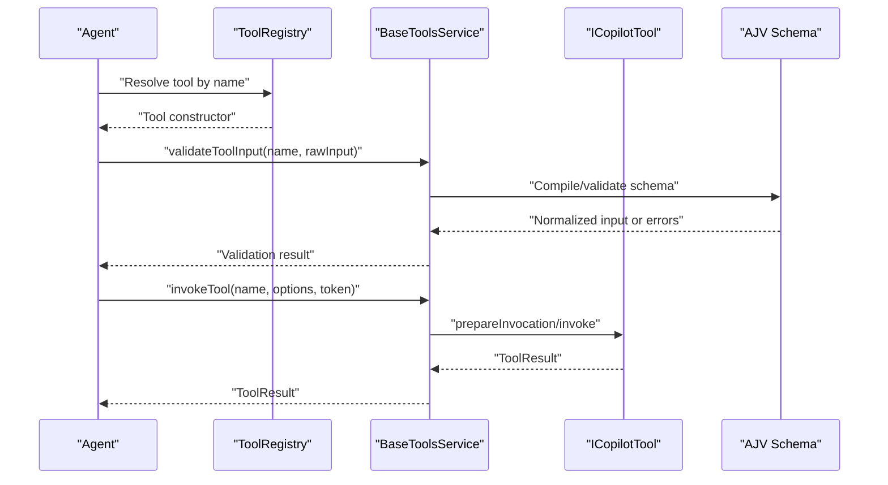
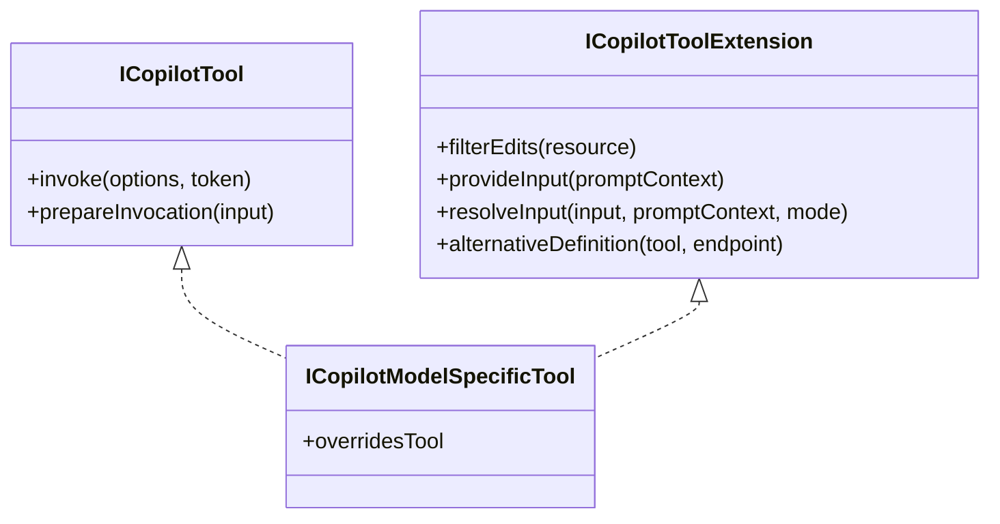
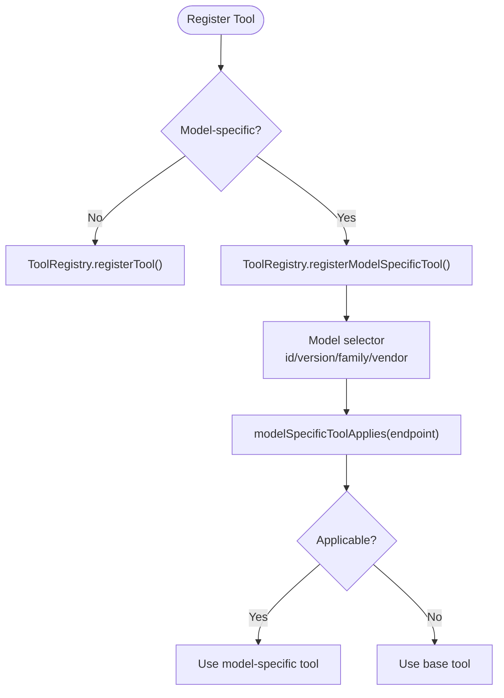
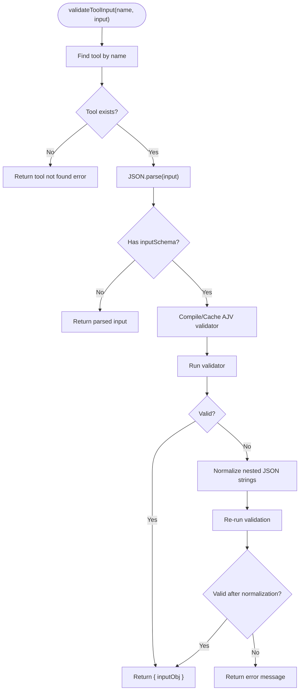
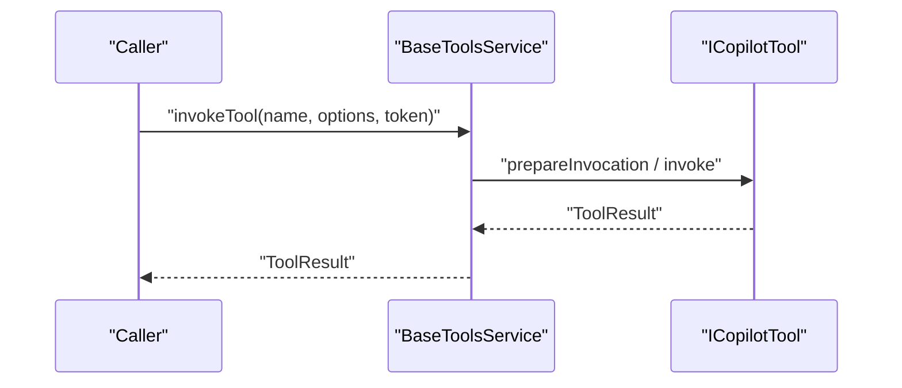
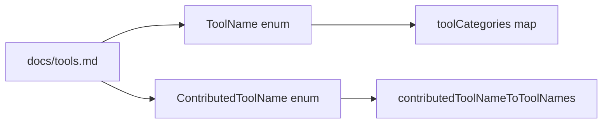
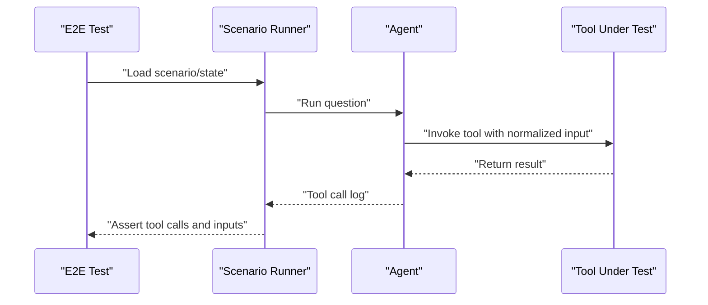
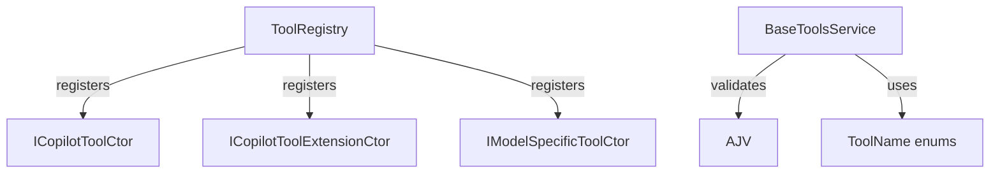

# Custom Tool Development

<cite>
**Referenced Files in This Document**
- [docs/tools.md](file://docs/tools.md)
- [src/extension/tools/common/toolsRegistry.ts](file://src/extension/tools/common/toolsRegistry.ts)
- [src/extension/tools/common/toolsService.ts](file://src/extension/tools/common/toolsService.ts)
- [src/extension/tools/common/toolNames.ts](file://src/extension/tools/common/toolNames.ts)
- [test/e2e/tools.stest.ts](file://test/e2e/tools.stest.ts)
- [test/e2e/fetchWebPageTool.stest.ts](file://test/e2e/fetchWebPageTool.stest.ts)
</cite>

## Table of Contents
1. [Introduction](#introduction)
2. [Project Structure](#project-structure)
3. [Core Components](#core-components)
4. [Architecture Overview](#architecture-overview)
5. [Detailed Component Analysis](#detailed-component-analysis)
6. [Dependency Analysis](#dependency-analysis)
7. [Performance Considerations](#performance-considerations)
8. [Troubleshooting Guide](#troubleshooting-guide)
9. [Conclusion](#conclusion)
10. [Appendices](#appendices)

## Introduction
This document explains how to develop custom tools that integrate with the Copilot Chat ecosystem. It covers the entire lifecycle from designing the tool’s JSON schema and interface implementation to registering and deploying tools, validating inputs, processing results, and testing. It also documents the ICopilotTool and model-specific tool patterns, input normalization and validation, and best practices for naming, documentation, and versioning.

## Project Structure
The tool system is implemented in the extension’s tools module and supported by a registry and service layer. Tests demonstrate end-to-end tool invocation and validation.

**Diagram sources**
- [src/extension/tools/common/toolsRegistry.ts](file://src/extension/tools/common/toolsRegistry.ts#L105-L143)
- [src/extension/tools/common/toolsService.ts](file://src/extension/tools/common/toolsService.ts#L175-L255)
- [src/extension/tools/common/toolNames.ts](file://src/extension/tools/common/toolNames.ts#L21-L246)
- [docs/tools.md](file://docs/tools.md#L1-L156)
- [test/e2e/tools.stest.ts](file://test/e2e/tools.stest.ts#L15-L23)
- [test/e2e/fetchWebPageTool.stest.ts](file://test/e2e/fetchWebPageTool.stest.ts#L19-L60)

**Section sources**
- [docs/tools.md](file://docs/tools.md#L1-L156)
- [src/extension/tools/common/toolsRegistry.ts](file://src/extension/tools/common/toolsRegistry.ts#L105-L143)
- [src/extension/tools/common/toolsService.ts](file://src/extension/tools/common/toolsService.ts#L175-L255)
- [src/extension/tools/common/toolNames.ts](file://src/extension/tools/common/toolNames.ts#L21-L246)
- [test/e2e/tools.stest.ts](file://test/e2e/tools.stest.ts#L15-L23)
- [test/e2e/fetchWebPageTool.stest.ts](file://test/e2e/fetchWebPageTool.stest.ts#L19-L60)

## Core Components
- ICopilotTool and ICopilotToolExtension define the contract for tools and optional extensions such as input resolution and edit filtering.
- ToolRegistry manages registration of tools, tool extensions, and model-specific tools.
- BaseToolsService provides input validation, tool invocation, and tool discovery.
- ToolName enumerations standardize tool naming and categorization.

Key responsibilities:
- Define tool schema in package.json and map it to a strongly typed input interface.
- Implement ICopilotTool or ICopilotModelSpecificTool and register via ToolRegistry.
- Use BaseToolsService.validateToolInput to normalize and validate inputs.
- Return structured results using the tool result types and messages for UI rendering.

**Section sources**
- [src/extension/tools/common/toolsRegistry.ts](file://src/extension/tools/common/toolsRegistry.ts#L31-L89)
- [src/extension/tools/common/toolsRegistry.ts](file://src/extension/tools/common/toolsRegistry.ts#L105-L143)
- [src/extension/tools/common/toolsService.ts](file://src/extension/tools/common/toolsService.ts#L48-L100)
- [src/extension/tools/common/toolsService.ts](file://src/extension/tools/common/toolsService.ts#L210-L247)
- [src/extension/tools/common/toolNames.ts](file://src/extension/tools/common/toolNames.ts#L21-L71)

## Architecture Overview
The tool system integrates with the agent loop and the language model tool infrastructure. Tools are validated against JSON schema, invoked with normalized inputs, and produce structured results.

**Diagram sources**
- [src/extension/tools/common/toolsRegistry.ts](file://src/extension/tools/common/toolsRegistry.ts#L105-L143)
- [src/extension/tools/common/toolsService.ts](file://src/extension/tools/common/toolsService.ts#L210-L247)
- [src/extension/tools/common/toolsService.ts](file://src/extension/tools/common/toolsService.ts#L194-L198)

## Detailed Component Analysis

### ICopilotTool and Extensions
- ICopilotTool extends the language model tool contract with optional prepareInvocation and invoke methods.
- ICopilotToolExtension adds capabilities such as filterEdits, provideInput, resolveInput, and alternativeDefinition.
- ICopilotModelSpecificTool supports model-family-specific behavior and optional overrides of base tools.

**Diagram sources**
- [src/extension/tools/common/toolsRegistry.ts](file://src/extension/tools/common/toolsRegistry.ts#L31-L89)

**Section sources**
- [src/extension/tools/common/toolsRegistry.ts](file://src/extension/tools/common/toolsRegistry.ts#L31-L89)

### Tool Registration and Model-Specific Tools
- ToolRegistry.registerTool registers standard tools.
- ToolRegistry.registerModelSpecificTool registers model-specific tools with selectors (id, version, family, vendor).
- modelSpecificToolApplies determines applicability based on endpoint metadata.

**Diagram sources**
- [src/extension/tools/common/toolsRegistry.ts](file://src/extension/tools/common/toolsRegistry.ts#L126-L138)
- [src/extension/tools/common/toolsRegistry.ts](file://src/extension/tools/common/toolsRegistry.ts#L145-L165)

**Section sources**
- [src/extension/tools/common/toolsRegistry.ts](file://src/extension/tools/common/toolsRegistry.ts#L105-L143)
- [src/extension/tools/common/toolsRegistry.ts](file://src/extension/tools/common/toolsRegistry.ts#L145-L165)

### Input Validation and Normalization
- BaseToolsService.validateToolInput parses raw input, compiles AJV schemas, caches validators, and normalizes nested JSON strings.
- It returns either a validated input object or a user-facing error message.

**Diagram sources**
- [src/extension/tools/common/toolsService.ts](file://src/extension/tools/common/toolsService.ts#L210-L247)
- [src/extension/tools/common/toolsService.ts](file://src/extension/tools/common/toolsService.ts#L133-L173)

**Section sources**
- [src/extension/tools/common/toolsService.ts](file://src/extension/tools/common/toolsService.ts#L210-L247)

### Tool Invocation Workflow
- BaseToolsService.invokeTool delegates to the underlying tool implementation.
- invokeToolWithEndpoint can be extended to route to model-specific tools or apply endpoint-specific overrides.

**Diagram sources**
- [src/extension/tools/common/toolsService.ts](file://src/extension/tools/common/toolsService.ts#L194-L198)

**Section sources**
- [src/extension/tools/common/toolsService.ts](file://src/extension/tools/common/toolsService.ts#L194-L198)

### Tool Naming, Categorization, and Documentation
- ToolName and ContributedToolName enumerate canonical tool identifiers and mapping helpers.
- Tool categories group tools for UI presentation.
- Documentation guidance covers static tool definition, schema, and localization.

**Diagram sources**
- [src/extension/tools/common/toolNames.ts](file://src/extension/tools/common/toolNames.ts#L21-L246)
- [docs/tools.md](file://docs/tools.md#L17-L31)

**Section sources**
- [src/extension/tools/common/toolNames.ts](file://src/extension/tools/common/toolNames.ts#L21-L246)
- [docs/tools.md](file://docs/tools.md#L17-L31)

### Step-by-Step Tutorial: Building a Custom Tool
- Define the tool in package.json under contributes.languageModelTools with a toolReferenceName, userDescription, modelDescription, and inputSchema.
- Add a ToolName entry and map it in toolNames.ts.
- Implement ICopilotTool or ICopilotModelSpecificTool and register via ToolRegistry.registerTool or ToolRegistry.registerModelSpecificTool.
- Import your tool in the tools aggregator and ensure it participates in the tool discovery pipeline.
- Write tests using the E2E framework to validate tool invocation and result handling.

**Section sources**
- [docs/tools.md](file://docs/tools.md#L17-L41)
- [src/extension/tools/common/toolsRegistry.ts](file://src/extension/tools/common/toolsRegistry.ts#L114-L124)
- [src/extension/tools/common/toolNames.ts](file://src/extension/tools/common/toolNames.ts#L21-L71)

### Step-by-Step Tutorial: Implementing Tool Extensions
- Use ICopilotToolExtension to add capabilities such as:
  - provideInput to prefill inputs from prompt context.
  - resolveInput to refine LLM-generated inputs based on mode.
  - filterEdits to gate edits made in tool responses.
- Register extensions via ToolRegistry.registerToolExtension.

**Section sources**
- [src/extension/tools/common/toolsRegistry.ts](file://src/extension/tools/common/toolsRegistry.ts#L31-L68)
- [src/extension/tools/common/toolsRegistry.ts](file://src/extension/tools/common/toolsRegistry.ts#L122-L124)

### Step-by-Step Tutorial: Integrating with the Agent System
- Ensure your tool is discoverable via BaseToolsService and that validateToolInput handles edge cases.
- Use invokeToolWithEndpoint to route to model-specific tools when applicable.
- Provide user-friendly invocationMessage and pastTenseMessage for UI display.

**Section sources**
- [src/extension/tools/common/toolsService.ts](file://src/extension/tools/common/toolsService.ts#L196-L198)
- [docs/tools.md](file://docs/tools.md#L55-L62)

### JSON Schema Validation and Input/Output Normalization
- Inputs are validated against the tool’s inputSchema using AJV with type coercion.
- Nested JSON strings are normalized to objects when schema expects objects or arrays.
- Errors are surfaced as user-readable messages.

**Section sources**
- [src/extension/tools/common/toolsService.ts](file://src/extension/tools/common/toolsService.ts#L210-L247)

### Testing Strategies and Debugging Techniques
- Unit tests can validate tool behavior with fixed inputs and snapshot comparisons.
- E2E tests validate end-to-end scenarios, including URL and query extraction for web tools.
- Use the E2E suite to assert expected tool calls, input shapes, and result handling.

**Diagram sources**
- [test/e2e/tools.stest.ts](file://test/e2e/tools.stest.ts#L15-L23)
- [test/e2e/fetchWebPageTool.stest.ts](file://test/e2e/fetchWebPageTool.stest.ts#L19-L60)

**Section sources**
- [test/e2e/tools.stest.ts](file://test/e2e/tools.stest.ts#L15-L23)
- [test/e2e/fetchWebPageTool.stest.ts](file://test/e2e/fetchWebPageTool.stest.ts#L19-L60)

## Dependency Analysis
- ToolRegistry depends on observable collections and lifecycle management to maintain tool registrations.
- BaseToolsService depends on AJV for schema compilation/validation and caches compiled validators.
- ToolName and toolCategories provide stable identifiers and categorization for UI and selection logic.

**Diagram sources**
- [src/extension/tools/common/toolsRegistry.ts](file://src/extension/tools/common/toolsRegistry.ts#L105-L143)
- [src/extension/tools/common/toolsService.ts](file://src/extension/tools/common/toolsService.ts#L184-L186)
- [src/extension/tools/common/toolNames.ts](file://src/extension/tools/common/toolNames.ts#L21-L71)

**Section sources**
- [src/extension/tools/common/toolsRegistry.ts](file://src/extension/tools/common/toolsRegistry.ts#L105-L143)
- [src/extension/tools/common/toolsService.ts](file://src/extension/tools/common/toolsService.ts#L184-L186)
- [src/extension/tools/common/toolNames.ts](file://src/extension/tools/common/toolNames.ts#L21-L71)

## Performance Considerations
- Schema compilation is cached per tool to avoid repeated overhead.
- Type coercion reduces manual normalization work while maintaining strictness.
- Prefer model-specific tools for model-optimized behavior to reduce unnecessary fallbacks.

[No sources needed since this section provides general guidance]

## Troubleshooting Guide
Common issues and resolutions:
- Tool not found: validate the tool name and ensure it is registered.
- Invalid input schema: ensure the JSON schema matches the input interface and required properties.
- Nested JSON strings: the validator attempts normalization; verify that the schema expects objects/arrays.
- Model-specific tool not applied: verify model selectors and endpoint metadata.

**Section sources**
- [src/extension/tools/common/toolsService.ts](file://src/extension/tools/common/toolsService.ts#L210-L247)
- [src/extension/tools/common/toolsRegistry.ts](file://src/extension/tools/common/toolsRegistry.ts#L145-L165)

## Conclusion
By following the ICopilotTool contract, defining precise JSON schemas, and leveraging ToolRegistry and BaseToolsService, you can build robust, testable tools that integrate seamlessly with the Copilot Chat agent. Use model-specific tools for advanced scenarios, adhere to naming and categorization standards, and validate inputs rigorously to ensure reliable tool behavior.

[No sources needed since this section summarizes without analyzing specific files]

## Appendices

### Best Practices for Tool Development
- Naming: Use descriptive ToolName values and align with existing tools’ terminology.
- Documentation: Provide detailed modelDescription and localize user-facing descriptions separately.
- Versioning: Keep inputSchema stable; introduce new properties as optional to preserve backward compatibility.
- Safety: For tools with side effects, return confirmation messages and gate edits via filterEdits.

**Section sources**
- [docs/tools.md](file://docs/tools.md#L17-L62)
- [src/extension/tools/common/toolsRegistry.ts](file://src/extension/tools/common/toolsRegistry.ts#L31-L68)