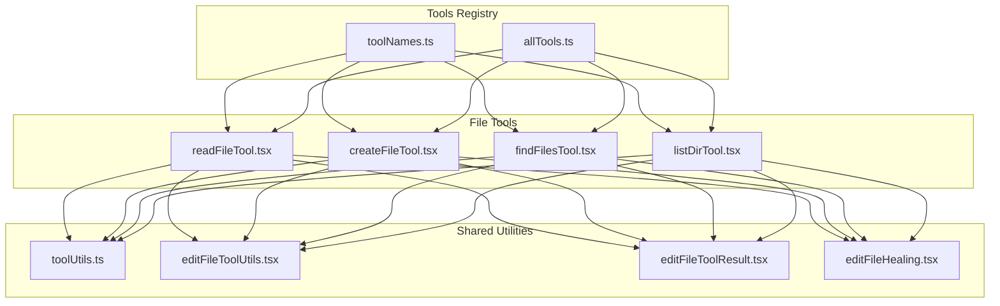
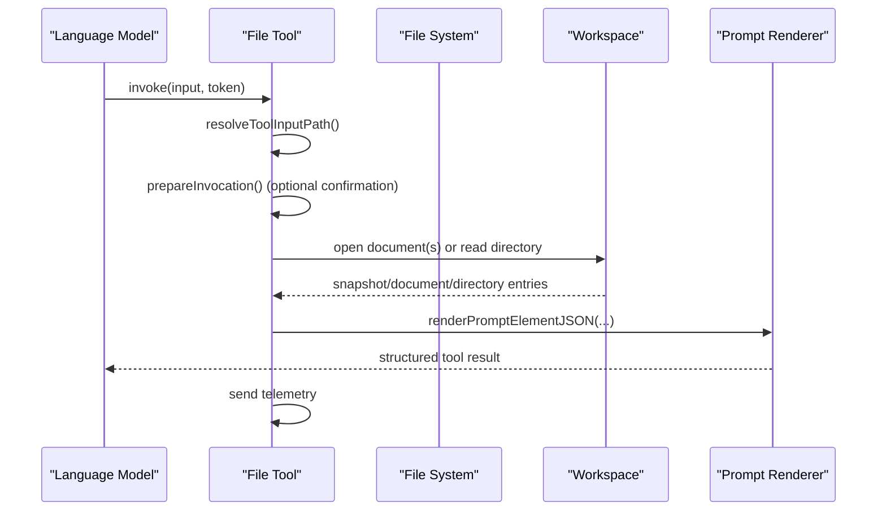
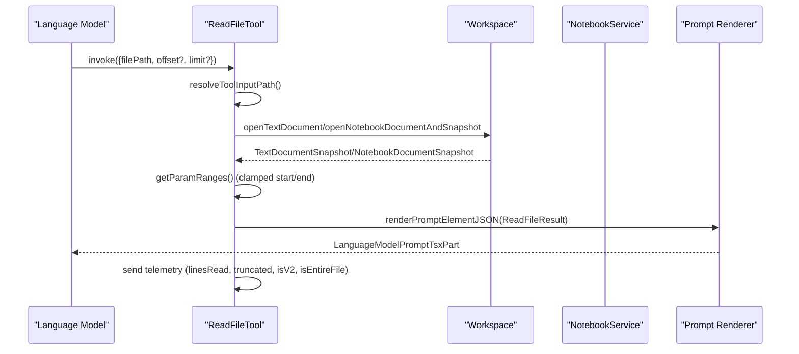
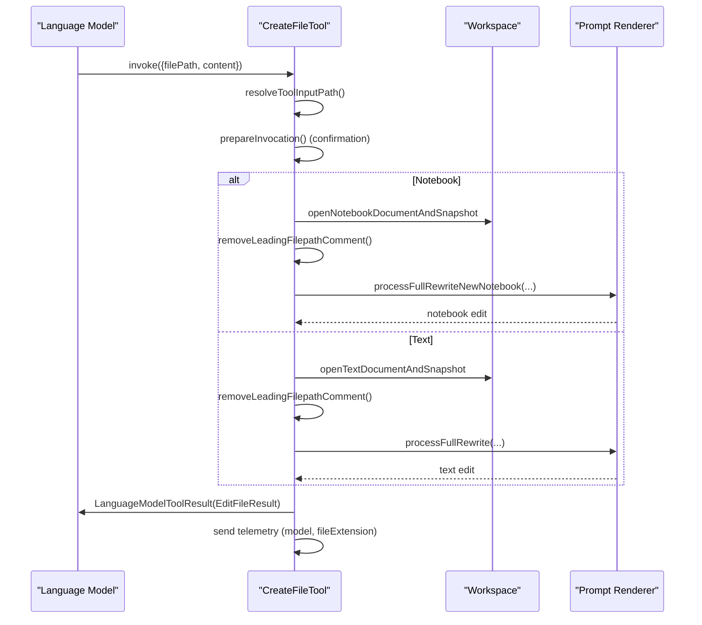
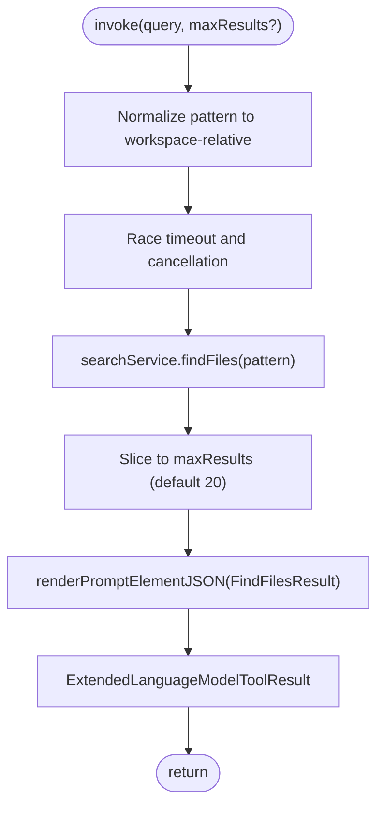
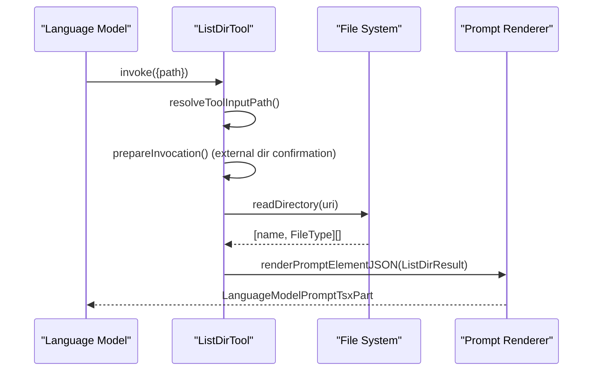
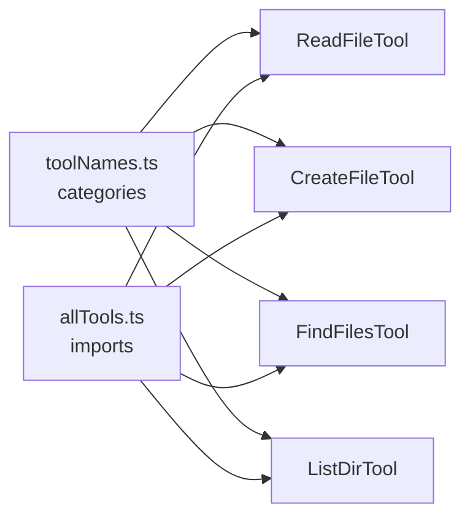

# File Operations Tools

<cite>
**Referenced Files in This Document**
- [readFileTool.tsx](file://src/extension/tools/node/readFileTool.tsx)
- [createFileTool.tsx](file://src/extension/tools/node/createFileTool.tsx)
- [findFilesTool.tsx](file://src/extension/tools/node/findFilesTool.tsx)
- [listDirTool.tsx](file://src/extension/tools/node/listDirTool.tsx)
- [editFileToolUtils.tsx](file://src/extension/tools/node/editFileToolUtils.tsx)
- [editFileToolResult.tsx](file://src/extension/tools/node/editFileToolResult.tsx)
- [toolNames.ts](file://src/extension/tools/common/toolNames.ts)
- [toolUtils.ts](file://src/extension/tools/node/toolUtils.ts)
- [allTools.ts](file://src/extension/tools/node/allTools.ts)
- [editFileHealing.tsx](file://src/extension/tools/node/editFileHealing.tsx)
</cite>

## Table of Contents
1. [Introduction](#introduction)
2. [Project Structure](#project-structure)
3. [Core Components](#core-components)
4. [Architecture Overview](#architecture-overview)
5. [Detailed Component Analysis](#detailed-component-analysis)
6. [Dependency Analysis](#dependency-analysis)
7. [Performance Considerations](#performance-considerations)
8. [Troubleshooting Guide](#troubleshooting-guide)
9. [Conclusion](#conclusion)

## Introduction
This document describes the file operations tools that enable AI-powered file manipulation in the system. It covers the complete suite of tools:
- readFileTool: Read file contents with context preservation and chunked reading
- createFileTool: Create new files with proper encoding and language detection
- findFilesTool: Search files with pattern matching and result formatting
- listDirTool: List directory contents with workspace awareness
- editFileTool utilities: Shared helpers for conflict resolution, confirmation, and diff generation

These tools integrate with the workspace, file system, and notebook services to support both text and notebook files, while ensuring safe, permission-aware operations and robust telemetry.

## Project Structure
The file operations tools are implemented under the tools node module and share common utilities and registries:
- Tools are registered and categorized centrally
- Each tool encapsulates invocation, preparation, and rendering logic
- Utilities provide path resolution, confirmation, and cancellation checks
- Edit utilities centralize conflict resolution and diff formatting

**Diagram sources**
- [toolNames.ts](file://src/extension/tools/common/toolNames.ts#L149-L179)
- [allTools.ts](file://src/extension/tools/node/allTools.ts#L8-L27)
- [readFileTool.tsx](file://src/extension/tools/node/readFileTool.tsx#L110-L125)
- [createFileTool.tsx](file://src/extension/tools/node/createFileTool.tsx#L44-L60)
- [findFilesTool.tsx](file://src/extension/tools/node/findFilesTool.tsx#L30-L38)
- [listDirTool.tsx](file://src/extension/tools/node/listDirTool.tsx#L27-L37)
- [toolUtils.ts](file://src/extension/tools/node/toolUtils.ts)
- [editFileToolUtils.tsx](file://src/extension/tools/node/editFileToolUtils.tsx)
- [editFileToolResult.tsx](file://src/extension/tools/node/editFileToolResult.tsx)
- [editFileHealing.tsx](file://src/extension/tools/node/editFileHealing.tsx)

**Section sources**
- [toolNames.ts](file://src/extension/tools/common/toolNames.ts#L149-L179)
- [allTools.ts](file://src/extension/tools/node/allTools.ts#L8-L27)

## Core Components
- readFileTool: Reads file content with optional offset/limit chunking, enforces line boundaries, and preserves context via snapshots. Supports both text and notebook documents, with optional fenced code blocks and telemetry.
- createFileTool: Creates new files with content, detects language and extension, and integrates with notebook rewrite processors. Requires confirmation and supports streaming progress reporting.
- findFilesTool: Searches files using glob patterns with workspace-aware normalization, applies timeouts, and renders results with counts and references.
- listDirTool: Lists directory entries with file type indicators and external directory confirmation.
- editFileTool utilities: Provide confirmation, diff formatting, and edit result rendering for file operations.

**Section sources**
- [readFileTool.tsx](file://src/extension/tools/node/readFileTool.tsx#L34-L57)
- [createFileTool.tsx](file://src/extension/tools/node/createFileTool.tsx#L38-L41)
- [findFilesTool.tsx](file://src/extension/tools/node/findFilesTool.tsx#L25-L28)
- [listDirTool.tsx](file://src/extension/tools/node/listDirTool.tsx#L23-L25)
- [editFileToolUtils.tsx](file://src/extension/tools/node/editFileToolUtils.tsx)
- [editFileToolResult.tsx](file://src/extension/tools/node/editFileToolResult.tsx)

## Architecture Overview
The tools follow a consistent lifecycle:
- Invocation: Resolve input path, validate parameters, and optionally request confirmation
- Execution: Perform file system or workspace operations
- Rendering: Produce structured prompt parts with references and optional fenced code blocks
- Telemetry: Emit events with model, outcomes, and metrics

**Diagram sources**
- [readFileTool.tsx](file://src/extension/tools/node/readFileTool.tsx#L127-L157)
- [createFileTool.tsx](file://src/extension/tools/node/createFileTool.tsx#L62-L140)
- [findFilesTool.tsx](file://src/extension/tools/node/findFilesTool.tsx#L40-L81)
- [listDirTool.tsx](file://src/extension/tools/node/listDirTool.tsx#L39-L49)
- [toolUtils.ts](file://src/extension/tools/node/toolUtils.ts)

## Detailed Component Analysis

### readFileTool
Purpose:
- Read file contents with chunked reading (offset/limit) to manage large files
- Preserve context by using document snapshots
- Support both text and notebook documents
- Optional fenced code blocks and line numbering

Key behaviors:
- Parameter validation and normalization to 1-based line ranges
- Enforced maximum lines per read (chunking)
- External file confirmation and content exclusion checks
- Skill-aware rendering and telemetry with model and outcome metrics

**Diagram sources**
- [readFileTool.tsx](file://src/extension/tools/node/readFileTool.tsx#L110-L157)
- [readFileTool.tsx](file://src/extension/tools/node/readFileTool.tsx#L265-L269)
- [readFileTool.tsx](file://src/extension/tools/node/readFileTool.tsx#L321-L378)

**Section sources**
- [readFileTool.tsx](file://src/extension/tools/node/readFileTool.tsx#L75-L108)
- [readFileTool.tsx](file://src/extension/tools/node/readFileTool.tsx#L127-L157)
- [readFileTool.tsx](file://src/extension/tools/node/readFileTool.tsx#L265-L269)
- [readFileTool.tsx](file://src/extension/tools/node/readFileTool.tsx#L321-L378)

### createFileTool
Purpose:
- Create new files with content, detect language and extension, and integrate with notebook rewrite processors
- Require explicit confirmation and support streaming progress reporting

Key behaviors:
- Validate required parameters and check existence atomically
- Choose notebook or text path based on supported notebooks
- Remove leading filepath comments and process full rewrite
- Stream edits and return structured results with diagnostics timeout

**Diagram sources**
- [createFileTool.tsx](file://src/extension/tools/node/createFileTool.tsx#L62-L140)
- [createFileTool.tsx](file://src/extension/tools/node/createFileTool.tsx#L159-L182)
- [createFileTool.tsx](file://src/extension/tools/node/createFileTool.tsx#L213-L227)

**Section sources**
- [createFileTool.tsx](file://src/extension/tools/node/createFileTool.tsx#L62-L140)
- [createFileTool.tsx](file://src/extension/tools/node/createFileTool.tsx#L159-L182)
- [createFileTool.tsx](file://src/extension/tools/node/createFileTool.tsx#L213-L227)

### findFilesTool
Purpose:
- Search files using glob patterns with workspace-aware normalization
- Apply timeouts and return formatted results with counts and references

Key behaviors:
- Normalize input to a workspace-relative pattern
- Limit results and render with total count and references
- Provide tool result messages and details for downstream consumption

**Diagram sources**
- [findFilesTool.tsx](file://src/extension/tools/node/findFilesTool.tsx#L40-L81)
- [findFilesTool.tsx](file://src/extension/tools/node/findFilesTool.tsx#L117-L140)

**Section sources**
- [findFilesTool.tsx](file://src/extension/tools/node/findFilesTool.tsx#L40-L81)
- [findFilesTool.tsx](file://src/extension/tools/node/findFilesTool.tsx#L83-L107)
- [findFilesTool.tsx](file://src/extension/tools/node/findFilesTool.tsx#L117-L140)

### listDirTool
Purpose:
- List directory entries with file type indicators and external directory confirmation

Key behaviors:
- Resolve path and read directory entries
- Render entries with trailing slash for directories
- Request confirmation for external directories

**Diagram sources**
- [listDirTool.tsx](file://src/extension/tools/node/listDirTool.tsx#L39-L49)
- [listDirTool.tsx](file://src/extension/tools/node/listDirTool.tsx#L92-L102)

**Section sources**
- [listDirTool.tsx](file://src/extension/tools/node/listDirTool.tsx#L39-L49)
- [listDirTool.tsx](file://src/extension/tools/node/listDirTool.tsx#L51-L78)
- [listDirTool.tsx](file://src/extension/tools/node/listDirTool.tsx#L92-L102)

### editFileTool utilities
Purpose:
- Shared helpers for conflict resolution, confirmation, and diff formatting
- Provide unified edit result rendering across tools

Key utilities:
- Confirmation and diff formatting for safe edits
- Edit result rendering with operation metadata and diagnostics timeout

**Section sources**
- [editFileToolUtils.tsx](file://src/extension/tools/node/editFileToolUtils.tsx)
- [editFileToolResult.tsx](file://src/extension/tools/node/editFileToolResult.tsx)

## Dependency Analysis
Tool registration and categorization:
- All tools are registered under ToolName and categorized as Core tools
- Centralized imports ensure tools are loaded and available

**Diagram sources**
- [toolNames.ts](file://src/extension/tools/common/toolNames.ts#L149-L179)
- [allTools.ts](file://src/extension/tools/node/allTools.ts#L8-L27)

**Section sources**
- [toolNames.ts](file://src/extension/tools/common/toolNames.ts#L149-L179)
- [allTools.ts](file://src/extension/tools/node/allTools.ts#L8-L27)

## Performance Considerations
- Chunked reading in readFileTool: Use offset/limit parameters to avoid loading entire large files at once; the tool enforces a maximum lines-per-read cap and signals truncation when limits are applied.
- Workspace-aware search: findFilesTool normalizes patterns and applies a timeout to prevent long-running queries; adjust maxResults for full-context modes.
- Streaming edits: createFileTool streams progress and returns structured results to reduce latency and improve responsiveness.
- Snapshot-based reads: readFileTool uses document snapshots to preserve context and avoid stale content during reads.

[No sources needed since this section provides general guidance]

## Troubleshooting Guide
Common issues and strategies:
- External file/directory access: Tools request confirmation for external resources; ensure permissions are granted or adjust workspace scope.
- Content exclusion: readFileTool checks for content exclusions; verify ignore rules and content filters.
- Large file handling: Use chunked reading with offset/limit to avoid truncation and excessive memory usage.
- Pattern matching: findFilesTool expects normalized patterns; ensure queries start with "**/" and end appropriately.
- Existence conflicts: createFileTool prevents overwriting existing files; use edit tools for modifications.

**Section sources**
- [readFileTool.tsx](file://src/extension/tools/node/readFileTool.tsx#L164-L202)
- [listDirTool.tsx](file://src/extension/tools/node/listDirTool.tsx#L54-L72)
- [findFilesTool.tsx](file://src/extension/tools/node/findFilesTool.tsx#L83-L88)
- [createFileTool.tsx](file://src/extension/tools/node/createFileTool.tsx#L72-L97)

## Conclusion
The file operations tools provide a robust, workspace-aware foundation for AI-driven file manipulation. They emphasize safety (confirmation and content exclusion), scalability (chunked reads and timeouts), and clarity (structured results and telemetry). By leveraging shared utilities and consistent invocation patterns, these tools support both individual operations and complex workflows such as multi-file edits and batch processing.