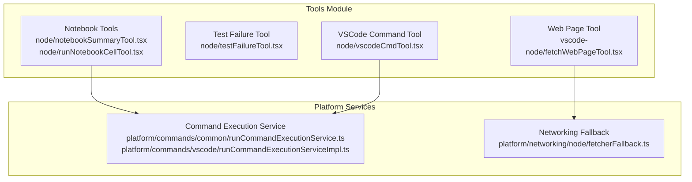
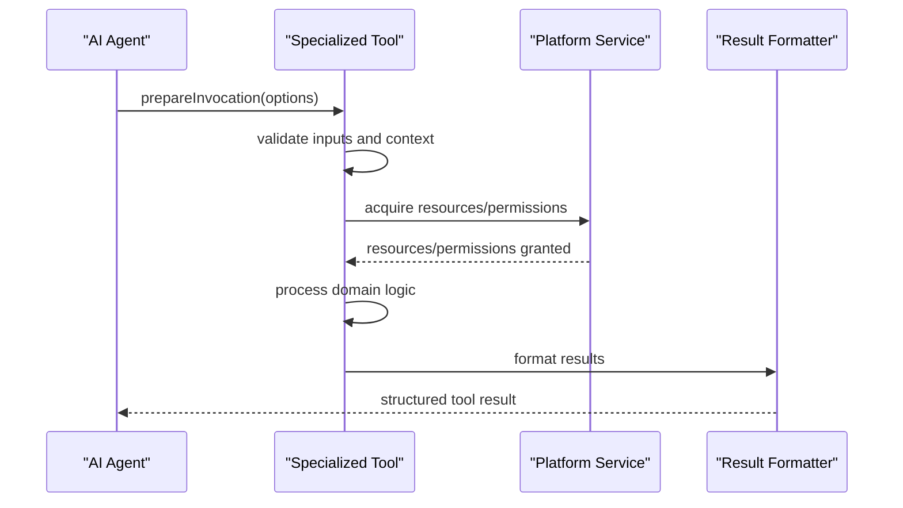
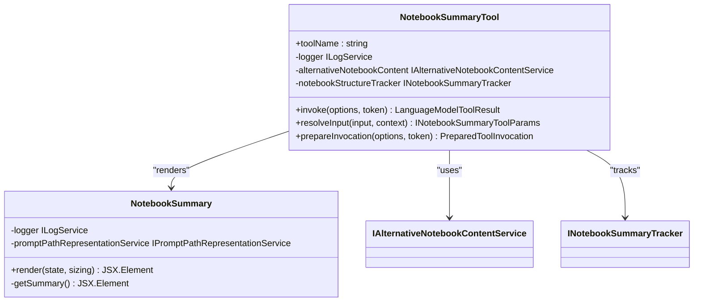
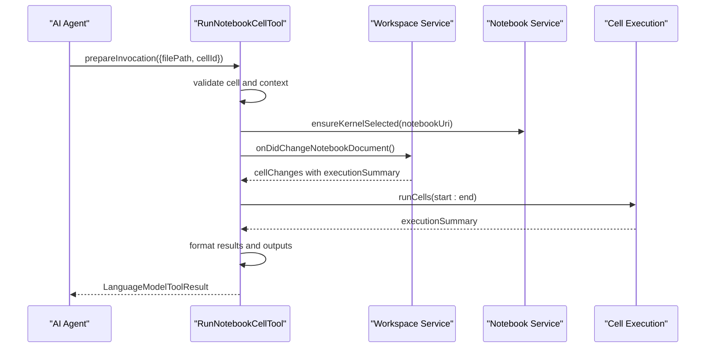
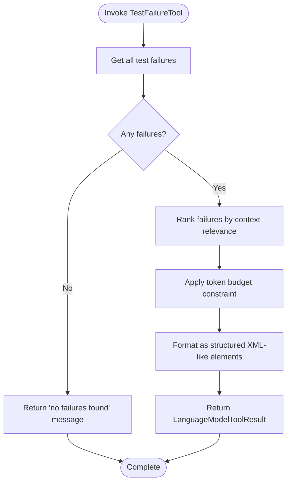
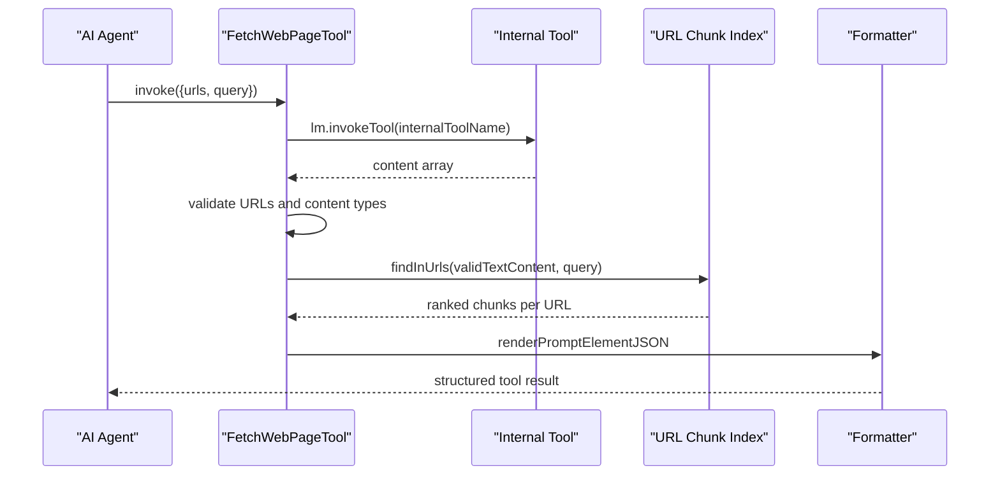
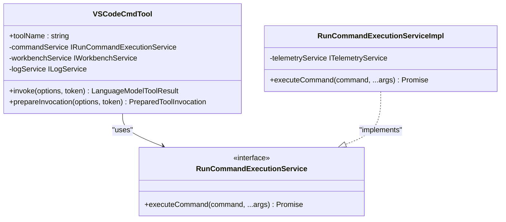
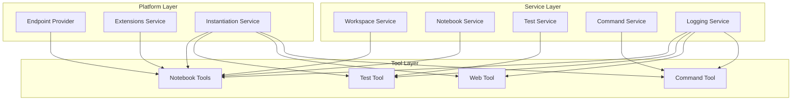

# Specialized Tools

<cite>
**Referenced Files in This Document**
- [notebookSummaryTool.tsx](file://src/extension/tools/node/notebookSummaryTool.tsx)
- [runNotebookCellTool.tsx](file://src/extension/tools/node/runNotebookCellTool.tsx)
- [testFailureTool.tsx](file://src/extension/tools/node/testFailureTool.tsx)
- [fetchWebPageTool.tsx](file://src/extension/tools/vscode-node/fetchWebPageTool.tsx)
- [vscodeCmdTool.tsx](file://src/extension/tools/node/vscodeCmdTool.tsx)
- [runCommandExecutionService.ts](file://src/platform/commands/common/runCommandExecutionService.ts)
- [runCommandExecutionServiceImpl.ts](file://src/platform/commands/vscode/runCommandExecutionServiceImpl.ts)
- [fetcherFallback.ts](file://src/platform/networking/node/fetcherFallback.ts)
- [fetchWebPageTool.stest.ts](file://test/e2e/fetchWebPageTool.stest.ts)
- [testFailure.spec.tsx](file://src/extension/tools/node/test/testFailure.spec.tsx)
</cite>

## Table of Contents
1. [Introduction](#introduction)
2. [Project Structure](#project-structure)
3. [Core Components](#core-components)
4. [Architecture Overview](#architecture-overview)
5. [Detailed Component Analysis](#detailed-component-analysis)
6. [Dependency Analysis](#dependency-analysis)
7. [Performance Considerations](#performance-considerations)
8. [Troubleshooting Guide](#troubleshooting-guide)
9. [Conclusion](#conclusion)

## Introduction
This document describes specialized tools that provide domain-specific functionality within the system. These tools integrate with Jupyter notebooks, test frameworks, web pages, and VS Code commands to enable AI-driven automation and diagnostics. The focus areas include:
- Notebook tools: notebookSummaryTool and runNotebookCellTool for Jupyter notebook integration
- Test failure analysis tool: testFailureTool for diagnosing test outcomes
- Web page fetching capabilities: fetchWebPageTool for retrieving and ranking web content
- VSCode command execution tools: vscodeCmdTool for invoking commands safely

Each tool includes specialized processing logic, result formatting, integration patterns, error handling, timeout management, and resource optimization strategies.

## Project Structure
The specialized tools are organized under the tools module with distinct implementations for different domains:
- Notebook tools: located under node with notebook-specific logic
- Test failure tool: located under node with test framework integration
- Web page fetching tool: located under vscode-node with web content retrieval
- VSCode command tool: located under node with command execution service integration

**Diagram sources**
- [notebookSummaryTool.tsx](file://src/extension/tools/node/notebookSummaryTool.tsx#L31-L105)
- [runNotebookCellTool.tsx](file://src/extension/tools/node/runNotebookCellTool.tsx#L79-L291)
- [testFailureTool.tsx](file://src/extension/tools/node/testFailureTool.tsx#L48-L96)
- [fetchWebPageTool.tsx](file://src/extension/tools/vscode-node/fetchWebPageTool.tsx#L43-L138)
- [vscodeCmdTool.tsx](file://src/extension/tools/node/vscodeCmdTool.tsx#L24-L99)
- [runCommandExecutionService.ts](file://src/platform/commands/common/runCommandExecutionService.ts#L8-L14)
- [runCommandExecutionServiceImpl.ts](file://src/platform/commands/vscode/runCommandExecutionServiceImpl.ts#L11-L25)
- [fetcherFallback.ts](file://src/platform/networking/node/fetcherFallback.ts#L121-L145)

**Section sources**
- [notebookSummaryTool.tsx](file://src/extension/tools/node/notebookSummaryTool.tsx#L1-L105)
- [runNotebookCellTool.tsx](file://src/extension/tools/node/runNotebookCellTool.tsx#L1-L291)
- [testFailureTool.tsx](file://src/extension/tools/node/testFailureTool.tsx#L1-L96)
- [fetchWebPageTool.tsx](file://src/extension/tools/vscode-node/fetchWebPageTool.tsx#L1-L138)
- [vscodeCmdTool.tsx](file://src/extension/tools/node/vscodeCmdTool.tsx#L1-L99)

## Core Components
This section outlines the primary specialized tools and their responsibilities:

- Notebook Summary Tool
  - Purpose: Summarize notebook structure, execution status, and metadata for context
  - Key features: Alternative notebook content formatting, execution order detection, cell line mapping
  - Integration: Workspace service, alternative notebook content service, notebook structure tracker

- Run Notebook Cell Tool
  - Purpose: Execute specific notebook cells and report results
  - Key features: Cell validation, execution tracking, output formatting, error handling, telemetry
  - Integration: Notebook service, kernel selection, extension recommendations, telemetry service

- Test Failure Tool
  - Purpose: Diagnose and present test failures with prioritization
  - Key features: Failure ranking by context relevance, structured XML-like output, edit filtering
  - Integration: Test provider, workspace service, tabs and editors service, Git extension service

- Fetch Web Page Tool
  - Purpose: Retrieve and rank web page content for context
  - Key features: URL validation, content chunking, embedding-based scoring, image handling
  - Integration: Internal web page fetch tool, URL chunk embeddings index, logging service

- VSCode Command Tool
  - Purpose: Safely execute VSCode commands from AI prompts
  - Key features: Command discovery, precondition checking, result serialization, telemetry
  - Integration: Command execution service, workbench service, logging service

**Section sources**
- [notebookSummaryTool.tsx](file://src/extension/tools/node/notebookSummaryTool.tsx#L31-L105)
- [runNotebookCellTool.tsx](file://src/extension/tools/node/runNotebookCellTool.tsx#L79-L291)
- [testFailureTool.tsx](file://src/extension/tools/node/testFailureTool.tsx#L48-L96)
- [fetchWebPageTool.tsx](file://src/extension/tools/vscode-node/fetchWebPageTool.tsx#L43-L138)
- [vscodeCmdTool.tsx](file://src/extension/tools/node/vscodeCmdTool.tsx#L24-L99)

## Architecture Overview
The specialized tools follow a consistent architecture pattern with tool registration, invocation preparation, and result formatting. Each tool integrates with platform services and may leverage domain-specific processing logic.

**Diagram sources**
- [notebookSummaryTool.tsx](file://src/extension/tools/node/notebookSummaryTool.tsx#L97-L101)
- [runNotebookCellTool.tsx](file://src/extension/tools/node/runNotebookCellTool.tsx#L204-L222)
- [testFailureTool.tsx](file://src/extension/tools/node/testFailureTool.tsx#L84-L89)
- [fetchWebPageTool.tsx](file://src/extension/tools/vscode-node/fetchWebPageTool.tsx#L56-L62)
- [vscodeCmdTool.tsx](file://src/extension/tools/node/vscodeCmdTool.tsx#L76-L95)

## Detailed Component Analysis

### Notebook Tools

#### Notebook Summary Tool
The notebook summary tool generates a comprehensive summary of a notebook's structure and execution state. It leverages alternative content formatting to provide cell line mappings and execution metadata.

Key processing logic:
- Validates notebook file path and resolves to notebook document
- Creates alternative notebook document for formatting
- Generates structured summary with cell metadata and execution status
- Integrates with notebook structure tracker for context

Result formatting:
- Cell-by-cell breakdown with execution order and timing
- MIME type listings for cell outputs
- Path representation for notebook location
- Conditional inclusion of cell line numbers based on alternative content availability

Integration patterns:
- Workspace service for notebook document resolution
- Alternative notebook content service for formatting
- Notebook structure tracker for state management
- Prompt path representation service for display formatting

**Diagram sources**
- [notebookSummaryTool.tsx](file://src/extension/tools/node/notebookSummaryTool.tsx#L31-L105)
- [notebookSummaryTool.tsx](file://src/extension/tools/node/notebookSummaryTool.tsx#L114-L188)

**Section sources**
- [notebookSummaryTool.tsx](file://src/extension/tools/node/notebookSummaryTool.tsx#L31-L105)
- [notebookSummaryTool.tsx](file://src/extension/tools/node/notebookSummaryTool.tsx#L114-L188)

#### Run Notebook Cell Tool
The run notebook cell tool executes individual notebook cells with robust error handling and result reporting. It includes sophisticated processing for cell validation, execution tracking, and output formatting.

Specialized processing logic:
- Cell validation: checks for code cell type and non-empty content
- Kernel selection: ensures appropriate kernel is selected for execution
- Execution tracking: monitors cell execution completion with timeout handling
- Output processing: formats different output types (text, HTML, images, errors)
- Extension recommendations: suggests Jupyter extension installation when needed

Result formatting:
- Execution summary with success/failure indication
- Timing information for successful executions
- Structured output blocks with MIME type metadata
- Error parsing and remediation suggestions
- Image output support for vision-capable models

Integration patterns:
- Notebook service for execution orchestration
- Workspace service for document change events
- Alternative content service for formatting
- Extensions service for dependency recommendations
- Telemetry service for usage analytics

**Diagram sources**
- [runNotebookCellTool.tsx](file://src/extension/tools/node/runNotebookCellTool.tsx#L204-L222)
- [runNotebookCellTool.tsx](file://src/extension/tools/node/runNotebookCellTool.tsx#L280-L290)
- [runNotebookCellTool.tsx](file://src/extension/tools/node/runNotebookCellTool.tsx#L144-L168)

**Section sources**
- [runNotebookCellTool.tsx](file://src/extension/tools/node/runNotebookCellTool.tsx#L79-L291)
- [runNotebookCellTool.tsx](file://src/extension/tools/node/runNotebookCellTool.tsx#L280-L290)
- [runNotebookCellTool.tsx](file://src/extension/tools/node/runNotebookCellTool.tsx#L359-L422)

### Test Failure Analysis Tool
The test failure tool provides intelligent diagnosis of test failures by ranking them based on contextual relevance and presenting structured information for debugging.

Processing logic:
- Gathers all test failures from the test provider
- Ranks failures by contextual importance (active editor, visible editors, open files, SCM changes)
- Applies token budget constraints for efficient presentation
- Formats failures as structured XML-like elements with stack traces

Result formatting:
- Hierarchical test failure representation
- Stack frame information with file paths and positions
- Expected vs actual output comparison
- Priority-based ordering for focused debugging

Integration patterns:
- Test provider for failure enumeration
- Workspace service for file context
- Tabs and editors service for active file detection
- Git extension service for SCM-aware ranking

**Diagram sources**
- [testFailureTool.tsx](file://src/extension/tools/node/testFailureTool.tsx#L57-L73)
- [testFailureTool.tsx](file://src/extension/tools/node/testFailureTool.tsx#L127-L160)
- [testFailureTool.tsx](file://src/extension/tools/node/testFailureTool.tsx#L213-L275)

**Section sources**
- [testFailureTool.tsx](file://src/extension/tools/node/testFailureTool.tsx#L48-L96)
- [testFailureTool.tsx](file://src/extension/tools/node/testFailureTool.tsx#L98-L195)
- [testFailureTool.tsx](file://src/extension/tools/node/testFailureTool.tsx#L206-L276)

### Web Page Fetching Tool
The web page fetching tool retrieves and processes web content for use as context. It handles both text content (chunked and ranked) and images.

Processing logic:
- Validates and parses input URLs
- Invokes internal web page fetch tool
- Handles mixed content types (text, images)
- Ranks text chunks by relevance using embeddings
- Formats results with priority-based presentation

Result formatting:
- Ranked text chunks with contextual priority
- Direct image passing for vision-capable models
- Error reporting for invalid URLs
- Structured presentation with keep-with semantics

Integration patterns:
- Internal web page fetch tool for content retrieval
- URL chunk embeddings index for relevance scoring
- Logging service for diagnostics
- Model capabilities detection for image handling

**Diagram sources**
- [fetchWebPageTool.tsx](file://src/extension/tools/vscode-node/fetchWebPageTool.tsx#L64-L135)
- [fetchWebPageTool.tsx](file://src/extension/tools/vscode-node/fetchWebPageTool.tsx#L110-L124)
- [fetchWebPageTool.tsx](file://src/extension/tools/vscode-node/fetchWebPageTool.tsx#L172-L212)

**Section sources**
- [fetchWebPageTool.tsx](file://src/extension/tools/vscode-node/fetchWebPageTool.tsx#L43-L138)
- [fetchWebPageTool.tsx](file://src/extension/tools/vscode-node/fetchWebPageTool.tsx#L146-L229)

### VSCode Command Execution Tool
The VSCode command execution tool provides safe command invocation with discovery, validation, and result reporting.

Processing logic:
- Discovers available commands with precondition filtering
- Validates command existence and accessibility
- Executes commands through command execution service
- Serializes and reports results appropriately

Result formatting:
- Success messages with command results
- Precondition failure notifications
- Error handling with logging
- Command URI generation for manual execution

Integration patterns:
- Command execution service for actual command execution
- Workbench service for command discovery
- Logging service for error tracking
- Telemetry service for usage analytics

**Diagram sources**
- [vscodeCmdTool.tsx](file://src/extension/tools/node/vscodeCmdTool.tsx#L24-L99)
- [runCommandExecutionService.ts](file://src/platform/commands/common/runCommandExecutionService.ts#L8-L14)
- [runCommandExecutionServiceImpl.ts](file://src/platform/commands/vscode/runCommandExecutionServiceImpl.ts#L11-L25)

**Section sources**
- [vscodeCmdTool.tsx](file://src/extension/tools/node/vscodeCmdTool.tsx#L24-L99)
- [runCommandExecutionService.ts](file://src/platform/commands/common/runCommandExecutionService.ts#L8-L14)
- [runCommandExecutionServiceImpl.ts](file://src/platform/commands/vscode/runCommandExecutionServiceImpl.ts#L11-L25)

## Dependency Analysis
The specialized tools share common patterns while maintaining domain-specific dependencies. The following diagram illustrates key dependencies:

**Diagram sources**
- [notebookSummaryTool.tsx](file://src/extension/tools/node/notebookSummaryTool.tsx#L35-L43)
- [runNotebookCellTool.tsx](file://src/extension/tools/node/runNotebookCellTool.tsx#L83-L93)
- [testFailureTool.tsx](file://src/extension/tools/node/testFailureTool.tsx#L51-L55)
- [fetchWebPageTool.tsx](file://src/extension/tools/vscode-node/fetchWebPageTool.tsx#L47-L52)
- [vscodeCmdTool.tsx](file://src/extension/tools/node/vscodeCmdTool.tsx#L28-L32)

**Section sources**
- [notebookSummaryTool.tsx](file://src/extension/tools/node/notebookSummaryTool.tsx#L35-L43)
- [runNotebookCellTool.tsx](file://src/extension/tools/node/runNotebookCellTool.tsx#L83-L93)
- [testFailureTool.tsx](file://src/extension/tools/node/testFailureTool.tsx#L51-L55)
- [fetchWebPageTool.tsx](file://src/extension/tools/vscode-node/fetchWebPageTool.tsx#L47-L52)
- [vscodeCmdTool.tsx](file://src/extension/tools/node/vscodeCmdTool.tsx#L28-L32)

## Performance Considerations
Each tool implements specific optimizations for efficient operation:

- Token Budget Management
  - Test failure tool applies 20% token budget constraint for efficient presentation
  - Notebook tools use tokenization options to prevent excessive content inclusion
  - Web page tool limits chunk sizes based on token budget ratios

- Timeout Handling
  - Run notebook cell tool implements 3-second timeout for execution completion
  - Uses race cancellation and timeout utilities for responsive operation
  - Provides fallback messaging when execution status is unclear

- Resource Optimization
  - Web page tool sorts results by relevance score to prioritize valuable content
  - Notebook tools conditionally include cell line information only when available
  - Command tool validates command existence before execution to avoid wasted attempts

- Memory Management
  - Proper disposal of event listeners and disposables in notebook operations
  - Lazy initialization of expensive services like URL chunk embeddings index
  - Efficient chunk processing with streaming-like approaches

## Troubleshooting Guide

### Notebook Tool Issues
Common problems and solutions:
- Cell not found errors: Use file tool to refresh notebook content before re-execution
- Empty cell execution: Verify cell contains code and is not markdown
- Kernel selection failures: Ensure appropriate kernel is selected for the notebook type
- Execution timeouts: Check for long-running operations or external dependencies

### Test Failure Diagnosis
Troubleshooting steps:
- No failures found: Run tests first using the core run test tool
- Insufficient context: Use file tools to examine relevant source files
- Ranking issues: Check active editor and SCM state for proper context detection
- Token budget exceeded: Reduce test scope or use filtering tools

### Web Page Fetching Problems
Common issues:
- Invalid URLs: Verify URL format and accessibility
- Content type mismatches: Check supported content types for the model
- Embedding index failures: Monitor logging for indexing errors
- Rate limiting: Implement backoff strategies for repeated requests

### Command Execution Failures
Troubleshooting approaches:
- Command not found: Verify command exists and is properly registered
- Precondition failures: Check prerequisites and workspace state
- Permission issues: Review command permissions and user context
- Result serialization: Handle non-string results appropriately

**Section sources**
- [runNotebookCellTool.tsx](file://src/extension/tools/node/runNotebookCellTool.tsx#L150-L165)
- [testFailureTool.tsx](file://src/extension/tools/node/testFailureTool.tsx#L59-L63)
- [fetchWebPageTool.tsx](file://src/extension/tools/vscode-node/fetchWebPageTool.tsx#L72-L77)
- [vscodeCmdTool.tsx](file://src/extension/tools/node/vscodeCmdTool.tsx#L38-L51)

## Conclusion
The specialized tools provide comprehensive domain-specific functionality for notebook integration, test failure analysis, web content retrieval, and VSCode command execution. Each tool follows consistent patterns for invocation, validation, processing, and result formatting while implementing domain-specific optimizations. The tools demonstrate robust error handling, timeout management, and resource optimization strategies essential for reliable AI-assisted development workflows.

The modular architecture enables easy extension and maintenance, while the standardized interfaces facilitate integration with various AI models and platforms. Future enhancements could include expanded content processing capabilities, improved caching mechanisms, and enhanced diagnostic features for better developer experience.