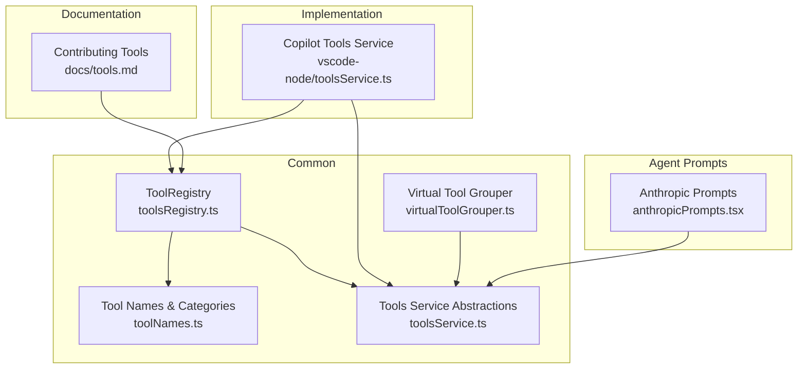
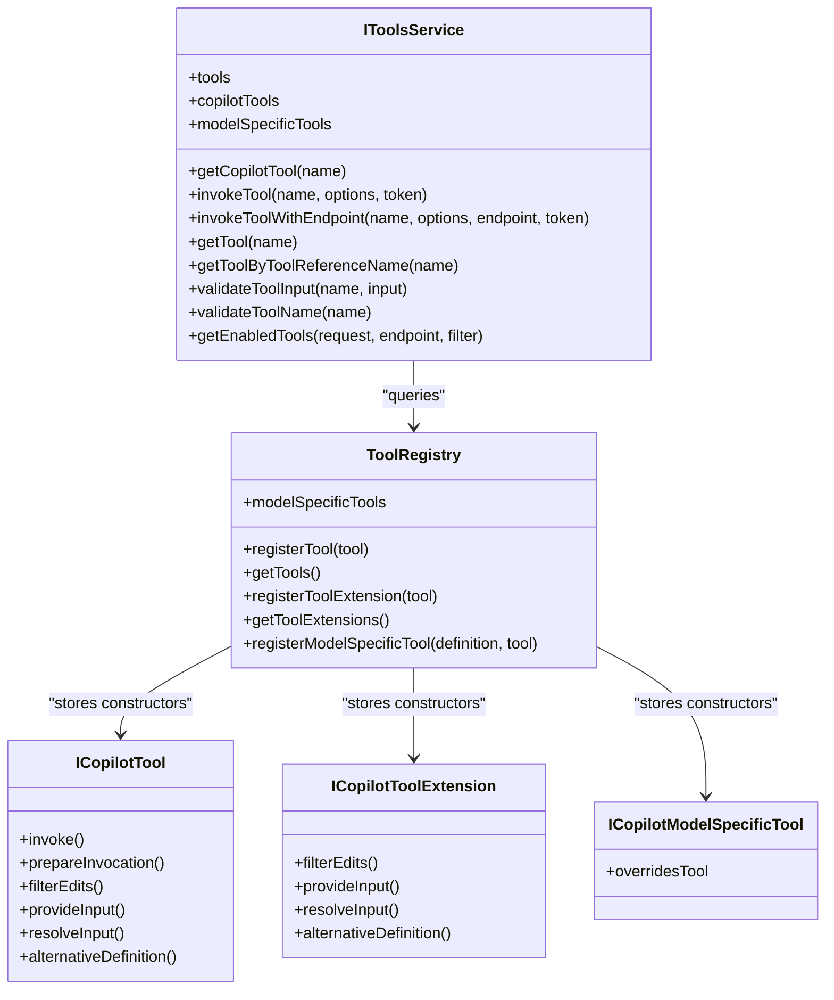
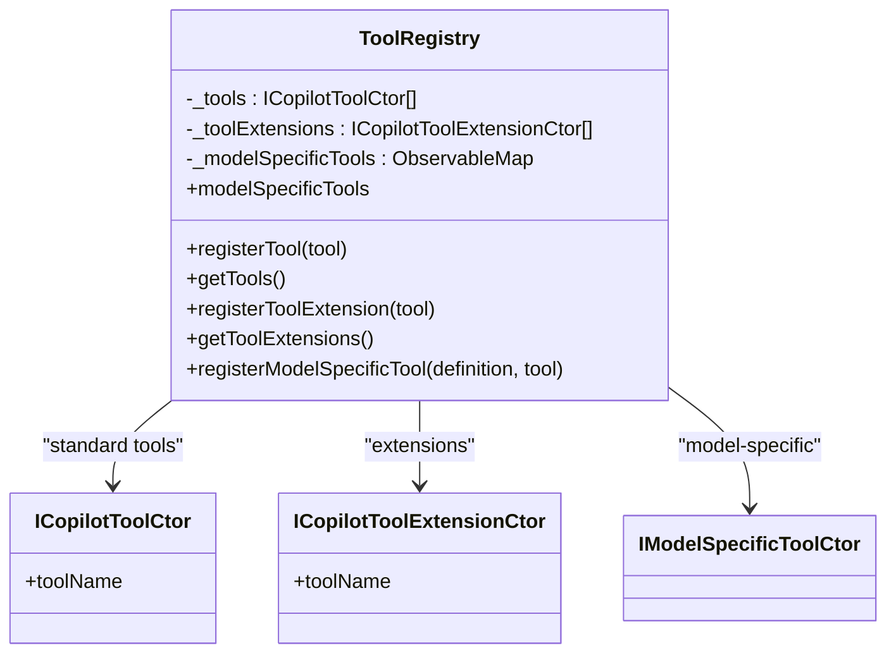
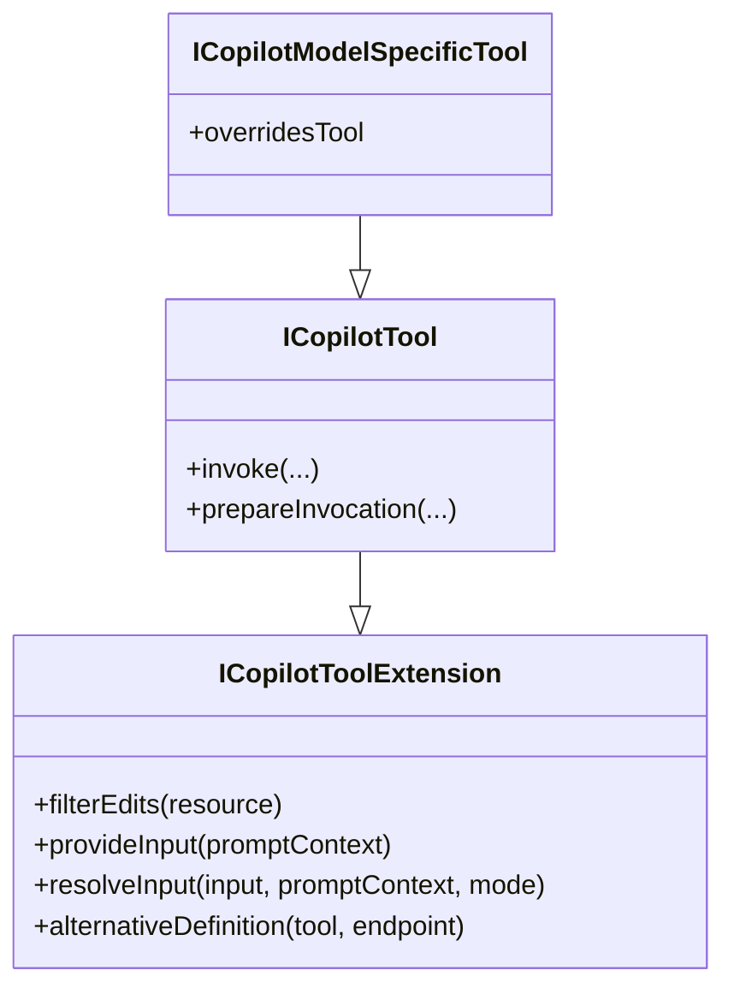
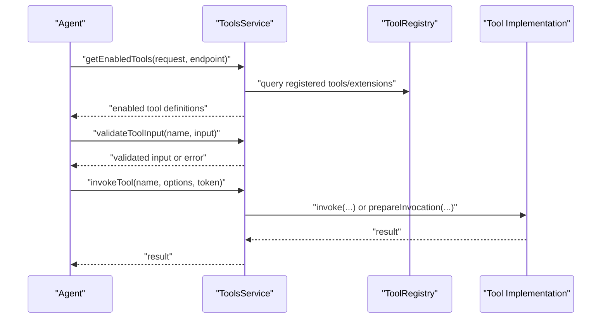
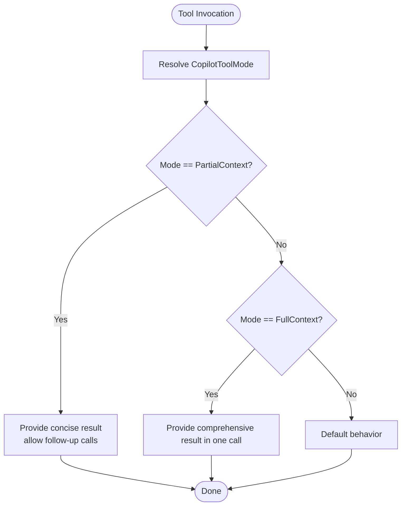
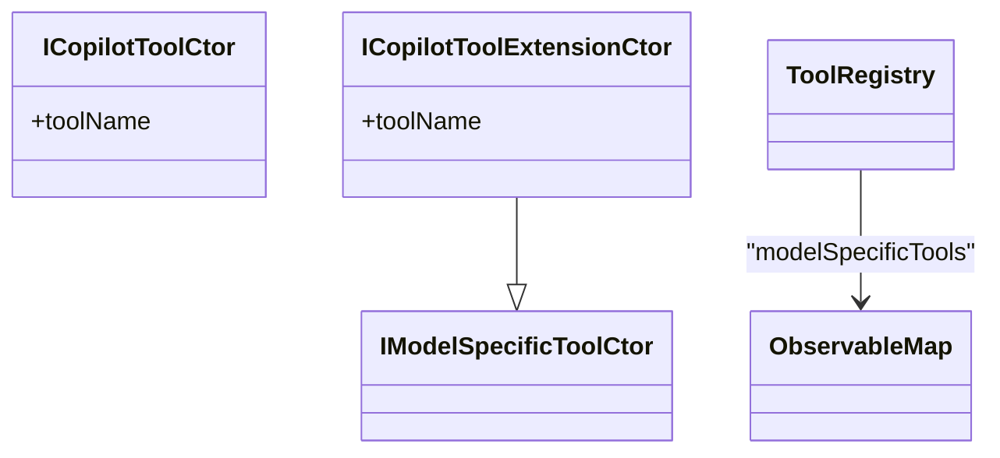
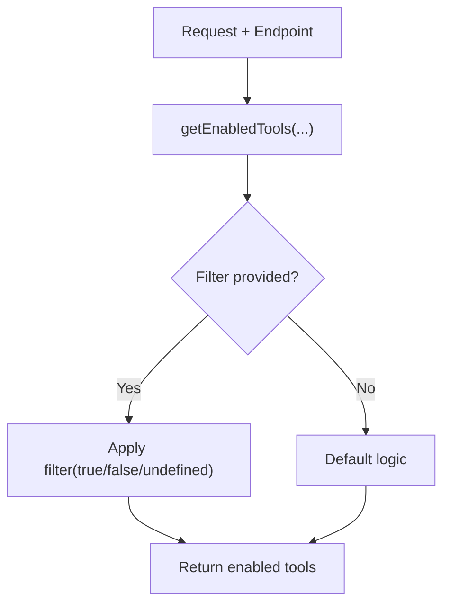
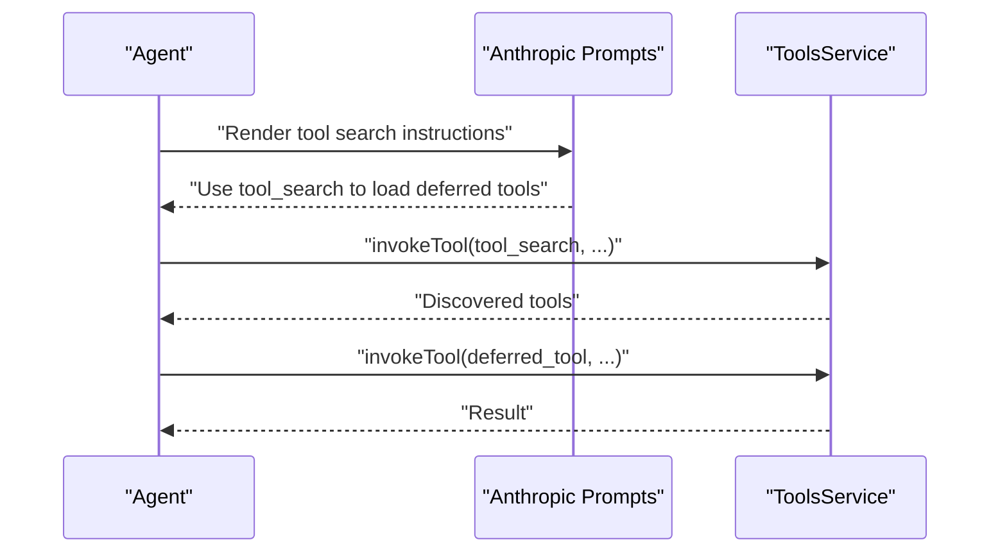
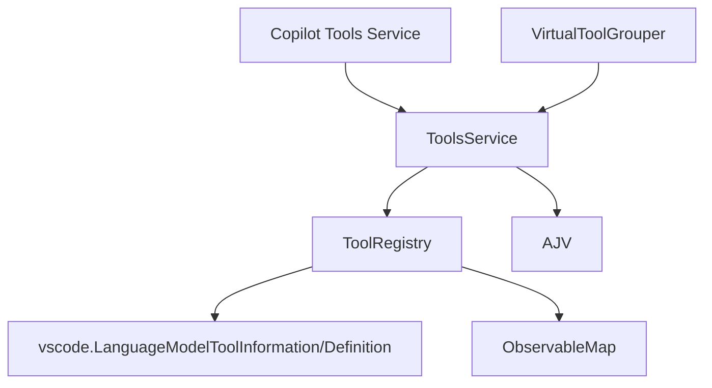

# Tool Registry & Architecture

<cite>
**Referenced Files in This Document**
- [toolsRegistry.ts](file://src/extension/tools/common/toolsRegistry.ts)
- [toolsService.ts](file://src/extension/tools/common/toolsService.ts)
- [toolNames.ts](file://src/extension/tools/common/toolNames.ts)
- [toolsService.ts](file://src/extension/tools/vscode-node/toolsService.ts)
- [anthropicPrompts.tsx](file://src/extension/prompts/node/agent/anthropicPrompts.tsx)
- [virtualToolGrouper.ts](file://src/extension/tools/common/virtualTools/virtualToolGrouper.ts)
- [tools.md](file://docs/tools.md)
</cite>

## Table of Contents
1. [Introduction](#introduction)
2. [Project Structure](#project-structure)
3. [Core Components](#core-components)
4. [Architecture Overview](#architecture-overview)
5. [Detailed Component Analysis](#detailed-component-analysis)
6. [Dependency Analysis](#dependency-analysis)
7. [Performance Considerations](#performance-considerations)
8. [Troubleshooting Guide](#troubleshooting-guide)
9. [Conclusion](#conclusion)
10. [Appendices](#appendices)

## Introduction
This document explains the tool registry architecture and core framework used by the Copilot agent system. It focuses on the ToolRegistry class, the ICopilotTool interface system, and the lifecycle of tools from registration to invocation. It also covers the differences between standard tools, tool extensions, and model-specific tools, the CopilotToolMode system for partial versus full context retrieval, type safety mechanisms, observable tool management, and tool discovery, filtering, and selection within the agent system.

## Project Structure
The tool system spans several modules:
- Common interfaces and registry: src/extension/tools/common/toolsRegistry.ts
- Tool names and categories: src/extension/tools/common/toolNames.ts
- Tools service abstractions and validation: src/extension/tools/common/toolsService.ts
- Implementation for the Copilot extension: src/extension/tools/vscode-node/toolsService.ts
- Agent-side tool search and deferred tool loading: src/extension/prompts/node/agent/anthropicPrompts.tsx
- Virtual tool grouping and discovery: src/extension/tools/common/virtualTools/virtualToolGrouper.ts
- Developer guidance for contributing tools: docs/tools.md

**Diagram sources**
- [toolsRegistry.ts](file://src/extension/tools/common/toolsRegistry.ts#L105-L143)
- [toolNames.ts](file://src/extension/tools/common/toolNames.ts#L21-L71)
- [toolsService.ts](file://src/extension/tools/common/toolsService.ts#L175-L255)
- [toolsService.ts](file://src/extension/tools/vscode-node/toolsService.ts#L84-L89)
- [anthropicPrompts.tsx](file://src/extension/prompts/node/agent/anthropicPrompts.tsx#L61-L84)
- [virtualToolGrouper.ts](file://src/extension/tools/common/virtualTools/virtualToolGrouper.ts#L108-L130)
- [tools.md](file://docs/tools.md#L15-L31)

**Section sources**
- [toolsRegistry.ts](file://src/extension/tools/common/toolsRegistry.ts#L105-L143)
- [toolNames.ts](file://src/extension/tools/common/toolNames.ts#L21-L71)
- [toolsService.ts](file://src/extension/tools/common/toolsService.ts#L175-L255)
- [toolsService.ts](file://src/extension/tools/vscode-node/toolsService.ts#L84-L89)
- [anthropicPrompts.tsx](file://src/extension/prompts/node/agent/anthropicPrompts.tsx#L61-L84)
- [virtualToolGrouper.ts](file://src/extension/tools/common/virtualTools/virtualToolGrouper.ts#L108-L130)
- [tools.md](file://docs/tools.md#L15-L31)

## Core Components
- ToolRegistry: Central registry for standard tools, tool extensions, and model-specific tools. Exposes registration APIs and observable model-specific tool sets.
- ICopilotTool and related interfaces: Define the contract for tools, including optional extension hooks and model-specific overrides.
- ToolName and categories: Enumerations and mappings for tool identity and grouping.
- ToolsService abstractions: Provide validation, discovery, filtering, and invocation APIs.
- Copilot Tools Service (implementation): Integrates with the instantiation service and contributes tool metadata.
- Agent prompts: Enforce deferred tool loading via a dedicated search tool when applicable.
- Virtual tool grouping: Manages toolset limits and grouping for discovery.

**Section sources**
- [toolsRegistry.ts](file://src/extension/tools/common/toolsRegistry.ts#L19-L89)
- [toolsRegistry.ts](file://src/extension/tools/common/toolsRegistry.ts#L105-L143)
- [toolNames.ts](file://src/extension/tools/common/toolNames.ts#L21-L71)
- [toolNames.ts](file://src/extension/tools/common/toolNames.ts#L155-L220)
- [toolsService.ts](file://src/extension/tools/common/toolsService.ts#L48-L100)
- [toolsService.ts](file://src/extension/tools/common/toolsService.ts#L175-L255)
- [toolsService.ts](file://src/extension/tools/vscode-node/toolsService.ts#L80-L89)
- [anthropicPrompts.tsx](file://src/extension/prompts/node/agent/anthropicPrompts.tsx#L61-L84)
- [virtualToolGrouper.ts](file://src/extension/tools/common/virtualTools/virtualToolGrouper.ts#L108-L130)

## Architecture Overview
The tool system is composed of:
- Registry: Stores constructors for standard tools, tool extensions, and model-specific tools. Provides observable updates for model-specific tools.
- Services: Provide discovery, validation, filtering, and invocation. The Copilot implementation integrates with instantiation and contributes tool metadata.
- Agent prompts: Enforce deferred tool loading semantics for certain providers.
- Virtual tool grouping: Ensures discoverability and avoids overwhelming the UI with too many tools.

**Diagram sources**
- [toolsRegistry.ts](file://src/extension/tools/common/toolsRegistry.ts#L105-L143)
- [toolsRegistry.ts](file://src/extension/tools/common/toolsRegistry.ts#L31-L89)
- [toolsService.ts](file://src/extension/tools/common/toolsService.ts#L48-L100)

## Detailed Component Analysis

### ToolRegistry and Tool Types
- Standard tools: Registered via constructors implementing ICopilotToolCtor. Stored in an internal array and retrievable through getTools().
- Tool extensions: Registered via constructors implementing ICopilotToolExtensionCtor. Provide optional hooks for edit filtering, input provision, and input resolution.
- Model-specific tools: Registered via registerModelSpecificTool with a vscode.LanguageModelToolDefinition and a constructor implementing ICopilotModelSpecificTool. The registry maintains an ObservableMap keyed by tool name and exposes an observable stream of model-specific tool definitions and constructors.

**Diagram sources**
- [toolsRegistry.ts](file://src/extension/tools/common/toolsRegistry.ts#L105-L143)
- [toolsRegistry.ts](file://src/extension/tools/common/toolsRegistry.ts#L91-L103)

**Section sources**
- [toolsRegistry.ts](file://src/extension/tools/common/toolsRegistry.ts#L105-L143)
- [toolsRegistry.ts](file://src/extension/tools/common/toolsRegistry.ts#L19-L89)
- [toolsRegistry.ts](file://src/extension/tools/common/toolsRegistry.ts#L91-L103)

### ICopilotTool Interface System
- ICopilotTool extends ICopilotToolExtension and adds invoke and prepareInvocation methods, aligning with vscode.LanguageModelTool capabilities.
- ICopilotToolExtension defines optional hooks:
  - filterEdits(resource): Allows tools to return confirmation data for edits made in their response.
  - provideInput(promptContext): Supply tool input when referenced in a prompt.
  - resolveInput(input, promptContext, mode): Resolve or refine LLM-generated input based on mode.
  - alternativeDefinition(tool, endpoint?): Override tool definition for a given endpoint.
- ICopilotModelSpecificTool adds overridesTool to overlay a base tool when needed.

**Diagram sources**
- [toolsRegistry.ts](file://src/extension/tools/common/toolsRegistry.ts#L31-L89)

**Section sources**
- [toolsRegistry.ts](file://src/extension/tools/common/toolsRegistry.ts#L31-L89)
- [toolsRegistry.ts](file://src/extension/tools/common/toolsRegistry.ts#L75-L85)

### Tool Lifecycle: Registration to Invocation
- Registration:
  - Standard tools: registerTool(toolCtor)
  - Tool extensions: registerToolExtension(toolCtor)
  - Model-specific tools: registerModelSpecificTool(definition, toolCtor)
- Discovery and filtering:
  - ToolsService.getEnabledTools(request, endpoint, filter?) selects tools for a given request and endpoint.
  - ToolsService.getTool(name) and getToolByToolReferenceName(name) resolve tool definitions.
- Validation:
  - ToolsService.validateToolInput(name, input) validates JSON input against the tool’s inputSchema using AJV with coercion and caching.
- Invocation:
  - ToolsService.invokeTool(name, options, token) invokes a tool by name.
  - ToolsService.invokeToolWithEndpoint(name, options, endpoint, token) delegates to invokeTool with endpoint-aware overrides.

**Diagram sources**
- [toolsService.ts](file://src/extension/tools/common/toolsService.ts#L99-L100)
- [toolsService.ts](file://src/extension/tools/common/toolsService.ts#L210-L247)
- [toolsService.ts](file://src/extension/tools/common/toolsService.ts#L194-L198)
- [toolsRegistry.ts](file://src/extension/tools/common/toolsRegistry.ts#L114-L124)
- [toolsRegistry.ts](file://src/extension/tools/common/toolsRegistry.ts#L126-L138)

**Section sources**
- [toolsService.ts](file://src/extension/tools/common/toolsService.ts#L99-L100)
- [toolsService.ts](file://src/extension/tools/common/toolsService.ts#L210-L247)
- [toolsService.ts](file://src/extension/tools/common/toolsService.ts#L194-L198)
- [toolsRegistry.ts](file://src/extension/tools/common/toolsRegistry.ts#L114-L124)
- [toolsRegistry.ts](file://src/extension/tools/common/toolsRegistry.ts#L126-L138)

### CopilotToolMode: Partial vs Full Context Retrieval
- CopilotToolMode defines two modes:
  - PartialContext: Shorter results; agent can call again to get more context.
  - FullContext: Longer results in a single call.
- Tools can implement resolveInput(input, promptContext, mode) to adapt behavior based on mode.

**Diagram sources**
- [toolsRegistry.ts](file://src/extension/tools/common/toolsRegistry.ts#L19-L29)
- [toolsRegistry.ts](file://src/extension/tools/common/toolsRegistry.ts#L51-L51)

**Section sources**
- [toolsRegistry.ts](file://src/extension/tools/common/toolsRegistry.ts#L19-L29)
- [toolsRegistry.ts](file://src/extension/tools/common/toolsRegistry.ts#L51-L51)

### Type Safety Mechanisms and Observable Management
- Type-safe tool constructors:
  - ICopilotToolCtor requires a toolName and a constructor signature compatible with ICopilotTool.
  - ICopilotToolExtensionCtor extends IModelSpecificToolCtor and adds toolName.
- Observable model-specific tools:
  - ToolRegistry.modelSpecificTools is exposed as an observable stream of { definition, tool } pairs.
  - ToolsService maintains its own observable modelSpecificTools map for runtime updates.

**Diagram sources**
- [toolsRegistry.ts](file://src/extension/tools/common/toolsRegistry.ts#L91-L103)
- [toolsRegistry.ts](file://src/extension/tools/common/toolsRegistry.ts#L108-L112)
- [toolsService.ts](file://src/extension/tools/common/toolsService.ts#L188-L191)

**Section sources**
- [toolsRegistry.ts](file://src/extension/tools/common/toolsRegistry.ts#L91-L103)
- [toolsRegistry.ts](file://src/extension/tools/common/toolsRegistry.ts#L108-L112)
- [toolsService.ts](file://src/extension/tools/common/toolsService.ts#L188-L191)

### Tool Discovery, Filtering, and Selection
- Discovery:
  - ToolsService.tools lists all registered vscode.LanguageModelToolInformation.
  - ToolsService.copilotTools maps ToolName to ICopilotTool implementations.
- Filtering:
  - getEnabledTools(request, endpoint, filter?) applies endpoint-specific logic and optional filter to enable or disable tools.
- Selection:
  - getTool(name) and getToolByToolReferenceName(name) resolve tool definitions for invocation.

**Diagram sources**
- [toolsService.ts](file://src/extension/tools/common/toolsService.ts#L99-L100)
- [toolsService.ts](file://src/extension/tools/common/toolsService.ts#L200-L202)

**Section sources**
- [toolsService.ts](file://src/extension/tools/common/toolsService.ts#L99-L100)
- [toolsService.ts](file://src/extension/tools/common/toolsService.ts#L200-L202)

### Deferred Tool Loading and Tool Search
- Some providers require a dedicated search tool to discover and load deferred tools before direct invocation.
- Anthropic prompts enforce mandatory use of a tool search instruction and distinguish between standard and custom search modes.

**Diagram sources**
- [anthropicPrompts.tsx](file://src/extension/prompts/node/agent/anthropicPrompts.tsx#L61-L84)
- [toolsService.ts](file://src/extension/tools/common/toolsService.ts#L194-L198)

**Section sources**
- [anthropicPrompts.tsx](file://src/extension/prompts/node/agent/anthropicPrompts.tsx#L61-L84)
- [toolsService.ts](file://src/extension/tools/common/toolsService.ts#L194-L198)

### Examples and Patterns

#### Registering a Custom Standard Tool
- Define a constructor implementing ICopilotToolCtor with a toolName.
- Register via ToolRegistry.registerTool(toolCtor).

**Section sources**
- [toolsRegistry.ts](file://src/extension/tools/common/toolsRegistry.ts#L114-L120)
- [toolsRegistry.ts](file://src/extension/tools/common/toolsRegistry.ts#L91-L94)

#### Implementing a Tool Extension
- Implement ICopilotToolExtension with optional hooks:
  - filterEdits(resource)
  - provideInput(promptContext)
  - resolveInput(input, promptContext, mode)
- Register via ToolRegistry.registerToolExtension(toolCtor).

**Section sources**
- [toolsRegistry.ts](file://src/extension/tools/common/toolsRegistry.ts#L122-L124)
- [toolsRegistry.ts](file://src/extension/tools/common/toolsRegistry.ts#L31-L68)

#### Creating a Model-Specific Tool Variant
- Implement ICopilotModelSpecificTool with optional overridesTool to overlay a base tool.
- Register via ToolRegistry.registerModelSpecificTool(definition, toolCtor).
- Use modelSpecificToolApplies(tool, endpoint) to check compatibility.

**Section sources**
- [toolsRegistry.ts](file://src/extension/tools/common/toolsRegistry.ts#L126-L138)
- [toolsRegistry.ts](file://src/extension/tools/common/toolsRegistry.ts#L75-L85)
- [toolsRegistry.ts](file://src/extension/tools/common/toolsRegistry.ts#L145-L165)

#### Contributing a Tool Definition (Developer Guidance)
- Add a contribution under contributes.languageModelTools with a toolReferenceName and localized userDescription.
- Add to a toolset under contributes.languageModelToolSets.
- Provide a detailed modelDescription and inputSchema.
- Add entries to ToolName, ContributedToolName, and mappings in toolNames.ts.

**Section sources**
- [tools.md](file://docs/tools.md#L15-L31)
- [toolNames.ts](file://src/extension/tools/common/toolNames.ts#L130-L148)

## Dependency Analysis
- ToolRegistry depends on:
  - vscode.LanguageModelToolInformation/Definition for tool metadata.
  - ObservableMap for model-specific tool observability.
- ToolsService depends on:
  - ToolRegistry for tool discovery.
  - AJV for input validation.
  - Instantiation service for constructing tool implementations.
- VirtualToolGrouper depends on:
  - Tool discovery and grouping heuristics to manage toolset sizes.

**Diagram sources**
- [toolsRegistry.ts](file://src/extension/tools/common/toolsRegistry.ts#L105-L143)
- [toolsService.ts](file://src/extension/tools/common/toolsService.ts#L175-L255)
- [toolsService.ts](file://src/extension/tools/vscode-node/toolsService.ts#L84-L89)
- [virtualToolGrouper.ts](file://src/extension/tools/common/virtualTools/virtualToolGrouper.ts#L108-L130)

**Section sources**
- [toolsRegistry.ts](file://src/extension/tools/common/toolsRegistry.ts#L105-L143)
- [toolsService.ts](file://src/extension/tools/common/toolsService.ts#L175-L255)
- [toolsService.ts](file://src/extension/tools/vscode-node/toolsService.ts#L84-L89)
- [virtualToolGrouper.ts](file://src/extension/tools/common/virtualTools/virtualToolGrouper.ts#L108-L130)

## Performance Considerations
- Input validation caching: ToolsService caches compiled AJV validators per tool name to avoid repeated compilation overhead.
- Observable model-specific tools: Updates are streamed via ObservableMap to minimize unnecessary recomputation.
- Virtual tool grouping: Limits toolset sizes and allocates slots proportionally to reduce UI overload and improve responsiveness.

**Section sources**
- [toolsService.ts](file://src/extension/tools/common/toolsService.ts#L184-L186)
- [toolsService.ts](file://src/extension/tools/common/toolsService.ts#L229-L244)
- [virtualToolGrouper.ts](file://src/extension/tools/common/virtualTools/virtualToolGrouper.ts#L108-L130)

## Troubleshooting Guide
- Tool not found during validation:
  - validateToolInput returns an error if the tool name does not exist.
- Schema compilation errors:
  - ToolsService logs warnings and falls back to accepting input when schema compilation fails.
- Tool name normalization:
  - validateToolName replaces invalid characters to produce a normalized name.
- Deferred tool invocation failures:
  - Ensure the provider’s tool search instruction is followed and the tool is discovered before direct invocation.

**Section sources**
- [toolsService.ts](file://src/extension/tools/common/toolsService.ts#L210-L254)
- [anthropicPrompts.tsx](file://src/extension/prompts/node/agent/anthropicPrompts.tsx#L61-L84)

## Conclusion
The tool registry architecture provides a robust, type-safe, and observable foundation for managing tools across standard, extension, and model-specific variants. It integrates tightly with the agent’s tool discovery and invocation pipeline, supports deferred tool loading where required, and offers strong validation and filtering mechanisms. Developers can contribute tools by defining proper metadata, registering constructors, and leveraging the provided services and patterns.

## Appendices
- Tool names and categories: Centralized enumerations and mappings for tool identity and grouping.
- Contributing tools: Step-by-step guidance for adding new tools and ensuring consistency with existing ones.

**Section sources**
- [toolNames.ts](file://src/extension/tools/common/toolNames.ts#L21-L71)
- [toolNames.ts](file://src/extension/tools/common/toolNames.ts#L155-L220)
- [tools.md](file://docs/tools.md#L15-L31)