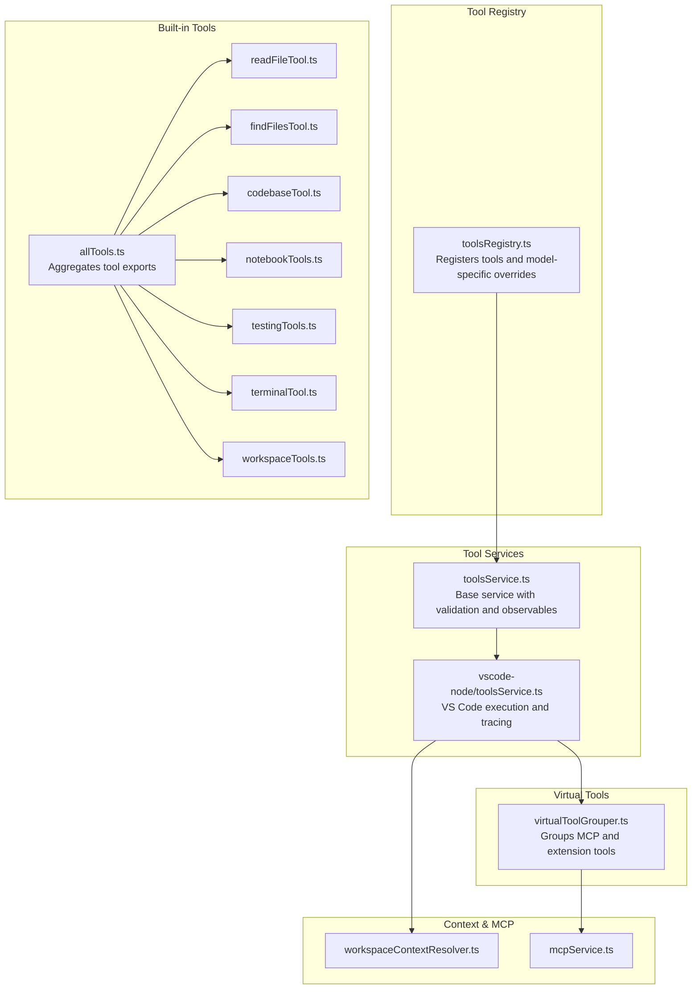
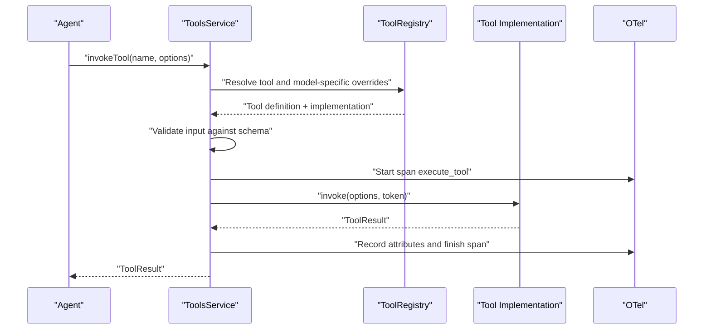
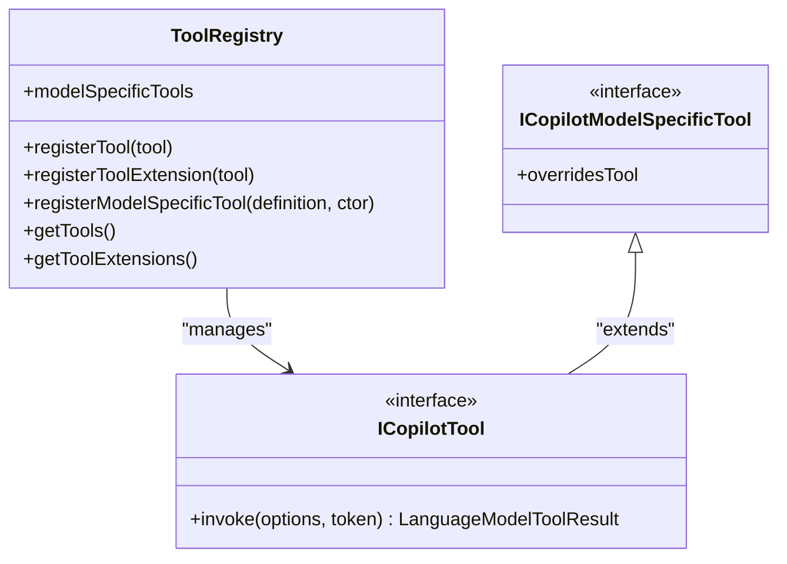
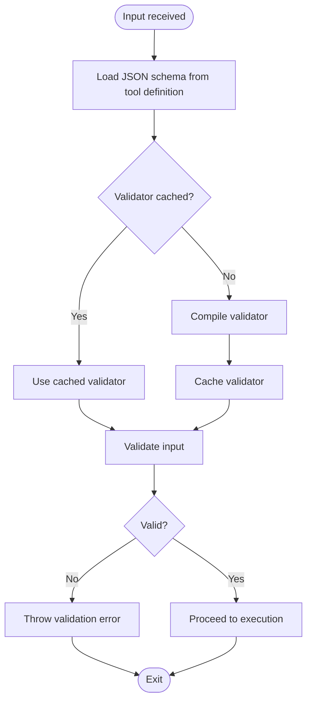
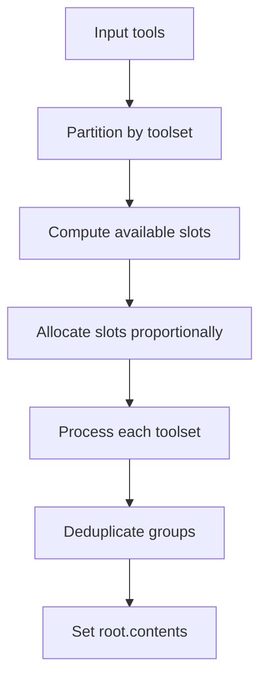
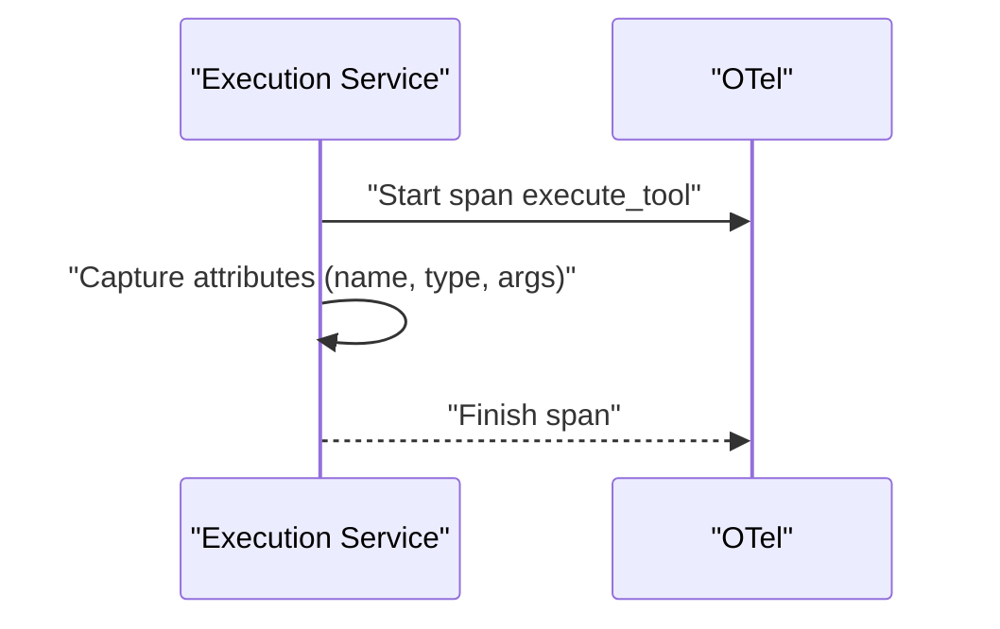
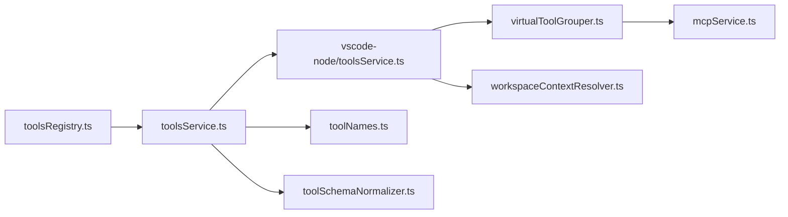

# Tools System

<cite>
**Referenced Files in This Document**
- [docs/tools.md](file://docs/tools.md)
- [src/extension/tools/common/toolsRegistry.ts](file://src/extension/tools/common/toolsRegistry.ts)
- [src/extension/tools/common/toolsService.ts](file://src/extension/tools/common/toolsService.ts)
- [src/extension/tools/common/toolNames.ts](file://src/extension/tools/common/toolNames.ts)
- [src/extension/tools/common/toolSchemaNormalizer.ts](file://src/extension/tools/common/toolSchemaNormalizer.ts)
- [src/extension/tools/common/virtualTools/virtualToolGrouper.ts](file://src/extension/tools/common/virtualTools/virtualToolGrouper.ts)
- [src/extension/tools/vscode-node/toolsService.ts](file://src/extension/tools/vscode-node/toolsService.ts)
- [src/extension/tools/node/allTools.ts](file://src/extension/tools/node/allTools.ts)
- [src/extension/tools/node/readFileTool.ts](file://src/extension/tools/node/readFileTool.ts)
- [src/extension/tools/node/findFilesTool.ts](file://src/extension/tools/node/findFilesTool.ts)
- [src/extension/tools/node/codebaseTool.ts](file://src/extension/tools/node/codebaseTool.ts)
- [src/extension/tools/node/notebookTools.ts](file://src/extension/tools/node/notebookTools.ts)
- [src/extension/tools/node/testingTools.ts](file://src/extension/tools/node/testingTools.ts)
- [src/extension/tools/node/terminalTool.ts](file://src/extension/tools/node/terminalTool.ts)
- [src/extension/tools/node/workspaceTools.ts](file://src/extension/tools/node/workspaceTools.ts)
- [src/extension/prompts/node/agent/test/__snapshots__/agentPrompts-claude-haiku-4.5/all_tools.spec.snap](file://src/extension/prompts/node/agent/test/__snapshots__/agentPrompts-claude-haiku-4.5/all_tools.spec.snap)
- [src/extension/prompts/node/agent/test/__snapshots__/agentPrompts-claude-haiku-4.5/all_non_edit_tools.spec.snap](file://src/extension/prompts/node/agent/test/__snapshots__/agentPrompts-claude-haiku-4.5/all_non_edit_tools.spec.snap)
- [src/extension/mcp/vscode-node/mcpService.ts](file://src/extension/mcp/vscode-node/mcpService.ts)
- [src/extension/mcp/common/mcpConstants.ts](file://src/extension/mcp/common/mcpConstants.ts)
- [src/extension/context/vscode-node/resolvers/workspaceContextResolver.ts](file://src/extension/context/vscode-node/resolvers/workspaceContextResolver.ts)
- [src/extension/commands/node/commandService.ts](file://src/extension/commands/node/commandService.ts)
- [src/extension/telemetry/vscode-node/otelContrib.ts](file://src/extension/telemetry/vscode-node/otelContrib.ts)
- [test/e2e/tools.stest.ts](file://test/e2e/tools.stest.ts)
- [test/e2e/notebookTools.stest.ts](file://test/e2e/notebookTools.stest.ts)
- [test/e2e/findFilesTool.stest.ts](file://test/e2e/findFilesTool.stest.ts)
- [test/e2e/fetchWebPageTool.stest.ts](file://test/e2e/fetchWebPageTool.stest.ts)
- [test/e2e/semanticSearch.stest.ts](file://test/e2e/semanticSearch.stest.ts)
- [test/simulation/tools/debugTools.stest.ts](file://test/simulation/tools/debugTools.stest.ts)
</cite>

## Table of Contents
1. [Introduction](#introduction)
2. [Project Structure](#project-structure)
3. [Core Components](#core-components)
4. [Architecture Overview](#architecture-overview)
5. [Detailed Component Analysis](#detailed-component-analysis)
6. [Dependency Analysis](#dependency-analysis)
7. [Performance Considerations](#performance-considerations)
8. [Troubleshooting Guide](#troubleshooting-guide)
9. [Conclusion](#conclusion)
10. [Appendices](#appendices)

## Introduction
This document describes the extensible tools system used by the agent ecosystem. It covers the tool registry architecture, tool execution framework, and patterns for building custom tools that integrate with the agent. It documents built-in tools for file operations, code search, workspace management, notebooks, and testing, along with the tool schema system, parameter validation, and result processing mechanisms. It also explains the tool context system, workspace integration, permissions, performance optimization, error handling, debugging, and how tools relate to the broader agent ecosystem.

## Project Structure
The tools system is organized around a registry and service layer, with implementations for built-in tools and virtual tools contributed via extensions and MCP servers. The structure supports:
- Tool registration and discovery
- Invocation orchestration and telemetry
- Schema-driven validation and normalization
- Virtual tool grouping and categorization
- Integration with workspace and MCP ecosystems

**Diagram sources**
- [src/extension/tools/common/toolsRegistry.ts](file://src/extension/tools/common/toolsRegistry.ts#L105-L143)
- [src/extension/tools/common/toolsService.ts](file://src/extension/tools/common/toolsService.ts#L175-L198)
- [src/extension/tools/vscode-node/toolsService.ts](file://src/extension/tools/vscode-node/toolsService.ts#L121-L145)
- [src/extension/tools/node/allTools.ts](file://src/extension/tools/node/allTools.ts)
- [src/extension/tools/common/virtualTools/virtualToolGrouper.ts](file://src/extension/tools/common/virtualTools/virtualToolGrouper.ts#L108-L130)
- [src/extension/mcp/vscode-node/mcpService.ts](file://src/extension/mcp/vscode-node/mcpService.ts)
- [src/extension/context/vscode-node/resolvers/workspaceContextResolver.ts](file://src/extension/context/vscode-node/resolvers/workspaceContextResolver.ts)

**Section sources**
- [src/extension/tools/common/toolsRegistry.ts](file://src/extension/tools/common/toolsRegistry.ts#L105-L143)
- [src/extension/tools/common/toolsService.ts](file://src/extension/tools/common/toolsService.ts#L175-L198)
- [src/extension/tools/common/virtualTools/virtualToolGrouper.ts](file://src/extension/tools/common/virtualTools/virtualToolGrouper.ts#L108-L130)
- [src/extension/tools/vscode-node/toolsService.ts](file://src/extension/tools/vscode-node/toolsService.ts#L121-L145)
- [src/extension/tools/node/allTools.ts](file://src/extension/tools/node/allTools.ts)

## Core Components
- Tool Registry: Central registry for registering standard and model-specific tools, and for tool extensions. Provides APIs to enumerate and manage tools.
- Tools Service: Validates inputs against JSON schemas, caches compiled validators, and exposes invocation APIs. Supports model-specific tool selection and telemetry.
- Virtual Tool Grouping: Dynamically groups extension and MCP tools into navigable categories with proportional slot allocation and deduplication.
- Built-in Tools: Implementations for file operations, search, workspace management, notebooks, testing, and terminal commands.
- Execution Service: Orchestrates tool invocation, captures traces, and handles special cases like subagent runs.

**Section sources**
- [src/extension/tools/common/toolsRegistry.ts](file://src/extension/tools/common/toolsRegistry.ts#L105-L143)
- [src/extension/tools/common/toolsService.ts](file://src/extension/tools/common/toolsService.ts#L175-L198)
- [src/extension/tools/common/virtualTools/virtualToolGrouper.ts](file://src/extension/tools/common/virtualTools/virtualToolGrouper.ts#L108-L130)
- [src/extension/tools/vscode-node/toolsService.ts](file://src/extension/tools/vscode-node/toolsService.ts#L121-L145)

## Architecture Overview
The tools system follows a layered architecture:
- Registry layer manages tool metadata and availability.
- Service layer validates inputs, selects implementations, and executes tools.
- Execution layer integrates with VS Code runtime, telemetry, and MCP/extension ecosystems.
- Virtual grouping layer organizes heterogeneous tools into a unified UI.

**Diagram sources**
- [src/extension/tools/common/toolsRegistry.ts](file://src/extension/tools/common/toolsRegistry.ts#L105-L143)
- [src/extension/tools/common/toolsService.ts](file://src/extension/tools/common/toolsService.ts#L175-L198)
- [src/extension/tools/vscode-node/toolsService.ts](file://src/extension/tools/vscode-node/toolsService.ts#L121-L145)

## Detailed Component Analysis

### Tool Registry and Model-Specific Tools
The registry maintains:
- Standard tools registered via constructor references
- Tool extensions for advanced integrations
- Model-specific tools with selectors for model families, versions, or IDs
- Optional override semantics to replace base tools for specific models

**Diagram sources**
- [src/extension/tools/common/toolsRegistry.ts](file://src/extension/tools/common/toolsRegistry.ts#L105-L143)

**Section sources**
- [src/extension/tools/common/toolsRegistry.ts](file://src/extension/tools/common/toolsRegistry.ts#L75-L165)

### Tool Schema System and Validation
- Inputs are validated against JSON schemas defined in tool metadata.
- The service compiles validators and caches them to minimize overhead.
- Schema normalization utilities ensure consistent handling of tool schemas.

**Diagram sources**
- [src/extension/tools/common/toolsService.ts](file://src/extension/tools/common/toolsService.ts#L175-L198)
- [src/extension/tools/common/toolSchemaNormalizer.ts](file://src/extension/tools/common/toolSchemaNormalizer.ts)

**Section sources**
- [src/extension/tools/common/toolsService.ts](file://src/extension/tools/common/toolsService.ts#L175-L198)
- [src/extension/tools/common/toolSchemaNormalizer.ts](file://src/extension/tools/common/toolSchemaNormalizer.ts)

### Virtual Tool Grouping and UI Organization
Virtual tools are grouped to fit within UI limits:
- Proportional slot allocation based on toolset sizes
- Deduplication of groups
- Thresholds to avoid grouping small toolsets

**Diagram sources**
- [src/extension/tools/common/virtualTools/virtualToolGrouper.ts](file://src/extension/tools/common/virtualTools/virtualToolGrouper.ts#L108-L130)

**Section sources**
- [src/extension/tools/common/virtualTools/virtualToolGrouper.ts](file://src/extension/tools/common/virtualTools/virtualToolGrouper.ts#L108-L130)

### Built-in Tools: File Operations
- Read file: Reads content from a file path with optional range support.
- Find files: Searches for files matching patterns.
- Create file: Creates a new file at an absolute path.
- Edit file: Applies edits to a file.
- Apply patch: Applies a patch to a target file.
- Replace string: Replaces occurrences in a file.
- Multi-replace string: Batch replacements across a file.
- List directory: Lists directory contents.
- Create directory: Creates a directory.
- Read project structure: Summarizes project layout.

These tools are categorized as core and are enabled by default in agent prompts.

**Section sources**
- [src/extension/tools/node/readFileTool.ts](file://src/extension/tools/node/readFileTool.ts)
- [src/extension/tools/node/findFilesTool.ts](file://src/extension/tools/node/findFilesTool.ts)
- [src/extension/tools/common/toolNames.ts](file://src/extension/tools/common/toolNames.ts#L155-L179)
- [src/extension/prompts/node/agent/test/__snapshots__/agentPrompts-claude-haiku-4.5/all_tools.spec.snap](file://src/extension/prompts/node/agent/test/__snapshots__/agentPrompts-claude-haiku-4.5/all_tools.spec.snap#L36-L41)

### Built-in Tools: Code Search and Workspace Management
- Codebase tool: Performs semantic/workspace-wide search.
- Workspace tools: Utilities for workspace-aware operations.

These tools complement file operations and enable complex multi-file workflows.

**Section sources**
- [src/extension/tools/node/codebaseTool.ts](file://src/extension/tools/node/codebaseTool.ts)
- [src/extension/tools/node/workspaceTools.ts](file://src/extension/tools/node/workspaceTools.ts)

### Built-in Tools: Notebooks and Testing
- Notebook tools: Operations tailored for notebook cells and execution contexts.
- Testing tools: Utilities for test-related operations.

These tools integrate with notebook and testing subsystems.

**Section sources**
- [src/extension/tools/node/notebookTools.ts](file://src/extension/tools/node/notebookTools.ts)
- [src/extension/tools/node/testingTools.ts](file://src/extension/tools/node/testingTools.ts)

### Built-in Tools: Terminal and Subagent Operations
- Terminal tool: Executes commands in the integrated terminal with optional confirmation for risky actions.
- Subagent tools: Run subagents and propagate trace context.

These tools enable agent-driven automation and complex workflows.

**Section sources**
- [src/extension/tools/node/terminalTool.ts](file://src/extension/tools/node/terminalTool.ts)
- [src/extension/tools/vscode-node/toolsService.ts](file://src/extension/tools/vscode-node/toolsService.ts#L121-L145)

### Tool Execution Framework and Telemetry
- Execution service wraps invocations with OpenTelemetry spans.
- Attributes capture tool name, type, and arguments when content capture is enabled.
- Special handling for subagent runs to preserve trace parentage.

**Diagram sources**
- [src/extension/tools/vscode-node/toolsService.ts](file://src/extension/tools/vscode-node/toolsService.ts#L121-L145)
- [src/extension/telemetry/vscode-node/otelContrib.ts](file://src/extension/telemetry/vscode-node/otelContrib.ts)

**Section sources**
- [src/extension/tools/vscode-node/toolsService.ts](file://src/extension/tools/vscode-node/toolsService.ts#L121-L145)
- [src/extension/telemetry/vscode-node/otelContrib.ts](file://src/extension/telemetry/vscode-node/otelContrib.ts)

### Tool Context System and Workspace Integration
- Workspace context resolver provides contextual information to tools.
- Commands service integrates tool usage with VS Code commands.
- MCP service enables third-party tools via MCP servers.

**Section sources**
- [src/extension/context/vscode-node/resolvers/workspaceContextResolver.ts](file://src/extension/context/vscode-node/resolvers/workspaceContextResolver.ts)
- [src/extension/commands/node/commandService.ts](file://src/extension/commands/node/commandService.ts)
- [src/extension/mcp/vscode-node/mcpService.ts](file://src/extension/mcp/vscode-node/mcpService.ts)

### Permission Management and Safety
- Dangerous tools (e.g., terminal) require explicit user confirmation before execution.
- Confirmation messages provide sufficient context for user understanding.

**Section sources**
- [docs/tools.md](file://docs/tools.md#L51-L61)

### Custom Tool Development Patterns
- Contribute tools via package.json language model tools and tool sets.
- Implement either the standard language model tool interface or the extended Copilot tool interface.
- Register tools in the registry and import the tool module in the aggregator.
- Use prompt-tsx for rich tool results and ensure messages are helpful and actionable.

**Section sources**
- [docs/tools.md](file://docs/tools.md#L11-L72)

### Model-Specific Tools
- Register model-specific tools with selectors for model family/version/ID.
- Override base tools by setting an override property; the override is not individually selectable and replaces the base tool when conditions match.

**Section sources**
- [docs/tools.md](file://docs/tools.md#L73-L149)
- [src/extension/tools/common/toolsRegistry.ts](file://src/extension/tools/common/toolsRegistry.ts#L145-L165)

## Dependency Analysis
The tools system exhibits low coupling and high cohesion:
- Registry decouples tool definitions from implementations.
- Service layer centralizes validation and telemetry.
- Virtual grouping isolates UI organization concerns.
- Integrations with MCP and workspace are opt-in and modular.

**Diagram sources**
- [src/extension/tools/common/toolsRegistry.ts](file://src/extension/tools/common/toolsRegistry.ts#L105-L143)
- [src/extension/tools/common/toolsService.ts](file://src/extension/tools/common/toolsService.ts#L175-L198)
- [src/extension/tools/common/toolNames.ts](file://src/extension/tools/common/toolNames.ts#L155-L179)
- [src/extension/tools/common/toolSchemaNormalizer.ts](file://src/extension/tools/common/toolSchemaNormalizer.ts)
- [src/extension/tools/common/virtualTools/virtualToolGrouper.ts](file://src/extension/tools/common/virtualTools/virtualToolGrouper.ts#L108-L130)
- [src/extension/mcp/vscode-node/mcpService.ts](file://src/extension/mcp/vscode-node/mcpService.ts)
- [src/extension/context/vscode-node/resolvers/workspaceContextResolver.ts](file://src/extension/context/vscode-node/resolvers/workspaceContextResolver.ts)

**Section sources**
- [src/extension/tools/common/toolsRegistry.ts](file://src/extension/tools/common/toolsRegistry.ts#L105-L143)
- [src/extension/tools/common/toolsService.ts](file://src/extension/tools/common/toolsService.ts#L175-L198)
- [src/extension/tools/common/virtualTools/virtualToolGrouper.ts](file://src/extension/tools/common/virtualTools/virtualToolGrouper.ts#L108-L130)

## Performance Considerations
- Validator caching: Compiled validators are cached to reduce repeated schema compilation overhead.
- Slot allocation: Virtual tool grouping uses proportional allocation to balance UI presentation and tool discoverability.
- Tracing overhead: OTel spans are started per invocation; ensure content capture is configured appropriately to avoid excessive serialization costs.
- Batch operations: Prefer multi-file operations (e.g., multi-replace string) to minimize round-trips.

[No sources needed since this section provides general guidance]

## Troubleshooting Guide
Common issues and resolutions:
- Validation errors: Ensure tool inputs conform to the declared JSON schema. The service throws descriptive errors that help the model retry with corrected arguments.
- Tool not available: Verify the tool is enabled in the current tool set and not overridden by a model-specific tool unintentionally.
- Unsafe tool execution: Terminal and similar tools require user confirmation; ensure the confirmation message provides adequate risk context.
- Debugging: Use the provided debug views and logs to inspect tool invocations and results.

**Section sources**
- [docs/tools.md](file://docs/tools.md#L47-L72)
- [src/extension/tools/common/toolsService.ts](file://src/extension/tools/common/toolsService.ts#L175-L198)
- [test/simulation/tools/debugTools.stest.ts](file://test/simulation/tools/debugTools.stest.ts)

## Conclusion
The tools system provides a robust, extensible foundation for agent-driven operations. Its registry and service architecture, combined with schema-driven validation, virtual grouping, and strong integrations with workspace and MCP, enable powerful multi-file workflows while maintaining safety and performance. Developers can extend the system with custom tools that integrate seamlessly into the agent ecosystem.

[No sources needed since this section summarizes without analyzing specific files]

## Appendices

### Example Workflows and Usage
- Multi-file refactor: Use find files to locate candidates, read files to gather context, apply patch or edit file to update content, and list directory to verify outcomes.
- Notebook automation: Use notebook tools to execute cells and collect outputs, then combine with file operations to save results.
- Semantic search and edits: Use codebase tool to locate relevant files, read files to understand context, and apply targeted edits.

**Section sources**
- [test/e2e/tools.stest.ts](file://test/e2e/tools.stest.ts)
- [test/e2e/notebookTools.stest.ts](file://test/e2e/notebookTools.stest.ts)
- [test/e2e/findFilesTool.stest.ts](file://test/e2e/findFilesTool.stest.ts)
- [test/e2e/fetchWebPageTool.stest.ts](file://test/e2e/fetchWebPageTool.stest.ts)
- [test/e2e/semanticSearch.stest.ts](file://test/e2e/semanticSearch.stest.ts)