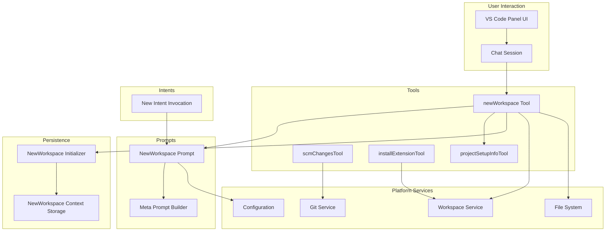
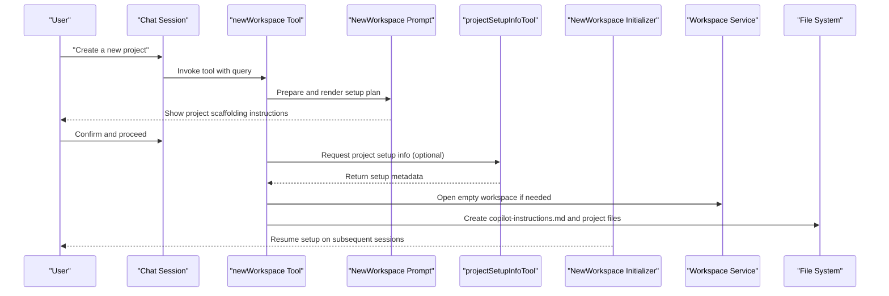
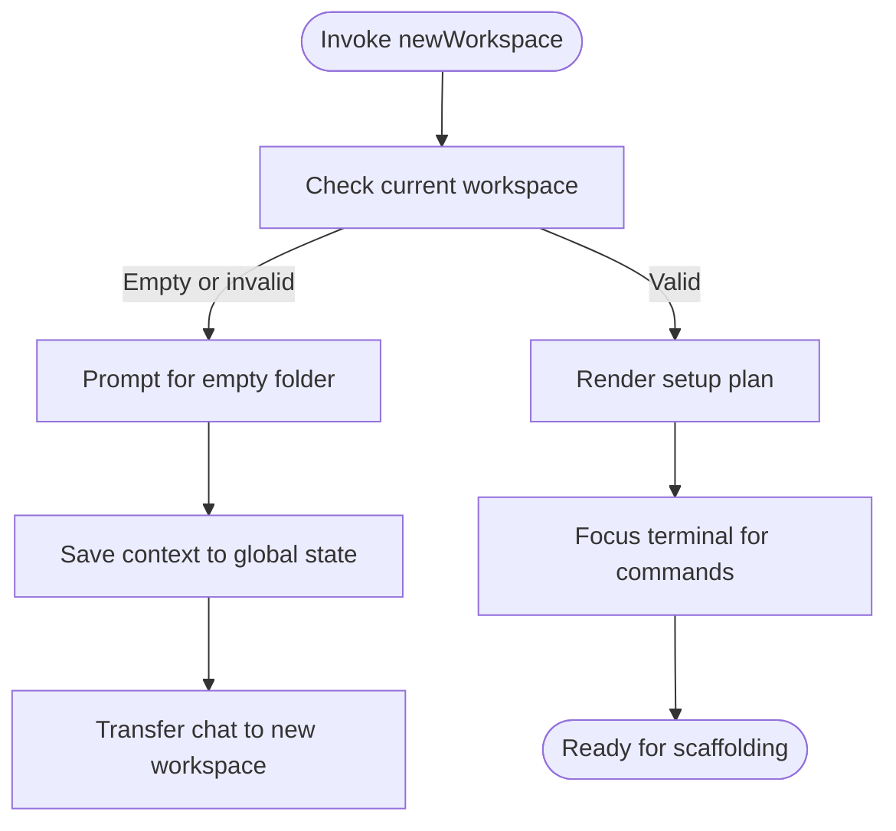
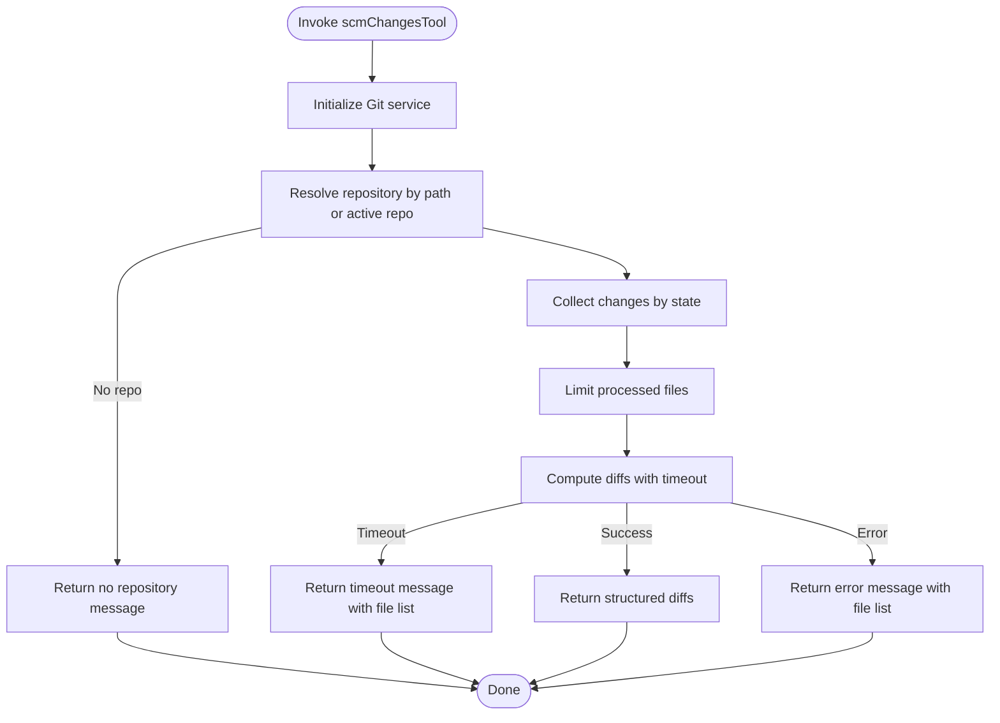
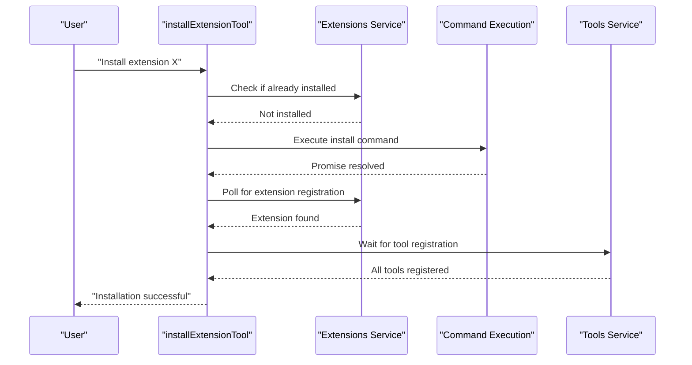
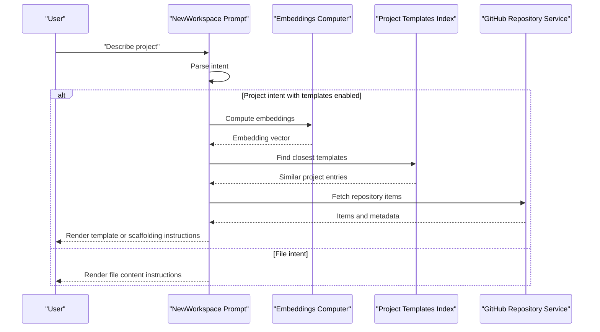
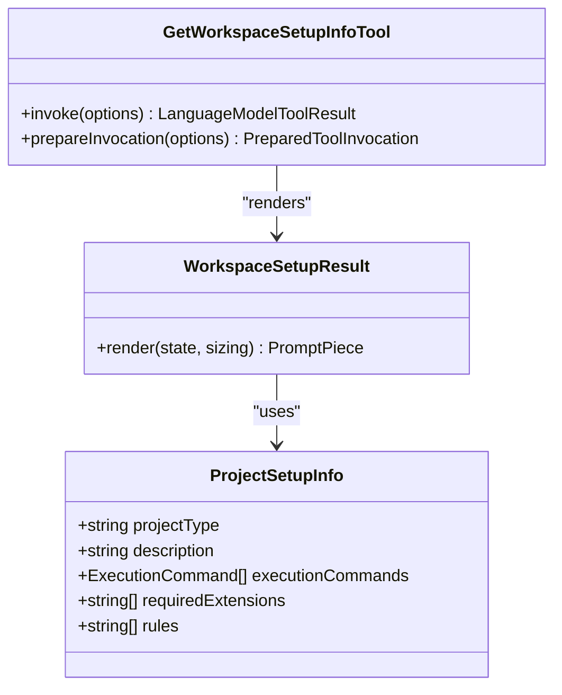

# Workspace Management Tools

<cite>
**Referenced Files in This Document**
- [newWorkspaceTool.tsx](file://src/extension/tools/node/newWorkspace/newWorkspaceTool.tsx)
- [scmChangesTool.ts](file://src/extension/tools/node/scmChangesTool.ts)
- [installExtensionTool.tsx](file://src/extension/tools/node/installExtensionTool.tsx)
- [newWorkspace.tsx](file://src/extension/prompts/node/panel/newWorkspace/newWorkspace.tsx)
- [newWorkspaceInitializer.ts](file://src/extension/getting-started/vscode-node/newWorkspaceInitializer.ts)
- [projectSetupInfoTool.tsx](file://src/extension/tools/node/newWorkspace/projectSetupInfoTool.tsx)
- [newWorkspaceContext.ts](file://src/extension/getting-started/common/newWorkspaceContext.ts)
- [newIntent.ts](file://src/extension/intents/node/newIntent.ts)
- [package.json](file://package.json)
- [README.md](file://README.md)
</cite>

## Table of Contents
1. [Introduction](#introduction)
2. [Project Structure](#project-structure)
3. [Core Components](#core-components)
4. [Architecture Overview](#architecture-overview)
5. [Detailed Component Analysis](#detailed-component-analysis)
6. [Dependency Analysis](#dependency-analysis)
7. [Performance Considerations](#performance-considerations)
8. [Troubleshooting Guide](#troubleshooting-guide)
9. [Conclusion](#conclusion)

## Introduction
This document explains the workspace management tools that automate project initialization and environment setup in the VSCode Copilot Chat extension. It covers three primary tools:
- newWorkspace tool: scaffolds new projects and orchestrates workspace initialization
- scmChangesTool: integrates with version control to surface diffs and changes
- installExtensionTool: automates VS Code extension installation for development environments

It also details GitHub repository integration, project template systems, environment preparation workflows, dependency management, configuration file generation, CI/CD pipeline configuration, and development environment provisioning. Finally, it addresses workspace validation, cleanup procedures, and error recovery mechanisms.

## Project Structure
The workspace management system spans several subsystems:
- Tools: language model tools that implement scaffolding, SCM integration, and extension installation
- Prompts: conversational UIs that guide users through project setup and template selection
- Intents: orchestration logic that interprets user intent and coordinates actions
- Getting Started: persistence and continuation of workspace setup across sessions
- Platform services: Git, filesystem, workspace, and configuration services

**Diagram sources**
- [newWorkspaceTool.tsx](file://src/extension/tools/node/newWorkspace/newWorkspaceTool.tsx#L28-L118)
- [scmChangesTool.ts](file://src/extension/tools/node/scmChangesTool.ts#L40-L196)
- [installExtensionTool.tsx](file://src/extension/tools/node/installExtensionTool.tsx#L24-L103)
- [newWorkspace.tsx](file://src/extension/prompts/node/panel/newWorkspace/newWorkspace.tsx#L63-L143)
- [newWorkspaceInitializer.ts](file://src/extension/getting-started/vscode-node/newWorkspaceInitializer.ts#L14-L71)
- [projectSetupInfoTool.tsx](file://src/extension/tools/node/newWorkspace/projectSetupInfoTool.tsx#L148-L178)

**Section sources**
- [newWorkspaceTool.tsx](file://src/extension/tools/node/newWorkspace/newWorkspaceTool.tsx#L28-L118)
- [newWorkspace.tsx](file://src/extension/prompts/node/panel/newWorkspace/newWorkspace.tsx#L63-L143)
- [newWorkspaceInitializer.ts](file://src/extension/getting-started/vscode-node/newWorkspaceInitializer.ts#L14-L71)
- [scmChangesTool.ts](file://src/extension/tools/node/scmChangesTool.ts#L40-L196)
- [installExtensionTool.tsx](file://src/extension/tools/node/installExtensionTool.tsx#L24-L103)
- [projectSetupInfoTool.tsx](file://src/extension/tools/node/newWorkspace/projectSetupInfoTool.tsx#L148-L178)

## Core Components
- newWorkspace tool: Generates a structured plan for creating a new workspace, opens an empty folder when needed, and renders a step-by-step setup checklist including GitHub Copilot instructions, project scaffolding, extension installation, compilation, task creation, and documentation verification.
- scmChangesTool: Reads staged/unstaged changes from a Git repository, computes diffs with timeouts and truncation, and returns either a structured diff view or a plain text summary with file lists.
- installExtensionTool: Installs a specified VS Code extension, checks for pre-existing installations, waits for the extension and its contributed tools to register, and returns success or failure messages.
- NewWorkspace Prompt: Determines user intent (file vs project), optionally fetches project templates from GitHub, and renders a tailored instruction message for scaffolding.
- NewWorkspace Initializer: Restores interrupted setups, validates workspace emptiness, and resumes setup via chat when the user confirms.
- projectSetupInfoTool: Provides project-type-specific setup information, including execution commands and required extensions for frameworks like VS Code extensions, Next.js, Vite, MCP servers, and Python packages.

**Section sources**
- [newWorkspaceTool.tsx](file://src/extension/tools/node/newWorkspace/newWorkspaceTool.tsx#L28-L118)
- [scmChangesTool.ts](file://src/extension/tools/node/scmChangesTool.ts#L40-L196)
- [installExtensionTool.tsx](file://src/extension/tools/node/installExtensionTool.tsx#L24-L103)
- [newWorkspace.tsx](file://src/extension/prompts/node/panel/newWorkspace/newWorkspace.tsx#L63-L143)
- [newWorkspaceInitializer.ts](file://src/extension/getting-started/vscode-node/newWorkspaceInitializer.ts#L14-L71)
- [projectSetupInfoTool.tsx](file://src/extension/tools/node/newWorkspace/projectSetupInfoTool.tsx#L148-L178)

## Architecture Overview
The workspace management architecture integrates user intent, project templates, scaffolding, and environment preparation:

**Diagram sources**
- [newWorkspaceTool.tsx](file://src/extension/tools/node/newWorkspace/newWorkspaceTool.tsx#L68-L118)
- [newWorkspace.tsx](file://src/extension/prompts/node/panel/newWorkspace/newWorkspace.tsx#L76-L143)
- [projectSetupInfoTool.tsx](file://src/extension/tools/node/newWorkspace/projectSetupInfoTool.tsx#L161-L175)
- [newWorkspaceInitializer.ts](file://src/extension/getting-started/vscode-node/newWorkspaceInitializer.ts#L24-L71)

## Detailed Component Analysis

### newWorkspace Tool
The newWorkspace tool orchestrates project initialization:
- Validates workspace state and prompts for an empty folder if needed
- Renders a comprehensive setup checklist with GitHub Copilot instructions
- Supports resuming interrupted setups via persistent storage
- Integrates with project setup info and template fetching

**Diagram sources**
- [newWorkspaceTool.tsx](file://src/extension/tools/node/newWorkspace/newWorkspaceTool.tsx#L68-L118)
- [newWorkspaceInitializer.ts](file://src/extension/getting-started/vscode-node/newWorkspaceInitializer.ts#L24-L71)

**Section sources**
- [newWorkspaceTool.tsx](file://src/extension/tools/node/newWorkspace/newWorkspaceTool.tsx#L28-L118)
- [newWorkspaceInitializer.ts](file://src/extension/getting-started/vscode-node/newWorkspaceInitializer.ts#L14-L71)
- [newWorkspaceContext.ts](file://src/extension/getting-started/common/newWorkspaceContext.ts#L9-L28)

### scmChangesTool
The scmChangesTool integrates with Git to surface changes:
- Initializes Git service and resolves repository context
- Filters changes by state (staged, unstaged, merge conflicts)
- Computes diffs with a configurable timeout and truncation
- Returns structured diffs or a plain text summary with file listings

**Diagram sources**
- [scmChangesTool.ts](file://src/extension/tools/node/scmChangesTool.ts#L52-L163)

**Section sources**
- [scmChangesTool.ts](file://src/extension/tools/node/scmChangesTool.ts#L40-L196)

### installExtensionTool
The installExtensionTool automates extension installation:
- Checks for existing installation
- Executes VS Code extension installation command
- Waits for registration of contributed tools
- Returns success or failure messages with confirmation prompts

**Diagram sources**
- [installExtensionTool.tsx](file://src/extension/tools/node/installExtensionTool.tsx#L35-L78)

**Section sources**
- [installExtensionTool.tsx](file://src/extension/tools/node/installExtensionTool.tsx#L24-L103)

### NewWorkspace Prompt and Template Integration
The NewWorkspace Prompt determines user intent and optionally fetches project templates:
- Parses user intent (file vs project)
- Uses embeddings to find similar templates from a project templates index
- Fetches repository items and constructs a metadata object for rendering
- Renders tailored instructions for scaffolding

**Diagram sources**
- [newWorkspace.tsx](file://src/extension/prompts/node/panel/newWorkspace/newWorkspace.tsx#L76-L143)

**Section sources**
- [newWorkspace.tsx](file://src/extension/prompts/node/panel/newWorkspace/newWorkspace.tsx#L63-L143)

### projectSetupInfoTool
The projectSetupInfoTool provides project-type-specific setup information:
- Defines setup metadata for supported project types (VS Code extension, Next.js, Vite, MCP server, Python script/package)
- Renders structured setup information or delegates to external tools when configured
- Enforces strict rules for scaffolding and extension installation

**Diagram sources**
- [projectSetupInfoTool.tsx](file://src/extension/tools/node/newWorkspace/projectSetupInfoTool.tsx#L148-L178)
- [projectSetupInfoTool.tsx](file://src/extension/tools/node/newWorkspace/projectSetupInfoTool.tsx#L180-L215)

**Section sources**
- [projectSetupInfoTool.tsx](file://src/extension/tools/node/newWorkspace/projectSetupInfoTool.tsx#L148-L178)
- [projectSetupInfoTool.tsx](file://src/extension/tools/node/newWorkspace/projectSetupInfoTool.tsx#L180-L215)

## Dependency Analysis
The workspace management tools rely on platform services and configuration:

```mermaid
graph TB
NW["newWorkspace Tool"] --> WS["Workspace Service"]
NW --> FS["File System"]
NW --> IS["Instantiation Service"]
NW --> DS["Dialog Service"]
NW --> CS["Configuration Service"]
SCM["scmChangesTool"] --> GIT["Git Service"]
SCM --> GDS["Git Diff Service"]
SCM --> IPS["Prompt Path Representation Service"]
EXT["installExtensionTool"] --> ES["Extensions Service"]
EXT --> CES["Command Execution Service"]
EXT --> ENV["Env Service"]
EXT --> TS["Tools Service"]
NWP["NewWorkspace Prompt"] --> EMB["Embeddings Computer"]
NWP --> PTI["Project Templates Index"]
NWP --> GRS["GitHub Repository Service"]
NWP --> EP["Endpoint Provider"]
NWSI["NewWorkspace Initializer"] --> WS
NWSI --> FS
NWSI --> NWC["NewWorkspace Context"]
```

**Diagram sources**
- [newWorkspaceTool.tsx](file://src/extension/tools/node/newWorkspace/newWorkspaceTool.tsx#L32-L40)
- [scmChangesTool.ts](file://src/extension/tools/node/scmChangesTool.ts#L44-L50)
- [installExtensionTool.tsx](file://src/extension/tools/node/installExtensionTool.tsx#L28-L33)
- [newWorkspace.tsx](file://src/extension/prompts/node/panel/newWorkspace/newWorkspace.tsx#L66-L72)
- [newWorkspaceInitializer.ts](file://src/extension/getting-started/vscode-node/newWorkspaceInitializer.ts#L16-L19)

**Section sources**
- [newWorkspaceTool.tsx](file://src/extension/tools/node/newWorkspace/newWorkspaceTool.tsx#L32-L40)
- [scmChangesTool.ts](file://src/extension/tools/node/scmChangesTool.ts#L44-L50)
- [installExtensionTool.tsx](file://src/extension/tools/node/installExtensionTool.tsx#L28-L33)
- [newWorkspace.tsx](file://src/extension/prompts/node/panel/newWorkspace/newWorkspace.tsx#L66-L72)
- [newWorkspaceInitializer.ts](file://src/extension/getting-started/vscode-node/newWorkspaceInitializer.ts#L16-L19)

## Performance Considerations
- Diff computation timeout: scmChangesTool enforces a 30-second timeout to prevent long-running operations and gracefully falls back to a file list when exceeded.
- File truncation: Limits diffs to a maximum number of changed files to maintain responsiveness.
- Asynchronous progress reporting: NewWorkspace Prompt reports progress during template search and repository fetching.
- Persistence limits: NewWorkspace context storage caps the number of stored contexts to avoid memory bloat.

[No sources needed since this section provides general guidance]

## Troubleshooting Guide
Common issues and recovery mechanisms:
- No active Git repository: scmChangesTool returns a message indicating no repository was found and suggests using the terminal for manual inspection.
- Diff retrieval timeout: scmChangesTool logs a warning and returns a message with the total count of changed files and a file list for manual inspection.
- Extension installation failures: installExtensionTool returns a failure message; ensure the extension ID is valid and retry after confirming the extension is not already installed.
- Interrupted workspace setup: NewWorkspace Initializer restores context and prompts the user to continue or cancel, preventing orphaned state.
- Empty workspace validation: newWorkspace Tool checks for non-empty folders and prompts for a valid empty workspace before proceeding.

**Section sources**
- [scmChangesTool.ts](file://src/extension/tools/node/scmChangesTool.ts#L68-L73)
- [scmChangesTool.ts](file://src/extension/tools/node/scmChangesTool.ts#L121-L127)
- [scmChangesTool.ts](file://src/extension/tools/node/scmChangesTool.ts#L131-L136)
- [installExtensionTool.tsx](file://src/extension/tools/node/installExtensionTool.tsx#L48-L51)
- [newWorkspaceInitializer.ts](file://src/extension/getting-started/vscode-node/newWorkspaceInitializer.ts#L46-L52)
- [newWorkspaceTool.tsx](file://src/extension/tools/node/newWorkspace/newWorkspaceTool.tsx#L77-L106)

## Conclusion
The workspace management tools provide a cohesive system for automated project initialization, SCM integration, and environment provisioning. They combine user intent detection, GitHub template integration, structured scaffolding, and robust error handling to deliver a reliable developer experience. The modular architecture ensures maintainability and extensibility for future enhancements.