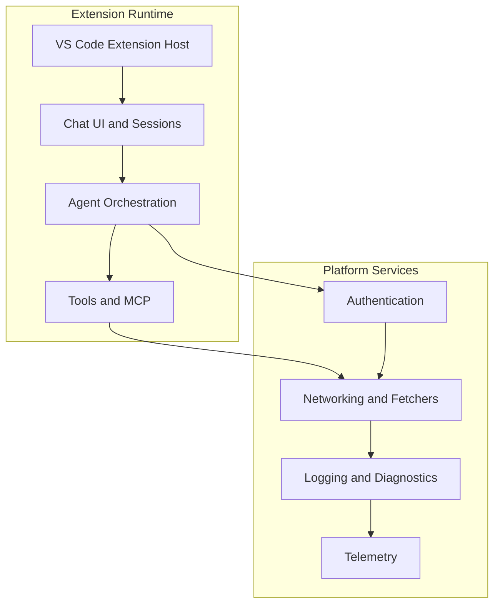
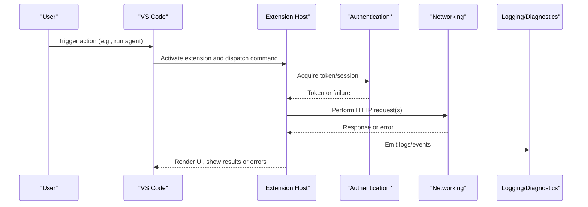
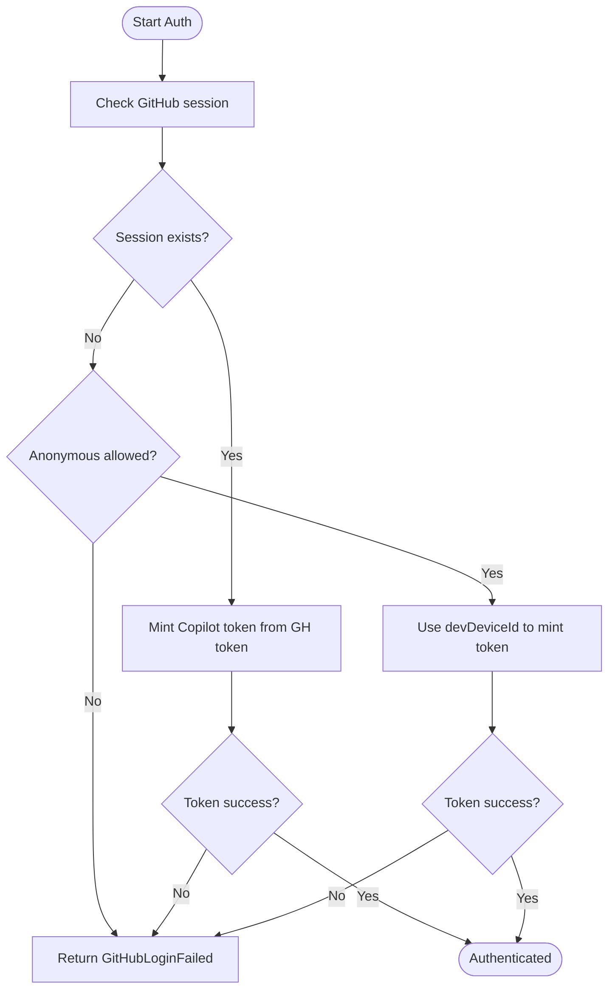
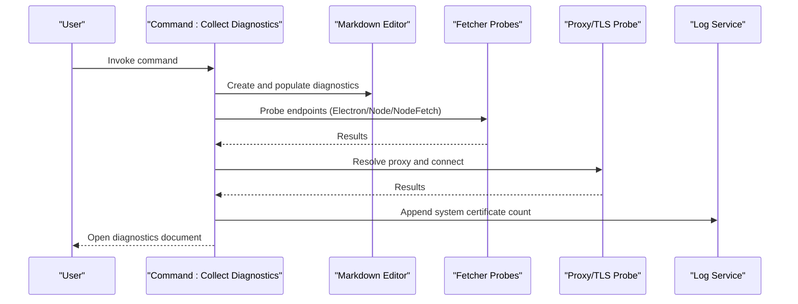
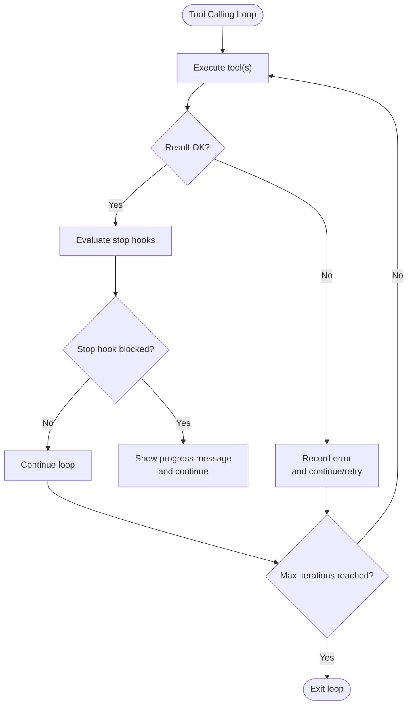
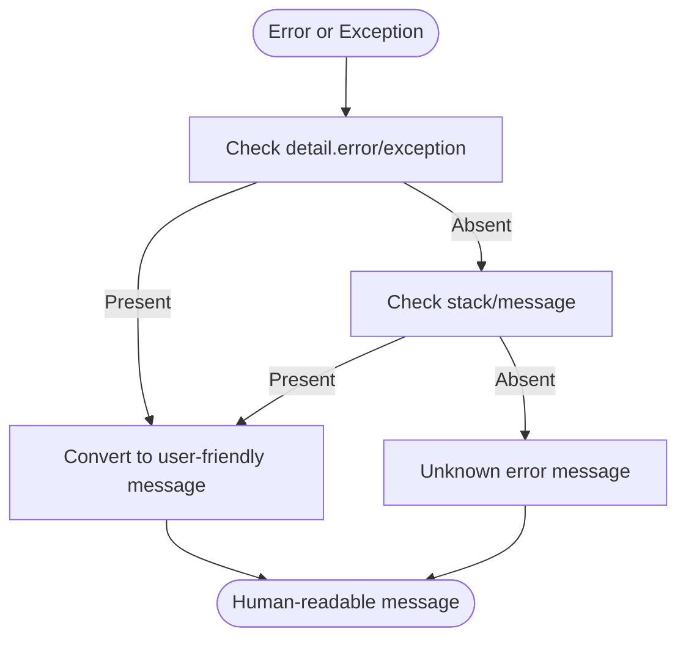
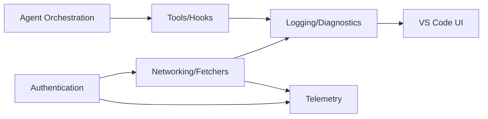

# Troubleshooting & FAQ

<cite>
**Referenced Files in This Document**
- [README.md](file://README.md)
- [SECURITY.md](file://SECURITY.md)
- [loggingActions.ts](file://src/extension/log/vscode-node/loggingActions.ts)
- [requestLogTree.ts](file://src/extension/log/vscode-node/requestLogTree.ts)
- [errors.ts](file://src/util/vs/base/common/errors.ts)
- [errorMessage.ts](file://src/util/common/errorMessage.ts)
- [agentDebugEventCollector.ts](file://src/extension/agentDebug/node/agentDebugEventCollector.ts)
- [copilotTokenManager.ts (node)](file://src/platform/authentication/node/copilotTokenManager.ts)
- [copilotTokenManager.ts (vscode-node)](file://src/platform/authentication/vscode-node/copilotTokenManager.ts)
- [staticGitHubAuthenticationService.ts](file://src/platform/authentication/common/staticGitHubAuthenticationService.ts)
- [toolCallingLoop.ts](file://src/extension/intents/node/toolCallingLoop.ts)
- [network.test.ts](file://src/extension/completions-core/vscode-node/lib/src/snippy/test/network.test.ts)
- [errorCreator.ts](file://src/extension/completions-core/vscode-node/lib/src/snippy/errorCreator.ts)
- [claudeChatSessionContentProvider.ts](file://src/extension/chatSessions/vscode-node/claudeChatSessionContentProvider.ts)
- [ghTelemetryService.ts](file://src/platform/telemetry/common/ghTelemetryService.ts)
- [package.json](file://package.json)
</cite>

## Table of Contents
1. [Introduction](#introduction)
2. [Project Structure](#project-structure)
3. [Core Components](#core-components)
4. [Architecture Overview](#architecture-overview)
5. [Detailed Component Analysis](#detailed-component-analysis)
6. [Dependency Analysis](#dependency-analysis)
7. [Performance Considerations](#performance-considerations)
8. [Troubleshooting Guide](#troubleshooting-guide)
9. [FAQ](#faq)
10. [Conclusion](#conclusion)
11. [Appendices](#appendices)

## Introduction
This document provides a comprehensive troubleshooting and FAQ guide for GitHub Copilot Chat in Visual Studio Code. It covers installation and setup issues, authentication failures, performance bottlenecks, integration conflicts, and agent/tool execution problems. It includes systematic debugging procedures, diagnostic commands, log analysis techniques, error interpretation, known limitations, workarounds, performance optimization strategies, escalation paths, and community resources.

## Project Structure
The repository is a large TypeScript/JavaScript codebase organized around:
- Extension runtime and UI integrations
- Platform services (authentication, telemetry, networking, logging)
- Agent orchestration and tool execution
- Diagnostic and logging utilities
- Tests and e2e scenarios

[No sources needed since this diagram shows conceptual structure, not actual code mapping]

## Core Components
- Authentication: GitHub login and Copilot token provisioning, with fallbacks and telemetry.
- Networking: Multiple fetcher implementations with diagnostics and status bar insights.
- Logging and Diagnostics: Request log tree, HTML viewer, export utilities, and diagnostic collection.
- Agent and Tools: Tool calling loops, stop hooks, and agent lifecycle events.
- Error Handling: Centralized error utilities and error message formatting.

**Section sources**
- [copilotTokenManager.ts (vscode-node)](file://src/platform/authentication/vscode-node/copilotTokenManager.ts#L73-L101)
- [loggingActions.ts](file://src/extension/log/vscode-node/loggingActions.ts#L66-L252)
- [requestLogTree.ts](file://src/extension/log/vscode-node/requestLogTree.ts#L60-L516)
- [toolCallingLoop.ts](file://src/extension/intents/node/toolCallingLoop.ts#L307-L366)
- [errors.ts](file://src/util/vs/base/common/errors.ts#L95-L343)
- [errorMessage.ts](file://src/util/common/errorMessage.ts#L36-L91)

## Architecture Overview
The extension integrates tightly with VS Code, orchestrates agents and tools, and relies on platform services for authentication, networking, logging, and telemetry. Diagnostic commands and log viewers provide actionable insights for troubleshooting.

**Diagram sources**
- [copilotTokenManager.ts (vscode-node)](file://src/platform/authentication/vscode-node/copilotTokenManager.ts#L73-L101)
- [loggingActions.ts](file://src/extension/log/vscode-node/loggingActions.ts#L66-L252)
- [requestLogTree.ts](file://src/extension/log/vscode-node/requestLogTree.ts#L60-L516)

## Detailed Component Analysis

### Authentication Failures
Common symptoms:
- Cannot sign in or get a Copilot token
- Anonymous access disabled or failing
- Enterprise/GHE token acquisition issues

Diagnostic steps:
- Verify GitHub session exists and is valid
- Confirm Copilot token retrieval succeeds
- Check configuration allowing anonymous access
- Inspect telemetry and logs for explicit failure reasons

**Diagram sources**
- [copilotTokenManager.ts (vscode-node)](file://src/platform/authentication/vscode-node/copilotTokenManager.ts#L73-L101)
- [copilotTokenManager.ts (node)](file://src/platform/authentication/node/copilotTokenManager.ts#L137-L160)
- [staticGitHubAuthenticationService.ts](file://src/platform/authentication/common/staticGitHubAuthenticationService.ts#L1-L22)

**Section sources**
- [copilotTokenManager.ts (vscode-node)](file://src/platform/authentication/vscode-node/copilotTokenManager.ts#L73-L101)
- [copilotTokenManager.ts (node)](file://src/platform/authentication/node/copilotTokenManager.ts#L137-L160)
- [staticGitHubAuthenticationService.ts](file://src/platform/authentication/common/staticGitHubAuthenticationService.ts#L1-L22)

### Network and Connectivity Issues
Symptoms:
- Requests fail or time out
- Proxy misconfiguration
- Certificate or TLS handshake issues
- Mixed fetcher behavior

Diagnostic commands and utilities:
- Collect diagnostics: opens a markdown document with environment, network settings, proxy, and connectivity probes
- Show network status bar item: displays recent request outcomes
- Export request logs: save individual or grouped logs as markdown or JSON archives

**Diagram sources**
- [loggingActions.ts](file://src/extension/log/vscode-node/loggingActions.ts#L66-L252)

**Section sources**
- [loggingActions.ts](file://src/extension/log/vscode-node/loggingActions.ts#L66-L252)
- [requestLogTree.ts](file://src/extension/log/vscode-node/requestLogTree.ts#L116-L198)
- [requestLogTree.ts](file://src/extension/log/vscode-node/requestLogTree.ts#L265-L362)
- [requestLogTree.ts](file://src/extension/log/vscode-node/requestLogTree.ts#L364-L501)

### Agent and Tool Execution Problems
Symptoms:
- Agent stuck in loops
- Stop hooks blocking completion
- Tool execution errors or timeouts
- Unexpected cancellations

Diagnostic steps:
- Inspect tool calling loop behavior and stop hook reasons
- Review request logs and exported traces
- Use HTML viewer for detailed request traces
- Check cancellation and error telemetry

**Diagram sources**
- [toolCallingLoop.ts](file://src/extension/intents/node/toolCallingLoop.ts#L307-L366)

**Section sources**
- [toolCallingLoop.ts](file://src/extension/intents/node/toolCallingLoop.ts#L307-L366)
- [requestLogTree.ts](file://src/extension/log/vscode-node/requestLogTree.ts#L102-L114)
- [requestLogTree.ts](file://src/extension/log/vscode-node/requestLogTree.ts#L503-L510)

### Error Handling and Message Interpretation
Centralized utilities:
- Normalize and format error messages
- Distinguish expected vs. unexpected errors
- Capture and redact sensitive data where appropriate

**Diagram sources**
- [errorMessage.ts](file://src/util/common/errorMessage.ts#L36-L91)
- [errors.ts](file://src/util/vs/base/common/errors.ts#L95-L343)

**Section sources**
- [errorMessage.ts](file://src/util/common/errorMessage.ts#L36-L91)
- [errors.ts](file://src/util/vs/base/common/errors.ts#L95-L343)

### Tool Execution Status Codes
The codebase defines specific HTTP-like status codes for internal tool/network conditions:
- Unauthorized (401)
- Bad arguments (400)
- Not found (404)
- Rate limit (429)
- Internal error (5xx)
- Connection retrying (600)
- Offline (601)

These are used to drive user-facing error responses and retries.

**Section sources**
- [errorCreator.ts](file://src/extension/completions-core/vscode-node/lib/src/snippy/errorCreator.ts#L25-L65)
- [network.test.ts](file://src/extension/completions-core/vscode-node/lib/src/snippy/test/network.test.ts#L116-L143)

### Session and Workspace Context
Claude session content provider resolves working directory and additional directories depending on workspace configuration. Misconfiguration here can lead to missing context or incorrect paths.

**Section sources**
- [claudeChatSessionContentProvider.ts](file://src/extension/chatSessions/vscode-node/claudeChatSessionContentProvider.ts#L115-L158)

## Dependency Analysis
Key dependencies and relationships:
- Authentication depends on VS Code authentication and configuration services
- Networking uses multiple fetcher implementations with telemetry and diagnostics
- Logging integrates with VS Code output channels and provides export capabilities
- Agent orchestration depends on tool execution and hook services

**Diagram sources**
- [copilotTokenManager.ts (vscode-node)](file://src/platform/authentication/vscode-node/copilotTokenManager.ts#L73-L101)
- [loggingActions.ts](file://src/extension/log/vscode-node/loggingActions.ts#L66-L252)
- [requestLogTree.ts](file://src/extension/log/vscode-node/requestLogTree.ts#L60-L516)

**Section sources**
- [copilotTokenManager.ts (vscode-node)](file://src/platform/authentication/vscode-node/copilotTokenManager.ts#L73-L101)
- [loggingActions.ts](file://src/extension/log/vscode-node/loggingActions.ts#L66-L252)
- [requestLogTree.ts](file://src/extension/log/vscode-node/requestLogTree.ts#L60-L516)

## Performance Considerations
- Prefer the active fetcher detected by diagnostics; avoid unnecessary fallbacks
- Minimize repeated network probes; use cached tokens when possible
- Reduce tool call loops by refining stop hooks and termination criteria
- Export and review logs to identify hotspots and repeated failures
- Keep VS Code and the extension updated for latest model and performance improvements

[No sources needed since this section provides general guidance]

## Troubleshooting Guide

### Installation and Setup
- Ensure the extension is installed and enabled in VS Code
- Verify compatibility with the current VS Code version
- Confirm required subscriptions and account access

**Section sources**
- [README.md](file://README.md#L12-L17)
- [README.md](file://README.md#L55-L60)

### Authentication Failures
- If signed out, sign in with a valid GitHub account
- If anonymous access is disallowed, sign in or adjust configuration
- For enterprise/GHE, ensure correct token acquisition paths

**Section sources**
- [copilotTokenManager.ts (vscode-node)](file://src/platform/authentication/vscode-node/copilotTokenManager.ts#L73-L101)
- [copilotTokenManager.ts (node)](file://src/platform/authentication/node/copilotTokenManager.ts#L137-L160)

### Network and Proxy Issues
- Use the built-in diagnostics command to collect environment and connectivity details
- Review proxy resolution and TLS handshake results
- Compare active vs. configured fetcher implementations
- Inspect the network status bar item for recent failures

**Section sources**
- [loggingActions.ts](file://src/extension/log/vscode-node/loggingActions.ts#L66-L252)
- [loggingActions.ts](file://src/extension/log/vscode-node/loggingActions.ts#L613-L687)

### Tool Execution Problems
- Export request logs and inspect HTML traces for tool calls
- Identify repeated failures or timeouts
- Adjust stop hooks and termination logic to prevent infinite loops
- Validate tool availability and permissions

**Section sources**
- [requestLogTree.ts](file://src/extension/log/vscode-node/requestLogTree.ts#L116-L198)
- [requestLogTree.ts](file://src/extension/log/vscode-node/requestLogTree.ts#L265-L362)
- [requestLogTree.ts](file://src/extension/log/vscode-node/requestLogTree.ts#L364-L501)
- [toolCallingLoop.ts](file://src/extension/intents/node/toolCallingLoop.ts#L307-L366)

### Agent-Related Issues
- Review agent debug events and error summaries
- Check stop hook reasons and progress messages
- Limit iterations and retries to avoid long-running loops

**Section sources**
- [agentDebugEventCollector.ts](file://src/extension/agentDebug/node/agentDebugEventCollector.ts#L532-L545)
- [toolCallingLoop.ts](file://src/extension/intents/node/toolCallingLoop.ts#L307-L366)

### Context Provider Failures
- Validate workspace folders and session folder selection
- Ensure correct working directory and additional directories are resolved

**Section sources**
- [claudeChatSessionContentProvider.ts](file://src/extension/chatSessions/vscode-node/claudeChatSessionContentProvider.ts#L115-L158)

### Diagnostic Commands and Utilities
- Collect diagnostics: opens a markdown document with environment, network settings, proxy, and connectivity probes
- Show output channel: reveals the extension output channel
- Export request logs: save individual or grouped logs as markdown or JSON archives
- Show raw request body: open raw request content for inspection

**Section sources**
- [loggingActions.ts](file://src/extension/log/vscode-node/loggingActions.ts#L66-L252)
- [requestLogTree.ts](file://src/extension/log/vscode-node/requestLogTree.ts#L116-L198)
- [requestLogTree.ts](file://src/extension/log/vscode-node/requestLogTree.ts#L265-L362)
- [requestLogTree.ts](file://src/extension/log/vscode-node/requestLogTree.ts#L364-L501)
- [requestLogTree.ts](file://src/extension/log/vscode-node/requestLogTree.ts#L503-L510)

### Error Message Interpretation
- Use centralized error formatting to derive user-friendly messages
- Distinguish expected vs. unexpected errors for telemetry and UX
- Inspect stack traces and details for deeper context

**Section sources**
- [errorMessage.ts](file://src/util/common/errorMessage.ts#L36-L91)
- [errors.ts](file://src/util/vs/base/common/errors.ts#L95-L343)

### Known Limitations and Workarounds
- Compatibility: Newer Copilot Chat versions require the latest VS Code
- Model updates: Only latest extension versions use latest models
- Privacy: Understand data collection and telemetry settings
- Enterprise/GHE: Ensure correct token acquisition and proxy configuration

**Section sources**
- [README.md](file://README.md#L55-L60)
- [README.md](file://README.md#L61-L67)

### Escalation Procedures and Community Support
- Report security issues responsibly via official channels
- Use the issue tracker for feature requests and bug reports
- Follow community resources and documentation links

**Section sources**
- [SECURITY.md](file://SECURITY.md#L1-L14)
- [README.md](file://README.md#L75-L77)

## FAQ

### Pricing and Access
- Access requires an active GitHub Copilot subscription
- Free tier available; upgrade for advanced features

**Section sources**
- [README.md](file://README.md#L12-L17)

### Compatibility
- Copilot Chat releases align with VS Code; use the latest version for compatibility
- Latest extension versions use latest models

**Section sources**
- [README.md](file://README.md#L55-L60)

### Privacy and Data Collection
- Extension collects usage data; respect telemetry settings
- Review privacy statements and transparency notes

**Section sources**
- [README.md](file://README.md#L61-L67)
- [README.md](file://README.md#L78-L81)

### Feature Availability
- Features vary by subscription tier and environment
- Enterprise and business offerings available

**Section sources**
- [README.md](file://README.md#L70-L72)

### Enterprise Environments
- Configure proxies and system certificates as needed
- Use diagnostics to validate connectivity and TLS

**Section sources**
- [loggingActions.ts](file://src/extension/log/vscode-node/loggingActions.ts#L66-L252)

### Operating System Notes
- Diagnostics capture OS and architecture details
- Proxy and certificate handling may differ across platforms

**Section sources**
- [loggingActions.ts](file://src/extension/log/vscode-node/loggingActions.ts#L66-L252)

## Conclusion
This guide consolidates practical troubleshooting steps, diagnostic tools, and interpretative techniques for GitHub Copilot Chat. By leveraging built-in commands, logs, and telemetry, most installation, authentication, performance, and integration issues can be quickly identified and resolved. For persistent problems, escalate via the documented channels and include diagnostic outputs.

[No sources needed since this section summarizes without analyzing specific files]

## Appendices

### Diagnostic Checklist
- Run diagnostics and review environment/network/proxy results
- Check network status bar item for recent failures
- Export and inspect request logs and HTML traces
- Verify authentication and token acquisition
- Confirm workspace and session folder configuration
- Review error messages and telemetry for patterns

**Section sources**
- [loggingActions.ts](file://src/extension/log/vscode-node/loggingActions.ts#L66-L252)
- [loggingActions.ts](file://src/extension/log/vscode-node/loggingActions.ts#L613-L687)
- [requestLogTree.ts](file://src/extension/log/vscode-node/requestLogTree.ts#L116-L198)
- [copilotTokenManager.ts (vscode-node)](file://src/platform/authentication/vscode-node/copilotTokenManager.ts#L73-L101)
- [claudeChatSessionContentProvider.ts](file://src/extension/chatSessions/vscode-node/claudeChatSessionContentProvider.ts#L115-L158)

### Error Codes Reference
- 401 Unauthorized
- 400 Bad arguments
- 404 Not found
- 429 Rate limit
- 5xx Internal error
- 600 Connection retrying
- 601 Offline

**Section sources**
- [errorCreator.ts](file://src/extension/completions-core/vscode-node/lib/src/snippy/errorCreator.ts#L25-L65)
- [network.test.ts](file://src/extension/completions-core/vscode-node/lib/src/snippy/test/network.test.ts#L116-L143)