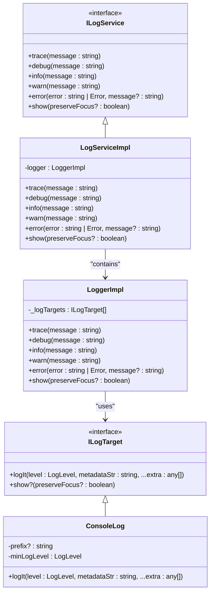
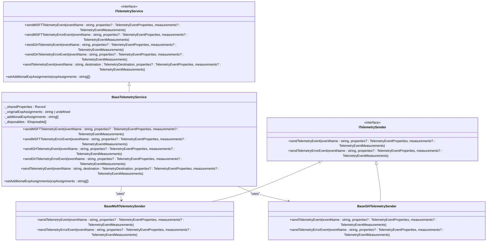
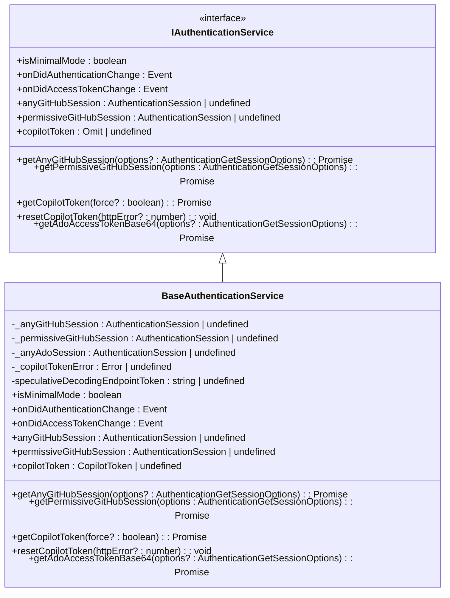
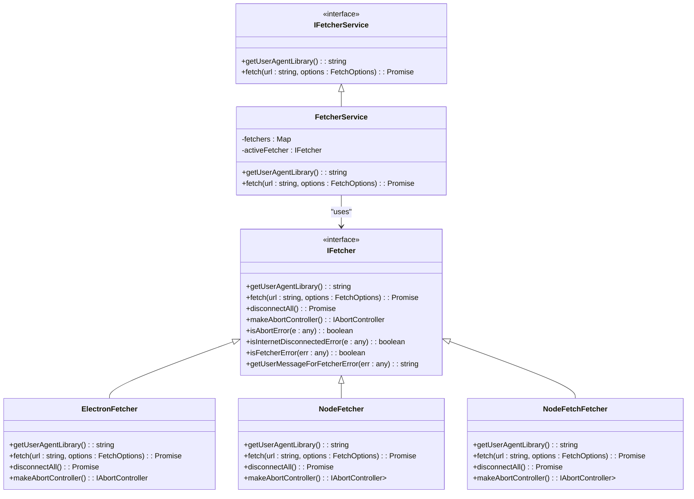

# Troubleshooting

<cite>
**Referenced Files in This Document**   
- [loggingActions.ts](file://src/extension/log/vscode-node/loggingActions.ts)
- [logService.ts](file://src/platform/log/common/logService.ts)
- [baseTelemetryService.ts](file://src/platform/telemetry/common/baseTelemetryService.ts)
- [telemetry.ts](file://src/platform/telemetry/common/telemetry.ts)
- [authentication.ts](file://src/platform/authentication/common/authentication.ts)
- [networking.ts](file://src/platform/networking/common/networking.ts)
</cite>

## Table of Contents
1. [Introduction](#introduction)
2. [Common Issues and Solutions](#common-issues-and-solutions)
3. [Logging System](#logging-system)
4. [Telemetry Services](#telemetry-services)
5. [Authentication Troubleshooting](#authentication-troubleshooting)
6. [Network Connectivity Issues](#network-connectivity-issues)
7. [Performance Considerations](#performance-considerations)
8. [Error Handling Strategies](#error-handling-strategies)
9. [Diagnostic Information Collection](#diagnostic-information-collection)
10. [Reporting Issues Effectively](#reporting-issues-effectively)

## Introduction
This document provides comprehensive troubleshooting guidance for GitHub Copilot Chat, addressing common issues users encounter such as authentication failures, slow responses, incorrect code suggestions, and network connectivity problems. The content covers the debugging tools available in the extension, including the logging system in src/extension/log/ and telemetry services in src/platform/telemetry/. Step-by-step guidance is provided for diagnosing problems, interpreting log files and telemetry data, and collecting diagnostic information. The document also includes performance considerations, optimization tips, and strategies for reporting issues effectively to the development team.

## Common Issues and Solutions
GitHub Copilot Chat users may encounter various issues during their development workflow. This section outlines the most common problems and their solutions.

### Authentication Failures
Authentication issues are among the most frequent problems users encounter. These can manifest as inability to sign in, session timeouts, or permission errors when accessing Copilot features.

**Common Causes:**
- Expired or invalid authentication tokens
- Network connectivity issues preventing token refresh
- Configuration conflicts with VS Code settings
- Corporate firewall or proxy restrictions

**Solutions:**
1. Sign out and sign back into your GitHub account through VS Code
2. Check your GitHub Copilot subscription status at github.com/settings/copilot
3. Verify that your authentication permissions are set correctly in VS Code settings
4. If using a corporate network, ensure that the necessary endpoints are accessible

### Slow Responses
Slow response times from Copilot Chat can disrupt the development workflow and reduce productivity.

**Common Causes:**
- Network latency between the client and Copilot servers
- High server load or rate limiting
- Resource constraints on the local machine
- Large context windows requiring extensive processing

**Solutions:**
1. Check your internet connection stability
2. Reduce the amount of context provided to Copilot (e.g., limit file scope)
3. Restart VS Code to refresh the extension state
4. Monitor system resources and close unnecessary applications

### Incorrect Code Suggestions
Occasionally, Copilot may provide suggestions that are syntactically incorrect, contextually inappropriate, or do not align with the user's intent.

**Common Causes:**
- Insufficient context provided to the AI model
- Ambiguous or unclear natural language prompts
- Model limitations in understanding complex code patterns
- Training data biases or gaps

**Solutions:**
1. Provide more specific and detailed prompts
2. Include relevant code context in your conversation
3. Use slash commands to specify the desired behavior
4. Refine your request based on the initial response

**Section sources**
- [authentication.ts](file://src/platform/authentication/common/authentication.ts#L1-L308)
- [networking.ts](file://src/platform/networking/common/networking.ts#L1-L453)

## Logging System
The logging system in GitHub Copilot Chat provides detailed information about the extension's operations, which is essential for troubleshooting issues.

### Log Service Architecture
The logging system is implemented through the `ILogService` interface and its concrete implementation `LogServiceImpl`. This service handles different log levels and routes log messages to appropriate targets.

**Diagram sources**
- [logService.ts](file://src/platform/log/common/logService.ts#L1-L233)

### Log Levels
The logging system supports multiple log levels, each serving a specific purpose:

- **Off**: No messages are logged
- **Trace**: All messages are logged (most verbose)
- **Debug**: Debug and higher level messages are logged
- **Info**: Informational messages and higher
- **Warning**: Warning and error messages
- **Error**: Only error messages are logged (least verbose)

### Accessing Logs
Users can access logs through the VS Code Output panel by selecting "GitHub Copilot" from the dropdown menu. The logs provide detailed information about API requests, authentication flows, and internal operations of the extension.

**Section sources**
- [logService.ts](file://src/platform/log/common/logService.ts#L1-L233)

## Telemetry Services
The telemetry system in GitHub Copilot Chat collects usage data and performance metrics to help improve the product and diagnose issues.

### Telemetry Architecture
The telemetry system is built around the `ITelemetryService` interface, which provides methods for sending events to different destinations, including Microsoft and GitHub telemetry endpoints.

**Diagram sources**
- [baseTelemetryService.ts](file://src/platform/telemetry/common/baseTelemetryService.ts#L1-L173)
- [telemetry.ts](file://src/platform/telemetry/common/telemetry.ts#L1-L217)

### Telemetry Data Collection
The telemetry system collects various types of data to monitor the health and performance of the extension:

- **Usage patterns**: How users interact with Copilot features
- **Performance metrics**: Response times, processing durations
- **Error reports**: Exceptions and error conditions
- **Feature adoption**: Which features are being used and how frequently

### Privacy Considerations
The telemetry system respects user privacy and complies with data protection regulations. Users can control telemetry reporting through VS Code settings. The extension respects the `telemetry.telemetryLevel` setting, allowing users to disable telemetry reporting if desired.

**Section sources**
- [baseTelemetryService.ts](file://src/platform/telemetry/common/baseTelemetryService.ts#L1-L173)
- [telemetry.ts](file://src/platform/telemetry/common/telemetry.ts#L1-L217)

## Authentication Troubleshooting
Authentication issues can prevent users from accessing GitHub Copilot Chat features. This section provides guidance on diagnosing and resolving authentication problems.

### Authentication Service Architecture
The authentication system is implemented through the `IAuthenticationService` interface, which manages GitHub and Azure DevOps sessions, as well as Copilot tokens.

**Diagram sources**
- [authentication.ts](file://src/platform/authentication/common/authentication.ts#L1-L308)

### Common Authentication Issues
#### Token Expiration
Copilot tokens have a limited lifespan and need to be refreshed periodically. When a token expires, users may experience authentication failures.

**Symptoms:**
- "Authentication required" messages
- Inability to access Copilot features
- Repeated sign-in prompts

**Solutions:**
1. Sign out and sign back into your GitHub account
2. Check your internet connection
3. Clear authentication cache in VS Code

#### Permission Errors
Users may encounter permission errors when their GitHub account lacks the necessary permissions for Copilot.

**Symptoms:**
- "Insufficient permissions" errors
- Limited access to Copilot features
- Inability to use certain Copilot capabilities

**Solutions:**
1. Verify your GitHub Copilot subscription status
2. Check organization policies if using a GitHub Enterprise account
3. Ensure required scopes are granted (user:email, repo, workflow)

#### Silent Authentication Failures
Sometimes authentication failures occur without clear error messages, making them difficult to diagnose.

**Diagnosis:**
1. Check the logs for authentication-related messages
2. Look for token refresh attempts in the telemetry data
3. Verify network connectivity to authentication endpoints

**Solutions:**
1. Restart VS Code to reset the authentication state
2. Clear the authentication cache
3. Try signing in from a different network environment

**Section sources**
- [authentication.ts](file://src/platform/authentication/common/authentication.ts#L1-L308)

## Network Connectivity Issues
Network connectivity problems can significantly impact the performance and reliability of GitHub Copilot Chat.

### Network Architecture
The networking system in Copilot Chat handles HTTP requests to various endpoints, including the Copilot API, telemetry services, and authentication servers.

**Diagram sources**
- [networking.ts](file://src/platform/networking/common/networking.ts#L1-L453)

### Common Network Issues
#### Proxy Configuration
Corporate networks often use proxies that can interfere with Copilot Chat's network requests.

**Symptoms:**
- Connection timeouts
- SSL/TLS handshake failures
- Unable to reach Copilot endpoints

**Solutions:**
1. Configure VS Code proxy settings (http.proxy, http.proxyStrictSSL)
2. Use the "Collect Diagnostics" command to test proxy connectivity
3. Work with your IT department to whitelist Copilot endpoints

#### DNS Resolution Problems
DNS issues can prevent the extension from resolving Copilot service endpoints.

**Symptoms:**
- "Host not found" errors
- Intermittent connectivity
- Slow DNS lookups

**Solutions:**
1. Test DNS resolution using the "Collect Diagnostics" command
2. Try using a different DNS server
3. Check for DNS configuration conflicts

#### Firewall Restrictions
Firewalls may block connections to Copilot services, especially in corporate environments.

**Symptoms:**
- Connection refused errors
- Blocked requests
- Timeout errors

**Solutions:**
1. Verify that required endpoints are accessible
2. Work with your IT department to configure firewall rules
3. Use the diagnostic tools to identify blocked connections

### Diagnostic Tools
The extension provides a "Collect Diagnostics" command that performs comprehensive network testing.

**What it tests:**
- DNS resolution for Copilot endpoints
- Proxy configuration and connectivity
- Direct connection to Copilot APIs
- System certificate availability
- Network latency and response times

**How to use:**
1. Open the VS Code command palette (Ctrl+Shift+P)
2. Run "GitHub Copilot: Collect Diagnostics"
3. Review the generated report for connectivity issues

**Section sources**
- [networking.ts](file://src/platform/networking/common/networking.ts#L1-L453)
- [loggingActions.ts](file://src/extension/log/vscode-node/loggingActions.ts#L1-L553)

## Performance Considerations
Optimizing performance is crucial for maintaining a smooth development experience with GitHub Copilot Chat.

### Extension Performance
The Copilot extension's performance can be affected by various factors, including system resources, network conditions, and configuration settings.

**Optimization Tips:**
- **Reduce context size**: Limit the amount of code context provided to Copilot by focusing on relevant files and sections
- **Manage extensions**: Disable unnecessary extensions that may compete for system resources
- **Update regularly**: Keep VS Code and the Copilot extension updated to benefit from performance improvements
- **Restart periodically**: Restart VS Code periodically to clear memory and reset extension state

### Network Performance
Network conditions significantly impact Copilot's responsiveness and reliability.

**Optimization Tips:**
- Use a stable, high-speed internet connection
- Minimize network latency by choosing geographically closer endpoints when possible
- Avoid network congestion by using Copilot during off-peak hours
- Configure proxy settings correctly to avoid unnecessary hops

### User Environment Optimization
The user's development environment can be optimized to enhance Copilot performance.

**Recommendations:**
- **System resources**: Ensure adequate CPU, memory, and storage resources
- **VS Code settings**: Optimize VS Code settings for performance
- **Project structure**: Organize projects to minimize unnecessary file scanning
- **File indexing**: Allow VS Code to complete file indexing before intensive Copilot usage

**Section sources**
- [networking.ts](file://src/platform/networking/common/networking.ts#L1-L453)
- [logService.ts](file://src/platform/log/common/logService.ts#L1-L233)

## Error Handling Strategies
Effective error handling is essential for maintaining a reliable Copilot Chat experience.

### Error Types
The extension handles various types of errors, each requiring different handling strategies.

**Network Errors:**
- Connection timeouts
- DNS resolution failures
- SSL/TLS handshake errors
- Proxy connectivity issues

**Authentication Errors:**
- Token expiration
- Permission denied
- Session invalidation
- Account subscription issues

**Service Errors:**
- Rate limiting
- Server overload
- API changes
- Feature deprecation

**Client Errors:**
- Configuration conflicts
- Extension bugs
- Compatibility issues
- Resource constraints

### Error Recovery
The extension implements several error recovery mechanisms to maintain service availability.

**Automatic Retry:**
- Network requests are automatically retried on certain types of failures
- Token refresh is attempted when authentication errors occur
- Connection recovery is initiated after network interruptions

**Graceful Degradation:**
- When primary services are unavailable, fallback mechanisms are used
- Reduced functionality is provided when full capabilities are not available
- User is informed of limitations rather than complete service failure

### Error Reporting
Comprehensive error reporting helps diagnose and resolve issues.

**Log Collection:**
- Errors are logged with detailed context information
- Stack traces are captured when available
- Related events are correlated for complete picture

**Telemetry Integration:**
- Errors are reported through telemetry services
- Anonymous usage data helps identify patterns
- Error rates are monitored to detect emerging issues

**Section sources**
- [networking.ts](file://src/platform/networking/common/networking.ts#L1-L453)
- [authentication.ts](file://src/platform/authentication/common/authentication.ts#L1-L308)
- [logService.ts](file://src/platform/log/common/logService.ts#L1-L233)

## Diagnostic Information Collection
Collecting diagnostic information is crucial for troubleshooting complex issues.

### Built-in Diagnostic Tools
The extension provides several built-in tools for collecting diagnostic information.

**Collect Diagnostics Command:**
- Generates a comprehensive report of system and network status
- Tests connectivity to Copilot services
- Captures configuration settings
- Includes system information and extension version

**Log Access:**
- Logs can be accessed through the VS Code Output panel
- Different log levels provide varying detail
- Log memory stores recent entries for troubleshooting

### Interpreting Diagnostic Data
Understanding the diagnostic information is key to effective troubleshooting.

**Log Analysis:**
- Look for error messages and warnings
- Identify patterns in request/response cycles
- Correlate timestamps with user actions
- Trace authentication flows and token refreshes

**Network Diagnostics:**
- Analyze DNS resolution results
- Examine proxy configuration and connectivity
- Review connection attempts to Copilot endpoints
- Check certificate validation results

### Sharing Diagnostic Information
When reporting issues, providing diagnostic information helps expedite resolution.

**Best Practices:**
- Include the full diagnostic report when available
- Provide relevant log excerpts
- Describe the sequence of actions leading to the issue
- Note any patterns or triggers for the problem

**Section sources**
- [loggingActions.ts](file://src/extension/log/vscode-node/loggingActions.ts#L1-L553)
- [logService.ts](file://src/platform/log/common/logService.ts#L1-L233)

## Reporting Issues Effectively
Proper issue reporting ensures that problems are addressed efficiently.

### Information to Include
When reporting an issue, provide comprehensive information to help the development team reproduce and fix the problem.

**Essential Details:**
- Extension version and VS Code version
- Operating system and architecture
- Steps to reproduce the issue
- Expected behavior vs. actual behavior
- Screenshots or screen recordings when applicable

**Diagnostic Data:**
- Relevant log entries
- Network diagnostic results
- Configuration settings
- Error messages and stack traces

### Issue Reporting Channels
Several channels are available for reporting issues.

**GitHub Issues:**
- Primary channel for bug reports and feature requests
- Public repository for community visibility
- Direct access to the development team

**Support Channels:**
- Official documentation and FAQs
- Community forums and discussions
- Enterprise support for business customers

### Best Practices for Issue Reporting
Follow these guidelines to ensure your issue reports are effective.

**Be Specific:**
- Provide clear, concise descriptions
- Include exact error messages
- Specify the conditions under which the issue occurs

**Be Reproducible:**
- Document the exact steps to reproduce
- Note any prerequisites or setup requirements
- Indicate whether the issue is intermittent or consistent

**Be Patient:**
- Allow time for the team to investigate
- Respond promptly to requests for additional information
- Test proposed solutions and provide feedback

**Section sources**
- [loggingActions.ts](file://src/extension/log/vscode-node/loggingActions.ts#L1-L553)
- [logService.ts](file://src/platform/log/common/logService.ts#L1-L233)
- [telemetry.ts](file://src/platform/telemetry/common/telemetry.ts#L1-L217)