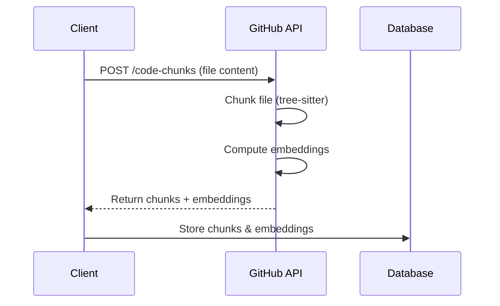

# Copilot Chat Indexing API

## Overview

Copilot Chat uses **GitHub's chunking and embedding APIs** to create workspace indices. These are the same APIs used internally by GitHub for code search.

## API Endpoints

Based on the Copilot Chat source code ([src/platform/chunking/common/chunkingEndpointClientImpl.ts](../src/platform/chunking/common/chunkingEndpointClientImpl.ts)):

### 1. **Chunking + Embeddings API**

**Endpoint**: `POST https://api.github.com/code-chunks`

**Purpose**: Chunk a file and compute embeddings in one request

**Request**:
```json
{
  "file": {
    "path": "src/index.ts",
    "content": "const hello = () => { ... }"
  },
  "embedding_model": "text-embedding-3-small-512",
  "compute_embeddings": true,
  "language_id": 183  // Optional: GitHub Linguist language ID
}
```

**Response**:
```json
{
  "chunks": [
    {
      "text": "const hello = () => { ... }",
      "range": {
        "start": { "line": 1, "column": 1 },
        "end": { "line": 5, "column": 2 }
      },
      "hash": "abc123...",
      "embedding": {
        "values": [0.123, -0.456, ...]
      }
    }
  ]
}
```

### 2. **Embeddings Only API**

**Endpoint**: `POST https://api.github.com/embeddings`

**Purpose**: Compute embeddings for arbitrary text (queries, etc.)

**Request**:
```json
{
  "inputs": ["authentication function", "error handling code"],
  "input_type": "query",  // or "document"
  "embedding_model": "text-embedding-3-small-512"
}
```

**Response**:
```json
{
  "embedding_model": "text-embedding-3-small-512",
  "embeddings": [
    { "embedding": [0.123, -0.456, ...] },
    { "embedding": [0.789, -0.012, ...] }
  ]
}
```

## Authentication

You need a GitHub token with appropriate scopes:

```bash
# GitHub Personal Access Token
export GITHUB_TOKEN="ghp_xxxxxxxxxxxx"

# Or Copilot token (for Copilot users)
export GITHUB_TOKEN="your-copilot-token"
```

Get a token from: https://github.com/settings/tokens

## Embedding Models

Supported models (from [embeddingsComputer.ts](../src/platform/embeddings/common/embeddingsComputer.ts)):

- **`text-embedding-3-small-512`** (OpenAI)
  - Dimensions: 512
  - Storage: Float32 (2KB per embedding)
  - Best for: General code search

- **`metis-1024-I16-Binary`** (GitHub)
  - Dimensions: 1024
  - Storage: Binary (128 bytes per embedding)
  - Best for: Large-scale indexing

## Python Implementation

Use the provided `create_index.py` script to create indices:

```bash
# Install dependencies
source venv/bin/activate

# Create an index
export GITHUB_TOKEN="ghp_xxxx"
python create_index.py /path/to/workspace output.db
```

## Key Implementation Details

### Chunking Strategy

From [naiveChunker.ts](../src/platform/chunking/node/naiveChunker.ts):

- Max chunk size: **512 tokens**
- Overlap: **64 tokens** between chunks
- Uses tree-sitter for syntax-aware chunking
- Preserves code structure (functions, classes, etc.)

### Rate Limiting

From [chunkingEndpointClientImpl.ts](../src/platform/chunking/common/chunkingEndpointClientImpl.ts#L40):

- Max parallel requests: **8** (configurable)
- Abuse limit: **40 requests/second**
- Respects `x-ratelimit-*` headers
- Automatic retry with exponential backoff

### Caching

From [workspaceChunkAndEmbeddingCache.ts](../src/platform/workspaceChunkSearch/node/workspaceChunkAndEmbeddingCache.ts):

- Uses **content version ID** to detect changes
- Stores **chunk hash** for deduplication
- Only recomputes changed files
- SQLite for persistent storage

## API Flow



## Comparison with VS Code Implementation

| Feature | VS Code Copilot | Python Script |
|---------|-----------------|---------------|
| **API** | Same GitHub endpoints | ✅ Same |
| **Chunking** | Tree-sitter + custom logic | ✅ Via API |
| **Embeddings** | GitHub's models | ✅ Same models |
| **Storage** | SQLite (local) | ✅ Compatible format |
| **Caching** | Content version ID | ✅ Same strategy |
| **Rate limiting** | Built-in queue | ⚠️ Basic |

## Using the Same Database

The Python script creates databases compatible with VS Code:

```bash
# Create index with Python
python create_index.py /workspace index.db

# Read it with Python tools
python read_index.py index.db
python search_index.py "query" index.db

# Or copy to VS Code storage location
cp index.db ~/.config/Code/User/workspaceStorage/{id}/GitHub.copilot-chat/workspace-chunks.db
```

## Benefits of Using the API

1. ✅ **Consistency**: Same chunking as Copilot Chat
2. ✅ **Quality**: GitHub's production-grade embeddings
3. ✅ **Syntax-aware**: Tree-sitter based chunking
4. ✅ **Compatible**: Works with VS Code database format
5. ✅ **Scalable**: Handles large codebases efficiently

## Limitations

- Requires GitHub authentication
- Rate limits apply (varies by account type)
- Network dependency
- No offline mode

## See Also

- [create_index.py](create_index.py) - Python implementation
- [GitHub Linguist Language IDs](https://github.com/github-linguist/linguist/blob/main/lib/linguist/languages.yml)
- [OpenAI Embeddings Documentation](https://platform.openai.com/docs/guides/embeddings)
